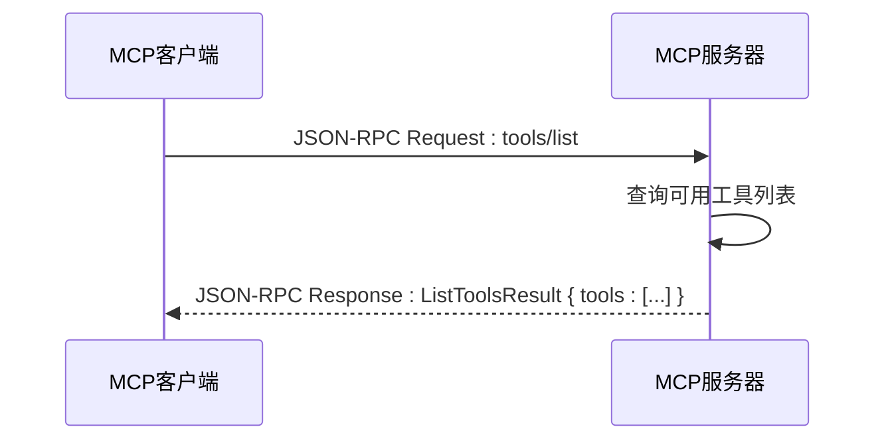
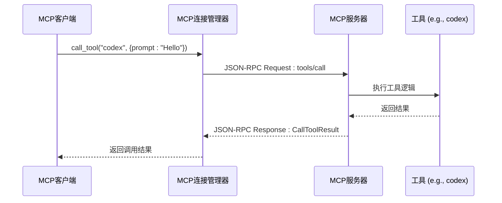

# MCP协议

<cite>
**本文档中引用的文件**   
- [lib.rs](file://codex-rs\mcp-types\src\lib.rs)
- [main.rs](file://codex-rs\mcp-server\src\main.rs)
- [mod.rs](file://codex-rs\core\src\mcp\mod.rs)
- [mcp_connection_manager.rs](file://codex-rs\core\src\mcp_connection_manager.rs)
- [mcp_tool_call.rs](file://codex-rs\core\src\mcp_tool_call.rs)
- [lib.rs](file://codex-rs\mcp-server\src\lib.rs)
- [message_processor.rs](file://codex-rs\mcp-server\src\message_processor.rs)
- [outgoing_message.rs](file://codex-rs\mcp-server\src\outgoing_message.rs)
- [index.ts](file://shell-tool-mcp\src\index.ts)
- [codex_tool_config.rs](file://codex-rs\mcp-server\src\codex_tool_config.rs)
- [codex_tool_runner.rs](file://codex-rs\mcp-server\src\codex_tool_runner.rs)
- [codex_mcp_interface.md](file://codex-rs\docs\codex_mcp_interface.md)
- [mcp_cmd.rs](file://codex-rs\cli\src\mcp_cmd.rs)
</cite>

## 目录
1. [引言](#引言)
2. [MCP架构与目的](#mcp架构与目的)
3. [MCP服务器](#mcp服务器)
4. [MCP客户端工具发现与调用](#mcp客户端工具发现与调用)
5. [JSON-RPC消息格式](#json-rpc消息格式)
6. [端到端集成教程：shell-tool-mcp](#端到端集成教程：shell-tool-mcp)
7. [结论](#结论)

## 引言
模型上下文协议（Model Context Protocol, MCP）是Codex项目中实现大语言模型（LLM）与外部工具（如shell、数据库、代码分析器）之间双向通信的核心机制。本API文档旨在全面解释MCP的架构、目的、服务器配置、客户端交互以及消息格式。文档将详细说明如何使用`mcp-types`中的类型定义来构建JSON-RPC消息，并通过`shell-tool-mcp`示例工具提供一个完整的端到端集成教程。

## MCP架构与目的
MCP的核心目的是为Codex这样的AI代理提供一个标准化的、安全的接口，使其能够与外部工具进行交互。该协议基于JSON-RPC 2.0标准，通过stdio或HTTP流式传输，实现了客户端（通常是LLM运行时）与服务器（外部工具）之间的双向通信。

在Codex的实现中，MCP架构主要由以下几个组件构成：
1.  **MCP服务器 (MCP Server)**: 一个独立的进程，负责监听来自客户端的请求。它实现了MCP协议，能够处理`initialize`、`tool.list`和`tool.call`等方法。`mcp-server`是Codex提供的一个原型MCP服务器。
2.  **MCP客户端 (MCP Client)**: 代表LLM或AI代理，负责发现可用的MCP服务器和工具，并发起工具调用。在Codex中，`mcp_connection_manager`扮演了客户端的角色，它管理与多个MCP服务器的连接。
3.  **工具 (Tools)**: 外部功能的封装，如执行shell命令、查询数据库等。每个工具都有一个唯一的名称和输入/输出模式。
4.  **消息协议 (Message Protocol)**: 基于JSON-RPC的请求-响应和通知机制，定义了客户端和服务器之间交换数据的格式。

MCP的双向通信能力体现在：
-   **请求-响应**: 客户端可以主动调用服务器上的工具，并等待结果。
-   **通知 (Notifications)**: 服务器可以向客户端发送事件，例如任务进度更新或需要用户批准的请求（如`execApproval`）。

这种架构允许Codex在执行任务时，既能主动调用外部工具获取信息或执行操作，又能被动接收来自工具的反馈和状态更新，从而实现更复杂、更智能的自动化流程。

**Section sources**
- [lib.rs](file://codex-rs\mcp-types\src\lib.rs#L1-L800)
- [codex_mcp_interface.md](file://codex-rs\docs\codex_mcp_interface.md#L1-L142)

## MCP服务器
MCP服务器是外部工具功能的提供者。在Codex项目中，`mcp-server`是一个用Rust编写的原型服务器，其主要职责是接收来自客户端的JSON-RPC消息，处理这些请求，并返回相应的响应或发送通知。

### 启动与配置
`mcp-server`通过标准输入（stdin）接收JSON-RPC请求，并通过标准输出（stdout）发送响应。其启动和配置主要通过以下方式完成：

1.  **直接启动**: 可以直接运行`mcp-server`二进制文件，它会进入监听模式。
    ```bash
    codex mcp-server
    ```
    或者，可以将其作为管道的一部分，将输出传递给一个MCP客户端进行检查：
    ```bash
    codex mcp-server | your_mcp_client
    ```

2.  **通过CLI管理**: Codex提供了一个`mcp`子命令来管理MCP服务器的配置。这允许用户将服务器配置（如启动命令、环境变量）保存在`~/.codex/config.toml`文件中，实现持久化和便捷管理。
    -   **添加服务器**: 使用`codex mcp add`命令可以将一个新的服务器配置添加到全局配置中。
        ```bash
        codex mcp add my-shell-tool -- my-shell-tool-command --arg1 value1
        ```
    -   **列出服务器**: 使用`codex mcp list`可以查看所有已配置的服务器及其状态。
    -   **移除服务器**: 使用`codex mcp remove`可以删除一个已配置的服务器。

服务器的配置信息（`McpServerConfig`）包括：
-   **transport**: 传输配置，可以是`stdio`（通过命令行启动）或`streamable_http`（通过URL连接）。
-   **enabled**: 一个布尔值，用于启用或禁用该服务器。
-   **startup_timeout_sec** 和 **tool_timeout_sec**: 分别定义了服务器启动和单个工具调用的超时时间。
-   **enabled_tools** 和 **disabled_tools**: 工具的白名单和黑名单，用于控制哪些工具可以被调用。

**Section sources**
- [main.rs](file://codex-rs\mcp-server\src\main.rs#L1-L11)
- [lib.rs](file://codex-rs\mcp-server\src\lib.rs#L1-L150)
- [mcp_cmd.rs](file://codex-rs\cli\src\mcp_cmd.rs#L1-L800)

## MCP客户端工具发现与调用
MCP客户端负责与一个或多个MCP服务器建立连接，并发现、调用其提供的工具。在Codex中，`mcp_connection_manager`是实现这一功能的核心组件。

### 工具发现 (`tool.list`)
客户端通过向服务器发送`tools/list`请求来发现可用的工具。服务器在收到`initialize`请求并成功初始化后，必须能够响应`tools/list`请求。

在`mcp-server`的实现中，当收到`tools/list`请求时，`message_processor.rs`会调用`handle_list_tools`方法。该方法会返回一个`ListToolsResult`，其中包含一个工具列表。例如，`mcp-server`内置了两个工具：
-   `codex`: 用于启动一个新的Codex会话。
-   `codex-reply`: 用于向现有的Codex会话发送后续消息。



**Diagram sources**
- [message_processor.rs](file://codex-rs\mcp-server\src\message_processor.rs#L299-L315)
- [lib.rs](file://codex-rs\mcp-types\src\lib.rs#L781-L798)

### 工具调用 (`tool.call`)
一旦客户端发现了可用的工具，它就可以通过`tools/call`方法来调用它们。

1.  **发起调用**: 客户端构造一个`CallToolRequest`，指定要调用的工具名称（`name`）和参数（`arguments`）。
2.  **服务器处理**: 服务器的`message_processor`接收到`tools/call`请求后，会调用`handle_call_tool`方法。该方法根据工具名称分发请求。
3.  **执行与响应**: 服务器执行工具逻辑，并将结果封装在`CallToolResult`中返回给客户端。

在Codex中，当`mcp_connection_manager`调用`call_tool`方法时，它会代理请求到相应的服务器。服务器执行完成后，结果会通过`mcp_tool_call.rs`中的`handle_mcp_tool_call`函数被处理，并作为事件发送回Codex会话。



**Diagram sources**
- [message_processor.rs](file://codex-rs\mcp-server\src\message_processor.rs#L317-L345)
- [mcp_connection_manager.rs](file://codex-rs\core\src\mcp_connection_manager.rs#L555-L574)
- [mcp_tool_call.rs](file://codex-rs\core\src\mcp_tool_call.rs#L16-L75)

## JSON-RPC消息格式
MCP协议基于JSON-RPC 2.0标准，所有消息都是JSON格式的。`mcp-types`库定义了所有消息的Rust结构体，这些结构体通过`serde`和`schemars`自动生成JSON Schema。

### 核心消息类型
1.  **`initialize` (初始化)**
    *   **方向**: 客户端 -> 服务器
    *   **目的**: 建立连接，交换能力信息。
    *   **请求 (Request)**:
        ```json
        {
          "jsonrpc": "2.0",
          "id": 1,
          "method": "initialize",
          "params": {
            "clientInfo": {
              "name": "my-client",
              "version": "1.0.0"
            },
            "capabilities": { /* 客户端支持的功能 */ },
            "protocolVersion": "2025-06-18"
          }
        }
        ```
    *   **响应 (Response)**:
        ```json
        {
          "jsonrpc": "2.0",
          "id": 1,
          "result": {
            "serverInfo": {
              "name": "codex-mcp-server",
              "version": "0.1.0"
            },
            "capabilities": { /* 服务器支持的功能 */ },
            "protocolVersion": "2025-06-18"
          }
        }
        ```

2.  **`tool.list` (列出工具)**
    *   **方向**: 客户端 -> 服务器
    *   **目的**: 获取服务器上所有可用工具的列表。
    *   **请求 (Request)**:
        ```json
        {
          "jsonrpc": "2.0",
          "id": 2,
          "method": "tools/list",
          "params": null
        }
        ```
    *   **响应 (Response)**:
        ```json
        {
          "jsonrpc": "2.0",
          "id": 2,
          "result": {
            "tools": [
              {
                "name": "codex",
                "description": "Run a Codex session.",
                "inputSchema": { /* JSON Schema 定义 */ }
              }
            ]
          }
        }
        ```

3.  **`tool.call` (调用工具)**
    *   **方向**: 客户端 -> 服务器
    *   **目的**: 调用一个具体的工具。
    *   **请求 (Request)**:
        ```json
        {
          "jsonrpc": "2.0",
          "id": 3,
          "method": "tools/call",
          "params": {
            "name": "codex",
            "arguments": {
              "prompt": "Write a function to sort an array.",
              "model": "gpt-4o"
            }
          }
        }
        ```
    *   **响应 (Response)**:
        ```json
        {
          "jsonrpc": "2.0",
          "id": 3,
          "result": {
            "content": [
              {
                "type": "text",
                "text": "Here is a sorting function..."
              }
            ],
            "isError": false
          }
        }
        ```

**Section sources**
- [lib.rs](file://codex-rs\mcp-types\src\lib.rs#L536-L582)
- [lib.rs](file://codex-rs\mcp-types\src\lib.rs#L643-L670)
- [lib.rs](file://codex-rs\mcp-types\src\lib.rs#L107-L137)

## 端到端集成教程：shell-tool-mcp
本教程将演示如何使用`shell-tool-mcp`作为示例，编写、注册和使用一个MCP工具。

### 步骤1: 理解 `shell-tool-mcp`
`shell-tool-mcp`是一个Node.js包，其主要作用是启动一个名为`codex-exec-mcp-server`的二进制文件。这个二进制文件是一个真正的MCP服务器，能够执行shell命令。

-   **入口文件**: `src/index.ts` 是这个包的入口点。
-   **功能**: 它根据当前的操作系统和架构，找到并启动预编译的`codex-exec-mcp-server`二进制文件，并将`--execve`和`--bash`等参数传递给它。
-   **通信**: 启动后，`shell-tool-mcp`通过stdio与`codex-exec-mcp-server`进行JSON-RPC通信。

### 步骤2: 注册工具
要让Codex能够使用`shell-tool-mcp`，需要将其注册为一个MCP服务器。

1.  **安装工具**: 确保`shell-tool-mcp`已安装。
2.  **添加配置**: 使用`codex mcp add`命令将其添加到配置中。
    ```bash
    codex mcp add shell-tool -- shell-tool-mcp
    ```
    这条命令会在`~/.codex/config.toml`中创建一个名为`shell-tool`的服务器配置，其传输方式为`stdio`，启动命令为`shell-tool-mcp`。

### 步骤3: 发现与调用
配置完成后，Codex的`mcp_connection_manager`会在启动时自动初始化与`shell-tool`的连接。

1.  **发现工具**: Codex会向`shell-tool`服务器发送`tools/list`请求。服务器会响应，告知它支持`exec`等工具。
2.  **调用工具**: 当Codex的逻辑需要执行shell命令时，它会通过`mcp_connection_manager`调用`call_tool`方法，指定`shell-tool`服务器和`exec`工具，并传入命令参数。
3.  **执行与返回**: `shell-tool-mcp`启动的`codex-exec-mcp-server`会执行命令，捕获输出，并将结果通过`tools/call`的响应返回给Codex。

此集成展示了MCP协议的灵活性：`shell-tool-mcp`作为一个轻量级的“启动器”，桥接了Codex和一个功能强大的底层MCP服务器，实现了安全的shell命令执行。

**Section sources**
- [index.ts](file://shell-tool-mcp\src\index.ts#L1-L97)
- [mcp_cmd.rs](file://codex-rs\cli\src\mcp_cmd.rs#L181-L289)

## 结论
模型上下文协议（MCP）为Codex提供了一个强大而灵活的框架，使其能够与各种外部工具无缝集成。通过标准化的JSON-RPC接口，MCP实现了客户端与服务器之间的双向通信，支持工具的发现、调用和事件通知。`mcp-server`和`mcp-types`等组件共同构成了这一协议的实现基础，而`shell-tool-mcp`则是一个成功的端到端集成示例。随着MCP生态的发展，Codex将能够利用越来越多的外部能力，从而解决更复杂的任务。