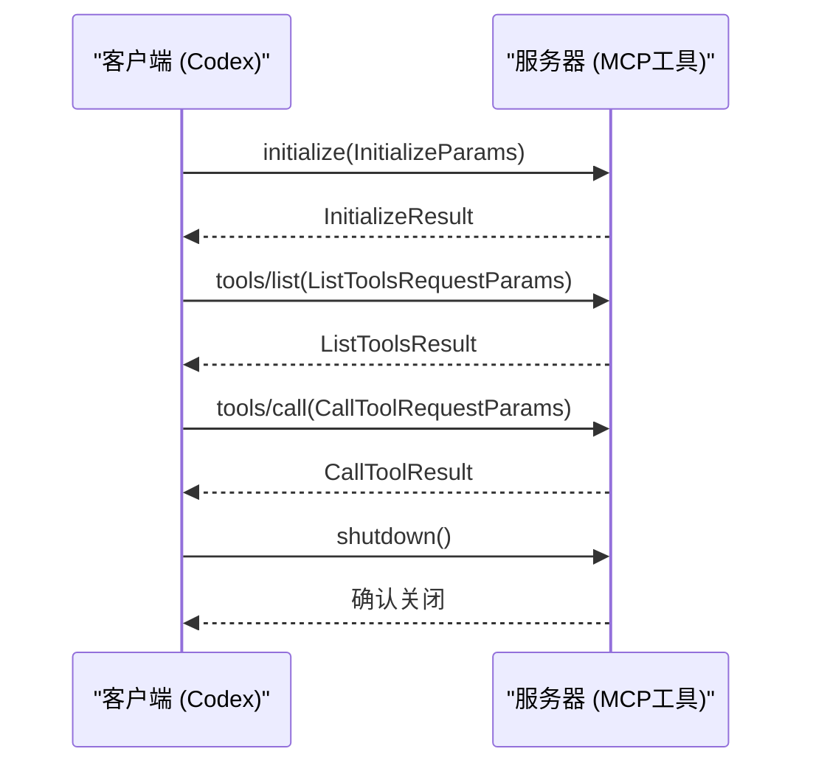

# MCP协议架构

<cite>
**本文档引用的文件**   
- [lib.rs](file://codex-rs\mcp-types\src\lib.rs)
- [mod.rs](file://codex-rs\core\src\mcp\mod.rs)
- [mcp_connection_manager.rs](file://codex-rs\core\src\mcp_connection_manager.rs)
- [mcp_tool_call.rs](file://codex-rs\core\src\mcp_tool_call.rs)
- [lib.rs](file://codex-rs\mcp-server\src\lib.rs)
- [message_processor.rs](file://codex-rs\mcp-server\src\message_processor.rs)
- [outgoing_message.rs](file://codex-rs\mcp-server\src\outgoing_message.rs)
- [codex_tool_runner.rs](file://codex-rs\mcp-server\src\codex_tool_runner.rs)
- [codex_tool_config.rs](file://codex-rs\mcp-server\src\codex_tool_config.rs)
- [codex_mcp_interface.md](file://codex-rs\docs\codex_mcp_interface.md)
</cite>

## 目录
1. [引言](#引言)
2. [MCP协议核心目的](#mcp协议核心目的)
3. [通信模型](#通信模型)
4. [协议生命周期](#协议生命周期)
5. [消息有效载荷结构](#消息有效载荷结构)
6. [上下文感知的工具调用](#上下文感知的工具调用)
7. [安全沙箱环境](#安全沙箱环境)
8. [客户端与服务器交互流程](#客户端与服务器交互流程)
9. [结论](#结论)

## 引言
MCP（Model Context Protocol）协议是Codex与外部工具之间进行标准化通信的桥梁。该协议基于JSON-RPC 2.0，定义了请求、响应和通知消息类型，实现了从初始化握手到工具调用再到关闭的完整生命周期。本文档详细阐述了MCP协议的架构，包括其核心目的、通信模型、生命周期、消息结构以及在安全沙箱环境中的作用。

## MCP协议核心目的
MCP协议的核心目的是作为Codex与外部工具之间的标准化通信桥梁。它允许Codex与各种外部工具进行交互，通过定义清晰的接口和消息格式，确保通信的可靠性和一致性。MCP协议不仅支持基本的工具调用，还提供了丰富的功能，如资源管理、提示获取和日志记录，从而增强了Codex的功能和灵活性。

## 通信模型
MCP协议基于JSON-RPC 2.0，定义了三种主要的消息类型：请求、响应和通知。请求消息由客户端发送给服务器，期望得到一个响应；响应消息是服务器对请求的回复；通知消息则是单向的，不需要响应。这种通信模型确保了消息的有序性和可靠性，同时也支持异步操作。

## 协议生命周期
MCP协议的生命周期从`initialize`握手开始，经过`tool.list`发现工具，再到`tool.call`执行调用，最后以`shutdown`结束。每个阶段都有明确的请求和响应格式，确保了协议的完整性和可预测性。

### 初始化握手
初始化握手是MCP协议生命周期的第一步。客户端发送`initialize`请求，包含客户端能力和信息，服务器响应`InitializeResult`，包含服务器能力和信息。这一过程确保了双方对彼此的能力有充分的了解，为后续的交互奠定了基础。

### 工具发现
在初始化握手完成后，客户端可以通过`tool.list`请求发现可用的工具。服务器返回`ListToolsResult`，包含所有可用工具的列表。这一过程使得客户端能够动态地了解服务器提供的功能，从而做出相应的调用决策。

### 工具调用
工具调用是MCP协议的核心功能。客户端通过`tool.call`请求调用特定的工具，服务器执行相应的操作并返回`CallToolResult`。这一过程支持复杂的业务逻辑，使得Codex能够与外部工具进行深度集成。

### 关闭连接
当通信完成时，客户端可以发送`shutdown`请求，通知服务器关闭连接。服务器确认后，连接被关闭，释放相关资源。这一过程确保了资源的有效管理和通信的有序终止。

## 消息有效载荷结构
MCP协议的消息有效载荷结构由`mcp-types`中的Rust结构体定义，如`InitializeParams`、`ToolCall`等。这些结构体使用`serde`进行序列化和反序列化，确保了数据的正确传输。

### InitializeParams
`InitializeParams`结构体定义了初始化请求的参数，包括客户端能力、客户端信息和协议版本。这些参数帮助服务器了解客户端的能力，从而提供适当的服务。

### ToolCall
`ToolCall`结构体定义了工具调用请求的参数，包括工具名称和参数。这些参数使得客户端能够精确地指定要调用的工具及其输入，确保了调用的准确性和有效性。

## 上下文感知的工具调用
MCP协议支持上下文感知的工具调用，这意味着工具调用可以基于当前的上下文信息进行。例如，`codex`工具调用可以接受配置参数，如工作目录、审批策略和沙箱模式，这些参数可以根据当前任务的需求进行调整，从而实现更灵活和智能的交互。

## 安全沙箱环境
MCP协议在安全沙箱环境中运行，确保了外部工具调用的安全性。沙箱环境限制了工具的权限，防止恶意操作。例如，`ReadOnly`沙箱模式只允许读取操作，而`DangerFullAccess`模式则允许完全访问。这种机制有效地保护了系统的安全性和稳定性。

## 客户端与服务器交互流程
客户端与服务器之间的交互流程通过序列图可视化，展示了从初始化到工具调用再到关闭的完整过程。

**图示来源**
- [lib.rs](file://codex-rs\mcp-types\src\lib.rs)
- [message_processor.rs](file://codex-rs\mcp-server\src\message_processor.rs)

## 结论
MCP协议作为Codex与外部工具之间的标准化通信桥梁，通过基于JSON-RPC 2.0的通信模型，实现了从初始化握手到工具调用再到关闭的完整生命周期。协议的消息有效载荷结构由`mcp-types`中的Rust结构体定义，支持上下文感知的工具调用，并在安全沙箱环境中运行，确保了通信的安全性和可靠性。通过详细的序列图，我们清晰地展示了客户端与服务器之间的交互流程，为开发者提供了全面的理解和指导。

**文档来源**
- [lib.rs](file://codex-rs\mcp-types\src\lib.rs)
- [mod.rs](file://codex-rs\core\src\mcp\mod.rs)
- [mcp_connection_manager.rs](file://codex-rs\core\src\mcp_connection_manager.rs)
- [mcp_tool_call.rs](file://codex-rs\core\src\mcp_tool_call.rs)
- [lib.rs](file://codex-rs\mcp-server\src\lib.rs)
- [message_processor.rs](file://codex-rs\mcp-server\src\message_processor.rs)
- [outgoing_message.rs](file://codex-rs\mcp-server\src\outgoing_message.rs)
- [codex_tool_runner.rs](file://codex-rs\mcp-server\src\codex_tool_runner.rs)
- [codex_tool_config.rs](file://codex-rs\mcp-server\src\codex_tool_config.rs)
- [codex_mcp_interface.md](file://codex-rs\docs\codex_mcp_interface.md)