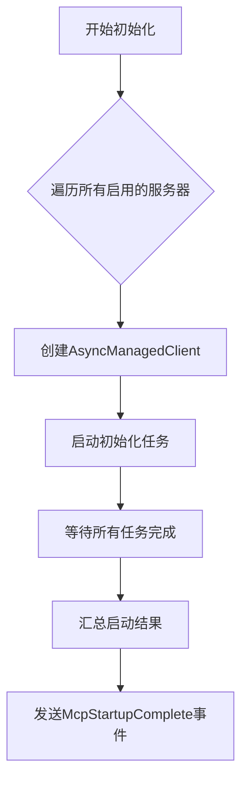
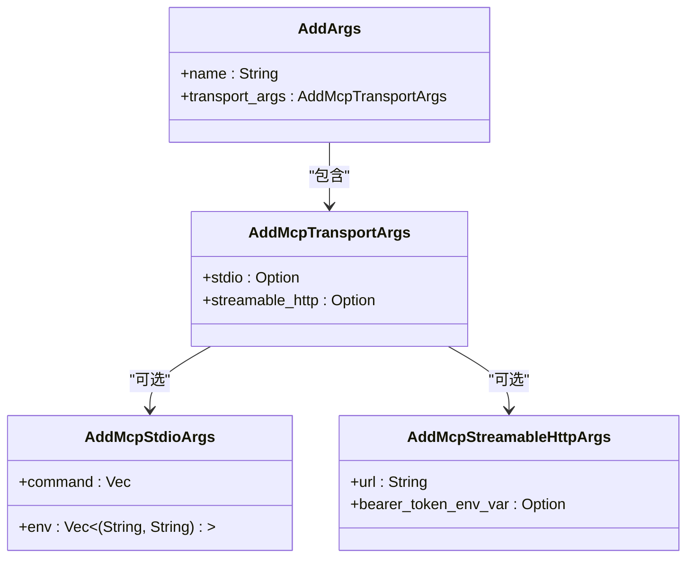
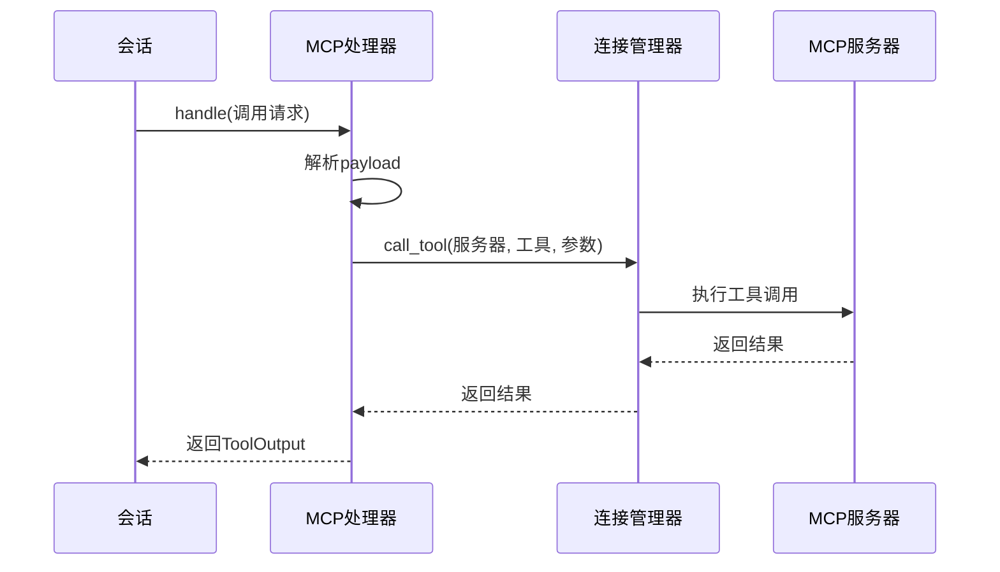
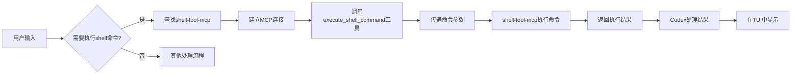

# MCP客户端集成

<cite>
**本文档中引用的文件**   
- [mcp_cmd.rs](file://codex-rs/cli/src/mcp_cmd.rs)
- [mcp_connection_manager.rs](file://codex-rs/core/src/mcp_connection_manager.rs)
- [mcp_tool_call.rs](file://codex-rs/core/src/mcp_tool_call.rs)
- [mcp.rs](file://codex-rs/core/src/tools/handlers/mcp.rs)
- [codex_mcp_interface.md](file://codex-rs/docs/codex_mcp_interface.md)
</cite>

## 目录
1. [引言](#引言)
2. [Codex作为MCP客户端的角色](#codex作为mcp客户端的角色)
3. [McpConnectionManager连接池管理](#mcpconnectionmanager连接池管理)
4. [CLI命令实现原理](#cli命令实现原理)
5. [Mcp Trait与会话集成](#mcp-trait与会话集成)
6. [实际案例：Shell命令执行](#实际案例shell命令执行)
7. [调试技巧与最佳实践](#调试技巧与最佳实践)

## 引言
Codex通过Model Context Protocol (MCP)协议与外部工具服务器进行集成，实现了强大的功能扩展能力。本指南详细阐述了Codex作为MCP客户端的完整工作流程，包括连接管理、工具调用、命令行接口实现以及实际应用案例。

## Codex作为MCP客户端的角色
Codex作为MCP客户端，负责主动发现、连接和调用配置的MCP服务器。系统通过`McpConnectionManager`管理与多个MCP服务器的连接池，实现了连接的建立、健康检查和断开等生命周期管理。

Codex通过两种传输方式与MCP服务器通信：
- **Stdio传输**：通过命令行启动MCP服务器进程，使用标准输入输出进行通信
- **Streamable HTTP传输**：通过HTTP流式连接与远程MCP服务器通信

系统支持OAuth认证机制，能够自动检测并处理需要登录的MCP服务器。当检测到支持OAuth的服务器时，Codex会自动启动OAuth流程完成身份验证。

**Section sources**
- [mcp_connection_manager.rs](file://codex-rs/core/src/mcp_connection_manager.rs#L1-L15)
- [mcp_cmd.rs](file://codex-rs/cli/src/mcp_cmd.rs#L22-L27)

## McpConnectionManager连接池管理
`McpConnectionManager`是MCP客户端的核心组件，负责管理与所有配置MCP服务器的连接。该组件为每个配置的服务器（以服务器名称为键）维护一个`RmcpClient`实例。

### 连接初始化
连接管理器通过`initialize`方法异步初始化所有启用的MCP服务器。该过程包括：
1. 为每个服务器创建`AsyncManagedClient`
2. 并发启动服务器初始化任务
3. 发送启动状态更新事件
4. 汇总所有服务器的启动结果

**Diagram sources **
- [mcp_connection_manager.rs](file://codex-rs/core/src/mcp_connection_manager.rs#L278-L380)

### 连接健康检查
系统实现了完善的健康检查机制，包括：
- **启动超时检查**：默认10秒超时，可通过`startup_timeout_sec`配置
- **工具调用超时**：默认60秒超时，可通过`tool_timeout_sec`配置
- **认证状态检查**：定期检查服务器的认证状态

当连接出现问题时，系统会提供详细的错误信息和解决方案建议，例如：
- 认证失败时提示运行`codex mcp login`命令
- 启动超时时建议调整超时配置

**Section sources**
- [mcp_connection_manager.rs](file://codex-rs/core/src/mcp_connection_manager.rs#L76-L81)
- [mcp_connection_manager.rs](file://codex-rs/core/src/mcp_connection_manager.rs#L890-L927)

## CLI命令实现原理
Codex提供了丰富的CLI命令来管理MCP服务器配置，这些命令在`mcp_cmd.rs`文件中实现。

### codex mcp add命令
`codex mcp add`命令用于添加新的MCP服务器配置。该命令支持两种传输方式：

**Diagram sources **
- [mcp_cmd.rs](file://codex-rs/cli/src/mcp_cmd.rs#L64-L125)

### codex mcp list命令
`codex mcp list`命令用于列出所有配置的MCP服务器。该命令支持两种输出格式：
- **表格格式**：适合人类阅读，按服务器类型分组显示
- **JSON格式**：适合程序解析，包含完整的服务器配置信息

命令实现中包含了详细的格式化逻辑，能够正确显示环境变量、工作目录等复杂信息，并根据服务器状态显示相应的认证状态。

**Section sources**
- [mcp_cmd.rs](file://codex-rs/cli/src/mcp_cmd.rs#L47-L63)
- [mcp_cmd.rs](file://codex-rs/cli/src/mcp_cmd.rs#L390-L645)

## Mcp Trait与会话集成
MCP工具调用通过`Mcp` trait在会话中被`SessionTask`使用，实现了工具调用的抽象化。

### 工具调用流程
工具调用流程遵循以下步骤：
1. 解析完全限定的工具名称
2. 验证工具是否被启用
3. 执行工具调用
4. 处理调用结果

**Diagram sources **
- [mcp_tool_call.rs](file://codex-rs/core/src/mcp_tool_call.rs#L16-L76)
- [mcp.rs](file://codex-rs/core/src/tools/handlers/mcp.rs#L19-L75)

### 工具名称规范化
系统使用`MCP_TOOL_NAME_DELIMITER`（"__"）作为分隔符，将服务器名称和工具名称组合成完全限定的工具名称：
`mcp__{server}__{tool}`

当工具名称过长（超过64字符）时，系统会使用SHA-1哈希值进行截断，确保名称符合OpenAI的要求。

**Section sources**
- [mcp_connection_manager.rs](file://codex-rs/core/src/mcp_connection_manager.rs#L68-L73)
- [mcp_tool_call.rs](file://codex-rs/core/src/mcp_tool_call.rs#L16-L76)

## 实际案例：Shell命令执行
当用户在TUI中输入需要执行shell命令的请求时，Codex通过MCP协议与`shell-tool-mcp`交互，完整流程如下：

### 交互流程
1. 用户在TUI中输入请求
2. Codex识别需要执行shell命令
3. 通过MCP协议调用`shell-tool-mcp`的相应工具
4. `shell-tool-mcp`执行shell命令并返回结果
5. Codex将结果呈现给用户

### 具体实现

**Diagram sources **
- [codex_mcp_interface.md](file://codex-rs/docs/codex_mcp_interface.md#L1-L142)

### 安全考虑
系统在执行shell命令时实施了多重安全措施：
- 沙箱环境执行：限制命令的执行权限
- 命令审批：根据配置的审批策略提示用户确认
- 环境隔离：确保命令在安全的环境中运行

**Section sources**
- [mcp_connection_manager.rs](file://codex-rs/core/src/mcp_connection_manager.rs#L263-L270)
- [codex_mcp_interface.md](file://codex-rs/docs/codex_mcp_interface.md#L27)

## 调试技巧与最佳实践
### 常见问题排查
1. **连接超时问题**
   - 检查服务器是否正常运行
   - 增加`startup_timeout_sec`配置值
   - 验证网络连接是否正常

2. **认证失败问题**
   - 运行`codex mcp login <server_name>`重新登录
   - 检查环境变量中的认证令牌是否正确
   - 对于GitHub MCP，使用个人访问令牌

3. **工具调用失败**
   - 使用`codex mcp list --json`验证工具是否可用
   - 检查工具名称是否正确
   - 验证工具参数是否符合要求

### 最佳实践
1. **配置管理**
   - 使用`config.toml`集中管理MCP服务器配置
   - 为不同环境设置不同的配置文件
   - 定期备份配置文件

2. **性能优化**
   - 合理设置超时时间，避免过长或过短
   - 使用连接池减少连接建立开销
   - 监控工具调用性能，优化慢速工具

3. **安全实践**
   - 限制工具的权限范围
   - 定期审查已启用的工具
   - 使用沙箱环境执行高风险命令

**Section sources**
- [mcp_connection_manager.rs](file://codex-rs/core/src/mcp_connection_manager.rs#L889-L947)
- [mcp_cmd.rs](file://codex-rs/cli/src/mcp_cmd.rs#L267-L285)