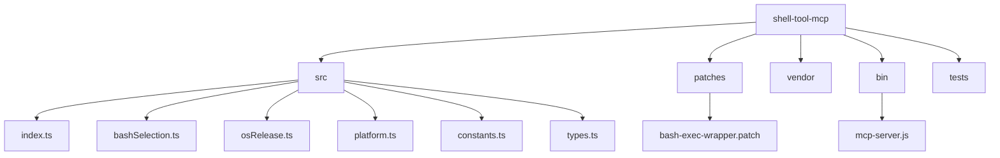
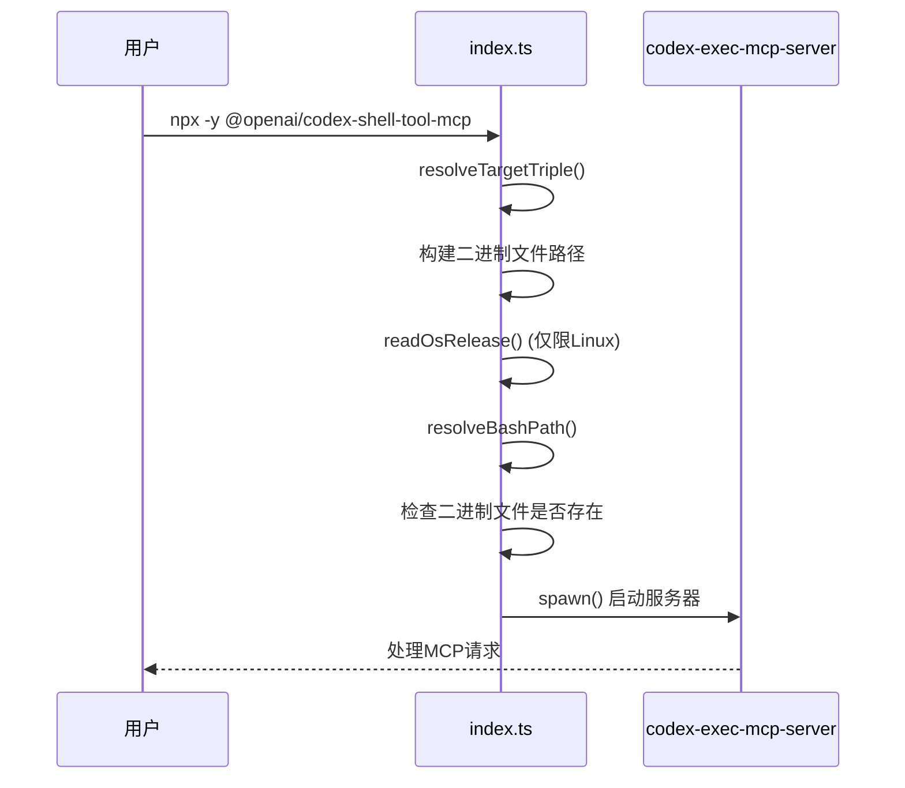
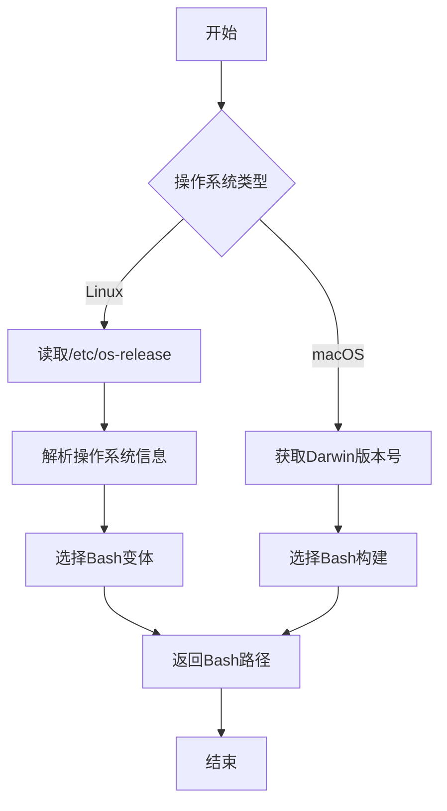
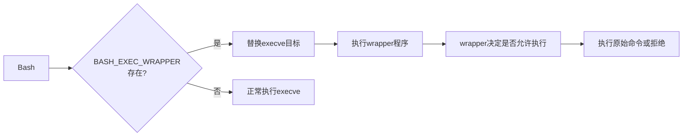

# MCP工具开发

<cite>
**本文档中引用的文件**  
- [index.ts](file://shell-tool-mcp/src/index.ts)
- [bashSelection.ts](file://shell-tool-mcp/src/bashSelection.ts)
- [osRelease.ts](file://shell-tool-mcp/src/osRelease.ts)
- [platform.ts](file://shell-tool-mcp/src/platform.ts)
- [constants.ts](file://shell-tool-mcp/src/constants.ts)
- [types.ts](file://shell-tool-mcp/src/types.ts)
- [package.json](file://shell-tool-mcp/package.json)
- [README.md](file://shell-tool-mcp/README.md)
- [bash-exec-wrapper.patch](file://shell-tool-mcp/patches/bash-exec-wrapper.patch)
- [mcp-server.js](file://shell-tool-mcp/bin/mcp-server.js)
</cite>

## 目录
1. [简介](#简介)
2. [项目结构](#项目结构)
3. [MCP工具注册](#mcp工具注册)
4. [核心实现分析](#核心实现分析)
5. [操作系统适配机制](#操作系统适配机制)
6. [Bash行为修改](#bash行为修改)
7. [git-helper工具开发示例](#git-helper工具开发示例)
8. [结论](#结论)

## 简介
本教程旨在为开发者提供一份详细的MCP（Model Context Protocol）工具开发指南。以`shell-tool-mcp`为例，逐步指导如何创建一个MCP工具。我们将深入探讨工具的注册过程、核心代码实现、操作系统适配机制以及如何修改shell行为以更好地与Codex集成。最后，通过一个完整的`git-helper`工具开发示例，演示如何将自定义工具集成到Codex中。

## 项目结构
`shell-tool-mcp`项目是一个Node.js包，用于提供一个名为`shell`的MCP工具，该工具可以在沙箱化的Bash实例中运行shell命令。项目结构清晰，主要包含以下几个部分：

- `src/`：包含所有TypeScript源代码文件
- `patches/`：包含用于修改Bash行为的补丁文件
- `vendor/`：包含预编译的二进制文件
- `bin/`：包含可执行脚本
- `tests/`：包含单元测试文件

项目通过`package.json`定义了包的元数据和构建脚本，使用TypeScript进行开发，并通过`tsup`进行打包。



**图源**
- [index.ts](file://shell-tool-mcp/src/index.ts)
- [bashSelection.ts](file://shell-tool-mcp/src/bashSelection.ts)
- [osRelease.ts](file://shell-tool-mcp/src/osRelease.ts)
- [platform.ts](file://shell-tool-mcp/src/platform.ts)
- [constants.ts](file://shell-tool-mcp/src/constants.ts)
- [types.ts](file://shell-tool-mcp/src/types.ts)
- [bash-exec-wrapper.patch](file://shell-tool-mcp/patches/bash-exec-wrapper.patch)
- [mcp-server.js](file://shell-tool-mcp/bin/mcp-server.js)

## MCP工具注册
MCP工具的注册过程主要通过`package.json`文件中的`bin`字段和`files`字段来定义。`bin`字段指定了可执行文件的入口点，而`files`字段则指定了需要包含在包中的文件。

在`shell-tool-mcp`中，`package.json`文件定义了以下元数据：

- `name`: `@openai/codex-shell-tool-mcp`，工具的名称
- `version`: `0.0.0-dev`，工具的版本号
- `description`: 工具的描述信息
- `bin`: 指定了可执行文件的入口点`bin/mcp-server.js`
- `files`: 指定了需要包含在包中的文件，包括`bin`、`vendor`和`README.md`

当用户通过`npx -y @openai/codex-shell-tool-mcp`命令运行工具时，Node.js会查找`bin`字段中指定的入口文件，并执行其中的代码。

**节源**
- [package.json](file://shell-tool-mcp/package.json)

## 核心实现分析
`shell-tool-mcp`的核心实现位于`src/index.ts`文件中。该文件定义了一个`main`函数，负责启动`codex-exec-mcp-server`二进制文件，并根据当前操作系统的类型和架构选择合适的二进制文件。

`main`函数的主要逻辑如下：

1. 根据当前操作系统的类型和架构，确定目标三元组（target triple）
2. 构建`vendor`目录的路径，并确定`codex-execve-wrapper`和`codex-exec-mcp-server`二进制文件的路径
3. 如果是Linux系统，读取`/etc/os-release`文件以获取操作系统信息
4. 根据操作系统信息，选择合适的Bash版本
5. 检查所有必需的二进制文件是否存在
6. 启动`codex-exec-mcp-server`进程，并将`execveWrapperPath`和`bashPath`作为参数传递



**图源**
- [index.ts](file://shell-tool-mcp/src/index.ts)

**节源**
- [index.ts](file://shell-tool-mcp/src/index.ts)

## 操作系统适配机制
`shell-tool-mcp`通过`bashSelection.ts`和`osRelease.ts`两个文件来实现对不同操作系统环境的适配。

`osRelease.ts`文件中的`readOsRelease`函数负责读取Linux系统中的`/etc/os-release`文件，并解析其中的操作系统信息。该函数返回一个包含`id`、`idLike`和`versionId`字段的对象，用于标识操作系统的类型和版本。

`bashSelection.ts`文件中的`resolveBashPath`函数则根据操作系统的类型和版本，选择合适的Bash版本。对于Linux系统，它会根据`os-release`文件中的信息，从预定义的Bash变体列表中选择最匹配的版本。对于macOS系统，它会根据Darwin内核的版本号，选择合适的Bash构建。



**图源**
- [bashSelection.ts](file://shell-tool-mcp/src/bashSelection.ts)
- [osRelease.ts](file://shell-tool-mcp/src/osRelease.ts)

**节源**
- [bashSelection.ts](file://shell-tool-mcp/src/bashSelection.ts)
- [osRelease.ts](file://shell-tool-mcp/src/osRelease.ts)

## Bash行为修改
`shell-tool-mcp`通过`bash-exec-wrapper.patch`文件来修改Bash的行为，以更好地与Codex集成。该补丁文件修改了Bash的`execute_cmd.c`文件，在`shell_execve`函数中添加了一段代码，用于检查环境变量`BASH_EXEC_WRAPPER`。

如果`BASH_EXEC_WRAPPER`环境变量存在且不为空，Bash会将`execve`调用的目标程序替换为`BASH_EXEC_WRAPPER`指定的程序，并将原始命令作为参数传递给新程序。这样，Codex就可以通过设置`BASH_EXEC_WRAPPER`环境变量，来拦截和控制所有通过Bash执行的命令。



**图源**
- [bash-exec-wrapper.patch](file://shell-tool-mcp/patches/bash-exec-wrapper.patch)

**节源**
- [bash-exec-wrapper.patch](file://shell-tool-mcp/patches/bash-exec-wrapper.patch)

## git-helper工具开发示例
现在，让我们通过一个完整的示例，演示如何开发一个名为`git-helper`的新MCP工具。该工具可以执行`git status`和`git commit`命令，并将其集成到Codex中。

首先，创建一个新的Node.js项目，并在`package.json`中定义工具的元数据：

```json
{
  "name": "git-helper-mcp",
  "version": "1.0.0",
  "description": "A MCP tool for Git operations",
  "bin": {
    "git-helper-mcp": "bin/git-helper.js"
  },
  "files": [
    "bin",
    "src"
  ]
}
```

然后，创建`src/index.ts`文件，实现`tool.list`和`tool.call`方法：

```typescript
import { spawn } from "node:child_process";

async function main(): Promise<void> {
  const args = process.argv.slice(2);
  const method = args[0];

  if (method === "tool.list") {
    console.log(JSON.stringify({
      tools: [
        {
          name: "git_status",
          description: "Get the status of the Git repository",
          input_schema: {
            type: "object",
            properties: {}
          }
        },
        {
          name: "git_commit",
          description: "Commit changes to the Git repository",
          input_schema: {
            type: "object",
            properties: {
              message: {
                type: "string",
                description: "The commit message"
              }
            },
            required: ["message"]
          }
        }
      ]
    }));
  } else if (method === "tool.call") {
    const toolName = args[1];
    const params = JSON.parse(args[2]);

    if (toolName === "git_status") {
      const child = spawn("git", ["status", "--porcelain"]);
      let output = "";
      child.stdout.on("data", (data) => {
        output += data.toString();
      });
      await new Promise((resolve) => {
        child.on("close", resolve);
      });
      console.log(JSON.stringify({ result: output }));
    } else if (toolName === "git_commit") {
      const child = spawn("git", ["commit", "-m", params.message]);
      let error = "";
      child.stderr.on("data", (data) => {
        error += data.toString();
      });
      const closePromise = new Promise((resolve) => {
        child.on("close", resolve);
      });
      const exitCode = await closePromise;
      if (exitCode === 0) {
        console.log(JSON.stringify({ result: "Commit successful" }));
      } else {
        console.log(JSON.stringify({ error: error }));
      }
    }
  }
}

void main().catch((err) => {
  console.error(err);
  process.exit(1);
});
```

最后，创建`bin/git-helper.js`文件，作为可执行文件的入口点：

```javascript
#!/usr/bin/env node
require("../src/index");
```

将这个工具集成到Codex中，只需在`~/.codex/config.toml`中添加以下配置：

```toml
[mcp_servers.git-helper]
command = "npx"
args = ["-y", "git-helper-mcp"]
```

**节源**
- [package.json](file://shell-tool-mcp/package.json)
- [index.ts](file://shell-tool-mcp/src/index.ts)
- [mcp-server.js](file://shell-tool-mcp/bin/mcp-server.js)

## 结论
通过本教程，我们详细介绍了如何开发一个MCP工具。我们以`shell-tool-mcp`为例，解释了工具的注册过程、核心代码实现、操作系统适配机制以及如何修改shell行为以更好地与Codex集成。最后，通过一个完整的`git-helper`工具开发示例，演示了如何将自定义工具集成到Codex中。希望本教程能帮助开发者快速上手MCP工具开发，为Codex生态系统贡献更多有用的工具。