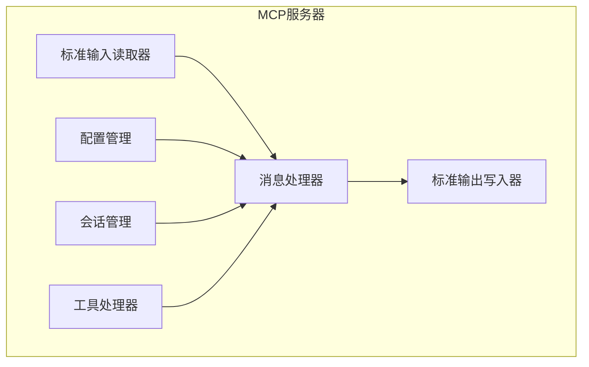
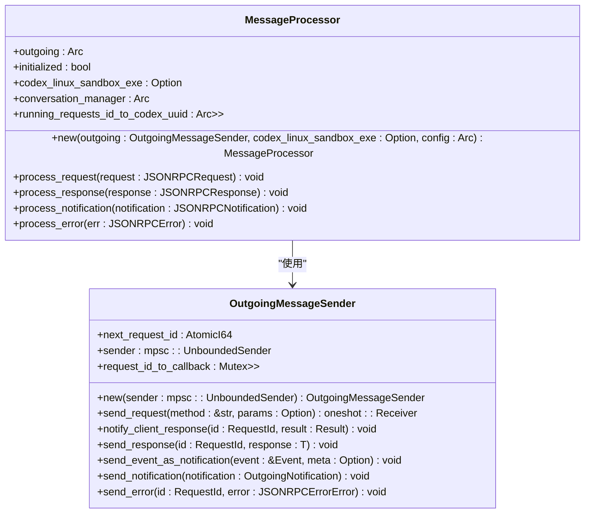
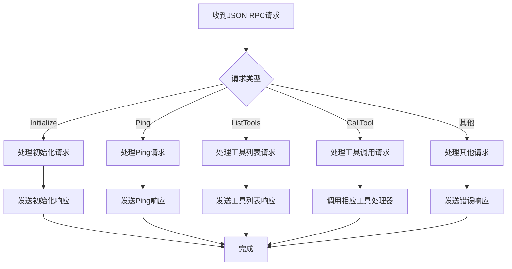
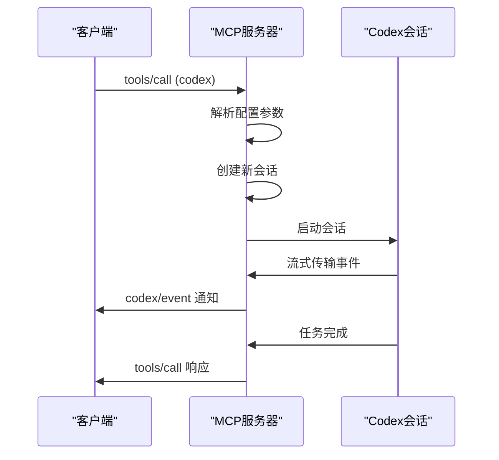
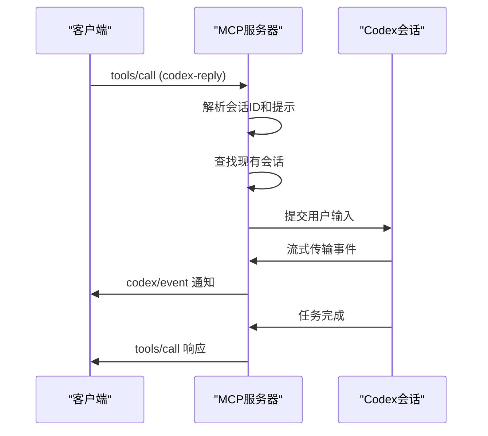
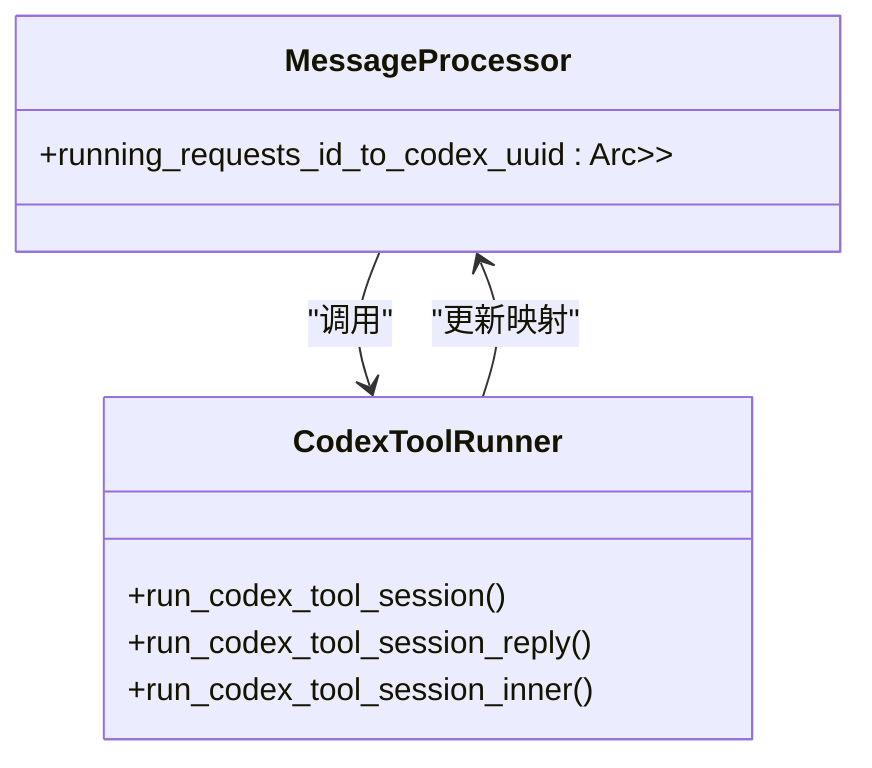
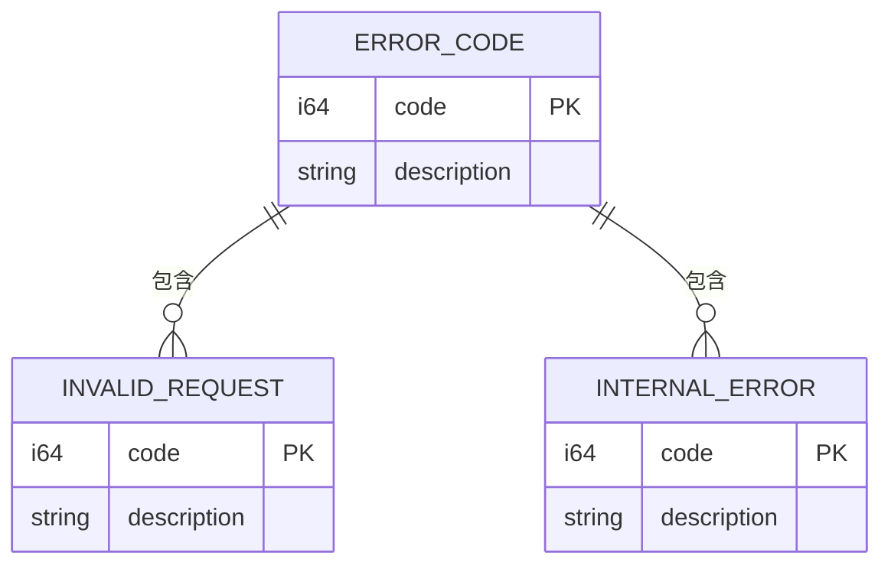
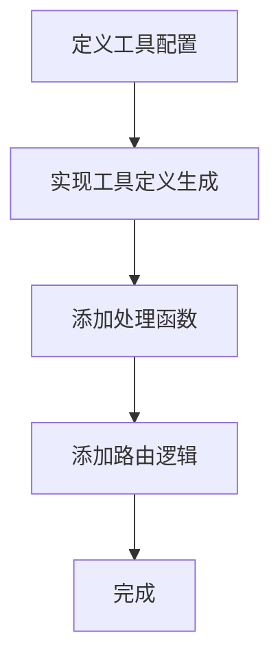
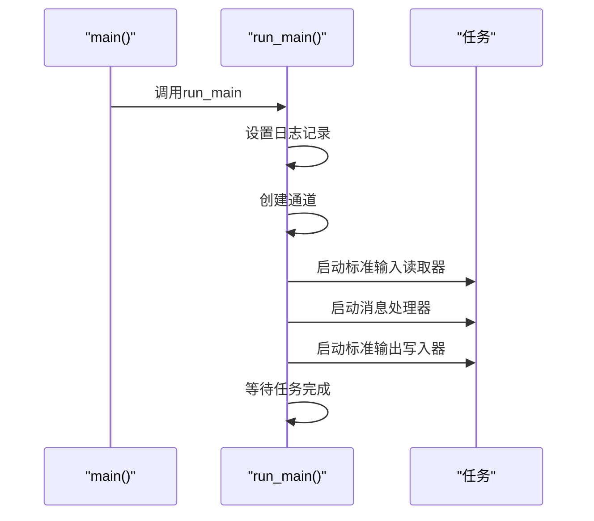

# MCP服务器实现

<cite>
**本文档中引用的文件**   
- [main.rs](file://codex-rs\mcp-server\src\main.rs)
- [lib.rs](file://codex-rs\mcp-server\src\lib.rs)
- [message_processor.rs](file://codex-rs\mcp-server\src\message_processor.rs)
- [codex_tool_runner.rs](file://codex-rs\mcp-server\src\codex_tool_runner.rs)
- [codex_tool_config.rs](file://codex-rs\mcp-server\src\codex_tool_config.rs)
- [outgoing_message.rs](file://codex-rs\mcp-server\src\outgoing_message.rs)
- [error_code.rs](file://codex-rs\mcp-server\src\error_code.rs)
- [exec_approval.rs](file://codex-rs\mcp-server\src\exec_approval.rs)
- [patch_approval.rs](file://codex-rs\mcp-server\src\patch_approval.rs)
</cite>

## 目录
1. [引言](#引言)
2. [MCP服务器架构](#mcp服务器架构)
3. [核心组件分析](#核心组件分析)
4. [消息处理流程](#消息处理流程)
5. [工具处理器实现](#工具处理器实现)
6. [进程生命周期管理](#进程生命周期管理)
7. [错误处理机制](#错误处理机制)
8. [自定义工具处理器实现指南](#自定义工具处理器实现指南)
9. [配置与启动](#配置与启动)
10. [结论](#结论)

## 引言
MCP（Model Context Protocol）服务器是Codex系统与外部工具进程之间的协调者，负责处理JSON-RPC请求并将其路由到相应的工具处理器。该服务器作为Codex与外部工具（如Node.js编写的`shell-tool-mcp`）之间的桥梁，通过stdin/stdout进行进程间通信（IPC）。本技术文档详细阐述了`mcp-server` crate的实现细节，包括消息处理、工具调用、进程管理以及错误处理等关键机制。

## MCP服务器架构
MCP服务器采用异步架构，基于Tokio运行时实现非阻塞I/O操作。服务器通过三个主要任务协同工作：从标准输入读取消息、处理传入消息以及将响应写入标准输出。这种设计确保了高并发性和响应性，同时通过有界通道在任务间传递消息，平衡了吞吐量和内存使用。

**图源**
- [lib.rs](file://codex-rs\mcp-server\src\lib.rs#L46-L149)

## 核心组件分析
MCP服务器的核心组件包括消息处理器（MessageProcessor）、工具处理器（ToolHandler）和输出消息发送器（OutgoingMessageSender）。这些组件协同工作，实现从请求接收、处理到响应发送的完整流程。

### 消息处理器（MessageProcessor）
消息处理器是MCP服务器的核心，负责解析来自Codex的JSON-RPC请求，并根据请求类型将其路由到相应的处理函数。处理器维护了服务器的初始化状态、会话管理器以及正在进行的请求映射。

**组件源**
- [message_processor.rs](file://codex-rs\mcp-server\src\message_processor.rs#L39-L656)

### 工具处理器（ToolHandler）
工具处理器负责处理具体的工具调用请求。MCP服务器实现了两种主要工具：`codex`和`codex-reply`，分别用于启动新的Codex会话和继续现有会话。

**图源**
- [message_processor.rs](file://codex-rs\mcp-server\src\message_processor.rs#L39-L656)
- [outgoing_message.rs](file://codex-rs\mcp-server\src\outgoing_message.rs#L24-L352)

## 消息处理流程
MCP服务器的消息处理流程遵循JSON-RPC协议规范，能够处理请求、响应、通知和错误四种消息类型。当收到请求时，处理器会根据方法名将其分发到相应的处理函数。

### 请求处理流程

**图源**
- [message_processor.rs](file://codex-rs\mcp-server\src\message_processor.rs#L72-L125)

## 工具处理器实现
MCP服务器实现了两种核心工具处理器：`codex`和`codex-reply`。这些处理器通过`handle_call_tool`函数进行路由，根据工具名称调用相应的处理函数。

### Codex工具调用处理
当收到`codex`工具调用请求时，服务器会解析传入的配置参数，创建新的Codex会话，并在独立的异步任务中运行会话。

**图源**
- [message_processor.rs](file://codex-rs\mcp-server\src\message_processor.rs#L346-L423)
- [codex_tool_runner.rs](file://codex-rs\mcp-server\src\codex_tool_runner.rs#L39-L114)

### Codex回复工具调用处理
`codex-reply`工具用于继续现有的Codex会话。处理器会根据提供的会话ID查找现有会话，并提交新的用户输入。

**图源**
- [message_processor.rs](file://codex-rs\mcp-server\src\message_processor.rs#L425-L536)
- [codex_tool_runner.rs](file://codex-rs\mcp-server\src\codex_tool_runner.rs#L116-L149)

## 进程生命周期管理
MCP服务器通过`running_requests_id_to_codex_uuid`映射来管理正在进行的请求和会话。当收到取消通知时，服务器会查找相应的会话并提交中断操作。

### 请求-会话映射管理

**图源**
- [message_processor.rs](file://codex-rs\mcp-server\src\message_processor.rs#L44-L68)
- [codex_tool_runner.rs](file://codex-rs\mcp-server\src\codex_tool_runner.rs#L39-L340)

## 错误处理机制
MCP服务器实现了全面的错误处理机制，包括请求验证、序列化错误和运行时错误的处理。服务器使用预定义的错误代码来区分不同类型的错误。

### 错误代码定义

**图源**
- [error_code.rs](file://codex-rs\mcp-server\src\error_code.rs#L1-L3)
- [outgoing_message.rs](file://codex-rs\mcp-server\src\outgoing_message.rs#L21-L22)

## 自定义工具处理器实现指南
开发者可以通过实现新的工具处理器来扩展MCP服务器的功能。以下是一个假想的数据库查询工具的实现步骤。

### 创建新的工具处理器
1. 定义工具配置结构体
2. 实现`create_tool_for_*`函数以生成工具定义
3. 在`MessageProcessor`中添加新的处理函数
4. 在`handle_call_tool`中添加路由逻辑

**组件源**
- [codex_tool_config.rs](file://codex-rs\mcp-server\src\codex_tool_config.rs#L18-L344)
- [message_processor.rs](file://codex-rs\mcp-server\src\message_processor.rs#L116-L118)

## 配置与启动
MCP服务器的配置和启动过程在`main.rs`和`lib.rs`中实现。服务器通过`run_main`函数启动，设置日志记录、通道和任务。

### 服务器启动流程

**组件源**
- [main.rs](file://codex-rs\mcp-server\src\main.rs#L5-L10)
- [lib.rs](file://codex-rs\mcp-server\src\lib.rs#L46-L149)

## 结论
MCP服务器作为Codex与外部工具之间的协调者，实现了高效的消息处理、工具调用和进程管理机制。通过异步架构和清晰的组件分离，服务器能够可靠地处理复杂的交互场景。开发者可以基于现有的框架轻松扩展功能，实现自定义的工具处理器。服务器的错误处理机制和生命周期管理确保了系统的稳定性和可靠性。