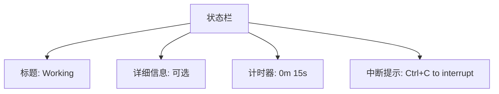
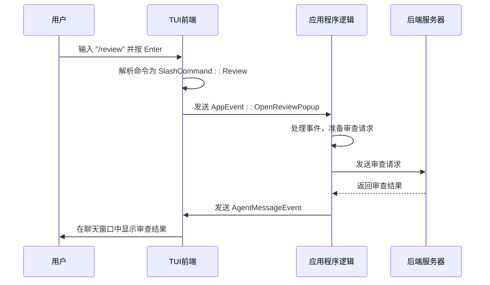
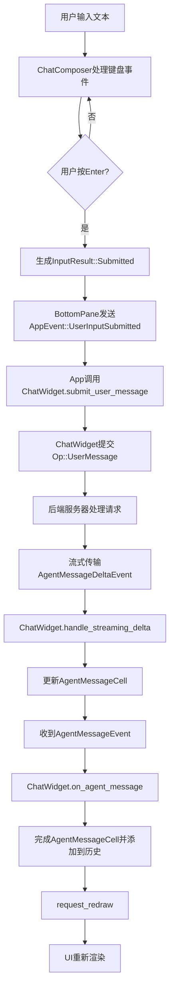

# 交互式界面（TUI）

<cite>
**本文档中引用的文件**   
- [lib.rs](file://codex-rs/tui/src/lib.rs)
- [app.rs](file://codex-rs/tui/src/app.rs)
- [chatwidget.rs](file://codex-rs/tui/src/chatwidget.rs)
- [slash_command.rs](file://codex-rs/tui/src/slash_command.rs)
- [key_hint.rs](file://codex-rs/tui/src/key_hint.rs)
- [history_cell.rs](file://codex-rs/tui/src/history_cell.rs)
- [tui.rs](file://codex-rs/tui/src/tui.rs)
- [bottom_pane\mod.rs](file://codex-rs/tui/src/bottom_pane/mod.rs)
- [chat_composer.rs](file://codex-rs/tui/src/bottom_pane/chat_composer.rs)
- [status_indicator_widget.rs](file://codex-rs/tui/src/status_indicator_widget.rs)
</cite>

## 目录
1. [简介](#简介)
2. [TUI布局](#tui布局)
3. [键盘快捷键](#键盘快捷键)
4. [斜杠命令](#斜杠命令)
5. [用户输入处理流程](#用户输入处理流程)
6. [高级功能](#高级功能)
7. [交互式会话示例](#交互式会话示例)
8. [结论](#结论)

## 简介
Codex交互式终端用户界面（TUI）是一个功能丰富的命令行界面，旨在提供与Codex AI助手的无缝交互体验。该界面采用Ratatui库构建，提供了一个结构化的布局，包括聊天窗口、命令输入区、状态栏和动态侧边栏元素。TUI的设计注重用户体验，通过直观的键盘快捷键、斜杠命令和实时反馈，使用户能够高效地与AI进行交互。本文档将详细描述TUI的整体布局、导航方式、命令处理流程以及高级功能，为用户提供全面的使用指南。

**Section sources**
- [lib.rs](file://codex-rs/tui/src/lib.rs#L1-L689)
- [app.rs](file://codex-rs/tui/src/app.rs#L1-L800)

## TUI布局
Codex TUI的布局设计为一个清晰的两部分结构：上半部分是聊天历史窗口，下半部分是用户输入和状态区域。

### 聊天窗口
聊天窗口位于界面的上半部分，是主要的交互区域。它以时间顺序显示用户和AI之间的对话历史。每条消息都以特定的格式呈现：
- **用户消息**：以 `›` 符号开头，文本为白色。
- **AI消息**：以 `•` 符号开头，文本为默认颜色。
- **系统消息**：如警告、错误或状态更新，使用不同的颜色和符号进行区分，例如警告消息为黄色，错误消息为红色。

聊天窗口支持滚动，用户可以使用键盘或鼠标滚轮浏览整个对话历史。

### 命令输入区
命令输入区位于界面的下半部分，由一个文本输入框（`ChatComposer`）组成。该区域的主要功能是接收用户的文本输入。其特点包括：
- **多行输入**：支持多行文本输入，方便用户编写复杂的指令。
- **占位符文本**：当输入框为空时，显示提示文本（如 "Ask Codex to do anything"）。
- **输入提示**：在输入框下方显示一组键盘快捷键提示，帮助用户了解可用的操作。

### 状态栏
状态栏是TUI中一个动态的、上下文相关的组件，位于命令输入区之上。它的内容和可见性根据当前的会话状态而变化。

#### 任务运行状态
当AI正在处理一个任务时，状态栏会显示一个“工作”指示器，包含以下信息：
- **标题**：一个动态的标题，通常为“Working”，但会根据AI当前的活动更新（例如，“Searching files”）。
- **详细信息**：可选的详细信息行，提供更具体的任务描述。
- **计时器**：显示任务已运行的时间，格式为 `0s`, `1m 00s`, 或 `1h 00m 00s`。
- **中断提示**：当任务运行时，会显示一个提示，告知用户可以按 `Ctrl+C` 来中断任务。



**Diagram sources**
- [status_indicator_widget.rs](file://codex-rs/tui/src/status_indicator_widget.rs#L33-L200)
- [bottom_pane\mod.rs](file://codex-rs/tui/src/bottom_pane/mod.rs#L82-L90)

#### 其他状态
状态栏还会在其他情况下出现：
- **批准请求**：当AI请求执行某个操作（如写入文件）时，会弹出一个批准对话框，覆盖在状态栏位置。
- **文件搜索**：当用户触发文件搜索时，会显示一个搜索结果弹窗。
- **命令选择**：当用户输入 `/` 时，会显示一个可用斜杠命令的列表。

### 侧边栏
Codex TUI没有一个固定的侧边栏。相反，它使用一种“弹出式”（popup）的设计模式，根据上下文动态地在底部区域显示不同的信息面板。这些面板包括：
- **技能面板**：显示可用的技能列表。
- **模型选择面板**：允许用户选择不同的AI模型。
- **反馈面板**：用于提交用户反馈。
这些面板在需要时出现，并在用户完成操作后消失，从而保持界面的简洁。

**Section sources**
- [chatwidget.rs](file://codex-rs/tui/src/chatwidget.rs#L313-L372)
- [bottom_pane\mod.rs](file://codex-rs/tui/src/bottom_pane/mod.rs#L65-L90)
- [status_indicator_widget.rs](file://codex-rs/tui/src/status_indicator_widget.rs#L33-L200)

## 键盘快捷键
Codex TUI提供了一套全面的键盘快捷键，以提高用户的操作效率。这些快捷键分为基本导航、文本编辑和高级操作三类。

### 基本导航
| 快捷键 | 功能 |
| :--- | :--- |
| `Enter` | 提交当前输入的文本。 |
| `Shift+Enter` | 在输入框中插入一个换行符，不提交。 |
| `Ctrl+C` | 中断当前正在运行的任务。如果输入框为空，则退出程序。 |
| `Ctrl+D` | 退出程序。 |
| `Up Arrow` | 在输入历史中向上浏览。 |
| `Down Arrow` | 在输入历史中向下浏览。 |
| `Page Up` | 向上滚动聊天历史。 |
| `Page Down` | 向下滚动聊天历史。 |

### 文本编辑
| 快捷键 | 功能 |
| :--- | :--- |
| `Ctrl+A` | 将光标移动到行首。 |
| `Ctrl+E` | 将光标移动到行尾。 |
| `Ctrl+U` | 删除从光标位置到行首的所有字符。 |
| `Ctrl+K` | 删除从光标位置到行尾的所有字符。 |
| `Ctrl+W` | 删除光标前的一个单词。 |
| `Ctrl+H` | 删除光标前的一个字符（退格）。 |
| `Ctrl+D` | 删除光标后的一个字符（删除）。 |

### 高级操作
| 快捷键 | 功能 |
| :--- | :--- |
| `/` | 打开斜杠命令列表，用户可以从中选择一个命令。 |
| `Esc` | 当任务正在运行时，发送中断信号。在其他情况下，用于关闭弹出窗口。 |
| `Esc+Esc` | 触发回溯功能，返回到上一个会话状态。 |
| `Ctrl+R` | 打开文件搜索功能。 |
| `Ctrl+O` | 在外部编辑器中打开当前输入。 |

**Section sources**
- [key_hint.rs](file://codex-rs/tui/src/key_hint.rs#L1-L113)
- [chat_composer.rs](file://codex-rs/tui/src/bottom_pane/chat_composer.rs#L95-L123)
- [app.rs](file://codex-rs/tui/src/app.rs#L513-L558)

## 斜杠命令
斜杠命令是Codex TUI中一种强大的功能，允许用户通过输入以 `/` 开头的特殊命令来触发特定的操作。这些命令提供了一种快捷方式，用于访问高级功能，而无需通过复杂的菜单。

### 命令列表
以下是Codex TUI支持的完整斜杠命令列表：

| 命令 | 描述 |
| :--- | :--- |
| `/model` | 选择要使用的AI模型和推理努力程度。 |
| `/approvals` | 配置AI在无需批准的情况下可以执行的操作。 |
| `/experimental` | 切换实验性功能的开关。 |
| `/skills` | 使用技能来增强Codex执行特定任务的能力。 |
| `/review` | 请求Codex审查当前的代码更改并提出改进建议。 |
| `/new` | 在当前会话中开始一个新对话。 |
| `/resume` | 恢复一个已保存的会话。 |
| `/init` | 创建一个AGENTS.md文件，为Codex提供项目指导。 |
| `/compact` | 总结对话以防止达到上下文限制。 |
| `/diff` | 显示git diff（包括未跟踪的文件）。 |
| `/mention` | 提及一个文件，将其内容包含在上下文中。 |
| `/status` | 显示当前会话配置和令牌使用情况。 |
| `/mcp` | 列出配置的MCP工具。 |
| `/logout` | 从Codex登出。 |
| `/quit` 或 `/exit` | 退出Codex。 |
| `/feedback` | 向维护者发送日志。 |
| `/rollout` | 打印推出文件路径。 |

### 命令处理
当用户在输入框中输入一个斜杠命令（例如 `/review`）并按 `Enter` 时，TUI会执行以下流程：
1.  **解析命令**：前端代码识别输入以 `/` 开头，并将其解析为一个有效的 `SlashCommand` 枚举值。
2.  **验证可用性**：检查该命令是否可以在当前状态下执行（例如，某些命令在任务运行时不可用）。
3.  **触发操作**：向应用程序事件循环发送一个相应的事件（如 `AppEvent::OpenReviewPopup`），从而启动命令的逻辑处理。
4.  **显示UI**：根据命令，可能会弹出一个对话框（如模型选择器）或直接执行一个后台操作（如启动代码审查）。



**Diagram sources**
- [slash_command.rs](file://codex-rs/tui/src/slash_command.rs#L7-L113)
- [chatwidget.rs](file://codex-rs/tui/src/chatwidget.rs#L534-L558)
- [app.rs](file://codex-rs/tui/src/app.rs#L567-L787)

## 用户输入处理流程
从用户在 `chat_composer` 中输入文本到 `chatwidget` 渲染响应，整个流程涉及多个组件的协同工作。以下是详细的处理流程。

### 1. 输入捕获
流程始于 `ChatComposer` 组件，它是一个封装了 `tui-textarea` 库的文本输入框。
- **键盘事件**：当用户按下键盘时，`Tui` 事件循环捕获 `KeyEvent` 并将其传递给 `BottomPane`。
- **事件处理**：`BottomPane` 根据当前状态（是否有弹窗）决定将事件传递给 `ChatComposer` 或当前的弹窗。
- **文本处理**：`ChatComposer` 处理按键，更新其内部文本状态。例如，`Enter` 键会触发提交，而 `Shift+Enter` 会插入换行符。

### 2. 输入提交
当用户提交输入（通常通过按 `Enter`）时：
- **生成事件**：`ChatComposer` 返回一个 `InputResult::Submitted(text)`。
- **事件传播**：`BottomPane` 将此结果转换为一个 `AppEvent::UserInputSubmitted` 事件，并通过 `AppEventSender` 发送出去。
- **会话管理**：`App` 组件接收到此事件，并调用 `ChatWidget` 的 `submit_user_message` 方法。

### 3. 消息发送与处理
- **操作提交**：`ChatWidget` 调用 `submit_op(Op::UserMessage { ... })`，将用户消息发送给后端服务器。
- **状态更新**：`ChatWidget` 将用户消息添加到本地历史记录中，并调用 `add_boxed_history` 方法，创建一个 `UserHistoryCell` 并将其添加到 `transcript_cells` 列表中。
- **UI更新**：`request_redraw()` 被调用，通知TUI需要重新渲染。

### 4. 响应接收与渲染
- **流式接收**：后端服务器开始流式传输AI的响应。`App` 组件通过 `AppEvent::CodexEvent` 接收 `AgentMessageDeltaEvent` 事件。
- **增量渲染**：`ChatWidget` 的 `handle_streaming_delta` 方法被调用，将新的文本增量添加到一个活动的 `AgentMessageCell` 中。
- **最终渲染**：当收到 `AgentMessageEvent` 时，`ChatWidget` 调用 `on_agent_message`，完成当前的流式单元格，并将其添加到历史记录中。



**Diagram sources**
- [chat_composer.rs](file://codex-rs/tui/src/bottom_pane/chat_composer.rs#L95-L123)
- [bottom_pane\mod.rs](file://codex-rs/tui/src/bottom_pane/mod.rs#L175-L213)
- [chatwidget.rs](file://codex-rs/tui/src/chatwidget.rs#L509-L517)
- [app.rs](file://codex-rs/tui/src/app.rs#L567-L573)

## 高级功能
Codex TUI集成了多种高级功能，极大地扩展了其能力。

### 审批覆盖
当AI需要执行一个可能影响系统安全的操作（如修改文件）时，它会发送一个 `ExecApprovalRequestEvent`。TUI会弹出一个审批对话框，要求用户明确批准或拒绝。用户可以选择：
- **仅此一次**：批准本次操作。
- **本次会话**：批准本次会话中的所有类似操作。
- **拒绝**：拒绝该操作。

### 技能系统调用
用户可以通过 `/skills` 命令或直接在消息中提及技能名称来调用技能。TUI会向后端发送 `ListSkillsResponseEvent`，获取可用技能列表，并在UI中显示。当技能被调用时，其输出会作为一个特殊的 `McpToolCallCell` 显示在聊天历史中。

### 自定义提示词
用户可以定义和使用自定义提示词。通过 `/init` 命令创建的 `AGENTS.md` 文件可以包含自定义提示词。TUI会解析这些提示词，并在 `/` 命令列表中显示它们，使用户能够轻松地复用复杂的指令模板。

**Section sources**
- [chatwidget.rs](file://codex-rs/tui/src/chatwidget.rs#L718-L730)
- [history_cell.rs](file://codex-rs/tui/src/history_cell.rs#L633-L710)
- [slash_command.rs](file://codex-rs/tui/src/slash_command.rs#L22-L23)

## 交互式会话示例
以下是一个完整的交互式会话示例，演示了如何使用Codex TUI。

```
› 你好，我想让你帮我创建一个Python的“Hello World”程序。
• 正在为您创建一个简单的Python“Hello World”程序...
  └ 创建文件: hello.py

已创建以下文件：
```python
# hello.py
print("Hello, World!")
```

您的“Hello World”程序已创建！文件 `hello.py` 已保存。您可以运行 `python hello.py` 来执行它。

Ctrl+C to interrupt
```

在此示例中，用户提交了一个请求，AI在后台执行了创建文件的操作，并请求批准。用户批准后，文件被创建，并在聊天窗口中显示了结果。状态栏显示了任务的实时状态。

## 结论
Codex交互式终端用户界面（TUI）是一个功能强大且用户友好的工具。通过其清晰的布局、丰富的键盘快捷键、灵活的斜杠命令和高级功能，它为用户提供了一个高效、直观的与AI助手交互的平台。理解其内部工作流程和各种功能，将帮助用户最大化其生产力。