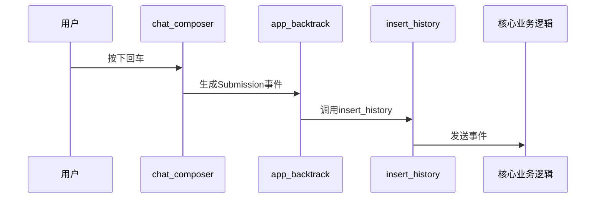
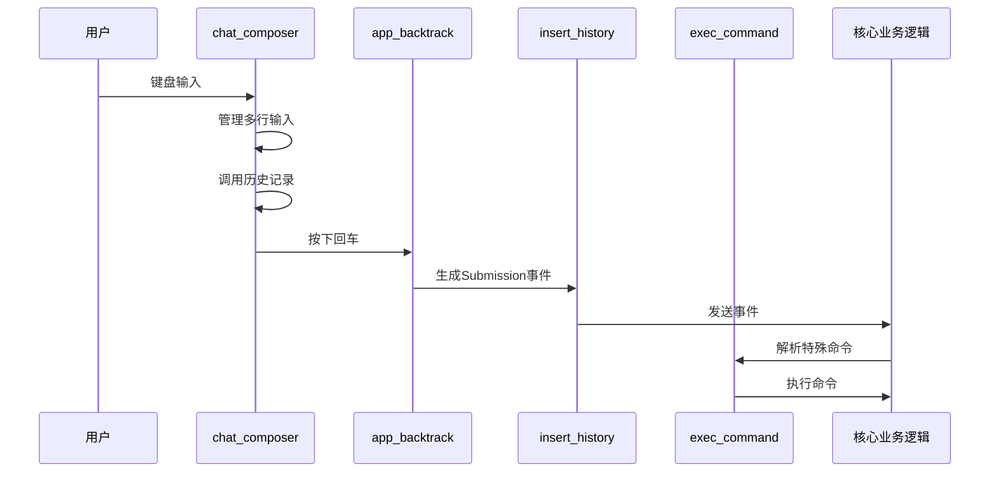

# 命令与输入处理

<cite>
**本文档引用的文件**   
- [chat_composer.rs](file://codex-rs\tui\src\bottom_pane\chat_composer.rs)
- [chat_composer_history.rs](file://codex-rs\tui\src\bottom_pane\chat_composer_history.rs)
- [app_backtrack.rs](file://codex-rs\tui\src\app_backtrack.rs)
- [insert_history.rs](file://codex-rs\tui\src\insert_history.rs)
- [exec_command.rs](file://codex-rs\tui\src\exec_command.rs)
</cite>

## 目录
1. [简介](#简介)
2. [用户输入管理](#用户输入管理)
3. [命令与历史记录处理](#命令与历史记录处理)
4. [特殊命令执行](#特殊命令执行)
5. [数据流序列图](#数据流序列图)
6. [结论](#结论)

## 简介
本文档详细阐述了Codex TUI中`chat_composer`组件如何处理用户的文本输入，包括多行输入、自动补全和历史记录调用。文档解释了用户按下回车后，输入内容如何被`app_backtrack`和`insert_history`模块处理，生成一个`Submission`事件并发送到核心业务逻辑。此外，文档还描述了`exec_command`模块如何解析和执行以`/`开头的特殊命令，并通过一个序列图展示从键盘输入到事件提交的完整数据流。

**Section sources**
- [chat_composer.rs](file://codex-rs\tui\src\bottom_pane\chat_composer.rs#L1-L800)

## 用户输入管理
`chat_composer`组件负责管理用户的文本输入。它支持多行输入，并通过`chat_composer_history`模块管理历史记录。当用户输入文本时，`chat_composer`会根据输入内容动态更新UI，并在用户按下回车时处理输入内容。

**Section sources**
- [chat_composer.rs](file://codex-rs\tui\src\bottom_pane\chat_composer.rs#L800-L1599)
- [chat_composer_history.rs](file://codex-rs\tui\src\bottom_pane\chat_composer_history.rs#L33-L77)

## 命令与历史记录处理
当用户按下回车时，`chat_composer`会生成一个`Submission`事件，并通过`app_event_tx`发送到核心业务逻辑。`app_backtrack`模块负责处理回车事件，并调用`insert_history`模块将输入内容插入到历史记录中。

**Diagram sources**
- [chat_composer.rs](file://codex-rs\tui\src\bottom_pane\chat_composer.rs#L1600-L2399)
- [app_backtrack.rs](file://codex-rs\tui\src\app_backtrack.rs#L1-L518)
- [insert_history.rs](file://codex-rs\tui\src\insert_history.rs#L1-L531)

## 特殊命令执行
`exec_command`模块负责解析和执行以`/`开头的特殊命令。当用户输入以`/`开头的命令时，`exec_command`会解析命令并执行相应的操作。

**Section sources**
- [exec_command.rs](file://codex-rs\tui\src\exec_command.rs#L1-L71)

## 数据流序列图
以下序列图展示了从键盘输入到事件提交的完整数据流。

**Diagram sources**
- [chat_composer.rs](file://codex-rs\tui\src\bottom_pane\chat_composer.rs#L2400-L3199)
- [app_backtrack.rs](file://codex-rs\tui\src\app_backtrack.rs#L1-L518)
- [insert_history.rs](file://codex-rs\tui\src\insert_history.rs#L1-L531)
- [exec_command.rs](file://codex-rs\tui\src\exec_command.rs#L1-L71)

## 结论
本文档详细介绍了Codex TUI中命令与用户输入处理流程，包括`chat_composer`组件如何管理用户的文本输入，`app_backtrack`和`insert_history`模块如何处理回车事件，以及`exec_command`模块如何解析和执行特殊命令。通过序列图展示了从键盘输入到事件提交的完整数据流，帮助开发者理解其内部机制。

**Section sources**
- [chat_composer.rs](file://codex-rs\tui\src\bottom_pane\chat_composer.rs#L3200-L3999)
- [app_backtrack.rs](file://codex-rs\tui\src\app_backtrack.rs#L1-L518)
- [insert_history.rs](file://codex-rs\tui\src\insert_history.rs#L1-L531)
- [exec_command.rs](file://codex-rs\tui\src\exec_command.rs#L1-L71)