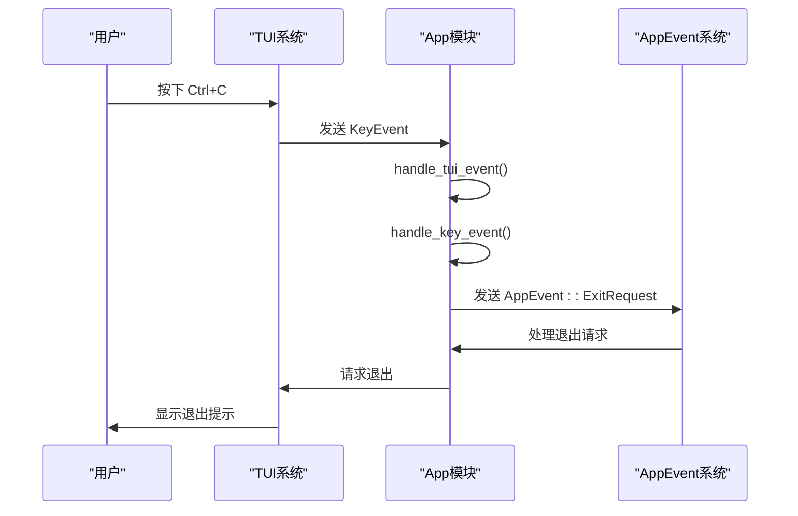
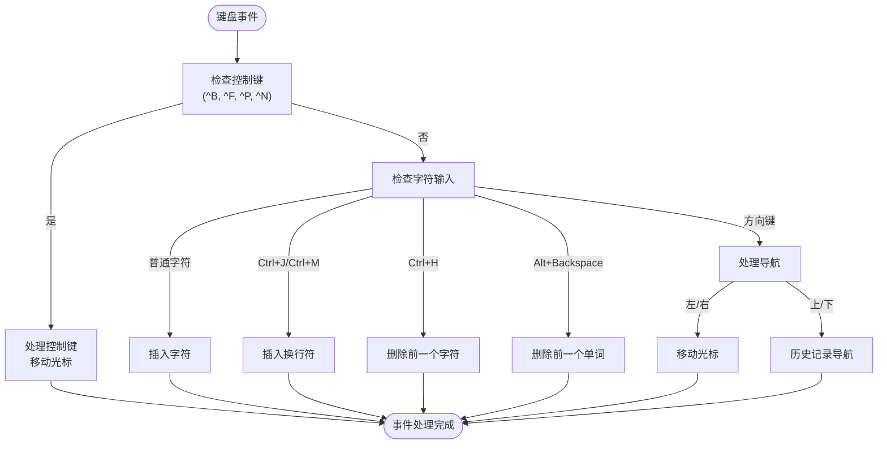
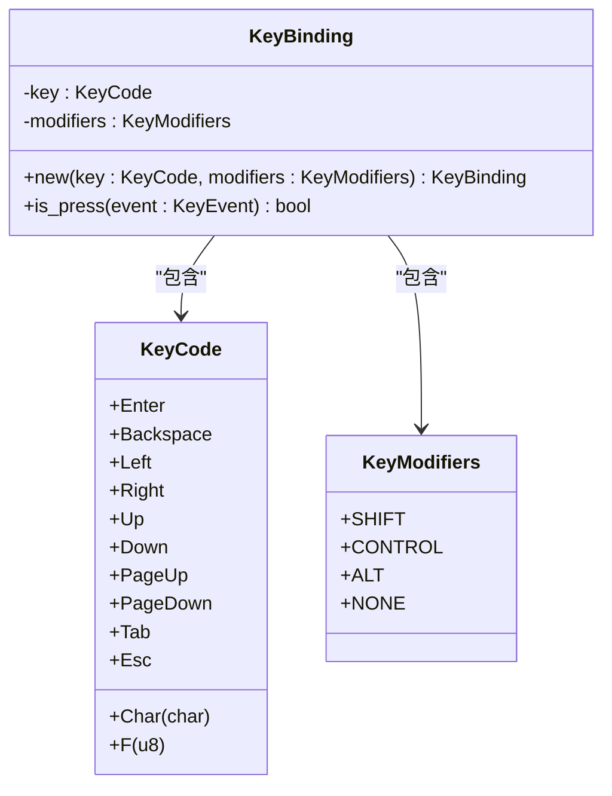
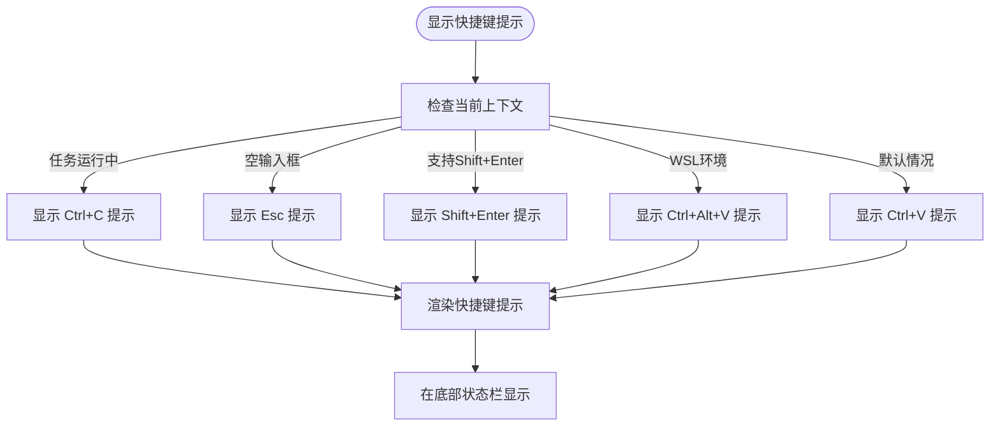
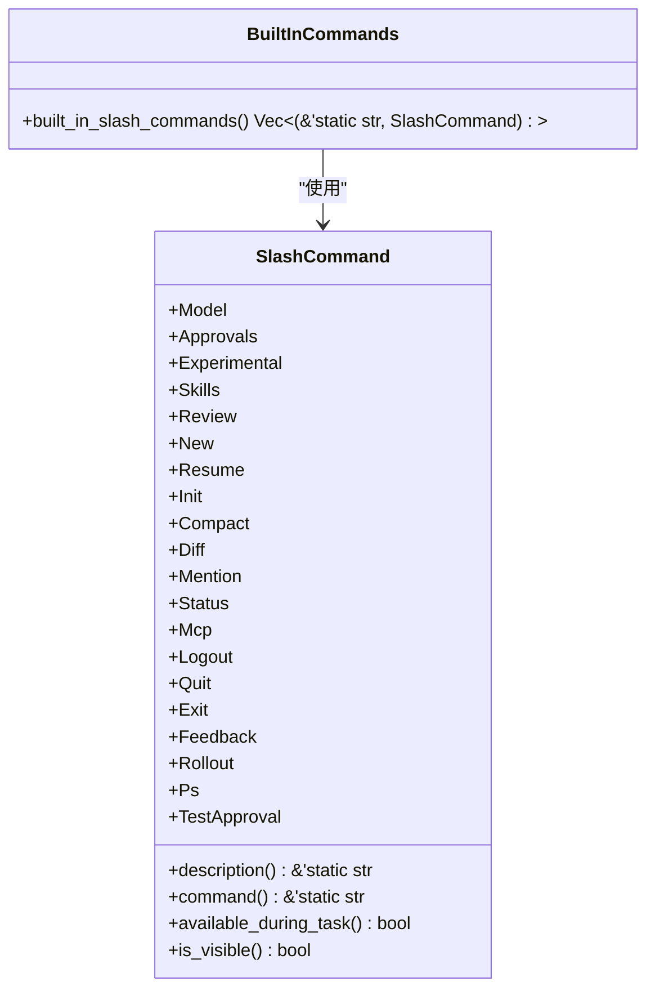
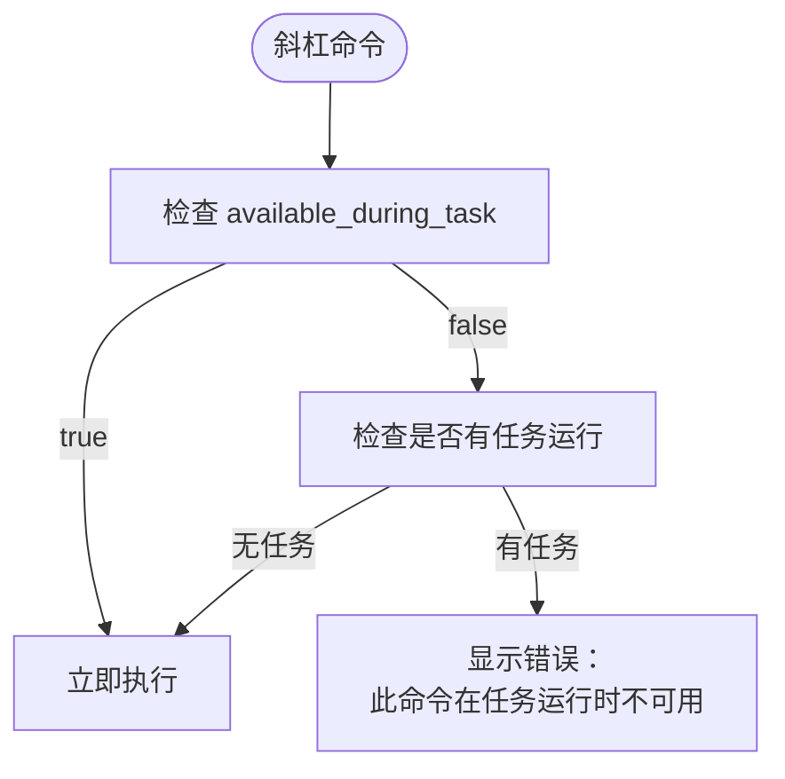

# 导航与快捷键

<cite>
**本文档引用的文件**   
- [app_event.rs](file://codex-rs\tui\src\app_event.rs)
- [app.rs](file://codex-rs\tui\src\app.rs)
- [key_hint.rs](file://codex-rs\tui\src\key_hint.rs)
- [slash_command.rs](file://codex-rs\tui\src\slash_command.rs)
- [chat_composer.rs](file://codex-rs\tui\src\bottom_pane\chat_composer.rs)
- [footer.rs](file://codex-rs\tui\src\bottom_pane\footer.rs)
- [textarea.rs](file://codex-rs\tui\src\bottom_pane\textarea.rs)
- [tui.rs](file://codex-rs\tui\src\tui.rs)
</cite>

## 目录
1. [简介](#简介)
2. [键盘快捷键概览](#键盘快捷键概览)
3. [键盘事件处理机制](#键盘事件处理机制)
4. [快捷键提示系统](#快捷键提示系统)
5. [斜杠命令详解](#斜杠命令详解)
6. [快捷键速查表](#快捷键速查表)

## 简介
Codex TUI（文本用户界面）提供了一套完整的键盘导航和快捷键系统，旨在提升用户与AI助手的交互效率。本指南详细介绍了所有可用的导航功能、键盘快捷键、事件处理机制以及特殊命令的使用方法。系统通过`app_event`和`app`模块处理键盘输入，利用`key_hint`模块在界面上动态显示可用的快捷键提示，并支持通过斜杠命令（`/command`）触发各种功能。

**Section sources**
- [app.rs](file://codex-rs\tui\src\app.rs#L1-L100)
- [app_event.rs](file://codex-rs\tui\src\app_event.rs#L1-L50)

## 键盘快捷键概览
Codex TUI支持多种键盘快捷键，用于控制应用行为、导航界面和执行特定操作。主要快捷键包括：

- **Ctrl+C**: 用于中断当前任务或退出应用。当任务正在运行时，此快捷键会中断任务；当没有任务运行时，会提示退出应用。
- **Ctrl+L**: 清屏操作，清除当前会话的显示内容。
- **Tab**: 在输入框和会话历史之间切换焦点。
- **Esc**: 用于编辑上一条消息或取消当前操作。连续按两次Esc可以编辑上一条用户消息。
- **?**: 显示所有可用的快捷键提示。
- **Ctrl+T**: 查看完整的会话记录（transcript）。
- **Shift+Enter** 或 **Ctrl+J**: 在输入框中插入新行，而不提交消息。

这些快捷键的设计遵循了常见的终端应用惯例，使用户能够快速上手。

**Section sources**
- [footer.rs](file://codex-rs\tui\src\bottom_pane\footer.rs#L337-L424)
- [app.rs](file://codex-rs\tui\src\app.rs#L522-L523)

## 键盘事件处理机制
Codex TUI的键盘事件处理系统由多个模块协同工作，核心组件包括`app_event`、`app`和`chat_composer`模块。

### AppEvent 枚举
`app_event.rs`文件定义了`AppEvent`枚举，这是整个应用的事件系统核心。所有键盘快捷键的最终目的都是生成特定的`AppEvent`，然后由应用主循环处理。例如：
- `Ctrl+C`会生成`ExitRequest`事件
- `/search`命令会触发`StartFileSearch`事件
- `Ctrl+L`会生成相应的清屏事件

```mermaid
classDiagram
class AppEvent {
+CodexEvent(Event)
+NewSession
+OpenResumePicker
+ExitRequest
+CodexOp(Op)
+StartFileSearch(String)
+FileSearchResult{query : String, matches : Vec<FileMatch>}
+RateLimitSnapshotFetched(RateLimitSnapshot)
+DiffResult(String)
+InsertHistoryCell(Box<dyn HistoryCell>)
+StartCommitAnimation
+StopCommitAnimation
+CommitTick
+UpdateReasoningEffort(Option<ReasoningEffort>)
+UpdateModel(String)
+PersistModelSelection{model : String, effort : Option<ReasoningEffort>}
+OpenReasoningPopup{model : ModelPreset}
+OpenAllModelsPopup{models : Vec<ModelPreset>}
+OpenFullAccessConfirmation{preset : ApprovalPreset}
+OpenWorldWritableWarningConfirmation{preset : Option<ApprovalPreset>, sample_paths : Vec<String>, extra_count : usize, failed_scan : bool}
+OpenWindowsSandboxEnablePrompt{preset : ApprovalPreset}
+EnableWindowsSandboxForAgentMode{preset : ApprovalPreset}
+UpdateAskForApprovalPolicy(AskForApproval)
+UpdateSandboxPolicy(SandboxPolicy)
+UpdateFeatureFlags{updates : Vec<(Feature, bool)>}
+UpdateFullAccessWarningAcknowledged(bool)
+UpdateWorldWritableWarningAcknowledged(bool)
+UpdateRateLimitSwitchPromptHidden(bool)
+PersistFullAccessWarningAcknowledged
+PersistWorldWritableWarningAcknowledged
+PersistRateLimitSwitchPromptHidden
+PersistModelMigrationPromptAcknowledged{from_model : String, to_model : String}
+SkipNextWorldWritableScan
+OpenApprovalsPopup
+ConversationHistory(ConversationPathResponseEvent)
+OpenReviewBranchPicker(PathBuf)
+OpenReviewCommitPicker(PathBuf)
+OpenReviewCustomPrompt
+FullScreenApprovalRequest(ApprovalRequest)
+OpenFeedbackNote{category : FeedbackCategory, include_logs : bool}
+OpenFeedbackConsent{category : FeedbackCategory}
+LaunchExternalEditor
}
class FeedbackCategory {
+BadResult
+GoodResult
+Bug
+Other
}
AppEvent --> FeedbackCategory : "包含"
```

**Diagram sources **
- [app_event.rs](file://codex-rs\tui\src\app_event.rs#L19-L187)

### 主应用事件循环
`app.rs`文件中的`handle_tui_event`方法是键盘事件处理的主要入口点。它接收来自TUI系统的键盘事件，并根据当前应用状态进行分发处理。



**Diagram sources **
- [app.rs](file://codex-rs\tui\src\app.rs#L513-L559)

### 输入框事件处理
`chat_composer.rs`和`textarea.rs`模块负责处理输入框的键盘事件。`textarea.rs`实现了基本的文本编辑功能，包括光标移动、文本插入和删除等。



**Diagram sources **
- [textarea.rs](file://codex-rs\tui\src\bottom_pane\textarea.rs#L215-L432)

## 快捷键提示系统
`key_hint`模块负责在界面上动态显示可用的快捷键提示，帮助用户发现和学习各种快捷键。

### KeyBinding 结构
`key_hint.rs`文件定义了`KeyBinding`结构，用于表示一个键盘快捷键组合。



**Diagram sources **
- [key_hint.rs](file://codex-rs\tui\src\key_hint.rs#L18-L34)

### 快捷键显示逻辑
`footer.rs`文件中的`SHORTCUTS`常量定义了所有在底部状态栏显示的快捷键提示。系统会根据当前上下文动态显示最相关的快捷键。



**Diagram sources **
- [footer.rs](file://codex-rs\tui\src\bottom_pane\footer.rs#L337-L424)

## 斜杠命令详解
斜杠命令是通过在消息开头输入`/`后跟命令名称来触发的特殊功能。这些命令由`slash_command.rs`模块定义和管理。

### SlashCommand 枚举
`slash_command.rs`文件定义了`SlashCommand`枚举，包含了所有可用的斜杠命令。



**Diagram sources **
- [slash_command.rs](file://codex-rs\tui\src\slash_command.rs#L7-L113)

### 常用斜杠命令
以下是常用的斜杠命令及其功能：

- **/search**: 触发文件搜索弹窗（`file_search_popup`），允许用户搜索项目中的文件。
- **/help**: 显示帮助信息，列出所有可用的命令和快捷键。
- **/model**: 选择要使用的模型和推理努力程度。
- **/approvals**: 配置AI在无需批准的情况下可以执行的操作。
- **/diff**: 显示git差异（包括未跟踪的文件）。
- **/status**: 显示当前会话配置和令牌使用情况。
- **/new**: 在对话期间开始新的聊天。
- **/resume**: 恢复保存的聊天会话。
- **/compact**: 总结对话以防止达到上下文限制。
- **/review**: 审查当前更改并发现问题。
- **/skills**: 使用技能来改进AI执行特定任务的方式。
- **/ps**: 列出后台终端。
- **/mcp**: 列出配置的MCP工具。
- **/feedback**: 发送日志给维护者。
- **/quit** 或 **/exit**: 退出Codex。

### 命令可用性
某些命令在任务运行期间不可用，以防止冲突。`available_during_task`方法决定了命令的可用性：



**Diagram sources **
- [slash_command.rs](file://codex-rs\tui\src\slash_command.rs#L71-L96)

## 快捷键速查表
以下是Codex TUI的完整快捷键速查表，方便用户快速参考。

### 基本导航
| 快捷键 | 功能 |
|--------|------|
| `Ctrl+C` | 中断当前任务或退出应用 |
| `Ctrl+L` | 清屏 |
| `Tab` | 在输入框和会话历史之间切换 |
| `Esc` | 编辑上一条消息或取消操作 |
| `?` | 显示所有快捷键提示 |
| `Ctrl+T` | 查看会话记录 |

### 文本编辑
| 快捷键 | 功能 |
|--------|------|
| `Shift+Enter` | 插入新行（推荐） |
| `Ctrl+J` 或 `Ctrl+M` | 插入新行（备用） |
| `Ctrl+A` | 移动光标到行首 |
| `Ctrl+E` | 移动光标到行尾 |
| `Ctrl+B` 或 `←` | 光标向左移动 |
| `Ctrl+F` 或 `→` | 光标向右移动 |
| `Ctrl+P` 或 `↑` | 光标向上移动/浏览历史 |
| `Ctrl+N` 或 `↓` | 光标向下移动/浏览历史 |
| `Ctrl+H` 或 `Backspace` | 删除前一个字符 |
| `Ctrl+W` | 删除前一个单词 |
| `Ctrl+U` | 删除到行首 |
| `Ctrl+K` | 删除到行尾 |

### 文件与图像
| 快捷键 | 功能 |
|--------|------|
| `@` | 开始文件路径搜索 |
| `Ctrl+V` | 粘贴文本（常规环境） |
| `Ctrl+Alt+V` | 粘贴文本（WSL环境） |
| `Ctrl+G` | 在外部编辑器中编辑 |

### 斜杠命令
| 命令 | 功能 |
|------|------|
| `/search` | 搜索文件 |
| `/help` | 显示帮助 |
| `/model` | 选择模型 |
| `/approvals` | 配置批准设置 |
| `/diff` | 显示git差异 |
| `/status` | 显示状态信息 |
| `/new` | 新建会话 |
| `/resume` | 恢复会话 |
| `/compact` | 压缩对话 |
| `/review` | 审查更改 |
| `/skills` | 管理技能 |
| `/ps` | 列出后台终端 |
| `/mcp` | 列出MCP工具 |
| `/feedback` | 发送反馈 |
| `/quit` 或 `/exit` | 退出应用 |

**Section sources**
- [footer.rs](file://codex-rs\tui\src\bottom_pane\footer.rs#L337-L424)
- [slash_command.rs](file://codex-rs\tui\src\slash_command.rs#L7-L113)
- [textarea.rs](file://codex-rs\tui\src\bottom_pane\textarea.rs#L215-L432)