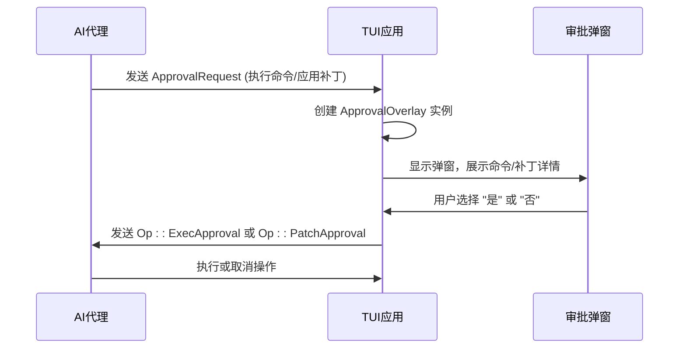
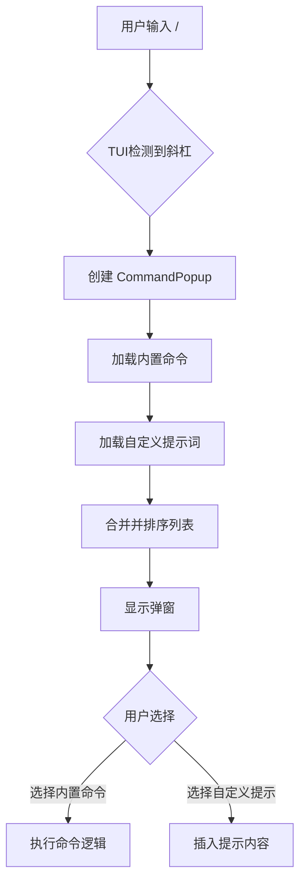
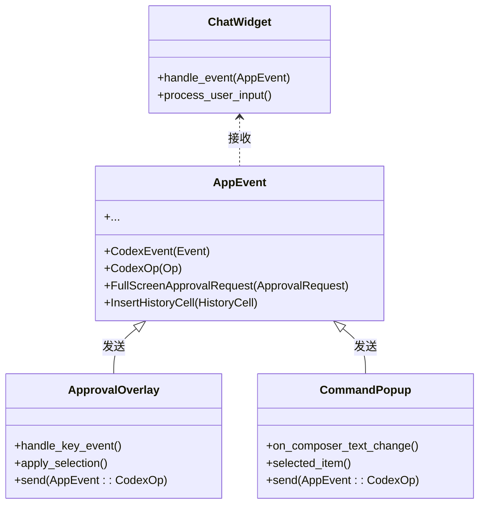

# 高级功能集成

<cite>
**本文档中引用的文件**   
- [approval_overlay.rs](file://codex-rs\tui\src\bottom_pane\approval_overlay.rs)
- [command_popup.rs](file://codex-rs\tui\src\bottom_pane\command_popup.rs)
- [custom_prompt_view.rs](file://codex-rs\tui\src\bottom_pane\custom_prompt_view.rs)
- [custom_prompts.rs](file://codex-rs\core\src\custom_prompts.rs)
- [skills\injection.rs](file://codex-rs\core\src\skills\injection.rs)
- [skills\loader.rs](file://codex-rs\core\src\skills\loader.rs)
- [skills\manager.rs](file://codex-rs\core\src\skills\manager.rs)
- [skills\model.rs](file://codex-rs\core\src\skills\model.rs)
- [slash_command.rs](file://codex-rs\tui\src\slash_command.rs)
- [app_event.rs](file://codex-rs\tui\src\app_event.rs)
- [chatwidget.rs](file://codex-rs\tui\src\chatwidget.rs)
</cite>

## 目录
1. [引言](#引言)
2. [审批弹窗 (approval_overlay)](#审批弹窗-approval_overlay)
3. [技能与自定义提示弹窗 (skill_popup & custom_prompt_view)](#技能与自定义提示弹窗-skill_popup--custom_prompt_view)
4. [功能集成与上下文变更](#功能集成与上下文变更)
5. [使用场景示例](#使用场景示例)
6. [结论](#结论)

## 引言
Codex TUI 提供了一系列高级功能，旨在增强用户与AI代理的交互体验。这些功能通过直观的弹窗界面，让用户在关键操作上拥有最终的控制权，并能灵活地扩展AI的能力。本文档将详细阐述 `approval_overlay`、`skill_popup` 和 `custom_prompt_view` 三大核心功能的实现机制、工作流程及其与TUI事件系统的集成方式。

## 审批弹窗 (approval_overlay)

`approval_overlay` 是一个关键的安全机制，它在AI代理执行高风险命令（如运行shell命令或应用代码补丁）之前，强制弹出一个审批窗口，要求用户进行确认。该功能确保了用户对代理行为的完全掌控。

### 工作原理
当AI代理需要执行一个敏感操作时，它会向TUI发送一个 `ApprovalRequest` 事件。TUI的主应用组件接收到此事件后，会创建一个 `ApprovalOverlay` 实例，并将其作为当前的底部面板（BottomPane）进行渲染。

**Diagram sources**
- [approval_overlay.rs](file://codex-rs\tui\src\bottom_pane\approval_overlay.rs#L39-L718)
- [app_event.rs](file://codex-rs\tui\src\app_event.rs#L172)

### 功能特点
*   **多类型请求支持**：`ApprovalRequest` 枚举支持多种请求类型，包括 `Exec`（执行命令）、`ApplyPatch`（应用补丁）和 `McpElicitation`（MCP工具调用请求）。
*   **动态选项生成**：弹窗会根据请求类型动态生成确认选项。例如，对于执行命令，选项可能包括“是，继续”、“是，但不再询问此类命令”和“否”。
*   **键盘快捷键**：用户可以通过键盘快捷键（如 `y` 确认，`n` 拒绝，`Ctrl+a` 全屏查看）快速响应，提升操作效率。
*   **队列处理**：如果同时有多个审批请求，它们会被放入队列中，按顺序逐一处理。

**Section sources**
- [approval_overlay.rs](file://codex-rs\tui\src\bottom_pane\approval_overlay.rs#L74-L718)

## 技能与自定义提示弹窗 (skill_popup & custom_prompt_view)

`skill_popup` 和 `custom_prompt_view` 是两个功能相似的弹窗，它们允许用户通过预设的“技能”（skills）或“自定义提示词”（custom_prompts）来增强AI的响应能力，从而更精确地指导AI完成特定任务。

### 技能系统 (skills)
“技能”是一组预定义的、针对特定任务的高级指令模板，通常以Markdown文件（`SKILL.md`）的形式存储在特定目录中。它们可以被看作是AI的“专家模式”。

*   **加载与发现**：`SkillsManager` 负责在启动时从多个路径（用户目录、系统目录、项目仓库目录）加载技能。它会遍历这些目录，查找名为 `SKILL.md` 的文件，并解析其YAML格式的元数据（如名称、描述）。
*   **作用域与优先级**：技能具有作用域（`SkillScope`），包括用户级、系统级和仓库级。当存在同名技能时，优先级为：仓库级 > 用户级 > 系统级。
*   **注入与执行**：当用户在输入中使用 `$技能名` 的语法时，`build_skill_injections` 函数会将对应的技能内容作为 `ResponseItem` 注入到当前会话的上下文中，从而影响AI的响应。

### 自定义提示词 (custom_prompts)
“自定义提示词”允许用户创建自己的、可重复使用的提示模板，通常以 `.md` 文件的形式存储在 `$CODEX_HOME/prompts` 目录下。

*   **发现与加载**：`discover_prompts_in` 函数会扫描指定目录，发现所有 `.md` 文件，并读取其内容。文件的 `frontmatter`（位于 `---` 分隔符之间的YAML块）可以包含 `description` 和 `argument-hint` 字段，用于在弹窗中显示描述信息。
*   **弹窗展示**：`CommandPopup` 组件负责渲染弹窗。它会将内置的斜杠命令（如 `/model`, `/diff`）和用户自定义的提示词混合在一起，并根据用户在输入框中的输入进行模糊搜索和排序。

**Diagram sources**
- [command_popup.rs](file://codex-rs\tui\src\bottom_pane\command_popup.rs#L26-L397)
- [custom_prompts.rs](file://codex-rs\core\src\custom_prompts.rs#L1-L245)
- [skills\loader.rs](file://codex-rs\core\src\skills\loader.rs#L68-L886)
- [skills\injection.rs](file://codex-rs\core\src\skills\injection.rs#L16-L79)

**Section sources**
- [command_popup.rs](file://codex-rs\tui\src\bottom_pane\command_popup.rs#L26-L397)
- [custom_prompts.rs](file://codex-rs\core\src\custom_prompts.rs#L1-L245)
- [skills\injection.rs](file://codex-rs\core\src\skills\injection.rs#L16-L79)
- [skills\loader.rs](file://codex-rs\core\src\skills\loader.rs#L68-L886)
- [skills\manager.rs](file://codex-rs\core\src\skills\manager.rs#L10-L53)
- [skills\model.rs](file://codex-rs\core\src\skills\model.rs#L1-L25)

## 功能集成与上下文变更

这些高级功能通过TUI的事件系统紧密集成，每一次用户交互都会触发一系列事件，从而改变会话的上下文。

### 事件系统集成
TUI的核心是 `AppEvent` 枚举，它定义了所有可能在应用内部传递的事件。`approval_overlay`、`skill_popup` 和 `custom_prompt_view` 都是通过监听和发送这些事件来工作的。

*   **事件发送**：当用户在 `CommandPopup` 中选择一个技能或自定义提示时，`chatwidget` 会接收到一个 `InputResult::Command` 事件。同样，当用户在 `ApprovalOverlay` 中做出选择时，会发送 `AppEvent::CodexOp` 事件。
*   **上下文变更**：这些事件最终会改变会话的上下文。例如，选择 `/skill web_search` 会向AI发送一个 `UserInput::Skill` 事件，这会触发 `build_skill_injections` 函数，将“网络搜索”技能的完整指令注入到当前对话的上下文中。这相当于在用户的问题前加上了一段详细的“系统提示”，从而改变了AI的思考和行为模式。

**Diagram sources**
- [app_event.rs](file://codex-rs\tui\src\app_event.rs#L20-L196)
- [chatwidget.rs](file://codex-rs\tui\src\chatwidget.rs#L88-L125)
- [approval_overlay.rs](file://codex-rs\tui\src\bottom_pane\approval_overlay.rs#L264-L317)
- [command_popup.rs](file://codex-rs\tui\src\bottom_pane\command_popup.rs#L218-L229)

**Section sources**
- [app_event.rs](file://codex-rs\tui\src\app_event.rs#L20-L196)
- [chatwidget.rs](file://codex-rs\tui\src\chatwidget.rs#L88-L125)

## 使用场景示例

### 示例1：使用 `/skill web_search` 激活网络搜索
1.  **用户输入**：用户在输入框中键入 `/skill web_search`。
2.  **弹窗激活**：TUI检测到斜杠命令，`CommandPopup` 被激活并显示所有可用的技能和命令。
3.  **用户选择**：用户从列表中选择 `web_search` 技能。
4.  **上下文注入**：TUI向核心逻辑发送一个 `UserInput::Skill` 事件。`build_skill_injections` 函数被调用，读取 `web_search` 技能文件的内容，并将其作为系统指令注入到当前会话的上下文中。
5.  **AI响应**：AI现在处于“网络搜索”模式，它会利用其工具调用能力来执行网络搜索，并将结果整合到回复中。

### 示例2：通过弹窗选择代码审查模板
1.  **用户输入**：用户键入 `/prompts` 或 `/prompts:`。
2.  **弹窗激活**：`CommandPopup` 被激活，但此时会优先显示所有自定义提示词。
3.  **用户选择**：用户从列表中选择一个名为 `code_review_security` 的自定义提示词。
4.  **内容插入**：该提示词的完整内容（例如，“请从安全角度审查以下代码，重点关注SQL注入、XSS和权限问题...”）被插入到用户的输入框中。
5.  **提交请求**：用户可以在此基础上添加具体的代码或文件，然后提交。AI会根据这个详细的提示词进行代码审查。

## 结论
Codex TUI的高级功能集成通过 `approval_overlay`、`skill_popup` 和 `custom_prompt_view` 三个核心组件，构建了一个强大且安全的交互框架。审批弹窗确保了用户对高风险操作的绝对控制，而技能和自定义提示弹窗则极大地扩展了AI的能力边界。这些功能通过统一的事件系统（`AppEvent`）与TUI的主应用逻辑无缝集成，使得每一次用户操作都能精确地改变会话的上下文，从而引导AI完成复杂、多样化的任务。这种设计模式不仅提升了用户体验，也体现了Codex在人机协作方面的先进理念。