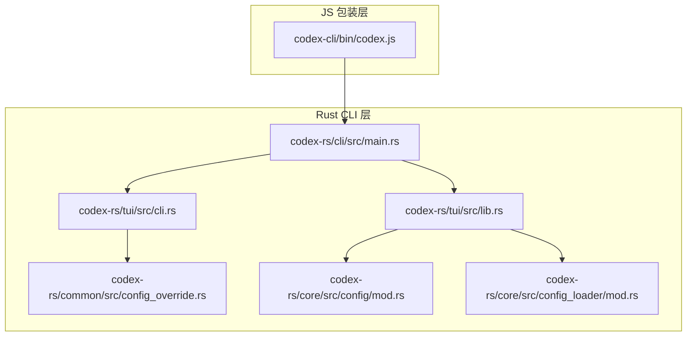
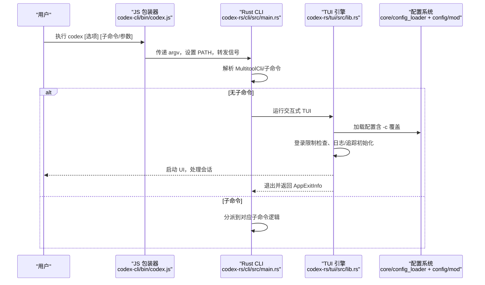
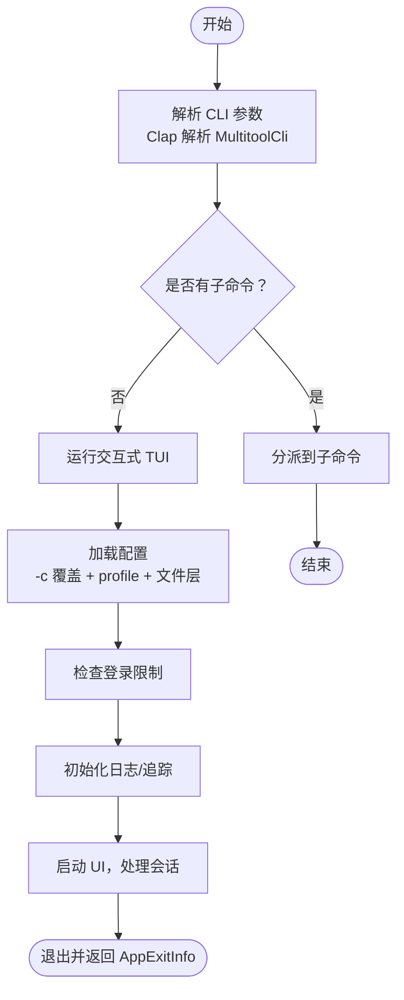
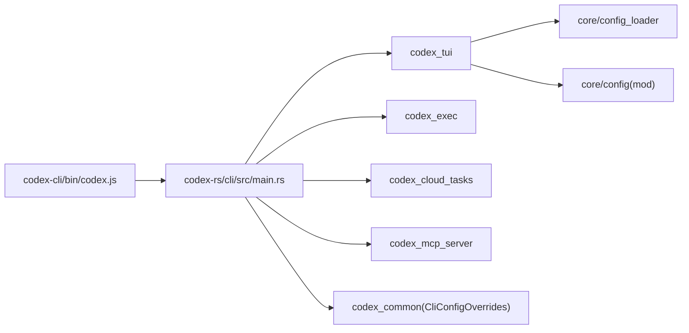

# 主命令

<cite>
**本文引用的文件**
- [codex-cli/bin/codex.js](file://codex-cli/bin/codex.js)
- [codex-rs/cli/src/main.rs](file://codex-rs/cli/src/main.rs)
- [codex-rs/common/src/config_override.rs](file://codex-rs/common/src/config_override.rs)
- [codex-rs/tui/src/cli.rs](file://codex-rs/tui/src/cli.rs)
- [codex-rs/tui/src/lib.rs](file://codex-rs/tui/src/lib.rs)
- [codex-rs/core/src/config/mod.rs](file://codex-rs/core/src/config/mod.rs)
- [codex-rs/core/src/config_loader/mod.rs](file://codex-rs/core/src/config_loader/mod.rs)
- [codex-rs/core/src/config/service.rs](file://codex-rs/core/src/config/service.rs)
- [codex-rs/core/src/util.rs](file://codex-rs/core/src/util.rs)
- [codex-rs/tui/src/session_log.rs](file://codex-rs/tui/src/session_log.rs)
</cite>

## 目录
1. [简介](#简介)
2. [项目结构](#项目结构)
3. [核心组件](#核心组件)
4. [架构总览](#架构总览)
5. [详细组件分析](#详细组件分析)
6. [依赖关系分析](#依赖关系分析)
7. [性能考量](#性能考量)
8. [故障排查指南](#故障排查指南)
9. [结论](#结论)
10. [附录](#附录)

## 简介
本文件面向 Codex 主命令“codex”，系统性阐述其作为交互式 AI 编程代理的职责与行为，覆盖以下主题：
- 全局选项与子命令：如 --model、--config/-c、--profile/-p、--sandbox/-s、--ask-for-approval/-a、--full-auto、--dangerously-bypass-approvals-and-sandbox、--cd/-C、--search、--add-dir、--oss、--local-provider 等。
- 命令行参数解析流程与优先级：CLI 参数、配置文件、环境变量、默认值之间的合并与覆盖顺序。
- 生命周期：从参数解析到 TUI 启动、登录校验、日志与可观测性初始化、会话恢复与退出。
- 使用示例：启动会话、加载特定配置文件、指定模型、启用搜索等。
- 常见错误与解决方案：配置文件路径错误、认证失败、日志写入失败、终端不可用等。

## 项目结构
Codex 的主命令由两部分组成：
- JS 包装器：在不同平台选择对应二进制并转发信号，负责跨平台分发与进程生命周期管理。
- Rust CLI：基于 Clap 的多工具 CLI，支持交互式 TUI、非交互执行、登录、MCP、应用服务器、沙箱调试、云任务、补丁应用等子命令。

图表来源
- [codex-cli/bin/codex.js](file://codex-cli/bin/codex.js#L1-L178)
- [codex-rs/cli/src/main.rs](file://codex-rs/cli/src/main.rs#L1-L200)
- [codex-rs/tui/src/cli.rs](file://codex-rs/tui/src/cli.rs#L1-L91)
- [codex-rs/common/src/config_override.rs](file://codex-rs/common/src/config_override.rs#L1-L120)
- [codex-rs/tui/src/lib.rs](file://codex-rs/tui/src/lib.rs#L100-L200)
- [codex-rs/core/src/config/mod.rs](file://codex-rs/core/src/config/mod.rs#L3120-L3170)
- [codex-rs/core/src/config_loader/mod.rs](file://codex-rs/core/src/config_loader/mod.rs#L55-L120)

章节来源
- [codex-cli/bin/codex.js](file://codex-cli/bin/codex.js#L1-L178)
- [codex-rs/cli/src/main.rs](file://codex-rs/cli/src/main.rs#L1-L200)

## 核心组件
- JS 分发器：根据平台选择目标三元组，定位本地二进制并以异步方式启动，转发信号，确保父进程与子进程优雅退出。
- 多工具 CLI（Rust）：通过子命令组织功能；若无子命令，默认进入交互式 TUI。
- 配置覆盖系统：支持 -c/--config 键值对覆盖，解析为 TOML 并应用到配置树。
- TUI 交互：负责配置加载、登录限制检查、日志与追踪初始化、会话恢复、UI 渲染与退出清理。

章节来源
- [codex-cli/bin/codex.js](file://codex-cli/bin/codex.js#L1-L178)
- [codex-rs/cli/src/main.rs](file://codex-rs/cli/src/main.rs#L436-L651)
- [codex-rs/common/src/config_override.rs](file://codex-rs/common/src/config_override.rs#L1-L120)
- [codex-rs/tui/src/lib.rs](file://codex-rs/tui/src/lib.rs#L100-L200)

## 架构总览
主命令从 JS 包装器进入 Rust CLI，解析参数后决定执行路径：交互式 TUI 或子命令。交互式 TUI 在启动前完成配置加载、登录限制检查、日志与追踪初始化，并在退出时输出摘要与更新提示。

图表来源
- [codex-cli/bin/codex.js](file://codex-cli/bin/codex.js#L120-L178)
- [codex-rs/cli/src/main.rs](file://codex-rs/cli/src/main.rs#L436-L651)
- [codex-rs/tui/src/lib.rs](file://codex-rs/tui/src/lib.rs#L100-L200)
- [codex-rs/core/src/config_loader/mod.rs](file://codex-rs/core/src/config_loader/mod.rs#L55-L120)
- [codex-rs/core/src/config/mod.rs](file://codex-rs/core/src/config/mod.rs#L3120-L3170)

## 详细组件分析

### 全局选项与子命令
- 全局选项（交互式 TUI 表面）：
  - --model/-m：指定模型 ID。
  - --oss：便捷选择本地开源模型提供者（LM Studio/Ollama），自动校验本地服务可用性。
  - --local-provider：指定本地提供者（lmstudio/ollama）。
  - --profile/-p：选择配置文件中的 profile。
  - --sandbox/-s：设置沙箱模式（如只读、工作区写入等）。
  - --ask-for-approval/-a：设置审批策略（如从不、仅受信任、按请求等）。
  - --full-auto：低摩擦自动执行（等价于 --ask-for-approval on-request 且 --sandbox workspace-write）。
  - --dangerously-bypass-approvals-and-sandbox（别名 yolo）：跳过审批与沙箱，极其危险。
  - --cd/-C：切换工作目录。
  - --search：启用网络搜索能力（无需逐次审批）。
  - --add-dir：追加额外可写目录。
  - -c/--config：键值覆盖（支持嵌套路径，值按 TOML 解析，否则按字符串字面量）。
- 子命令：
  - exec/review：非交互执行与代码评审。
  - login/logout：登录与登出。
  - mcp/mcp-server：MCP 客户端与服务器。
  - app-server：应用服务器相关工具。
  - completion：生成 shell 补全脚本。
  - sandbox：在不同平台下运行沙箱化命令。
  - execpolicy：执行策略工具。
  - apply：应用最新 diff 到本地工作树。
  - resume：恢复上次会话。
  - cloud/cloud-tasks：浏览云端任务并应用变更。
  - responses-api-proxy/stdio-to-uds：内部工具。
  - features：查看特性开关状态。

章节来源
- [codex-rs/tui/src/cli.rs](file://codex-rs/tui/src/cli.rs#L1-L91)
- [codex-rs/cli/src/main.rs](file://codex-rs/cli/src/main.rs#L78-L160)
- [codex-rs/common/src/config_override.rs](file://codex-rs/common/src/config_override.rs#L1-L120)

### 命令行参数解析流程与优先级
- 解析阶段：
  - JS 包装器将 argv 传给 Rust CLI，Rust 使用 Clap 解析 MultitoolCli，识别子命令与全局选项。
  - 全局 -c/--config 被收集为原始字符串列表，稍后转换为键值对并应用到配置树。
- 配置加载与优先级（从高到低）：
  1) 自定义命令行参数（如 --model o3）。
  2) 通过 --profile 指定的 profile（profile 本身来自配置文件）。
  3) 配置文件（/etc/codex/config.toml、$CODEX_HOME/config.toml、当前工作目录 config.toml、项目根目录 .codex/config.toml、仓库根 .codex/config.toml）。
  4) 默认值（代码中定义的默认值）。
- 特殊说明：
  - -c/--config 支持嵌套路径（foo.bar.baz），值按 TOML 解析，失败则按字符串字面量处理。
  - 顶层 --enable/--disable 会被转换为 -c features.<name>=true/false 并注入到各子命令的配置覆盖中。
  - 交互式 TUI 在启动前会进行一次轻量配置加载，用于判定是否启用 TUI v2。

章节来源
- [codex-rs/cli/src/main.rs](file://codex-rs/cli/src/main.rs#L436-L651)
- [codex-rs/common/src/config_override.rs](file://codex-rs/common/src/config_override.rs#L1-L120)
- [codex-rs/core/src/config/mod.rs](file://codex-rs/core/src/config/mod.rs#L3120-L3170)
- [codex-rs/core/src/config_loader/mod.rs](file://codex-rs/core/src/config_loader/mod.rs#L55-L120)

### 生命周期：从参数解析到 TUI 启动
- JS 层：
  - 选择目标三元组，定位本地二进制，继承标准 IO，转发 SIGINT/SIGTERM/SIGHUP。
  - 子进程退出时镜像退出码或信号，保证 shell 语义一致。
- Rust CLI 层：
  - 解析 MultitoolCli，合并 --enable/--disable 为 -c 覆盖，按子命令分派。
  - 若无子命令，进入交互式 TUI。
- TUI 层：
  - 解析 -c 覆盖，查找 CODEX_HOME，确定 cwd，加载配置（含 -c 覆盖与 profile）。
  - 校验登录限制，初始化日志与追踪（文件与反馈通道），必要时拉起 OSS 提供者就绪。
  - 初始化 UI、会话恢复、登录引导、信任屏幕等，最终退出并输出摘要与更新提示。

图表来源
- [codex-rs/cli/src/main.rs](file://codex-rs/cli/src/main.rs#L436-L651)
- [codex-rs/tui/src/lib.rs](file://codex-rs/tui/src/lib.rs#L100-L200)
- [codex-rs/core/src/config_loader/mod.rs](file://codex-rs/core/src/config_loader/mod.rs#L55-L120)

章节来源
- [codex-cli/bin/codex.js](file://codex-cli/bin/codex.js#L120-L178)
- [codex-rs/cli/src/main.rs](file://codex-rs/cli/src/main.rs#L436-L651)
- [codex-rs/tui/src/lib.rs](file://codex-rs/tui/src/lib.rs#L100-L200)

### 使用示例
- 启动交互式会话（带初始提示与图片）：
  - codex "请帮我修复这个函数"
  - codex -i ./screenshot.png "请分析图像"
- 指定模型与配置文件：
  - codex -m o3 "你好"
  - codex --profile gpt3 "你好"
- 启用网络搜索：
  - codex --search "查询最新技术趋势"
- 指定工作目录与附加可写目录：
  - codex -C ./myproj --add-dir ./logs "执行构建"
- 使用 -c 覆盖配置：
  - codex -c model="o3" -c sandbox_permissions='["disk-full-read-access"]' "执行"
- 恢复上次会话：
  - codex resume --last
  - codex resume <会话ID>

章节来源
- [codex-rs/tui/src/cli.rs](file://codex-rs/tui/src/cli.rs#L1-L91)
- [codex-rs/cli/src/main.rs](file://codex-rs/cli/src/main.rs#L495-L511)

### 错误处理与常见问题
- 配置文件路径错误：
  - 当配置文件解析失败或缺少父目录时，会抛出错误并终止。建议检查路径是否存在、权限是否正确、内容是否为合法 TOML。
- 认证失败或未登录：
  - 对需要 OpenAI 认证的提供者，若未登录或令牌无效，会提示登录。可通过 login 子命令完成认证。
- 日志写入失败：
  - TUI 会在日志目录创建 codex-tui.log，若写入失败会打印警告。建议检查日志目录权限与磁盘空间。
- 终端不可用：
  - TUI 要求 stdin/stdout 为终端，若非终端会报错并终止。请在交互式终端中运行。
- -c 覆盖语法错误：
  - -c key=value 必须包含第一个等号，且 key 不为空；值按 TOML 解析，失败则按字符串字面量处理。语法错误会导致退出。
- 会话恢复失败：
  - 指定的会话 ID 不存在时，会提示使用 codex resume 无参选择历史会话。

章节来源
- [codex-rs/tui/src/lib.rs](file://codex-rs/tui/src/lib.rs#L140-L200)
- [codex-rs/core/src/config/service.rs](file://codex-rs/core/src/config/service.rs#L40-L99)
- [codex-rs/core/src/util.rs](file://codex-rs/core/src/util.rs#L1-L77)
- [codex-rs/tui/src/session_log.rs](file://codex-rs/tui/src/session_log.rs#L39-L78)

## 依赖关系分析
- JS 包装器依赖 Node 内建模块（child_process、fs、path、url）与平台三元组映射。
- Rust CLI 依赖：
  - codex_tui：交互式 UI。
  - codex_exec：非交互执行与评审。
  - codex_cloud_tasks：云任务。
  - codex_mcp_server：MCP 服务器。
  - codex_common：通用 CLI 配置覆盖。
  - codex_core：配置加载、特性开关、认证、协议等。
- 配置加载链路：
  - config_loader 按顺序加载系统、用户、项目、运行时覆盖等层，最终合并为有效配置。
  - config/mod 提供优先级与测试用例，明确 CLI 参数 > profile > config.toml > 默认值。

图表来源
- [codex-cli/bin/codex.js](file://codex-cli/bin/codex.js#L1-L178)
- [codex-rs/cli/src/main.rs](file://codex-rs/cli/src/main.rs#L1-L120)
- [codex-rs/core/src/config_loader/mod.rs](file://codex-rs/core/src/config_loader/mod.rs#L55-L120)
- [codex-rs/core/src/config/mod.rs](file://codex-rs/core/src/config/mod.rs#L3120-L3170)

章节来源
- [codex-rs/cli/src/main.rs](file://codex-rs/cli/src/main.rs#L1-L120)
- [codex-rs/core/src/config_loader/mod.rs](file://codex-rs/core/src/config_loader/mod.rs#L55-L120)

## 性能考量
- 启动延迟主要来源于配置加载与日志/追踪初始化。建议：
  - 合理使用 --profile 减少重复配置项。
  - 将频繁使用的 -c 覆盖放入配置文件，避免每次启动都传大量参数。
  - 在 CI 环境使用非交互执行（exec/review）替代 TUI，减少 UI 初始化开销。
- 日志与追踪：
  - TUI 默认开启文件日志与反馈通道，生产环境可通过 RUST_LOG 控制级别，避免过度输出。
- 会话恢复：
  - 使用 codex resume 可快速回到上次上下文，减少重复加载与初始化成本。

[本节为通用指导，不直接分析具体文件]

## 故障排查指南
- “找不到 codex home”或“无法加载配置”：
  - 检查 CODEX_HOME 是否正确设置，确认 $CODEX_HOME/config.toml 存在且可读。
  - 使用 -c 覆盖临时定位问题，逐步缩小范围。
- “stdin 不是终端”：
  - 在交互式终端中运行；避免将输出重定向到文件或管道。
- “日志写入失败”：
  - 检查日志目录权限与磁盘空间；确认 codex-tui.log 可写。
- “认证失败”：
  - 使用 codex login 完成登录；对于 GitHub MCP，需配置 bearer_token_env_var。
- “-c 覆盖语法错误”：
  - 确保 -c key=value 中包含首个等号且 key 非空；值按 TOML 解析，必要时用引号包裹。
- “会话恢复失败”：
  - 使用 codex resume 无参选择历史会话；或使用 --last 直接恢复最近会话。

章节来源
- [codex-rs/tui/src/lib.rs](file://codex-rs/tui/src/lib.rs#L140-L200)
- [codex-rs/core/src/config/service.rs](file://codex-rs/core/src/config/service.rs#L40-L99)
- [codex-rs/core/src/util.rs](file://codex-rs/core/src/util.rs#L1-L77)

## 结论
主命令 codex 通过 JS 包装器与 Rust CLI 协作，提供了统一的入口与强大的交互式体验。其配置系统采用分层叠加与明确优先级，结合 -c 覆盖与 profile，既满足日常使用，又便于团队与环境定制。遵循本文的参数解析与优先级规则、生命周期流程与故障排查建议，可高效地使用与维护该命令。

[本节为总结性内容，不直接分析具体文件]

## 附录
- 关键实现参考路径：
  - JS 分发器：[codex-cli/bin/codex.js](file://codex-cli/bin/codex.js#L1-L178)
  - CLI 主入口与子命令分派：[codex-rs/cli/src/main.rs](file://codex-rs/cli/src/main.rs#L436-L651)
  - 交互式 TUI CLI 参数定义：[codex-rs/tui/src/cli.rs](file://codex-rs/tui/src/cli.rs#L1-L91)
  - 配置覆盖解析与应用：[codex-rs/common/src/config_override.rs](file://codex-rs/common/src/config_override.rs#L1-L120)
  - TUI 启动与配置加载：[codex-rs/tui/src/lib.rs](file://codex-rs/tui/src/lib.rs#L100-L200)
  - 配置优先级与加载顺序：[codex-rs/core/src/config/mod.rs](file://codex-rs/core/src/config/mod.rs#L3120-L3170)、[codex-rs/core/src/config_loader/mod.rs](file://codex-rs/core/src/config_loader/mod.rs#L55-L120)