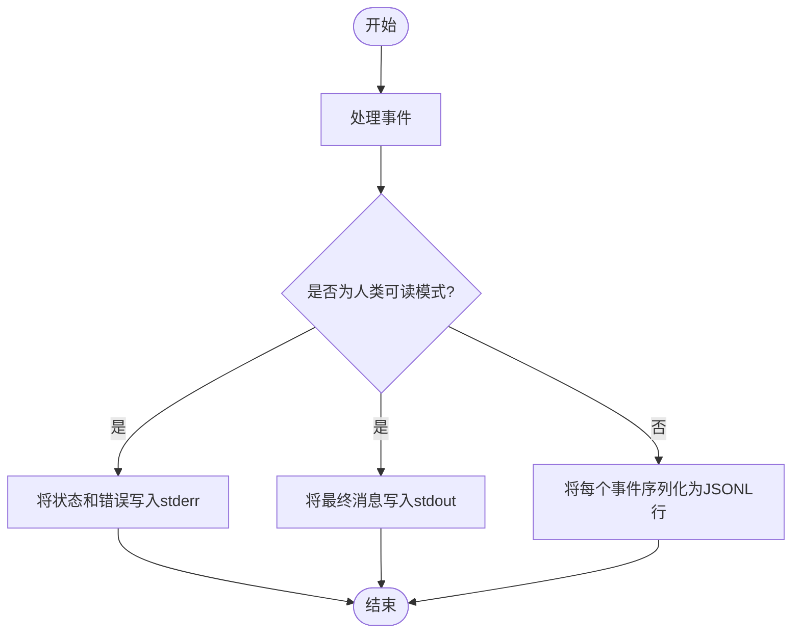
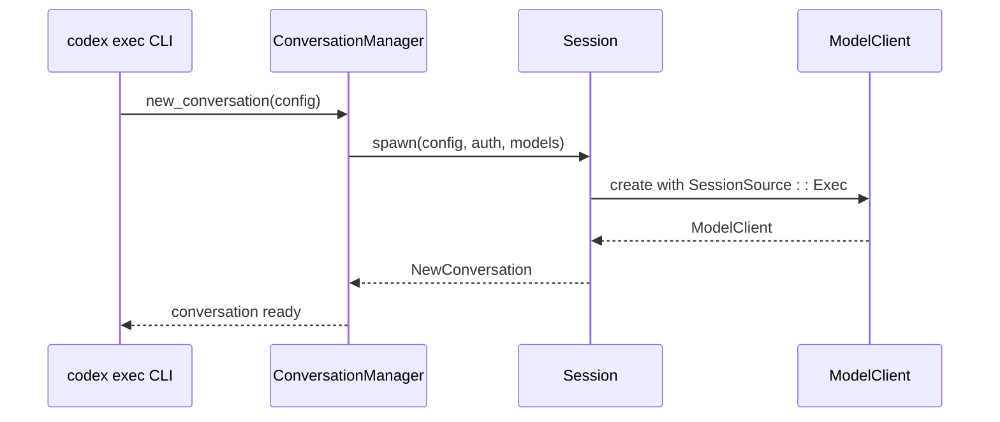

# 非交互式执行模式

<cite>
**本文档引用的文件**   
- [cli.rs](file://codex-rs\exec\src\cli.rs)
- [lib.rs](file://codex-rs\exec\src\lib.rs)
- [event_processor_with_human_output.rs](file://codex-rs\exec\src\event_processor_with_human_output.rs)
- [event_processor_with_jsonl_output.rs](file://codex-rs\exec\src\event_processor_with_jsonl_output.rs)
- [config.md](file://codex-rs\config.md)
</cite>

## 目录
1. [简介](#简介)
2. [核心组件](#核心组件)
3. [输出模式](#输出模式)
4. [命令行参数](#命令行参数)
5. [会话与事件系统](#会话与事件系统)
6. [自动化集成示例](#自动化集成示例)
7. [结论](#结论)

## 简介
`codex exec` 命令提供了一种非交互式、脚本化的执行模式，专为CI/CD流水线和自动化任务设计。该模式通过复用核心的`Session`和`Event`系统，实现了与交互式模式一致的功能，同时确保了输出的可预测性和机器可读性。本文档详细解释了其工作原理、配置选项和最佳实践。

## 核心组件

`codex exec` 的实现主要由以下几个核心组件构成：

- **CLI解析器**：定义了所有可用的命令行选项和子命令。
- **事件处理器**：根据不同的输出模式处理来自核心系统的事件。
- **会话管理器**：负责创建和管理非交互式会话。
- **配置系统**：加载和合并来自命令行、配置文件和环境变量的设置。

这些组件协同工作，确保`codex exec`能够在无用户干预的情况下可靠地执行任务。

**Section sources**
- [cli.rs](file://codex-rs\exec\src\cli.rs#L1-L158)
- [lib.rs](file://codex-rs\exec\src\lib.rs#L1-L663)

## 输出模式

`codex exec` 支持两种主要的输出模式，以适应不同的使用场景。

### 人类可读模式
这是默认的输出模式，旨在为人类用户提供清晰、易读的输出。所有诊断信息和进度更新都写入标准错误（stderr），而最终的代理消息则写入标准输出（stdout）。这种分离确保了在脚本中可以轻松地捕获最终结果。



**Diagram sources **
- [event_processor_with_human_output.rs](file://codex-rs\exec\src\event_processor_with_human_output.rs#L1-L661)
- [event_processor_with_jsonl_output.rs](file://codex-rs\exec\src\event_processor_with_jsonl_output.rs#L1-L549)

### JSONL模式
通过 `--json` 或 `--experimental-json` 标志启用，此模式将每个事件序列化为一行JSON（JSONL），便于机器解析。这对于集成到自动化工作流中非常有用，因为下游工具可以轻松地解析和处理结构化数据。

**Section sources**
- [event_processor_with_human_output.rs](file://codex-rs\exec\src\event_processor_with_human_output.rs#L1-L661)
- [event_processor_with_jsonl_output.rs](file://codex-rs\exec\src\event_processor_with_jsonl_output.rs#L1-L549)

## 命令行参数

`codex exec` 提供了丰富的命令行参数来控制其行为。

### 核心参数
- `--prompt`：指定发送给代理的初始指令。如果未提供，将从标准输入读取。
- `--output-schema`：指定一个JSON Schema文件，用于定义代理最终响应的期望结构。
- `--originator`：设置请求的发起者，用于跟踪和分析。

### 沙箱与安全参数
- `--sandbox`：选择执行模型生成的shell命令时使用的沙箱策略。
- `--full-auto`：启用低摩擦的自动执行模式，等同于 `-a on-request --sandbox workspace-write`。
- `--dangerously-bypass-approvals-and-sandbox`：跳过所有确认提示并以无沙箱方式执行命令。**极其危险**，仅应在外部沙箱环境中使用。

### 输出控制参数
- `--json`：启用JSONL输出模式。
- `--color`：控制输出中的颜色使用（`always`, `never`, `auto`）。
- `--output-last-message`：将代理的最后一条消息写入指定文件。

**Section sources**
- [cli.rs](file://codex-rs\exec\src\cli.rs#L1-L158)
- [lib.rs](file://codex-rs\exec\src\lib.rs#L70-L477)

## 会话与事件系统

`codex exec` 深度集成到核心的`Session`和`Event`系统中。

### 会话初始化
当 `codex exec` 启动时，它会创建一个新的 `Session`，其 `SessionSource` 被明确设置为 `Exec`。这确保了会话的行为符合非交互式预期，例如默认不请求执行批准。



**Diagram sources **
- [lib.rs](file://codex-rs\exec\src\lib.rs#L275-L477)
- [conversation_manager.rs](file://codex-rs\core\src\conversation_manager.rs#L1-L412)

### 事件流处理
`codex exec` 通过一个事件循环监听来自 `Session` 的事件。根据配置的输出模式，它使用不同的 `EventProcessor` 来处理这些事件：
- 在人类可读模式下，`EventProcessorWithHumanOutput` 将事件格式化为带颜色的文本。
- 在JSONL模式下，`EventProcessorWithJsonOutput` 将事件转换为结构化的JSON对象并逐行打印。

**Section sources**
- [lib.rs](file://codex-rs\exec\src\lib.rs#L378-L473)
- [event_processor_with_human_output.rs](file://codex-rs\exec\src\event_processor_with_human_output.rs#L1-L661)
- [event_processor_with_jsonl_output.rs](file://codex-rs\exec\src\event_processor_with_jsonl_output.rs#L1-L549)

## 自动化集成示例

以下是一些将 `codex exec` 集成到自动化工作流中的实际示例。

### CI/CD流水线中的代码审查
```bash
#!/bin/bash
# 在CI/CD流水线中运行代码审查
codex exec review --uncommitted --json --output-last-message review_results.json

# 检查审查结果
if grep -q "security vulnerability" review_results.json; then
  echo "发现安全漏洞，构建失败！"
  exit 1
fi
```

### 结构化输出的自动化任务
```bash
#!/bin/bash
# 使用结构化输出生成报告
OUTPUT_SCHEMA="schema/report_schema.json"
PROMPT="分析当前目录中的日志文件，并生成一份包含错误计数和警告摘要的报告。"

codex exec --prompt "$PROMPT" --output-schema "$OUTPUT_SCHEMA" --json | \
while IFS= read -r line; do
  # 解析JSONL输出
  echo "$line" | jq -r 'select(.type == "turn_completed") | .usage'
done
```

**Section sources**
- [lib.rs](file://codex-rs\exec\src\lib.rs#L317-L368)
- [config.md](file://codex-rs\config.md#L1-L100)

## 结论
`codex exec` 命令为自动化场景提供了一个强大而灵活的接口。通过理解其两种输出模式、丰富的参数集以及与核心会话和事件系统的深度集成，开发者可以有效地将其集成到CI/CD流水线、批处理任务和其他自动化工作流中，从而实现高效、可靠的非交互式操作。