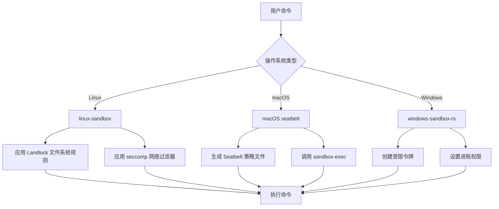
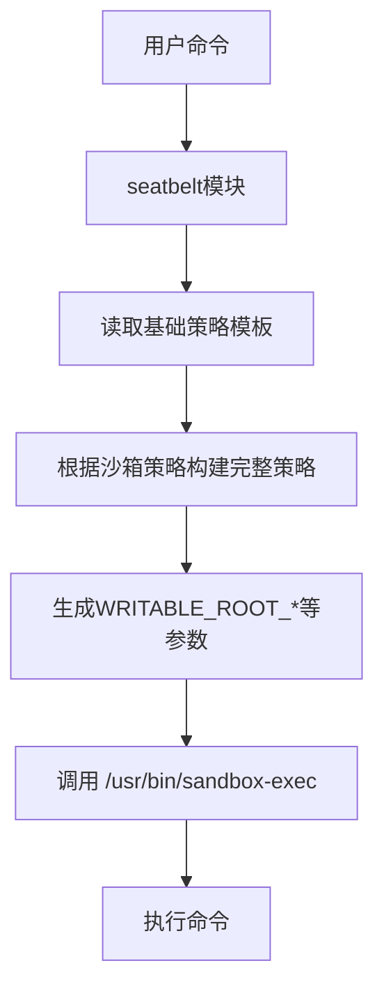
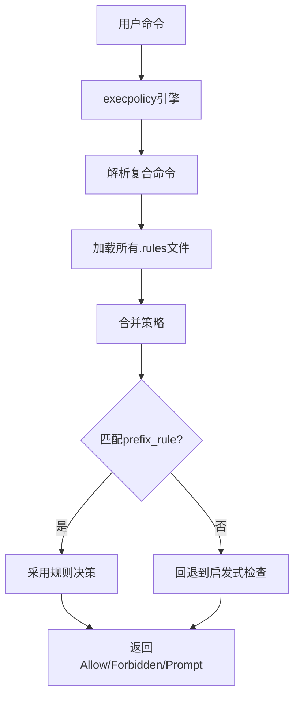
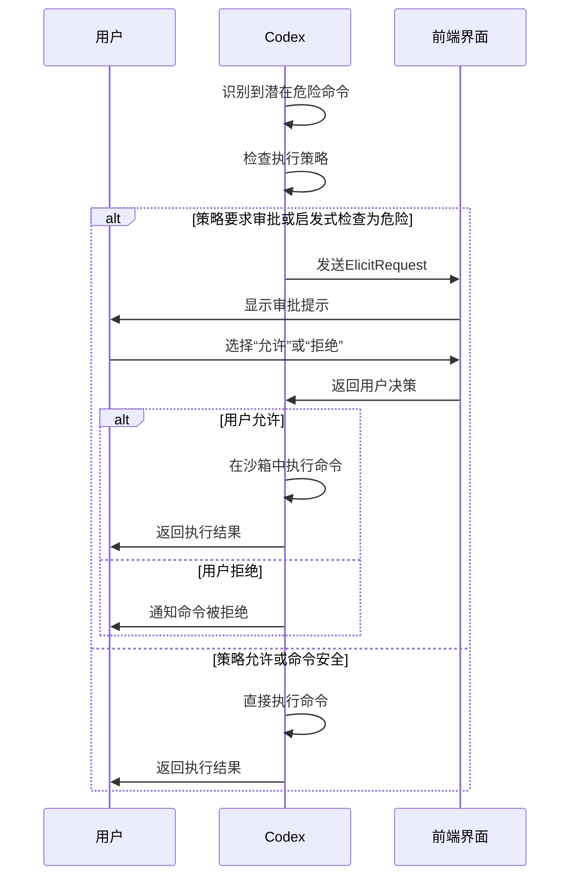

# 安全机制

<cite>
**本文档引用的文件**
- [mod.rs](file://codex-rs\core\src\sandboxing\mod.rs)
- [lib.rs](file://codex-rs\linux-sandbox\src\lib.rs)
- [lib.rs](file://codex-rs\windows-sandbox-rs\src\lib.rs)
- [seatbelt.rs](file://codex-rs\core\src\seatbelt.rs)
- [lib.rs](file://codex-rs\execpolicy\src\lib.rs)
- [main.rs](file://codex-rs\execpolicy\src\main.rs)
- [exec_approval.rs](file://codex-rs\mcp-server\src\exec_approval.rs)
- [is_dangerous_command.rs](file://codex-rs\core\src\command_safety\is_dangerous_command.rs)
- [safety.rs](file://codex-rs\core\src\safety.rs)
- [landlock.rs](file://codex-rs\linux-sandbox\src\landlock.rs)
- [exec_policy.rs](file://codex-rs\core\src\exec_policy.rs)
</cite>

## 目录
1. [引言](#引言)
2. [沙箱机制](#沙箱机制)
3. [执行策略引擎](#执行策略引擎)
4. [命令审批流程](#命令审批流程)
5. [总结](#总结)

## 引言
Codex 是一个先进的代码生成和自动化工具，其核心设计原则之一是确保用户环境的安全。为了实现这一目标，Codex 实施了一套多层安全架构，该架构由三个关键组件构成：沙箱机制、执行策略（execpolicy）引擎和命令审批流程。这些组件协同工作，以限制潜在的恶意代码执行，防止对系统造成意外或故意的损害。本文档旨在深入探讨这些安全机制，为用户提供一个权威的参考，帮助他们理解 Codex 如何保护其系统，并根据自身需求进行配置。

## 沙箱机制
Codex 的沙箱机制是其安全架构的第一道防线。它通过在操作系统层面限制 Codex 及其子进程的权限，来防止恶意代码的执行。该机制根据运行的操作系统，采用不同的技术来实现隔离和权限控制，包括 Linux 上的 `linux-sandbox`、Windows 上的 `windows-sandbox-rs` 和 macOS 上的 `macOS seatbelt`。

### Linux 沙箱 (linux-sandbox)
在 Linux 系统上，Codex 利用 `linux-sandbox` 组件来创建一个受限的执行环境。该组件的核心是 Landlock 和 seccomp 技术。
- **Landlock**: 用于实施文件系统级别的访问控制。当沙箱策略禁止完全磁盘写入访问时，`linux-sandbox` 会创建一个 Landlock 规则集。该规则集默认允许对整个文件系统进行只读访问，但会将写权限严格限制在 `/dev/null` 和用户明确指定的“可写根目录”（writable roots）内。这确保了进程无法修改项目范围外的任何文件。
- **seccomp**: 用于实施系统调用级别的过滤。当沙箱策略禁止完全网络访问时，`linux-sandbox` 会安装一个 seccomp 过滤器。该过滤器会阻止所有与网络通信相关的系统调用（如 `connect`, `bind`, `listen` 等），但允许 `AF_UNIX` 域套接字，以支持进程间通信。这有效地切断了沙箱内进程的出站网络连接。

`linux-sandbox` 组件通过一个独立的可执行文件（`codex-linux-sandbox`）来启动，它会先应用这些安全策略，然后再执行用户请求的命令。

**沙箱机制**


**图示来源**
- [mod.rs](file://codex-rs\core\src\sandboxing\mod.rs#L1-L181)
- [lib.rs](file://codex-rs\linux-sandbox\src\lib.rs#L1-L15)
- [lib.rs](file://codex-rs\windows-sandbox-rs\src\lib.rs#L1-L498)
- [seatbelt.rs](file://codex-rs\core\src\seatbelt.rs#L1-L532)
- [landlock.rs](file://codex-rs\linux-sandbox\src\landlock.rs#L1-L146)

### macOS 沙箱 (macOS seatbelt)
在 macOS 系统上，Codex 通过 `seatbelt` 模块与系统内置的 `sandbox-exec` 工具集成。`seatbelt` 模块负责根据 Codex 的沙箱策略动态生成一个 Seatbelt 策略文件。
- **策略生成**: 该模块会读取一个基础策略模板（`seatbelt_base_policy.sbpl`），并根据当前的沙箱策略进行扩展。例如，如果策略允许完全磁盘写入，则添加 `(allow file-write* (regex #"^/"))` 规则；如果策略限制了可写路径，则会为每个可写根目录生成相应的 `(subpath ...)` 规则，并为 `.git` 或 `.codex` 等敏感子目录添加 `(require-not ...)` 规则以防止被篡改。
- **执行**: 生成的策略文本会通过 `-p` 参数传递给 `/usr/bin/sandbox-exec`，后者会强制执行该策略并运行目标命令。通过直接调用 `/usr/bin/sandbox-exec`，Codex 避免了 PATH 环境变量被恶意程序劫持的风险。

**沙箱机制**


**图示来源**
- [seatbelt.rs](file://codex-rs\core\src\seatbelt.rs#L1-L532)

### Windows 沙箱 (windows-sandbox-rs)
在 Windows 系统上，Codex 使用 `windows-sandbox-rs` 库来创建一个受限的执行环境。该库通过创建一个具有受限权限的令牌（Restricted Token）来实现沙箱。
- **令牌创建**: 根据沙箱策略，库会创建一个只读令牌或工作区写入令牌。这些令牌通过 SID（安全标识符）来定义，限制了进程对系统资源的访问。
- **进程创建**: 使用 `CreateProcessAsUserW` API，以受限令牌的身份创建新的进程。这确保了新进程从一开始就运行在受限的权限下。
- **文件系统控制**: 通过向文件或目录的 DACL（自主访问控制列表）添加 ACE（访问控制项），库可以动态地授予或拒绝特定路径的访问权限。例如，它会为可写根目录添加允许写入的 ACE，并为 `.git` 或 `.codex` 目录添加拒绝写入的 ACE。
- **网络控制**: 通过修改进程的环境变量，可以阻止其访问网络。

**沙箱机制**
```mermaid
graph TD
A[用户命令] --> B[windows-sandbox-rs]
B --> C[解析沙箱策略]
C --> D[加载或创建CAP SIDs]
D --> E[创建受限令牌]
E --> F[设置文件系统ACE]
F --> G[修改环境变量(如网络)]
G --> H[CreateProcessAsUserW]
H --> I[执行命令]
```

**图示来源**
- [lib.rs](file://codex-rs\windows-sandbox-rs\src\lib.rs#L1-L498)

## 执行策略引擎
执行策略（execpolicy）引擎是 Codex 安全架构的第二道防线，它提供了一个可配置的规则系统，用于决定是否允许、拒绝或提示用户批准特定的命令执行。

### 策略文件与语法
执行策略规则存储在以 `.rules` 为扩展名的文件中，这些文件通常位于配置目录下的 `rules` 子目录中。策略文件使用一种特定的领域特定语言（DSL）来定义规则。
- **核心规则**: 最常见的规则是 `prefix_rule`，它基于命令行参数的前缀来匹配命令。例如，`prefix_rule(pattern=["rm"], decision="forbidden")` 会禁止所有以 `rm` 开头的命令。
- **决策类型**: 规则可以指定三种决策：
  - `allow`: 允许命令执行。
  - `forbidden`: 禁止命令执行。
  - `prompt`: 要求用户在执行前进行确认。
- **规则加载**: Codex 会从多个配置层（如用户层、项目层）加载 `.rules` 文件，并按优先级顺序合并它们，高优先级的规则可以覆盖低优先级的规则。

### 规则匹配逻辑
当需要评估一个命令时，执行策略引擎会执行以下步骤：
1.  **解析命令**: 对于像 `bash -lc "git reset && rm -rf"` 这样的复合命令，引擎会先将其解析成多个独立的命令（`git reset` 和 `rm -rf`）。
2.  **加载策略**: 从所有配置层加载并合并 `.rules` 文件，构建一个完整的策略对象。
3.  **检查规则**: 将解析后的命令与策略中的所有 `prefix_rule` 进行匹配。匹配是基于命令行参数的精确前缀。
4.  **决策**: 如果找到匹配的规则，则采用该规则的决策。如果没有找到匹配的规则，则回退到基于启发式的安全检查。

### 策略验证工具
Codex 提供了一个名为 `codex-execpolicy` 的命令行工具，用于验证策略文件和测试命令。
- **功能**: 该工具的主要子命令是 `check`，它允许用户在不实际执行命令的情况下，测试一个命令在给定策略下的评估结果。
- **用途**: 这对于调试策略文件、验证规则是否按预期工作以及在部署前测试安全性非常有用。

**执行策略引擎**


**图示来源**
- [lib.rs](file://codex-rs\execpolicy\src\lib.rs#L1-L21)
- [main.rs](file://codex-rs\execpolicy\src\main.rs#L1-L19)
- [exec_policy.rs](file://codex-rs\core\src\exec_policy.rs#L1-L800)

## 命令审批流程
命令审批流程是 Codex 安全架构的第三道防线，它在执行潜在危险命令之前，要求用户进行显式确认，从而提供最终的人工审查。

### 审批触发条件
当执行策略引擎的决策为 `prompt`，或者基于启发式检查认为命令可能危险时，Codex 会触发审批流程。启发式检查会识别出一些已知的危险命令，例如：
- `rm -rf` 或 `rm -f`：用于删除文件。
- `git reset` 或 `git rm`：用于重置或删除 Git 仓库中的内容。
- `sudo <command>`：用于以提升的权限执行命令。

### 审批流程
1.  **生成请求**: 当需要审批时，Codex 会生成一个 `ElicitRequest`，其中包含一个清晰的提示信息，例如：“允许 Codex 在 `/path/to/project` 中运行 `rm -rf /tmp` 吗？”
2.  **用户交互**: 该请求会被发送到前端界面（如 CLI 或 IDE 插件），向用户展示。
3.  **用户决策**: 用户可以选择“允许”或“拒绝”。
4.  **执行或拒绝**: 根据用户的决策，Codex 会继续执行命令或终止操作。

### 最佳实践与配置
- **配置审批策略**: 用户可以通过 `AskForApproval` 配置项来调整审批行为，例如设置为 `OnRequest`（仅在需要时请求）、`UnlessTrusted`（除非命令被认为是安全的）或 `Never`（从不请求，但可能降低安全性）。
- **使用执行策略**: 为了减少频繁的审批提示，建议创建执行策略规则。例如，如果用户经常使用 `cargo build`，可以添加一条 `allow` 规则，这样后续执行就无需再审批。
- **沙箱与审批的协同**: 审批流程和沙箱机制是互补的。即使一个命令被批准执行，它仍然可能在沙箱中运行，从而受到文件系统和网络访问的限制。

**命令审批流程**


**图示来源**
- [exec_approval.rs](file://codex-rs\mcp-server\src\exec_approval.rs#L1-L154)
- [is_dangerous_command.rs](file://codex-rs\core\src\command_safety\is_dangerous_command.rs#L1-L177)
- [safety.rs](file://codex-rs\core\src\safety.rs#L1-L288)

## 总结
Codex 的多层安全架构通过沙箱机制、执行策略引擎和命令审批流程三个核心组件，为自动化代码操作提供了强大的安全保障。沙箱机制在操作系统层面强制执行隔离，执行策略引擎提供了灵活的、可配置的规则来自动化决策，而命令审批流程则确保了在关键时刻有用户的人工监督。这三者共同作用，使得 Codex 既能高效地完成任务，又能最大限度地降低对用户系统造成意外损害的风险。用户应根据自己的安全需求，合理配置沙箱策略和执行策略，以在安全性和便利性之间取得最佳平衡。