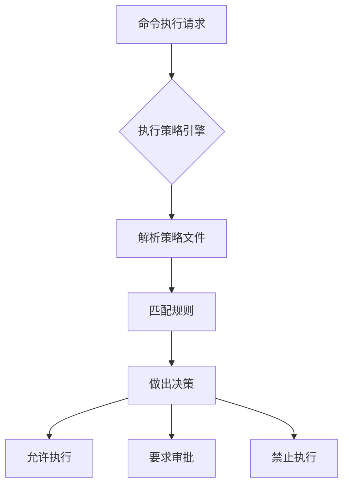
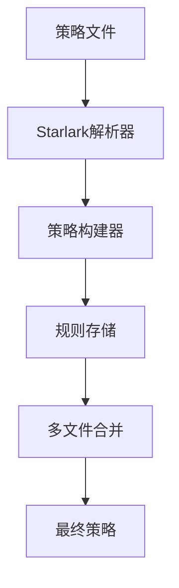
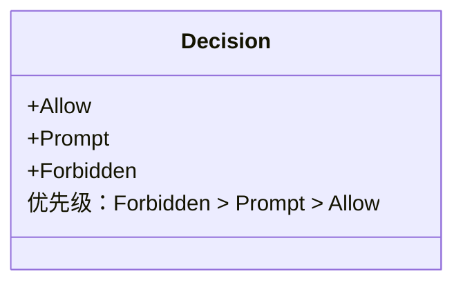
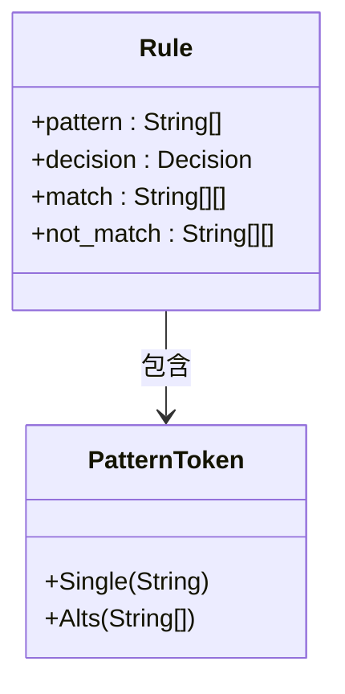
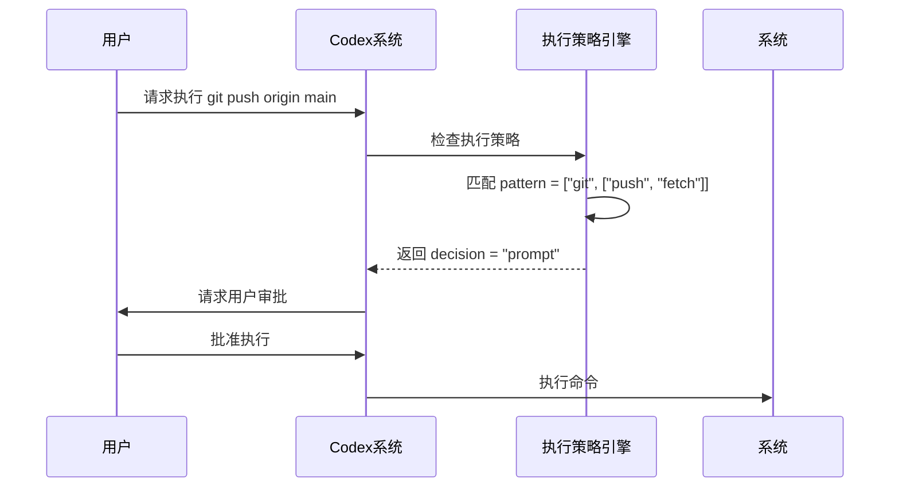
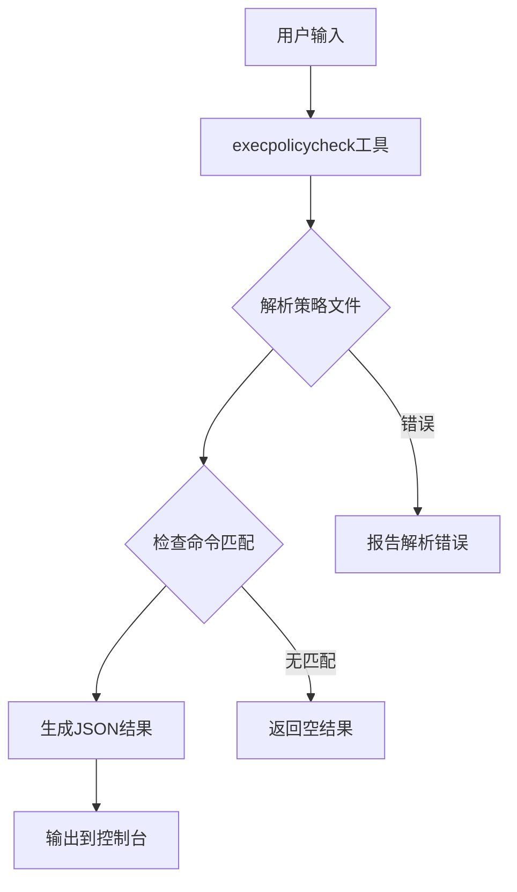
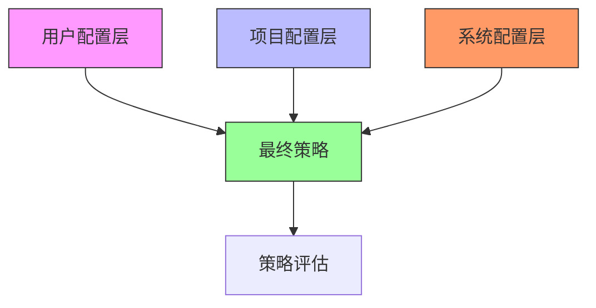
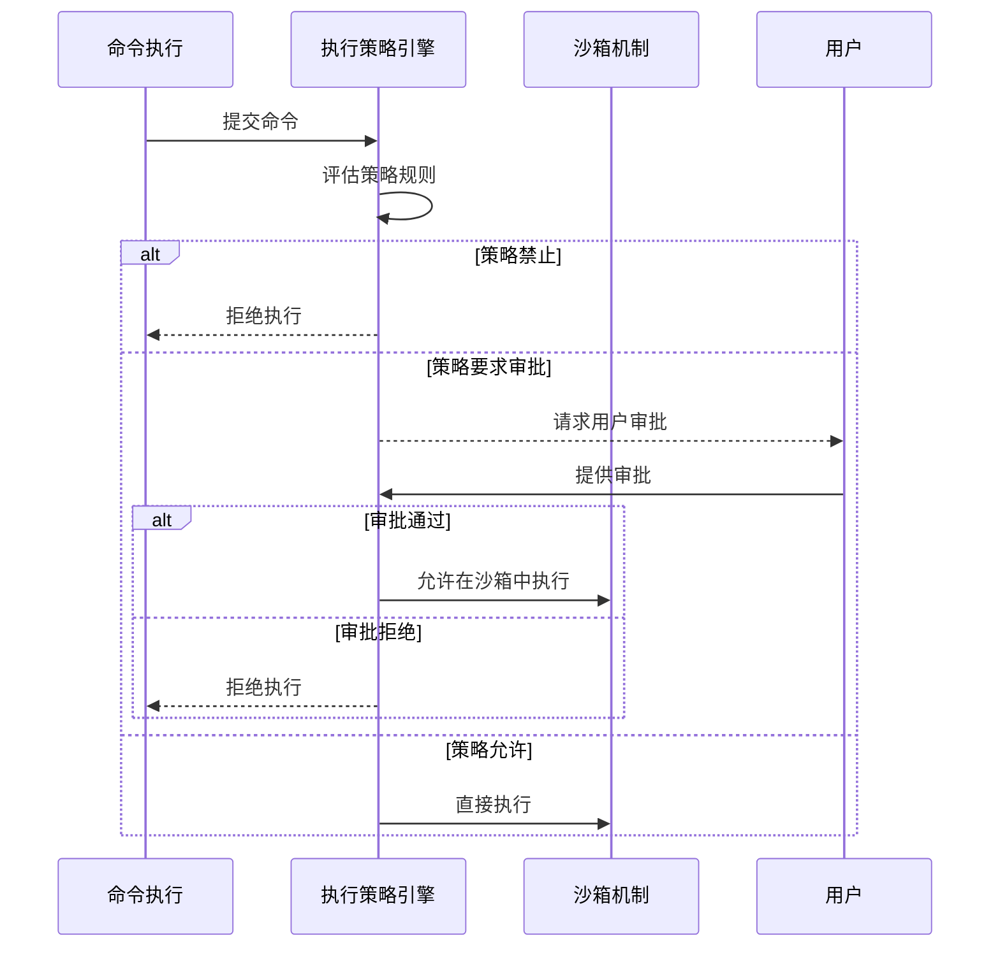

# 执行策略

<cite>
**本文档中引用的文件**  
- [example.codexpolicy](file://codex-rs/execpolicy/examples/example.codexpolicy)
- [execpolicy.md](file://docs/execpolicy.md)
- [README.md](file://codex-rs/execpolicy/README.md)
- [lib.rs](file://codex-rs/execpolicy/src/lib.rs)
- [policy.rs](file://codex-rs/execpolicy/src/policy.rs)
- [rule.rs](file://codex-rs/execpolicy/src/rule.rs)
- [parser.rs](file://codex-rs/execpolicy/src/parser.rs)
- [decision.rs](file://codex-rs/execpolicy/src/decision.rs)
- [execpolicycheck.rs](file://codex-rs/execpolicy/src/execpolicycheck.rs)
- [exec_policy.rs](file://codex-rs/core/src/exec_policy.rs)
</cite>

## 目录
1. [简介](#简介)
2. [执行策略引擎概述](#执行策略引擎概述)
3. [策略文件语法](#策略文件语法)
4. [核心指令详解](#核心指令详解)
5. [示例策略分析](#示例策略分析)
6. [策略验证工具](#策略验证工具)
7. [策略继承与覆盖](#策略继承与覆盖)
8. [与沙箱机制的协同](#与沙箱机制的协同)
9. [最佳实践](#最佳实践)
10. [故障排除](#故障排除)

## 简介

Codex执行策略（execpolicy）引擎是一个静态分析工具，用于在命令执行前根据预定义的策略文件对命令行进行白名单/黑名单检查，从而防止危险操作。该系统通过在命令执行前进行事前检查，与运行时强制执行的沙箱机制形成互补的安全防护体系。

**本节来源**
- [execpolicy.md](file://docs/execpolicy.md#L1-L10)
- [README.md](file://codex-rs/execpolicy/README.md#L1-L10)

## 执行策略引擎概述

执行策略引擎的核心功能是在命令执行前对其进行安全评估。它通过解析策略文件中的规则，对即将执行的命令进行匹配和决策。引擎采用分层架构，包括策略解析器、规则匹配器和决策评估器三个主要组件。

策略文件使用Starlark语法编写，允许用户定义复杂的匹配规则。当Codex需要执行命令时，执行策略引擎会评估该命令是否符合预定义的策略，根据匹配结果决定是允许、要求审批还是禁止执行。



**图表来源**
- [lib.rs](file://codex-rs/execpolicy/src/lib.rs#L1-L21)
- [policy.rs](file://codex-rs/execpolicy/src/policy.rs#L1-L136)

**本节来源**
- [lib.rs](file://codex-rs/execpolicy/src/lib.rs#L1-L21)
- [policy.rs](file://codex-rs/execpolicy/src/policy.rs#L1-L136)

## 策略文件语法

策略文件使用Starlark语法编写，主要包含`prefix_rule`函数调用，该函数接受多个参数来定义策略规则。策略文件通常保存在`~/.codex/rules`目录下，以`.rules`为扩展名。

基本语法结构如下：
```starlark
prefix_rule(
    pattern = ["command", "subcommand"],
    decision = "allow",
    match = [["command", "subcommand"]],
    not_match = [["command", "other"]]
)
```

策略文件支持以下特性：
- 使用列表表示命令行参数序列
- 嵌套列表表示参数的可选值
- 字符串或列表形式的示例验证
- 多个规则文件的合并加载



**图表来源**
- [parser.rs](file://codex-rs/execpolicy/src/parser.rs#L1-L260)
- [policy.rs](file://codex-rs/execpolicy/src/policy.rs#L1-L136)

**本节来源**
- [parser.rs](file://codex-rs/execpolicy/src/parser.rs#L1-L260)
- [README.md](file://codex-rs/execpolicy/README.md#L11-L20)

## 核心指令详解

执行策略引擎支持三个核心决策指令：`allow`、`deny`（在代码中为`forbidden`）和`require_approval`（在代码中为`prompt`）。这些指令通过`decision`参数在`prefix_rule`函数中指定。

### 决策类型

决策类型定义了命令执行的权限级别，按严格程度排序为：`forbidden` > `prompt` > `allow`。



**图表来源**
- [decision.rs](file://codex-rs/execpolicy/src/decision.rs#L7-L16)

### 规则匹配字段

`prefix_rule`函数支持以下关键字段：

- `pattern`: 定义需要匹配的命令前缀模式
- `decision`: 指定匹配后的决策（allow, prompt, forbidden）
- `match`: 必须匹配的示例列表（作为单元测试）
- `not_match`: 必须不匹配的示例列表（作为单元测试）



**图表来源**
- [rule.rs](file://codex-rs/execpolicy/src/rule.rs#L11-L153)
- [parser.rs](file://codex-rs/execpolicy/src/parser.rs#L208-L259)

**本节来源**
- [decision.rs](file://codex-rs/execpolicy/src/decision.rs#L7-L28)
- [rule.rs](file://codex-rs/execpolicy/src/rule.rs#L11-L153)

## 示例策略分析

通过分析`example.codexpolicy`文件中的实例，我们可以深入了解如何构建复杂的执行策略规则。

### Git命令限制示例

以下规则禁止执行`git reset --hard`命令，但允许其他`git reset`变体：

```starlark
prefix_rule(
    pattern = ["git", "reset", "--hard"],
    decision = "forbidden",
    match = [
        ["git", "reset", "--hard"],
    ],
    not_match = [
        ["git", "reset", "--keep"],
        "git reset --merge",
    ],
)
```

此规则展示了如何精确匹配特定命令组合，同时通过`not_match`验证确保规则不会意外匹配相似但不同的命令。

### 复杂模式匹配

策略支持使用嵌套列表表示参数的可选值，实现更灵活的匹配：

```starlark
prefix_rule(
    pattern = ["git", ["push", "fetch"]],
    decision = "prompt",
    match = [["git", "push", "origin", "main"]],
)
```

此规则会匹配`git push`和`git fetch`两种命令，对它们都要求用户审批。



**图表来源**
- [example.codexpolicy](file://codex-rs/execpolicy/examples/example.codexpolicy#L4-L14)
- [execpolicy.md](file://docs/execpolicy.md#L21-L37)

**本节来源**
- [example.codexpolicy](file://codex-rs/execpolicy/examples/example.codexpolicy#L1-L78)
- [execpolicy.md](file://docs/execpolicy.md#L21-L37)

## 策略验证工具

`execpolicycheck`工具用于在部署前验证策略文件的正确性，确保策略按预期工作。

### 工具使用方法

通过Codex CLI使用`execpolicy check`子命令：

```bash
codex execpolicy check --rules ~/.codex/rules/default.rules git status
```

工具支持以下选项：
- `--rules`: 指定一个或多个策略文件路径
- `--pretty`: 格式化JSON输出
- 命令行参数：要检查的具体命令

### 输出格式

工具输出JSON格式的评估结果：

```json
{
  "matchedRules": [
    {
      "prefixRuleMatch": {
        "matchedPrefix": ["git", "status"],
        "decision": "allow"
      }
    }
  ],
  "decision": "allow"
}
```

当没有规则匹配时，`matchedRules`为空数组，`decision`字段被省略。



**图表来源**
- [execpolicycheck.rs](file://codex-rs/execpolicy/src/execpolicycheck.rs#L1-L84)
- [README.md](file://codex-rs/execpolicy/README.md#L22-L35)

**本节来源**
- [execpolicycheck.rs](file://codex-rs/execpolicy/src/execpolicycheck.rs#L1-L84)
- [README.md](file://codex-rs/execpolicy/README.md#L22-L35)

## 策略继承与覆盖

执行策略支持多层配置的继承和覆盖机制，允许在不同作用域定义策略规则。

### 配置层叠

策略从多个配置层加载，按优先级顺序合并：
1. 用户级配置
2. 项目级配置
3. 系统级配置

高优先级层的规则可以覆盖低优先级层的相同规则。



### 加载顺序

策略文件按以下顺序加载和合并：
1. 遍历所有配置层（从最低优先级到最高优先级）
2. 在每个层中收集`.rules`目录下的所有策略文件
3. 按文件路径排序后依次解析
4. 后解析的规则可以覆盖先解析的相同规则

**本节来源**
- [exec_policy.rs](file://codex-rs/core/src/exec_policy.rs#L208-L244)
- [exec_policy.rs](file://codex-rs/core/src/exec_policy.rs#L313-L363)

## 与沙箱机制的协同

执行策略引擎与沙箱机制协同工作，形成多层次的安全防护体系。

### 协同工作流程



### 决策优先级

当执行策略和沙箱机制同时存在时，决策遵循以下优先级：
1. 执行策略的`forbidden`决策优先于所有其他决策
2. 执行策略的`prompt`决策会触发用户审批流程
3. 执行策略的`allow`决策可能绕过沙箱执行

**图表来源**
- [exec_policy.rs](file://codex-rs/core/src/exec_policy.rs#L109-L163)
- [sandboxing.rs](file://codex-rs/core/src/tools/sandboxing.rs#L245-L292)

**本节来源**
- [exec_policy.rs](file://codex-rs/core/src/exec_policy.rs#L109-L163)
- [exec.md](file://docs/exec.md)

## 最佳实践

### 从宽松策略开始

建议从相对宽松的策略开始，逐步收紧安全控制：

1. 初始阶段：主要使用`prompt`决策，记录需要审批的命令
2. 分析阶段：审查审批日志，识别常见模式
3. 优化阶段：为安全命令添加`allow`规则，为危险命令添加`forbidden`规则

### 策略编写建议

- 使用`match`和`not_match`验证规则的准确性
- 为复杂命令编写多个测试用例
- 定期审查和清理过时的规则
- 在项目级策略中定义团队共识的规则
- 在用户级策略中定义个人偏好

### 安全考虑

- 避免过度宽松的模式匹配，防止意外匹配
- 定期审计策略文件，确保符合安全要求
- 使用版本控制管理策略文件变更
- 为关键系统配置严格的默认策略

**本节来源**
- [execpolicy.md](file://docs/execpolicy.md)
- [README.md](file://codex-rs/execpolicy/README.md)

## 故障排除

### 常见问题

#### 策略文件未被加载

确保策略文件位于正确的目录：
```bash
mkdir -p ~/.codex/rules
```

#### 规则未按预期匹配

使用`execpolicy check`工具验证规则匹配：
```bash
codex execpolicy check --rules ~/.codex/rules/default.rules --pretty your-command
```

#### 解析错误

检查Starlark语法是否正确，特别是引号和括号的匹配。

### 调试技巧

1. 使用`--pretty`选项获取格式化的JSON输出
2. 逐步添加规则，每次验证其效果
3. 利用`match`和`not_match`作为单元测试确保规则准确性
4. 检查系统日志获取详细的错误信息

**本节来源**
- [execpolicy.md](file://docs/execpolicy.md#L38-L75)
- [execpolicycheck.rs](file://codex-rs/execpolicy/src/execpolicycheck.rs#L37-L45)