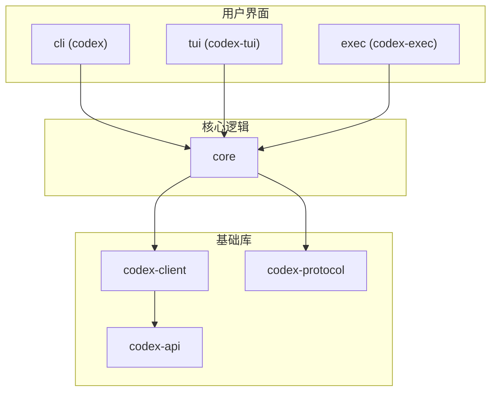

# 开发者指南

<cite>
**本文档中引用的文件**   
- [README.md](file://README.md)
- [justfile](file://justfile)
- [package.json](file://package.json)
- [codex-rs/Cargo.toml](file://codex-rs/Cargo.toml)
- [codex-rs/rust-toolchain.toml](file://codex-rs/rust-toolchain.toml)
- [docs/contributing.md](file://docs/contributing.md)
- [docs/install.md](file://docs/install.md)
- [codex-rs/README.md](file://codex-rs/README.md)
- [codex-rs/cli/Cargo.toml](file://codex-rs/cli/Cargo.toml)
- [codex-rs/core/Cargo.toml](file://codex-rs/core/Cargo.toml)
- [codex-rs/tui/Cargo.toml](file://codex-rs/tui/Cargo.toml)
- [codex-rs/exec/Cargo.toml](file://codex-rs/exec/Cargo.toml)
- [codex-rs/app-server/Cargo.toml](file://codex-rs/app-server/Cargo.toml)
- [pnpm-workspace.yaml](file://pnpm-workspace.yaml)
</cite>

## 目录
1. [简介](#简介)
2. [开发环境设置](#开发环境设置)
3. [构建与任务运行](#构建与任务运行)
4. [项目代码结构](#项目代码结构)
5. [贡献指南](#贡献指南)
6. [测试策略](#测试策略)
7. [版本发布与分支管理](#版本发布与分支管理)

## 简介

Codex项目是一个由OpenAI开发的本地运行的编码代理工具，旨在为开发者提供强大的代码生成和自动化能力。本指南旨在为贡献者提供一份权威的开发参考，涵盖从环境设置到代码贡献的完整流程。项目采用Rust作为主要实现语言，并通过Node.js和pnpm进行前端工具链管理。Codex支持多种运行模式，包括交互式TUI界面、非交互式执行模式以及MCP（Model Context Protocol）服务器模式。本指南将详细介绍项目的整体架构、开发流程和贡献规范，帮助开发者快速上手并有效参与项目开发。

## 开发环境设置

要开始开发Codex项目，需要安装以下先决条件：

1.  **Rust**: 项目使用Rust 1.90.0版本。可以通过`rustup`工具链进行安装：
    ```bash
    curl --proto '=https' --tlsv1.2 -sSf https://sh.rustup.rs | sh -s -- -y
    source "$HOME/.cargo/env"
    rustup component add rustfmt
    rustup component add clippy
    ```
    项目根目录下的`codex-rs/rust-toolchain.toml`文件指定了确切的工具链版本。

2.  **Node.js**: 项目使用Node.js（版本>=22）来管理npm脚本和前端工具。请从[Node.js官网](https://nodejs.org/)下载并安装最新LTS版本。

3.  **pnpm**: 项目使用pnpm作为包管理器（版本>=9.0.0）。可以通过npm全局安装：
    ```bash
    npm install -g pnpm
    ```
    项目根目录的`package.json`文件中指定了`packageManager`为`pnpm@10.8.1`。

4.  **辅助工具**: 为了使用`just`命令运行构建任务，需要安装`just`和`cargo-nextest`：
    ```bash
    cargo install just
    cargo install cargo-nextest
    ```

安装完上述依赖后，克隆项目仓库并进入`codex-rs`工作区目录即可开始开发。

**Section sources**
- [docs/install.md](file://docs/install.md#L1-L49)
- [codex-rs/rust-toolchain.toml](file://codex-rs/rust-toolchain.toml#L1-L4)
- [package.json](file://package.json#L20-L22)

## 构建与任务运行

Codex项目使用`just`命令作为主要的构建和任务运行工具。`justfile`位于项目根目录，定义了所有可用的任务。

### 使用`just`命令

在项目根目录下，可以使用以下`just`命令：

- `just help`: 显示所有可用命令的帮助信息。
- `just install`: 安装Rust工具链并获取依赖。
- `just fmt`: 使用`cargo fmt`格式化所有Rust代码。
- `just fix`: 使用`cargo clippy --fix`自动修复代码中的lint警告。
- `just clippy`: 运行`cargo clippy`进行代码检查。
- `just test`: 使用`cargo nextest`运行所有测试（比`cargo test`更快）。
- `just codex`: 编译并运行主`codex`二进制文件。
- `just exec`: 编译并运行`codex exec`命令。
- `just tui`: 编译并运行`codex tui`命令。

### 构建流程

完整的构建流程如下：
1.  进入`codex-rs`目录：`cd codex/codex-rs`
2.  安装依赖：`just install`
3.  构建项目：`cargo build`
4.  运行测试：`just test`

**Section sources**
- [justfile](file://justfile#L1-L54)
- [docs/install.md](file://docs/install.md#L17-L48)

## 项目代码结构

Codex项目采用Rust工作区（workspace）模式进行组织，核心逻辑位于`codex-rs`目录下。该工作区包含多个独立的crate，每个crate负责特定的功能模块。

### `codex-rs`工作区中的主要crate

`codex-rs`工作区由`Cargo.toml`文件定义，包含了多个crate。以下是关键crate的职责和依赖关系：

- **`core`**: 项目的核心业务逻辑库。它包含了Codex的主要功能实现，如会话管理、模型调用、命令执行等。其他所有CLI和TUI应用都依赖于这个crate。它依赖于`codex-client`、`codex-protocol`等基础库。
- **`cli`**: 主命令行工具的多用途二进制文件。它通过子命令（如`exec`、`tui`、`mcp`）提供对其他功能的统一入口。它直接依赖于`core`、`tui`、`exec`等crate。
- **`tui`**: 基于`Ratatui`库构建的全屏终端用户界面（TUI）。为用户提供交互式的操作体验。它依赖于`core`来处理业务逻辑。
- **`exec`**: 用于自动化和非交互式场景的“无头”CLI。允许通过脚本或程序调用Codex。它依赖于`core`来执行任务。
- **`app-server`**: 一个应用服务器，可能用于处理特定的后端请求或作为MCP客户端/服务器的一部分。
- **`codex-client`**: 与Codex后端API通信的客户端库。
- **`codex-api`**: 定义了与Codex后端通信的API端点和数据模型。
- **`codex-protocol`**: 定义了Codex内部使用的通信协议和数据结构。



**Diagram sources **
- [codex-rs/Cargo.toml](file://codex-rs/Cargo.toml#L1-L303)
- [codex-rs/cli/Cargo.toml](file://codex-rs/cli/Cargo.toml#L1-L67)
- [codex-rs/core/Cargo.toml](file://codex-rs/core/Cargo.toml#L1-L143)
- [codex-rs/tui/Cargo.toml](file://codex-rs/tui/Cargo.toml#L1-L125)
- [codex-rs/exec/Cargo.toml](file://codex-rs/exec/Cargo.toml#L1-L64)
- [codex-rs/app-server/Cargo.toml](file://codex-rs/app-server/Cargo.toml#L1-L59)

**Section sources**
- [codex-rs/README.md](file://codex-rs/README.md#L91-L99)
- [codex-rs/Cargo.toml](file://codex-rs/Cargo.toml#L1-L303)

## 贡献指南

我们欢迎社区贡献。请遵循以下流程来贡献代码。

### 开发工作流

1.  从`main`分支创建一个主题分支（例如`feat/new-feature`）。
2.  保持提交的专注性，每个分支只解决一个问题。
3.  确保代码没有lint警告，并且所有相关测试都通过。

### 提交拉取请求

1.  在提交代码前，先创建一个issue来讨论你的想法和解决方案。
2.  运行所有本地检查：`just fmt`格式化代码，`just fix -p <crate>`修复lint问题，`just test`或`cargo test -p <crate>`运行测试。
3.  填写PR模板，清晰地说明“做了什么”、“为什么做”以及“如何实现”。
4.  确保你的分支与`main`分支保持同步。
5.  当你的PR准备好被审查时，将其标记为“Ready for review”。

### 提交信息规范

提交信息应遵循清晰的格式：
-   使用祈使句，例如"Fix bug"而不是"Fixed bug"或"Fixes bug"。
-   第一行是简短的摘要（50个字符以内）。
-   空一行后，提供更详细的描述，解释更改的原因和影响。

**Section sources**
- [docs/contributing.md](file://docs/contributing.md#L1-L77)

## 测试策略

Codex项目采用多层次的测试策略来保证代码质量。

### 单元测试

每个crate都包含其自身的单元测试，位于`src`目录下的`tests`模块中。这些测试专注于验证单个函数或模块的正确性。使用`cargo test`或`just test`命令可以运行所有单元测试。

### 集成测试

集成测试位于各个crate的`tests`目录下，用于验证多个模块或组件之间的交互。例如，`core` crate的集成测试会验证会话管理、命令执行等核心流程是否按预期工作。

### 端到端测试

项目可能包含端到端测试，模拟用户从启动CLI到完成任务的完整流程。这些测试通常在CI/CD环境中运行，确保整个应用的功能完整性。

**Section sources**
- [docs/contributing.md](file://docs/contributing.md#L20-L21)
- [justfile](file://justfile#L48-L49)

## 版本发布与分支管理

### 分支管理策略

项目采用基于`main`分支的开发模式。所有功能开发和bug修复都应在独立的分支上进行，通过Pull Request合并到`main`分支。`main`分支始终保持可发布状态。

### 版本发布流程

版本发布由维护者通过GitHub Releases进行。发布流程通常包括：
1.  合并所有计划在本次发布中包含的PR。
2.  更新版本号（在`codex-rs/Cargo.toml`中）。
3.  创建新的GitHub Release，包含版本说明和编译好的二进制文件。
4.  更新npm包（如果适用）。

**Section sources**
- [codex-rs/Cargo.toml](file://codex-rs/Cargo.toml#L52-L53)
- [README.md](file://README.md#L39-L52)