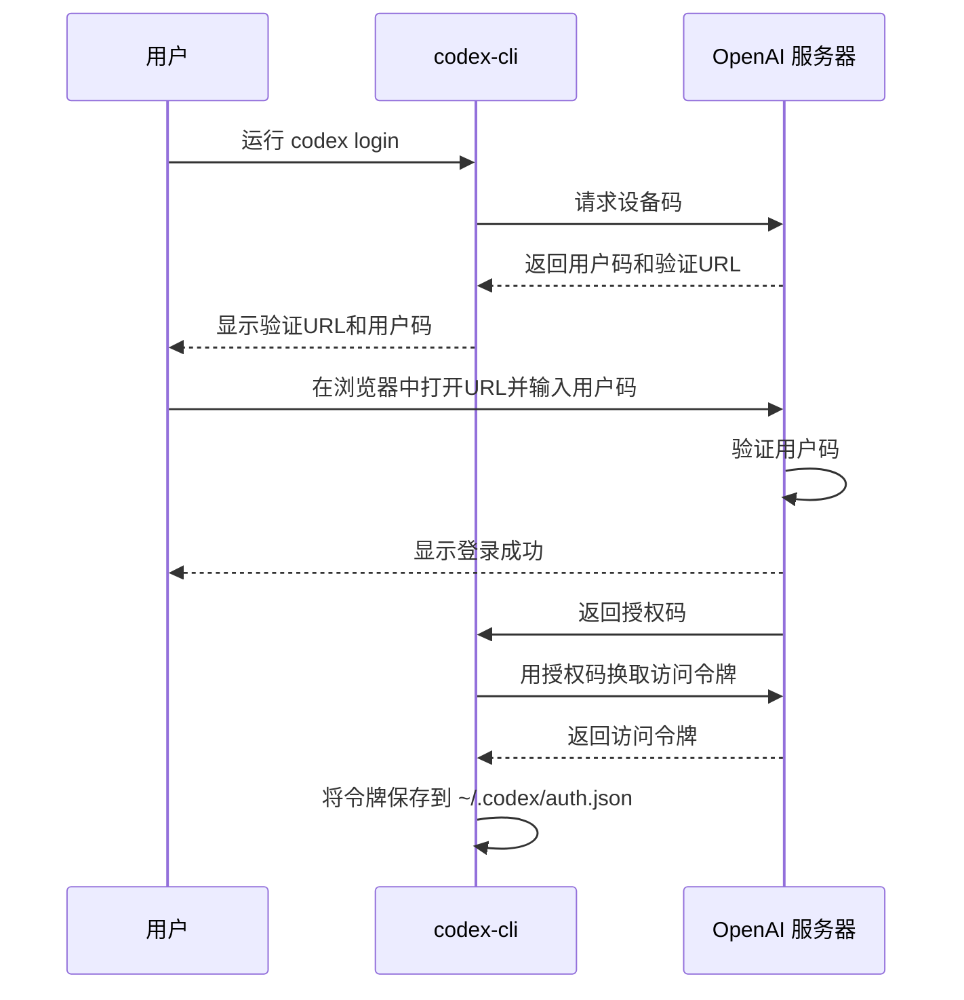

# 快速入门

<cite>
**本文档中引用的文件**   
- [README.md](file://README.md)
- [codex-cli/package.json](file://codex-cli/package.json)
- [codex-rs/Cargo.toml](file://codex-rs/Cargo.toml)
- [docs/getting-started.md](file://docs/getting-started.md)
- [docs/install.md](file://docs/install.md)
- [docs/authentication.md](file://docs/authentication.md)
- [docs/config.md](file://docs/config.md)
- [docs/sandbox.md](file://docs/sandbox.md)
- [docs/faq.md](file://docs/faq.md)
- [codex-cli/bin/codex.js](file://codex-cli/bin/codex.js)
- [codex-rs/cli/src/main.rs](file://codex-rs/cli/src/main.rs)
- [codex-rs/login/src/device_code_auth.rs](file://codex-rs/login/src/device_code_auth.rs)
</cite>

## 目录
1. [简介](#简介)
2. [安装 `codex-cli`](#安装-codex-cli)
3. [配置 Rust 工具链](#配置-rust-工具链)
4. [首次运行与初始化](#首次运行与初始化)
5. [基本用法示例](#基本用法示例)
6. [关键配置选项](#关键配置选项)
7. [常见问题与故障排除](#常见问题与故障排除)

## 简介

`codex-cli` 是 OpenAI 提供的一个本地运行的编程代理工具，旨在帮助开发者通过自然语言指令来编写、审查和修改代码。本指南将引导您完成在不同操作系统上的安装、配置和首次使用流程，确保您能快速上手并有效利用其功能。

**Section sources**
- [README.md](file://README.md#L1-L113)

## 安装 `codex-cli`

`codex-cli` 可以通过多种方式安装，最推荐的方式是使用 npm 或 Homebrew。

### 在所有操作系统上通用的安装方法

**使用 npm 安装**

```shell
npm install -g @openai/codex
```

**使用 Homebrew 安装 (macOS)**

```shell
brew install --cask codex
```

### 通过 GitHub Releases 安装

您也可以从 [GitHub Releases](https://github.com/openai/codex/releases/latest) 页面下载适用于您平台的预编译二进制文件。下载后，解压并将可执行文件重命名为 `codex`，然后将其放置在您的系统 PATH 环境变量所包含的目录中。

**Section sources**
- [README.md](file://README.md#L18-L52)
- [codex-cli/package.json](file://codex-cli/package.json#L1-L22)

## 配置 Rust 工具链

虽然 `codex-cli` 的 npm 包已经包含了预编译的二进制文件，但如果您选择从源码构建，则需要配置 Rust 工具链。

### 安装 Rust

1.  访问 [rustup.rs](https://rustup.rs/) 并按照说明安装 `rustup`。
2.  安装完成后，运行以下命令来安装 Rust 工具链：

```bash
curl --proto '=https' --tlsv1.2 -sSf https://sh.rustup.rs | sh -s -- -y
source "$HOME/.cargo/env"
```

3.  安装必要的组件：

```bash
rustup component add rustfmt
rustup component add clippy
```

### 构建 `codex`

1.  克隆仓库：

```bash
git clone https://github.com/openai/codex.git
cd codex/codex-rs
```

2.  构建项目：

```bash
cargo build
```

3.  运行：

```bash
cargo run --bin codex -- "explain this codebase to me"
```

**Section sources**
- [docs/install.md](file://docs/install.md#L17-L48)

## 首次运行与初始化

安装完成后，首次运行 `codex` 会引导您完成身份验证和基本配置。

### 启动 `codex`

在终端中运行：

```shell
codex
```

### 身份验证 (Device Code Flow)

`codex` 会启动一个本地服务器（默认在 `localhost:1455`），并提示您通过浏览器登录。对于无法直接访问浏览器的“无头”机器（如远程服务器或 Docker 容器），可以使用 **设备码流程 (Device Code Flow)**。

1.  运行 `codex login`。
2.  您将看到一个提示，要求您访问一个特定的 URL 并输入一个一次性代码。
3.  在您的个人电脑上打开该 URL，登录您的 ChatGPT 账户，然后输入显示的代码。
4.  认证成功后，您的凭据将被安全地存储在 `~/.codex/auth.json` 文件中。



**Diagram sources **
- [docs/authentication.md](file://docs/authentication.md#L1-L69)
- [codex-rs/login/src/device_code_auth.rs](file://codex-rs/login/src/device_code_auth.rs#L1-L203)
- [codex-rs/cli/src/main.rs](file://codex-rs/cli/src/main.rs#L214-L225)

**Section sources**
- [README.md](file://README.md#L54-L62)
- [docs/authentication.md](file://docs/authentication.md#L1-L69)

## 基本用法示例

让我们通过一个具体的例子来演示 `codex` 的基本用法。

### 启动交互式会话

1.  打开您的终端。
2.  导航到您想要操作的项目目录。
3.  运行 `codex` 启动交互式界面。

### 输入编程任务

在 `codex` 的提示符下，输入您的任务：

```text
创建一个Python脚本来列出当前目录中的文件
```

### 观察 `codex` 的行为

1.  `codex` 会分析您的请求。
2.  它可能会生成一个 Python 脚本，例如：
    ```python
    import os

    # 列出当前目录中的所有文件
    for filename in os.listdir('.'):
        if os.path.isfile(filename):
            print(filename)
    ```
3.  `codex` 会询问您是否要将此代码保存到文件中，或者直接在沙箱环境中执行它。
4.  根据您的选择，`codex` 会执行相应的操作，并向您展示结果。

**Section sources**
- [docs/getting-started.md](file://docs/getting-started.md#L40-L47)

## 关键配置选项

`codex` 的配置文件位于 `~/.codex/config.toml`，您可以通过此文件进行深度定制。

### 默认模型选择

您可以指定 `codex` 使用的默认模型。例如，要使用 `gpt-5.1` 模型，请在 `config.toml` 中添加：

```toml
model = "gpt-5.1"
```

### 沙箱模式

沙箱模式决定了 `codex` 执行命令时的权限级别。

-   **只读模式 (`read-only`)**: `codex` 只能读取文件，不能进行任何修改或网络访问。
-   **工作区可写模式 (`workspace-write`)**: `codex` 可以在当前工作目录及其子目录中读写文件。
-   **危险全访问模式 (`danger-full-access`)**: `codex` 拥有完全的系统访问权限，**不推荐使用**。

```toml
sandbox_mode = "read-only"
```

**Section sources**
- [docs/config.md](file://docs/config.md#L58-L345)
- [docs/sandbox.md](file://docs/sandbox.md#L1-L97)

## 常见问题与故障排除

### 网络代理设置

如果您的网络环境需要代理，请确保在运行 `codex` 之前正确设置了 `HTTP_PROXY` 和 `HTTPS_PROXY` 环境变量。

```bash
export HTTP_PROXY=http://your-proxy:port
export HTTPS_PROXY=http://your-proxy:port
codex
```

### 权限错误

如果遇到权限错误，请检查：
1.  `~/.codex` 目录的所有权和权限。
2.  您是否在受限的环境中运行（如某些 Docker 容器），可能需要使用 `--dangerously-bypass-approvals-and-sandbox` 标志。

### 在 Windows 上运行

`codex` 在原生 Windows 上的支持有限。我们强烈建议使用 **Windows Subsystem for Linux (WSL2)** 来获得最佳体验。

**Section sources**
- [docs/faq.md](file://docs/faq.md#L31-L40)
- [docs/authentication.md](file://docs/authentication.md#L29-L69)