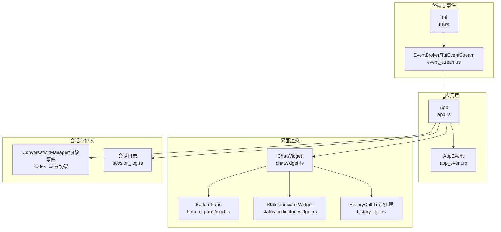
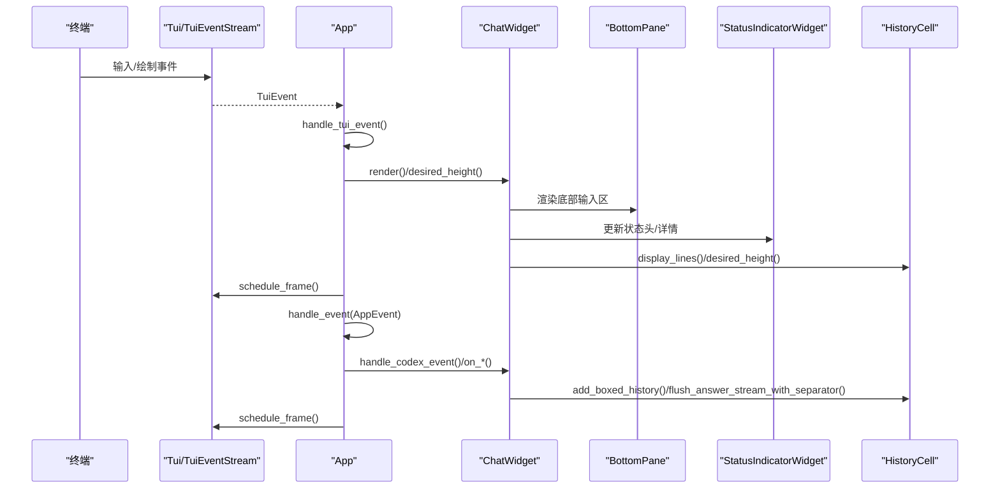
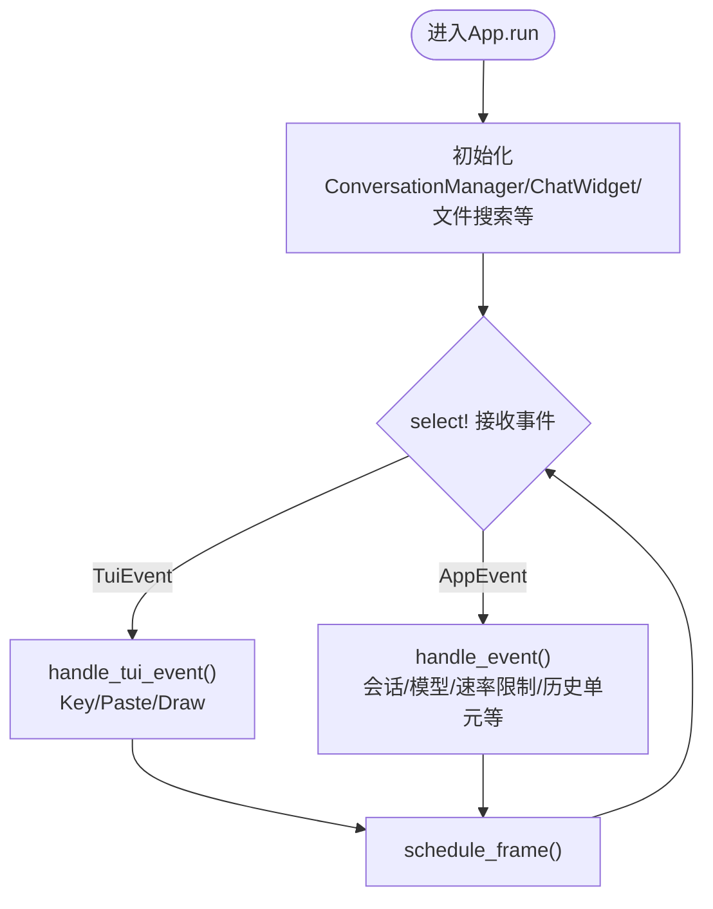
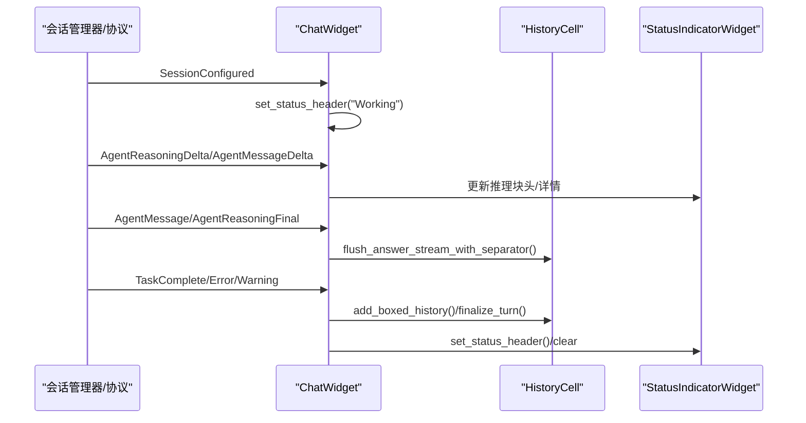
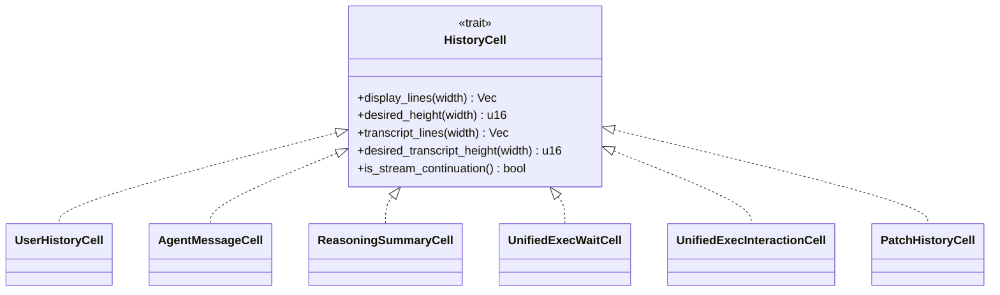
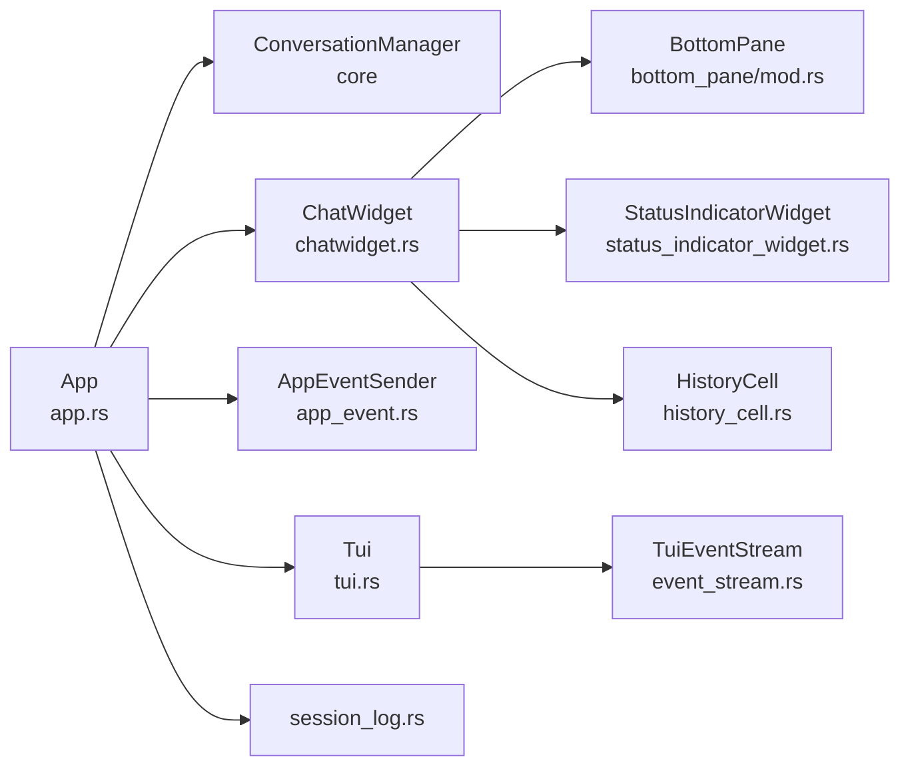

# 会话与用户界面集成

<cite>
**本文引用的文件列表**
- [app.rs](file://codex-rs/tui/src/app.rs)
- [chatwidget.rs](file://codex-rs/tui/src/chatwidget.rs)
- [history_cell.rs](file://codex-rs/tui/src/history_cell.rs)
- [app_event.rs](file://codex-rs/tui/src/app_event.rs)
- [tui.rs](file://codex-rs/tui/src/tui.rs)
- [event_stream.rs](file://codex-rs/tui/src/tui/event_stream.rs)
- [status_indicator_widget.rs](file://codex-rs/tui/src/status_indicator_widget.rs)
- [bottom_pane/mod.rs](file://codex-rs/tui/src/bottom_pane/mod.rs)
- [session_log.rs](file://codex-rs/tui/src/session_log.rs)
</cite>

## 目录
1. [简介](#简介)
2. [项目结构](#项目结构)
3. [核心组件](#核心组件)
4. [架构总览](#架构总览)
5. [组件详解](#组件详解)
6. [依赖关系分析](#依赖关系分析)
7. [性能考量](#性能考量)
8. [故障排查指南](#故障排查指南)
9. [结论](#结论)
10. [附录：开发者集成指南](#附录开发者集成指南)

## 简介
本文件聚焦于Codex TUI（文本用户界面）与会话状态的深度集成，系统性阐述：
- TUI如何通过应用层事件循环监听会话状态变化并实时更新界面；
- 聊天小部件如何渲染消息流（用户输入、AI响应、工具调用与执行结果）；
- 历史单元（HistoryCell）如何表示与展示单次会话单元（命令执行、文件修改等）；
- 界面如何反映不同会话状态（正在思考、等待审批、执行中等）；
- 事件驱动的重绘机制与性能优化策略；
- 如何在自定义前端中复用会话状态，实现一致的用户体验。

## 项目结构
围绕会话与TUI的关键模块如下：
- 应用主循环与事件分发：app.rs
- 聊天小部件与渲染：chatwidget.rs
- 历史单元抽象与渲染：history_cell.rs
- 应用事件类型：app_event.rs
- 终端与事件流：tui.rs、event_stream.rs
- 状态指示器与底部面板：status_indicator_widget.rs、bottom_pane/mod.rs
- 会话日志与调试：session_log.rs

图表来源
- [app.rs](file://codex-rs/tui/src/app.rs#L492-L506)
- [tui.rs](file://codex-rs/tui/src/tui.rs#L389-L425)
- [event_stream.rs](file://codex-rs/tui/src/tui/event_stream.rs#L132-L171)
- [chatwidget.rs](file://codex-rs/tui/src/chatwidget.rs#L3559-L3563)
- [bottom_pane/mod.rs](file://codex-rs/tui/src/bottom_pane/mod.rs#L64-L140)
- [status_indicator_widget.rs](file://codex-rs/tui/src/status_indicator_widget.rs#L193-L200)
- [history_cell.rs](file://codex-rs/tui/src/history_cell.rs#L63-L122)
- [session_log.rs](file://codex-rs/tui/src/session_log.rs#L165-L210)

章节来源
- [app.rs](file://codex-rs/tui/src/app.rs#L492-L506)
- [tui.rs](file://codex-rs/tui/src/tui.rs#L389-L425)
- [event_stream.rs](file://codex-rs/tui/src/tui/event_stream.rs#L132-L171)

## 核心组件
- App：应用主循环，聚合会话管理器、聊天小部件、历史单元、底部面板、文件搜索等；统一处理来自TUI事件与应用事件的双通道输入，驱动重绘与状态切换。
- ChatWidget：会话渲染核心，负责将协议事件映射为可渲染的历史单元，维护任务运行状态、流式渲染控制器、速率限制与上下文窗口信息、统一执行会话摘要等。
- HistoryCell：历史单元抽象，定义统一的显示接口与高度计算，具体实现覆盖用户消息、AI消息、推理摘要、执行等待/交互、补丁差异、工具调用结果等。
- AppEvent：应用层事件枚举，涵盖会话新建、模型/推理努力更新、速率限制快照、文件搜索、外部编辑器启动、历史单元插入、提交动画等。
- Tui/TuiEventStream：事件桥接，将终端输入与绘制事件统一为可消费的事件流，支持在需要时丢弃/重建事件流以避免stdin竞争。
- BottomPane/StatusIndicatorWidget：底部输入区与状态指示器，承载输入composer、弹窗视图、统一执行摘要、上下文使用提示与中断提示等。

章节来源
- [app.rs](file://codex-rs/tui/src/app.rs#L288-L324)
- [chatwidget.rs](file://codex-rs/tui/src/chatwidget.rs#L313-L372)
- [history_cell.rs](file://codex-rs/tui/src/history_cell.rs#L63-L122)
- [app_event.rs](file://codex-rs/tui/src/app_event.rs#L18-L120)
- [tui.rs](file://codex-rs/tui/src/tui.rs#L389-L425)
- [event_stream.rs](file://codex-rs/tui/src/tui/event_stream.rs#L132-L171)
- [bottom_pane/mod.rs](file://codex-rs/tui/src/bottom_pane/mod.rs#L64-L140)
- [status_indicator_widget.rs](file://codex-rs/tui/src/status_indicator_widget.rs#L193-L200)

## 架构总览
TUI采用“事件驱动+双通道输入”的架构：
- 终端事件通道：TuiEventStream将键盘、鼠标、绘制事件统一为TuiEvent，由App.handle_tui_event处理。
- 应用事件通道：App.handle_event接收AppEvent，包含来自会话管理器的协议事件、模型/推理努力变更、文件搜索结果、历史单元插入等。
- 渲染路径：App在每次事件处理后调度帧（schedule_frame），Draw事件触发ChatWidget.render，BottomPane与StatusIndicatorWidget按需更新，HistoryCell按宽度换行并计算所需高度。

图表来源
- [app.rs](file://codex-rs/tui/src/app.rs#L513-L559)
- [chatwidget.rs](file://codex-rs/tui/src/chatwidget.rs#L3559-L3563)
- [bottom_pane/mod.rs](file://codex-rs/tui/src/bottom_pane/mod.rs#L578-L588)
- [status_indicator_widget.rs](file://codex-rs/tui/src/status_indicator_widget.rs#L193-L200)
- [history_cell.rs](file://codex-rs/tui/src/history_cell.rs#L63-L122)

## 组件详解

### TUI事件监听与会话状态更新（App）
- 双通道事件循环：App.run创建无阻塞通道，同时从TuiEventStream与AppEventReceiver接收事件，使用select!轮询，确保界面在会话事件与用户输入之间快速切换。
- Tui事件处理：Draw事件触发重绘，Key/Paste事件转发给ChatWidget；Draw还负责可能的外部编辑器启动与通知提示。
- 应用事件处理：App.handle_event集中处理会话生命周期事件（新建会话、恢复会话、速率限制快照、Diff结果、模型/推理努力更新、历史单元插入、提交动画tick等），并在必要时刷新帧。

图表来源
- [app.rs](file://codex-rs/tui/src/app.rs#L492-L506)
- [app.rs](file://codex-rs/tui/src/app.rs#L513-L559)
- [app.rs](file://codex-rs/tui/src/app.rs#L561-L800)

章节来源
- [app.rs](file://codex-rs/tui/src/app.rs#L492-L506)
- [app.rs](file://codex-rs/tui/src/app.rs#L513-L559)
- [app.rs](file://codex-rs/tui/src/app.rs#L561-L800)

### ChatWidget消息流渲染与状态反映
- 会话配置：SessionConfigured事件设置会话ID、模型、回放初始消息、欢迎横幅控制等，随后请求重绘。
- AI消息与推理：AgentMessage/AgentMessageDelta与AgentReasoning/AgentReasoningDelta分别驱动答案流与推理块；推理块结束时汇总为历史单元；任务开始/完成时切换任务运行状态与中断提示。
- 执行与工具调用：统一执行会话（UnifiedExec）跟踪等待/交互单元，显示等待闪烁与交互摘要；工具调用结果以历史单元形式呈现。
- 速率限制与上下文：RateLimitSnapshotFetched更新上下文窗口百分比与已用令牌数，触发警告与提示；高使用率时可能弹出切换模型提示。
- 错误/警告：Error/Warning事件生成对应历史单元并重绘；任务失败时终止当前流并尝试发送下一个排队输入。

图表来源
- [chatwidget.rs](file://codex-rs/tui/src/chatwidget.rs#L434-L465)
- [chatwidget.rs](file://codex-rs/tui/src/chatwidget.rs#L509-L518)
- [chatwidget.rs](file://codex-rs/tui/src/chatwidget.rs#L520-L549)
- [chatwidget.rs](file://codex-rs/tui/src/chatwidget.rs#L561-L591)
- [chatwidget.rs](file://codex-rs/tui/src/chatwidget.rs#L706-L717)
- [chatwidget.rs](file://codex-rs/tui/src/chatwidget.rs#L722-L734)
- [status_indicator_widget.rs](file://codex-rs/tui/src/status_indicator_widget.rs#L193-L200)

章节来源
- [chatwidget.rs](file://codex-rs/tui/src/chatwidget.rs#L434-L465)
- [chatwidget.rs](file://codex-rs/tui/src/chatwidget.rs#L509-L518)
- [chatwidget.rs](file://codex-rs/tui/src/chatwidget.rs#L520-L549)
- [chatwidget.rs](file://codex-rs/tui/src/chatwidget.rs#L561-L591)
- [chatwidget.rs](file://codex-rs/tui/src/chatwidget.rs#L706-L717)
- [chatwidget.rs](file://codex-rs/tui/src/chatwidget.rs#L722-L734)

### HistoryCell：单次会话单元的表示与展示
- 抽象接口：HistoryCell定义display_lines/desired_height/transcript_lines等方法，统一历史单元的渲染与高度计算。
- 典型实现：
  - 用户消息：带前缀与样式包裹，支持宽度换行。
  - AI消息：首行缩进，后续行缩进，支持流式续写标记。
  - 推理摘要：Markdown渲染，仅转录模式下可见。
  - 执行等待/交互：带闪烁动画或静态文本，显示命令摘要与标准输入。
  - 补丁差异：基于文件变更生成摘要卡片。
  - 工具调用结果：根据输出类型（文本/图像）给出简洁提示。
- 复合单元：支持多个HistoryCell组合为一个条目，用于复杂场景（如会话摘要卡片内含命令行与摘要）。

图表来源
- [history_cell.rs](file://codex-rs/tui/src/history_cell.rs#L63-L122)
- [history_cell.rs](file://codex-rs/tui/src/history_cell.rs#L133-L162)
- [history_cell.rs](file://codex-rs/tui/src/history_cell.rs#L235-L268)
- [history_cell.rs](file://codex-rs/tui/src/history_cell.rs#L164-L234)
- [history_cell.rs](file://codex-rs/tui/src/history_cell.rs#L446-L511)
- [history_cell.rs](file://codex-rs/tui/src/history_cell.rs#L380-L445)
- [history_cell.rs](file://codex-rs/tui/src/history_cell.rs#L720-L740)

章节来源
- [history_cell.rs](file://codex-rs/tui/src/history_cell.rs#L63-L122)
- [history_cell.rs](file://codex-rs/tui/src/history_cell.rs#L133-L162)
- [history_cell.rs](file://codex-rs/tui/src/history_cell.rs#L235-L268)
- [history_cell.rs](file://codex-rs/tui/src/history_cell.rs#L164-L234)
- [history_cell.rs](file://codex-rs/tui/src/history_cell.rs#L446-L511)
- [history_cell.rs](file://codex-rs/tui/src/history_cell.rs#L380-L445)
- [history_cell.rs](file://codex-rs/tui/src/history_cell.rs#L720-L740)

### 界面状态反映：正在思考、等待审批、执行中等
- 正在思考/推理：推理块Delta事件更新状态头（提取粗体标题作为状态），并在推理块结束时汇总为历史单元。
- 等待审批：工具调用/执行审批请求通过BottomPane弹窗视图处理，ChatWidget在收到审批请求时打开确认弹窗，状态指示器显示“等待”或“审批中”。
- 执行中：统一执行会话显示等待单元（可闪烁），完成后刷新历史单元；错误/取消时终止流并清理状态。
- 速率限制：当使用率接近阈值时，显示警告与切换模型提示；任务结束后可能弹出提示。

章节来源
- [chatwidget.rs](file://codex-rs/tui/src/chatwidget.rs#L520-L549)
- [chatwidget.rs](file://codex-rs/tui/src/chatwidget.rs#L561-L591)
- [chatwidget.rs](file://codex-rs/tui/src/chatwidget.rs#L706-L717)
- [chatwidget.rs](file://codex-rs/tui/src/chatwidget.rs#L639-L705)
- [status_indicator_widget.rs](file://codex-rs/tui/src/status_indicator_widget.rs#L193-L200)
- [bottom_pane/mod.rs](file://codex-rs/tui/src/bottom_pane/mod.rs#L64-L140)

### 界面更新机制与性能优化
- 事件驱动重绘：所有事件处理后调用schedule_frame，Draw事件触发ChatWidget.render，BottomPane与StatusIndicatorWidget按需更新。
- 流式渲染：StreamController管理答案流，增量追加到当前活动单元，最终一次性flush到历史单元，减少频繁重绘。
- 高度计算：HistoryCell与Renderable实现desired_height，避免重复布局计算；ChatWidget按宽度换行，避免溢出。
- 动画节流：提交动画通过线程周期性发送CommitTick，避免高频重绘；状态指示器与等待单元支持可选闪烁动画。
- 事件流管理：TuiEventStream在需要时丢弃/重建事件流，避免与其他进程争抢stdin，提升稳定性。

章节来源
- [app.rs](file://codex-rs/tui/src/app.rs#L513-L559)
- [chatwidget.rs](file://codex-rs/tui/src/chatwidget.rs#L371-L378)
- [history_cell.rs](file://codex-rs/tui/src/history_cell.rs#L63-L122)
- [status_indicator_widget.rs](file://codex-rs/tui/src/status_indicator_widget.rs#L193-L200)
- [event_stream.rs](file://codex-rs/tui/src/tui/event_stream.rs#L132-L171)

## 依赖关系分析
- App依赖ConversationManager进行会话生命周期管理，依赖ChatWidget进行渲染，依赖AppEventSender进行跨层通信。
- ChatWidget依赖BottomPane与StatusIndicatorWidget进行输入与状态展示，依赖HistoryCell实现历史单元渲染。
- TuiEventStream依赖EventBroker统一输入源，避免stdin竞争；App.run同时订阅两个事件源。
- 会话日志模块记录应用事件与操作，便于调试与审计。

图表来源
- [app.rs](file://codex-rs/tui/src/app.rs#L288-L324)
- [chatwidget.rs](file://codex-rs/tui/src/chatwidget.rs#L313-L372)
- [bottom_pane/mod.rs](file://codex-rs/tui/src/bottom_pane/mod.rs#L64-L140)
- [status_indicator_widget.rs](file://codex-rs/tui/src/status_indicator_widget.rs#L193-L200)
- [history_cell.rs](file://codex-rs/tui/src/history_cell.rs#L63-L122)
- [tui.rs](file://codex-rs/tui/src/tui.rs#L389-L425)
- [event_stream.rs](file://codex-rs/tui/src/tui/event_stream.rs#L132-L171)
- [session_log.rs](file://codex-rs/tui/src/session_log.rs#L165-L210)

章节来源
- [app.rs](file://codex-rs/tui/src/app.rs#L288-L324)
- [chatwidget.rs](file://codex-rs/tui/src/chatwidget.rs#L313-L372)
- [bottom_pane/mod.rs](file://codex-rs/tui/src/bottom_pane/mod.rs#L64-L140)
- [status_indicator_widget.rs](file://codex-rs/tui/src/status_indicator_widget.rs#L193-L200)
- [history_cell.rs](file://codex-rs/tui/src/history_cell.rs#L63-L122)
- [tui.rs](file://codex-rs/tui/src/tui.rs#L389-L425)
- [event_stream.rs](file://codex-rs/tui/src/tui/event_stream.rs#L132-L171)
- [session_log.rs](file://codex-rs/tui/src/session_log.rs#L165-L210)

## 性能考量
- 减少重绘次数：通过流式渲染与批量flush，避免每条Delta都触发完整重绘。
- 按需高度计算：HistoryCell的desired_height仅在需要时计算，避免重复布局。
- 动画节流：提交动画线程以固定频率发送tick，降低CPU占用。
- 事件流管理：在需要时丢弃/重建事件流，避免stdin竞争导致的额外开销与输入丢失。
- 文本换行与宽度裁剪：统一的换行算法与宽度计算，减少无效渲染区域。

## 故障排查指南
- 会话未更新：检查App.handle_event是否正确转发协议事件至ChatWidget；确认schedule_frame被调用。
- 状态不一致：核对ChatWidget.on_*系列方法是否正确更新状态指示器与BottomPane；查看速率限制快照是否正确下发。
- 执行卡住：检查UnifiedExec等待单元是否被正确替换为静态条目；确认TaskComplete/Error事件到达。
- 输入无响应：检查TuiEventStream是否被正确丢弃/重建；确认Alt屏幕切换与焦点状态。
- 日志定位：启用会话日志，观察应用事件与操作记录，定位事件丢失或顺序异常。

章节来源
- [app.rs](file://codex-rs/tui/src/app.rs#L561-L800)
- [chatwidget.rs](file://codex-rs/tui/src/chatwidget.rs#L561-L591)
- [chatwidget.rs](file://codex-rs/tui/src/chatwidget.rs#L706-L717)
- [tui.rs](file://codex-rs/tui/src/tui.rs#L389-L425)
- [event_stream.rs](file://codex-rs/tui/src/tui/event_stream.rs#L132-L171)
- [session_log.rs](file://codex-rs/tui/src/session_log.rs#L165-L210)

## 结论
Codex TUI通过清晰的事件分层与职责划分，实现了对会话状态的实时感知与高效渲染。App作为中枢协调终端事件与应用事件，ChatWidget专注消息流与状态管理，HistoryCell提供统一的历史单元抽象，BottomPane与状态指示器保障底部交互体验。配合流式渲染、高度计算与动画节流等优化策略，整体具备良好的性能与可维护性。

## 附录：开发者集成指南
- 在自定义前端中集成会话状态：
  - 使用AppEvent枚举表达会话生命周期与界面控制（新建会话、模型/推理努力更新、速率限制快照、历史单元插入、Diff结果、外部编辑器启动等）。
  - 将协议事件映射到ChatWidget的handle_codex_event/on_*系列方法，确保状态指示器与历史单元同步更新。
  - 实现HistoryCell的display_lines/desired_height，保证在不同宽度下的稳定换行与高度估算。
  - 使用TuiEventStream统一处理终端输入与绘制事件，必要时丢弃/重建事件流以避免stdin竞争。
- 保持一致用户体验：
  - 严格遵循状态机：正在思考/推理、等待审批、执行中、错误/完成等状态应有明确的视觉与交互提示。
  - 优先使用流式渲染：对长文本与持续输出采用增量更新，减少重绘压力。
  - 提供中断与反馈入口：在任务运行期间提供中断提示与反馈入口，增强可控性与透明度。

章节来源
- [app_event.rs](file://codex-rs/tui/src/app_event.rs#L18-L120)
- [chatwidget.rs](file://codex-rs/tui/src/chatwidget.rs#L3559-L3563)
- [history_cell.rs](file://codex-rs/tui/src/history_cell.rs#L63-L122)
- [tui.rs](file://codex-rs/tui/src/tui.rs#L389-L425)
- [event_stream.rs](file://codex-rs/tui/src/tui/event_stream.rs#L132-L171)