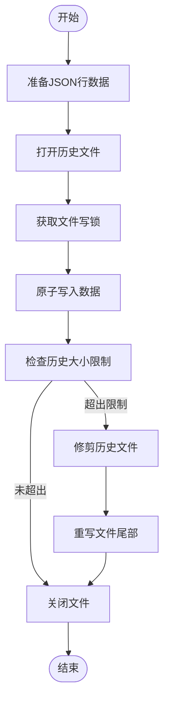
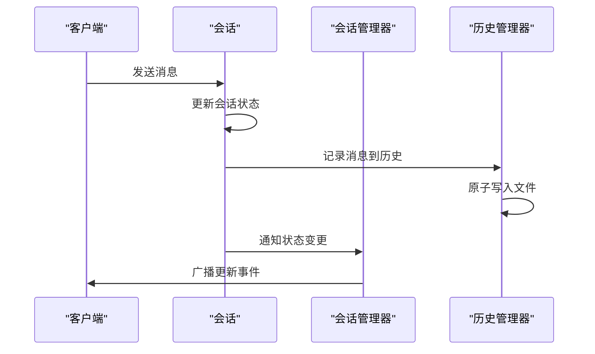
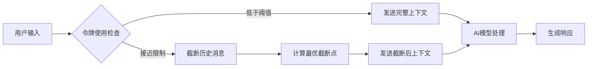

# 会话状态管理

<cite>
**本文档引用的文件**
- [session.rs](file://codex-rs\core\src\state\session.rs)
- [turn.rs](file://codex-rs\core\src\state\turn.rs)
- [message_history.rs](file://codex-rs\core\src\message_history.rs)
- [conversation_manager.rs](file://codex-rs\core\src\conversation_manager.rs)
- [codex.rs](file://codex-rs\core\src\codex.rs)
</cite>

## 目录
1. [引言](#引言)
2. [会话状态数据结构](#会话状态数据结构)
3. [回合状态管理](#回合状态管理)
4. [消息历史实现](#消息历史实现)
5. [状态变更与事件传播](#状态变更与事件传播)
6. [上下文管理策略](#上下文管理策略)
7. [状态序列化与持久化](#状态序列化与持久化)
8. [开发者最佳实践](#开发者最佳实践)

## 引言
Codex系统通过精心设计的状态管理机制来维护会话的完整性和一致性。该系统将状态分为会话级和回合级两个层次，分别处理长期和短期的状态信息。会话状态存储跨多个交互回合的持久化数据，而回合状态则管理单次交互过程中的临时信息。这种分层设计确保了系统既能保持上下文连贯性，又能高效处理并发操作。

## 会话状态数据结构
会话状态由`SessionState`结构体定义，包含会话配置、上下文管理和速率限制信息。该结构体在内存中组织为一个包含多个组件的复合结构，其中`session_configuration`存储会话的配置参数，`history`作为上下文管理器维护对话历史，`latest_rate_limits`跟踪最新的速率限制快照。

**会话状态组件**
- `session_configuration`: 会话配置信息
- `history`: 上下文管理器
- `latest_rate_limits`: 速率限制快照

**Section sources**
- [session.rs](file://codex-rs\core\src\state\session.rs#L13-L99)

## 回合状态管理
回合状态由`ActiveTurn`结构体管理，包含当前运行任务的元数据和回合状态。该结构体使用`IndexMap`存储运行中的任务，每个任务通过`RunningTask`结构体表示，包含完成通知、任务类型、取消令牌等信息。`TurnState`结构体维护回合级别的可变状态，包括待处理的审批和输入。

```mermaid
classDiagram
class ActiveTurn {
+tasks : IndexMap<String, RunningTask>
+turn_state : Arc<Mutex<TurnState>>
+add_task(task : RunningTask)
+remove_task(sub_id : &str)
+drain_tasks()
}
class RunningTask {
+done : Arc<Notify>
+kind : TaskKind
+task : Arc<dyn SessionTask>
+cancellation_token : CancellationToken
+handle : Arc<AbortOnDropHandle<()>>
+turn_context : Arc<TurnContext>
}
class TurnState {
+pending_approvals : HashMap<String, oneshot : : Sender<ReviewDecision>>
+pending_input : Vec<ResponseInputItem>
+insert_pending_approval(key : String, tx : oneshot : : Sender<ReviewDecision>)
+remove_pending_approval(key : &str)
+clear_pending()
+push_pending_input(input : ResponseInputItem)
+take_pending_input()
}
class TaskKind {
+Regular
+Review
+Compact
}
ActiveTurn --> RunningTask : "包含"
ActiveTurn --> TurnState : "包含"
```

**Diagram sources**
- [turn.rs](file://codex-rs\core\src\state\turn.rs#L19-L116)

**Section sources**
- [turn.rs](file://codex-rs\core\src\state\turn.rs#L1-L116)

## 消息历史实现
消息历史通过`message_history.rs`文件实现，采用JSON Lines格式存储在`~/.codex/history.jsonl`文件中。每个记录包含会话ID、时间戳和文本内容。系统使用原子写入保证并发写入的安全性，通过文件锁机制防止写入交错。历史文件的读取和写入都经过优化，确保高效处理大量历史记录。



**Diagram sources**
- [message_history.rs](file://codex-rs\core\src\message_history.rs#L1-L615)

**Section sources**
- [message_history.rs](file://codex-rs\core\src\message_history.rs#L1-L615)

## 状态变更与事件传播
状态变更通过事件驱动机制传播，当会话配置更新或新消息添加时触发相应事件。`ConversationManager`负责管理会话的生命周期，处理会话的创建、恢复和删除。状态变更通过`Mutex`和`RwLock`等同步原语保证线程安全，确保在并发环境下状态的一致性。



**Diagram sources**
- [conversation_manager.rs](file://codex-rs\core\src\conversation_manager.rs#L1-L412)
- [codex.rs](file://codex-rs\core\src\codex.rs#L805-L3293)

**Section sources**
- [conversation_manager.rs](file://codex-rs\core\src\conversation_manager.rs#L1-L412)

## 上下文管理策略
上下文管理策略通过`ContextManager`实现，决定哪些历史消息被发送给AI模型以保持上下文连贯性。系统根据模型的上下文窗口大小和令牌使用情况动态调整发送的历史消息数量。当令牌使用接近限制时，系统会自动截断较早的历史消息，确保不会超出模型的处理能力。



**Section sources**
- [session.rs](file://codex-rs\core\src\state\session.rs#L30-L84)

## 状态序列化与持久化
状态序列化与持久化通过JSON格式实现，确保会话状态在重启后的一致性。系统定期将内存中的状态写入磁盘，同时维护一个全局的、仅追加的消息历史文件。持久化过程采用原子操作，防止写入过程中断导致的数据损坏。历史文件的软硬容量限制机制确保磁盘空间不会无限增长。

**持久化特性**
- **原子写入**: 使用单个系统调用确保写入完整性
- **文件锁定**: 通过建议性文件锁防止并发写入冲突
- **容量限制**: 超出硬限制时自动修剪历史
- **权限控制**: 确保历史文件仅所有者可读写

**Section sources**
- [message_history.rs](file://codex-rs\core\src\message_history.rs#L70-L234)

## 开发者最佳实践
开发者在使用Codex状态管理系统时应遵循以下最佳实践：避免直接修改状态字段，而是通过提供的API方法进行操作；在处理并发访问时使用适当的同步机制；注意历史文件的容量限制，避免无限制增长；正确处理状态变更事件，确保UI及时更新。

**潜在陷阱**
- **并发写入冲突**: 多个进程同时写入历史文件
- **内存泄漏**: 未及时清理已完成的回合状态
- **令牌超限**: 忽略上下文窗口限制导致API错误
- **状态不一致**: 手动修改状态导致数据不一致

**Section sources**
- [session.rs](file://codex-rs\core\src\state\session.rs#L13-L99)
- [turn.rs](file://codex-rs\core\src\state\turn.rs#L19-L116)
- [message_history.rs](file://codex-rs\core\src\message_history.rs#L1-L615)