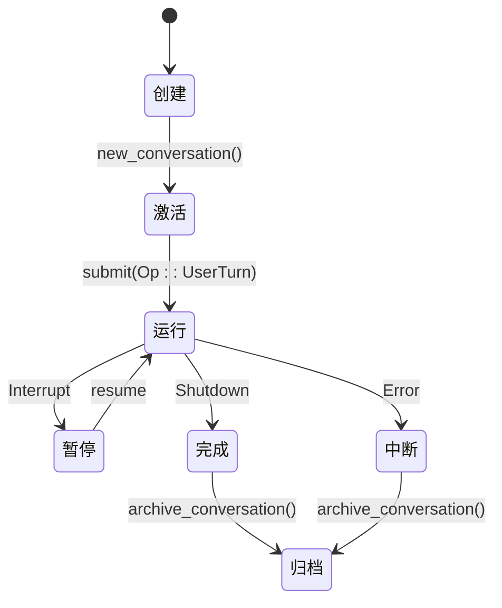
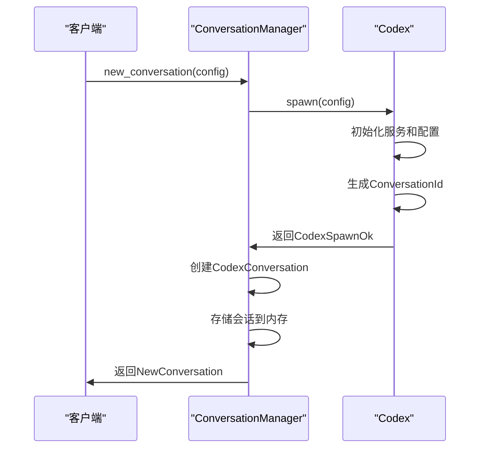
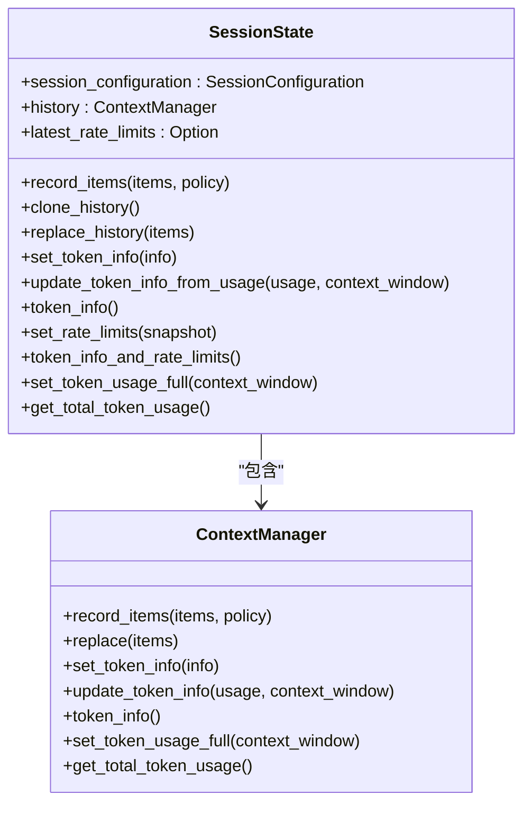
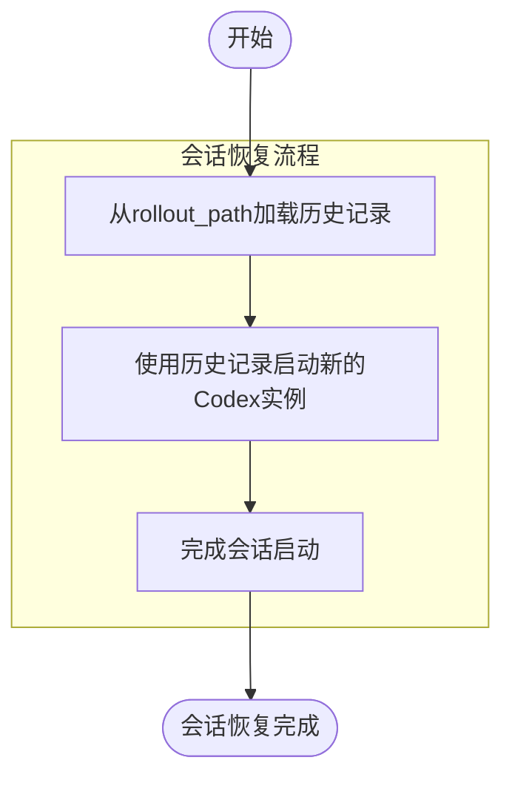
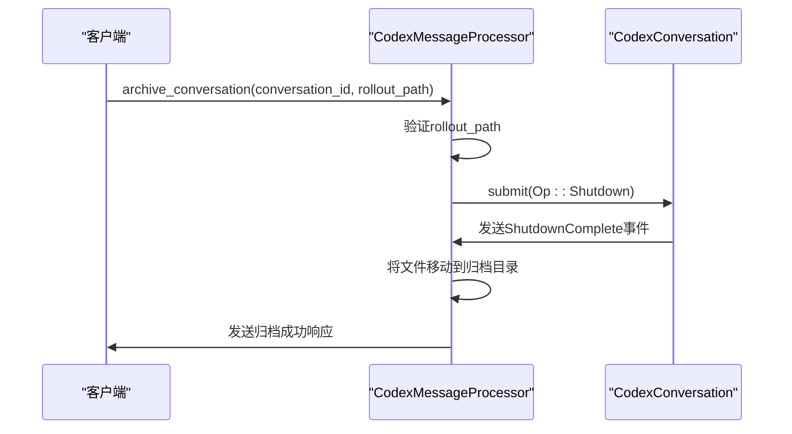
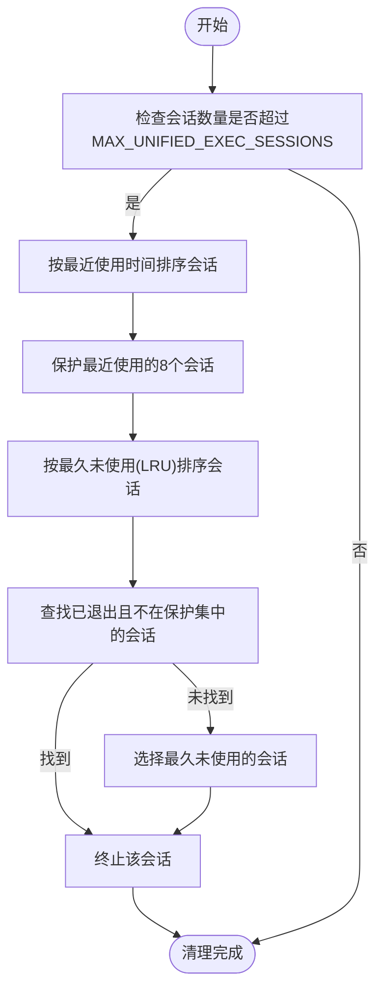
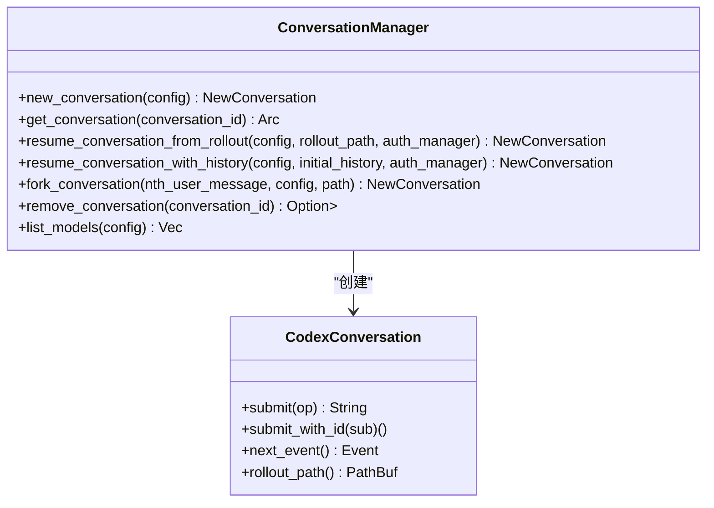

# 会话生命周期

<cite>
**本文档引用的文件**   
- [conversation_manager.rs](file://codex-rs\core\src\conversation_manager.rs)
- [session.rs](file://codex-rs\core\src\state\session.rs)
- [turn.rs](file://codex-rs\core\src\state\turn.rs)
- [codex.rs](file://codex-rs\core\src\codex.rs)
- [codex_conversation.rs](file://codex-rs\core\src\codex_conversation.rs)
- [codex_message_processor.rs](file://codex-rs\app-server\src\codex_message_processor.rs)
- [rollout\list.rs](file://codex-rs\core\src\rollout\list.rs)
- [unified_exec\session_manager.rs](file://codex-rs\core\src\unified_exec\session_manager.rs)
</cite>

## 目录
1. [会话生命周期概述](#会话生命周期概述)
2. [会话创建与激活](#会话创建与激活)
3. [会话状态表示](#会话状态表示)
4. [单轮对话管理](#单轮对话管理)
5. [会话持久化与恢复](#会话持久化与恢复)
6. [会话完成、中断与归档](#会话完成、中断与归档)
7. [会话超时与资源清理](#会话超时与资源清理)
8. [API控制会话生命周期](#api控制会话生命周期)

## 会话生命周期概述

Codex的会话生命周期管理是一个复杂而精密的系统，涵盖了从会话创建、激活、运行、暂停到最终归档的完整过程。该系统由多个核心组件协同工作，包括`ConversationManager`负责会话的全局管理，`SessionState`维护会话级别的持久状态，以及`ActiveTurn`管理单轮对话的执行状态。会话数据通过JSONL格式的文件持久化到磁盘，确保了会话状态的可靠存储和恢复。整个生命周期通过事件驱动的架构进行控制，开发者可以通过API接口精确地控制会话的启动、恢复和终止。

**会话生命周期状态图**


**Diagram sources**
- [conversation_manager.rs](file://codex-rs\core\src\conversation_manager.rs)
- [codex_message_processor.rs](file://codex-rs\app-server\src\codex_message_processor.rs)

## 会话创建与激活

会话的创建由`ConversationManager`类负责，该类是会话管理的核心组件。当调用`new_conversation`方法时，系统会启动一个新的会话流程。首先，`Codex::spawn`方法被调用，它负责初始化会话所需的各种服务和配置，包括认证管理器、模型管理器和技能管理器。会话创建成功后，系统会生成一个唯一的`ConversationId`，并触发`SessionConfiguredEvent`事件，这是会话生命周期中的第一个事件，标志着会话已成功配置并准备就绪。

会话的激活是通过提交`Op::UserTurn`操作来实现的。当用户提交新的输入时，系统会创建一个新的`TurnContext`，这个上下文包含了当前轮次的所有配置信息，如工作目录、审批策略、沙箱策略等。`new_turn_with_sub_id`方法负责处理这一过程，它会更新会话配置并创建新的执行上下文。如果配置更新成功，系统会进入新的对话轮次；如果失败，则会发送一个错误事件，通知客户端配置更新失败。



**Diagram sources**
- [conversation_manager.rs](file://codex-rs\core\src\conversation_manager.rs#L106-L134)
- [codex.rs](file://codex-rs\core\src\codex.rs#L841-L878)

**Section sources**
- [conversation_manager.rs](file://codex-rs\core\src\conversation_manager.rs#L106-L134)
- [codex.rs](file://codex-rs\core\src\codex.rs#L841-L878)

## 会话状态表示

会话状态由`SessionState`结构体表示，它封装了会话级别的所有持久化状态。该结构体包含三个主要部分：`session_configuration`、`history`和`latest_rate_limits`。`session_configuration`存储了会话的配置信息，如使用的模型、审批策略、沙箱策略和工作目录等。`history`是一个`ContextManager`实例，负责管理对话历史记录，包括用户消息、AI响应和系统事件。`latest_rate_limits`则存储了最新的速率限制快照，用于监控和控制API调用频率。

`SessionState`提供了多种方法来操作和查询会话状态。`record_items`方法用于将新的响应项记录到历史记录中，并根据指定的截断策略进行管理。`clone_history`和`replace_history`方法允许对历史记录进行复制和替换操作。`update_token_info_from_usage`方法根据最新的令牌使用情况更新会话的令牌信息，这对于管理模型的上下文窗口和成本控制至关重要。`set_rate_limits`方法用于更新速率限制信息，并通过`merge_rate_limit_fields`函数智能地合并新旧快照，确保关键信息（如信用额度和计划类型）不会丢失。



**Diagram sources**
- [session.rs](file://codex-rs\core\src\state\session.rs#L12-L84)
- [context_manager.rs](file://codex-rs\core\src\context_manager\mod.rs)

**Section sources**
- [session.rs](file://codex-rs\core\src\state\session.rs#L12-L84)

## 单轮对话管理

单轮对话的管理由`ActiveTurn`结构体负责，它代表了当前正在执行的对话轮次。`ActiveTurn`包含两个核心组件：`tasks`和`turn_state`。`tasks`是一个`IndexMap`，用于存储当前轮次中所有正在运行的任务，每个任务都有一个唯一的子ID作为键。`turn_state`是一个`Arc<Mutex<TurnState>>`，用于管理轮次级别的临时状态，如待处理的审批请求和用户输入。

`RunningTask`结构体表示一个正在执行的任务，它包含了任务完成通知、任务类型、任务实例、取消令牌、中止句柄和轮次上下文。任务类型`TaskKind`枚举了三种可能的值：`Regular`（常规任务）、`Review`（审查任务）和`Compact`（压缩任务）。`ActiveTurn`提供了`add_task`、`remove_task`和`drain_tasks`等方法来管理任务的生命周期。当一个任务完成时，`on_task_finished`方法会被调用，它会从`tasks`映射中移除该任务，并在所有任务完成后关闭统一执行会话。

`TurnState`结构体管理轮次级别的临时状态，包括`pending_approvals`和`pending_input`。`pending_approvals`是一个哈希映射，用于存储待处理的审批请求，键是审批的唯一标识符，值是用于发送审批决策的单次发送通道。`pending_input`是一个向量，用于存储待处理的用户输入。`clear_pending`方法用于清除所有待处理的审批和输入，`push_pending_input`和`take_pending_input`方法用于添加和获取待处理的输入。

```mermaid
classDiagram
class ActiveTurn {
+tasks : IndexMap<String, RunningTask>
+turn_state : Arc<Mutex<TurnState>>
+add_task(task)
+remove_task(sub_id)
+drain_tasks()
}
class RunningTask {
+done : Arc<Notify>
+kind : TaskKind
+task : Arc<dyn SessionTask>
+cancellation_token : CancellationToken
+handle : Arc<AbortOnDropHandle<()>>
+turn_context : Arc<TurnContext>
}
class TurnState {
+pending_approvals : HashMap<String, oneshot : : Sender<ReviewDecision>>
+pending_input : Vec<ResponseInputItem>
+insert_pending_approval(key, tx)
+remove_pending_approval(key)
+clear_pending()
+push_pending_input(input)
+take_pending_input()
}
class TaskKind {
+Regular
+Review
+Compact
}
ActiveTurn --> RunningTask : "包含"
ActiveTurn --> TurnState : "包含"
RunningTask --> TaskKind : "引用"
```

**Diagram sources**
- [turn.rs](file://codex-rs\core\src\state\turn.rs#L19-L115)
- [tasks\mod.rs](file://codex-rs\core\src\tasks\mod.rs)

**Section sources**
- [turn.rs](file://codex-rs\core\src\state\turn.rs#L19-L115)

## 会话持久化与恢复

会话的持久化是通过`RolloutRecorder`组件实现的，它将会话的完整历史记录以JSONL格式写入磁盘文件。每个会话都有一个唯一的`rollout_path`，该路径指向存储会话数据的文件。文件名遵循`rollout-YYYY-MM-DDThh-mm-ss-<uuid>.jsonl`的格式，其中包含会话创建的时间戳和唯一标识符。这种命名约定使得会话文件可以按时间顺序轻松地进行排序和查找。

会话的恢复是通过`resume_conversation_from_rollout`方法实现的。该方法首先调用`RolloutRecorder::get_rollout_history`从指定的`rollout_path`读取会话历史记录。然后，它使用`Codex::spawn`方法创建一个新的`Codex`实例，并将读取到的历史记录作为`InitialHistory`参数传递。这使得新创建的会话能够从之前的状态继续执行，仿佛从未中断过。`fork_conversation`方法提供了一种分叉会话的能力，它允许开发者从会话历史中的某个特定点创建一个新的分支会话。



**Diagram sources**
- [conversation_manager.rs](file://codex-rs\core\src\conversation_manager.rs#L182-L212)
- [rollout\list.rs](file://codex-rs\core\src\rollout\list.rs#L36-L468)

**Section sources**
- [conversation_manager.rs](file://codex-rs\core\src\conversation_manager.rs#L182-L212)

## 会话完成、中断与归档

会话的完成或中断是通过`Op::Shutdown`操作触发的。当客户端提交此操作时，系统会向会话发送一个关闭请求。`archive_conversation`方法负责处理会话的归档流程。首先，它会验证`rollout_path`是否位于会话目录下，以确保安全性。然后，它会提交`Op::Shutdown`操作，并等待`ShutdownComplete`事件，以确保会话已完全关闭。一旦会话关闭，系统会将对应的JSONL文件从活动会话目录移动到归档会话目录，完成归档过程。

会话可能因多种原因被标记为完成或中断。正常完成是通过显式调用`Shutdown`操作实现的。中断可能由多种因素引起，包括用户中断（通过`InterruptConversation`请求）、系统错误或超时。`interrupt_conversation`方法处理用户中断请求，它会向会话提交`Op::Interrupt`操作，并在收到`TurnAborted`事件后回复客户端。会话ID是恢复会话的关键，客户端可以通过`get_conversation`方法使用会话ID从内存中获取会话引用，或通过`resume_conversation_from_rollout`方法从磁盘恢复会话。



**Diagram sources**
- [codex_message_processor.rs](file://codex-rs\app-server\src\codex_message_processor.rs#L2384-L2548)
- [conversation_manager.rs](file://codex-rs\core\src\conversation_manager.rs#L218-L223)

**Section sources**
- [codex_message_processor.rs](file://codex-rs\app-server\src\codex_message_processor.rs#L2384-L2548)

## 会话超时与资源清理

会话的超时和资源清理机制主要由`UnifiedExecSessionManager`负责。该组件维护一个会话存储，用于跟踪所有活跃的执行会话。为了防止资源耗尽，系统实现了会话清理策略。`prune_sessions_if_needed`方法会检查会话数量是否超过最大限制（`MAX_UNIFIED_EXEC_SESSIONS`），如果超过，则调用`session_id_to_prune_from_meta`方法选择一个会话进行清理。

会话清理策略优先选择已退出的会话，并保护最近使用的8个会话不被清理。`session_id_to_prune_from_meta`方法首先按最近使用时间对会话进行排序，确定受保护的会话集。然后，它按最久未使用（LRU）顺序对会话进行排序，并优先选择已退出且不在保护集中的会话。如果没有已退出的会话，则选择最久未使用的会话进行清理。`terminate_all_sessions`方法用于终止所有会话，它会遍历会话存储中的所有条目，调用`terminate`方法来清理资源。



**Diagram sources**
- [unified_exec\session_manager.rs](file://codex-rs\core\src\unified_exec\session_manager.rs#L585-L633)
- [unified_exec\session_manager.rs](file://codex-rs\core\src\unified_exec\session_manager.rs#L635-L647)

**Section sources**
- [unified_exec\session_manager.rs](file://codex-rs\core\src\unified_exec\session_manager.rs#L585-L647)

## API控制会话生命周期

开发者可以通过一系列API来控制会话的生命周期。`new_conversation` API用于启动一个新会话，它返回一个包含会话ID、会话引用和初始配置事件的`NewConversation`对象。`get_conversation` API允许通过会话ID从内存中获取现有的会话引用。`resume_conversation_from_rollout` API用于从磁盘上的持久化文件恢复一个会话，这对于在应用程序重启后恢复用户工作流至关重要。

`fork_conversation` API提供了一种强大的功能，允许从会话历史中的特定点创建一个新的分支会话。这在需要探索不同解决方案路径时非常有用。`remove_conversation` API用于从内存中移除会话引用，尽管会话对象可能由于其他引用而继续存在。`archive_conversation` API用于将会话从活动状态移动到归档状态，这通常在会话完成或用户明确请求归档时调用。



**Diagram sources**
- [conversation_manager.rs](file://codex-rs\core\src\conversation_manager.rs#L106-L264)
- [codex_conversation.rs](file://codex-rs\core\src\codex_conversation.rs#L8-L40)

**Section sources**
- [conversation_manager.rs](file://codex-rs\core\src\conversation_manager.rs#L106-L264)