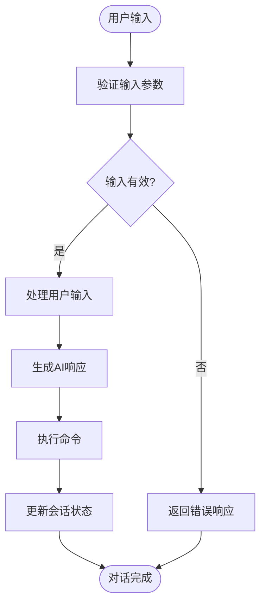
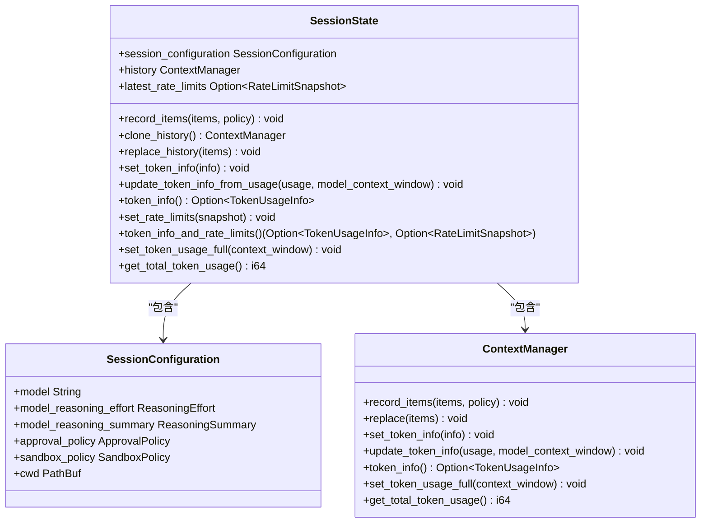
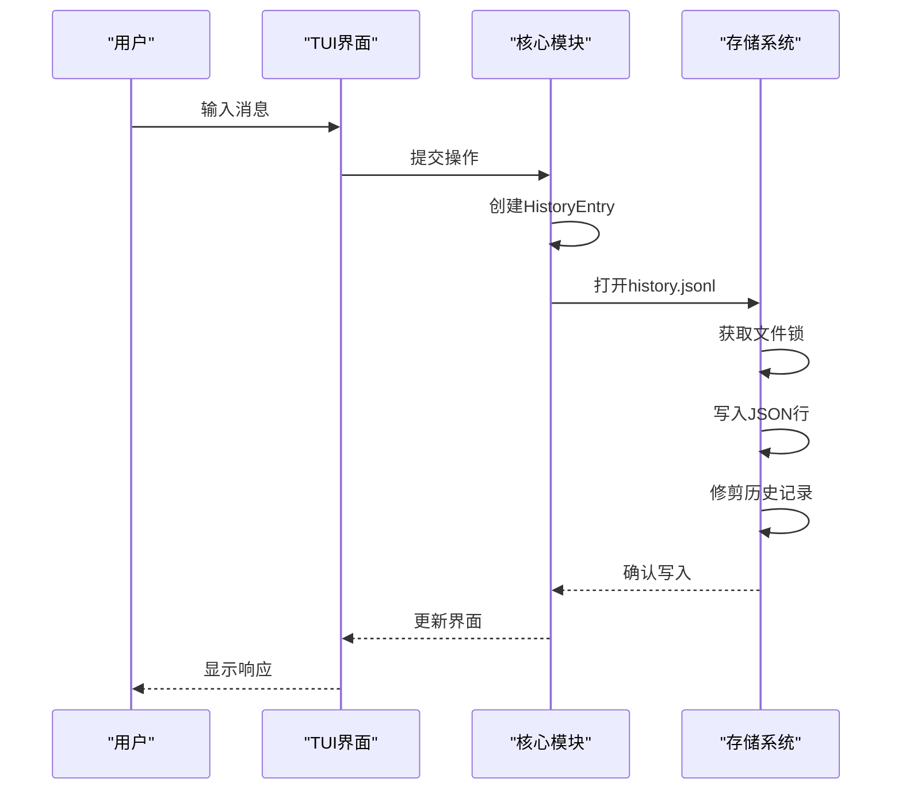
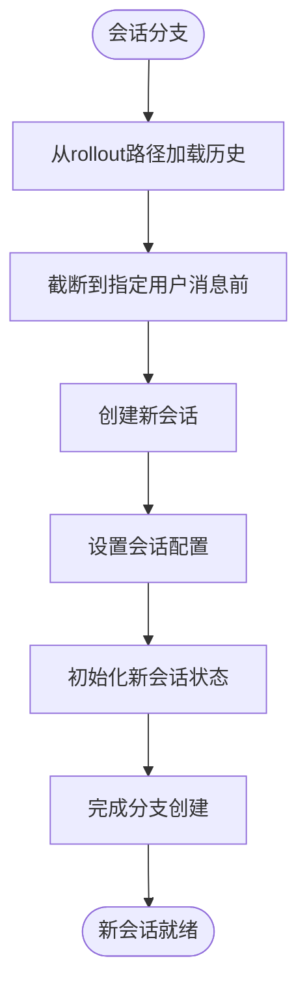
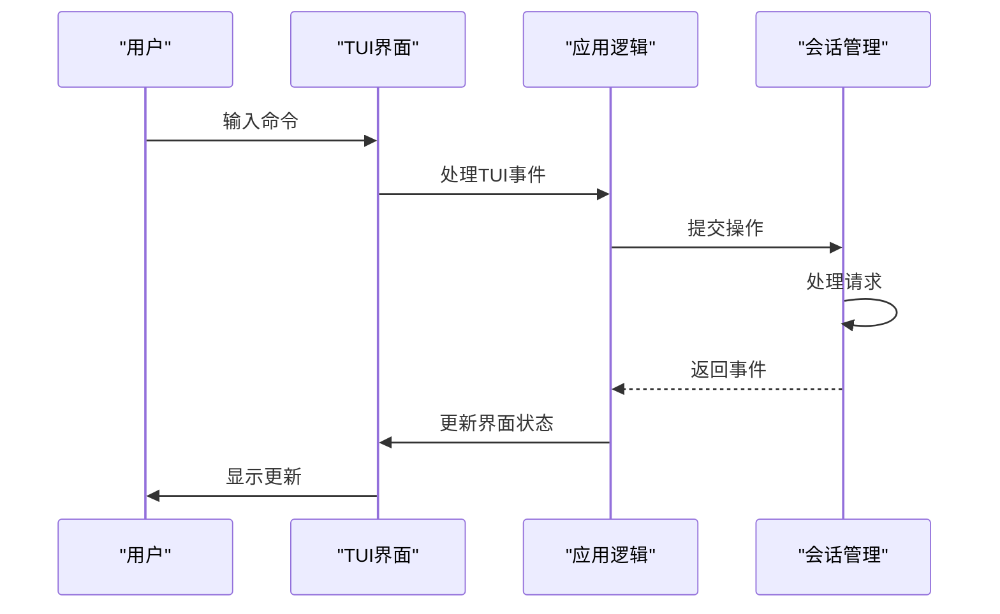

# 会话管理

<cite>
**本文档中引用的文件**  
- [conversation_manager.rs](file://codex-rs\core\src\conversation_manager.rs)
- [session.rs](file://codex-rs\core\src\state\session.rs)
- [turn.rs](file://codex-rs\core\src\state\turn.rs)
- [message_history.rs](file://codex-rs\core\src\message_history.rs)
- [codex_conversation.rs](file://codex-rs\core\src\codex_conversation.rs)
- [truncate.rs](file://codex-rs\core\src\truncate.rs)
- [app.rs](file://codex-rs\tui2\src\app.rs)
- [resume_picker.rs](file://codex-rs\tui2\src\resume_picker.rs)
- [app_backtrack.rs](file://codex-rs\tui2\src\app_backtrack.rs)
- [codex.rs](file://codex-rs\core\src\codex.rs)
- [tui_viewport_and_history.md](file://codex-rs\tui2\docs\tui_viewport_and_history.md)
- [codex_message_processor.rs](file://codex-rs\app-server\src\codex_message_processor.rs)
</cite>

## 目录
1. [引言](#引言)
2. [会话生命周期管理](#会话生命周期管理)
3. [单轮对话流程](#单轮对话流程)
4. [会话状态表示](#会话状态表示)
5. [消息历史与上下文感知](#消息历史与上下文感知)
6. [高级会话功能](#高级会话功能)
7. [TUI界面集成](#tui界面集成)
8. [开发者API参考](#开发者api参考)

## 引言
会话（Session）是Codex系统中用户与AI交互的基本单元。每个会话代表一个独立的对话流程，从用户输入开始，经过AI处理和响应，最终完成命令执行。会话管理器负责创建、加载和持久化会话，确保对话状态在内存和磁盘之间正确同步。本文档详细解释会话管理的核心机制，包括会话的创建、加载、持久化以及状态管理。

## 会话生命周期管理
会话生命周期由`ConversationManager`负责管理，该组件负责创建新会话、恢复现有会话以及维护会话在内存中的状态。会话通过`conversation_manager.rs`中的`ConversationManager`结构体进行管理，该结构体维护一个`HashMap`来存储所有活动的会话。

会话的创建通过`new_conversation`方法实现，该方法会初始化一个新的`Codex`实例并返回`NewConversation`结构体，其中包含会话ID、会话引用和会话配置事件。会话的恢复通过`resume_conversation_from_rollout`方法实现，该方法从指定的rollout路径加载会话历史并重新创建会话状态。

**Section sources**
- [conversation_manager.rs](file://codex-rs\core\src\conversation_manager.rs#L106-L255)

## 单轮对话流程
单轮对话（Turn）是从用户输入到AI响应再到命令执行的完整流程。`ActiveTurn`结构体在`turn.rs`中定义，用于表示当前运行的对话轮次的元数据。每个`ActiveTurn`包含一个任务映射和一个`TurnState`，用于跟踪当前轮次的状态。

对话流程从用户输入开始，系统会创建一个新的`ActiveTurn`实例，并将用户输入添加到`pending_input`队列中。AI处理完成后，系统会生成响应并更新会话状态。命令执行阶段，系统会根据AI的决策执行相应的操作，并将结果反馈给用户。

**Diagram sources**
- [turn.rs](file://codex-rs\core\src\state\turn.rs#L18-L116)

**Section sources**
- [turn.rs](file://codex-rs\core\src\state\turn.rs#L18-L116)

## 会话状态表示
会话状态在内存中通过`SessionState`结构体表示，该结构体定义在`state/session.rs`中。`SessionState`包含会话配置、历史记录和最新的速率限制快照。会话配置包括模型选择、推理努力程度、审批策略等设置。

历史记录通过`ContextManager`管理，该组件负责记录和检索对话历史。速率限制快照用于跟踪API调用的使用情况，确保不会超出配额。`SessionState`提供了多种方法来更新和查询会话状态，包括记录项目、更新令牌信息和设置速率限制。

**Diagram sources**
- [session.rs](file://codex-rs\core\src\state\session.rs#L12-L99)

**Section sources**
- [session.rs](file://codex-rs\core\src\state\session.rs#L12-L99)

## 消息历史与上下文感知
消息历史通过`message_history.rs`中的持久化层管理，历史记录存储在`~/.codex/history.jsonl`文件中，每行包含一个JSON对象。系统使用原子写入确保并发写入时的数据完整性，通过`O_APPEND`标志和文件锁机制防止数据交错。

消息历史的管理包括追加条目、强制历史限制和查找历史条目。追加条目时，系统会序列化`HistoryEntry`并写入文件，同时确保文件权限为`0o600`。强制历史限制会在文件超过最大字节数时修剪最旧的行，保留最新的条目。查找历史条目时，系统会验证文件标识符并返回指定偏移量的条目。

**Diagram sources**
- [message_history.rs](file://codex-rs\core\src\message_history.rs#L1-L615)

**Section sources**
- [message_history.rs](file://codex-rs\core\src\message_history.rs#L1-L615)

## 高级会话功能
Codex提供了会话恢复、归档和分支等高级功能。会话恢复通过`resume_conversation_from_rollout`方法实现，该方法从指定路径加载会话历史并重新创建会话。会话归档通过`archive_conversation`方法实现，该方法将会话文件移动到归档目录。

会话分支（fork）功能允许用户从现有会话的特定位置创建新会话。`fork_conversation`方法会计算指定位置之前的历史记录，并以此为基础创建新会话。这在需要探索不同解决方案路径时非常有用。

**Diagram sources**
- [conversation_manager.rs](file://codex-rs\core\src\conversation_manager.rs#L229-L255)
- [codex_message_processor.rs](file://codex-rs\app-server\src\codex_message_processor.rs#L2384-L2548)

**Section sources**
- [conversation_manager.rs](file://codex-rs\core\src\conversation_manager.rs#L229-L255)
- [codex_message_processor.rs](file://codex-rs\app-server\src\codex_message_processor.rs#L2384-L2548)

## TUI界面集成
TUI（文本用户界面）通过`app.rs`中的`App`结构体与会话管理系统集成。TUI负责处理用户输入、显示会话状态和渲染界面。当用户与TUI交互时，事件会被传递给`handle_tui_event`方法进行处理。

会话状态的变化会实时反映在TUI界面上。例如，当AI生成响应时，TUI会更新聊天窗口；当命令执行时，TUI会显示执行结果。TUI还支持会话的挂起和恢复，确保用户可以在不同会话之间切换。

**Diagram sources**
- [app.rs](file://codex-rs\tui2\src\app.rs#L591-L598)
- [tui_viewport_and_history.md](file://codex-rs\tui2\docs\tui_viewport_and_history.md#L249-L279)

**Section sources**
- [app.rs](file://codex-rs\tui2\src\app.rs#L591-L598)
- [tui_viewport_and_history.md](file://codex-rs\tui2\docs\tui_viewport_and_history.md#L249-L279)

## 开发者API参考
开发者可以通过`ConversationManager`提供的API来管理会话生命周期。主要API包括：

- `new_conversation`: 创建新会话
- `get_conversation`: 获取现有会话
- `resume_conversation_from_rollout`: 从rollout路径恢复会话
- `remove_conversation`: 移除会话
- `fork_conversation`: 分支会话

会话配置通过`Config`结构体进行管理，开发者可以自定义模型、推理努力程度、审批策略等参数。状态管理API允许开发者查询和更新会话状态，包括令牌使用情况和速率限制信息。

**Section sources**
- [conversation_manager.rs](file://codex-rs\core\src\conversation_manager.rs#L106-L264)
- [codex_conversation.rs](file://codex-rs\core\src\codex_conversation.rs#L8-L40)
- [codex.rs](file://codex-rs\core\src\codex.rs#L428-L457)