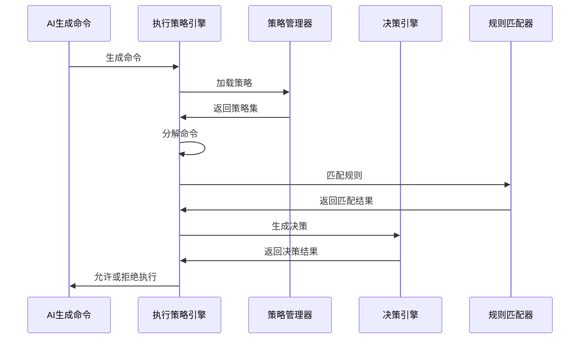
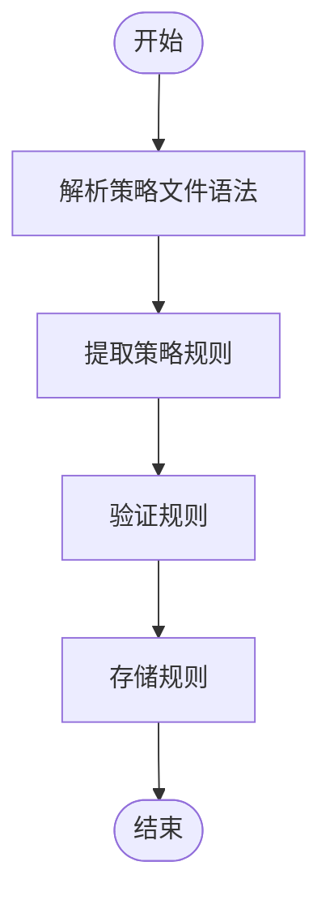
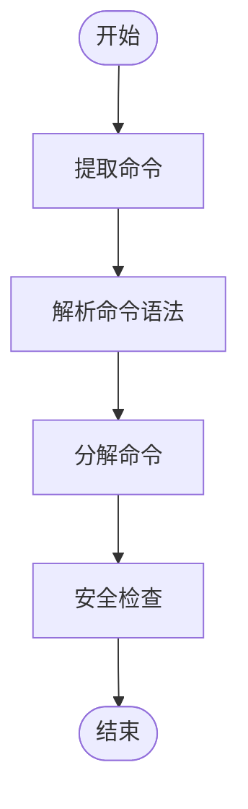
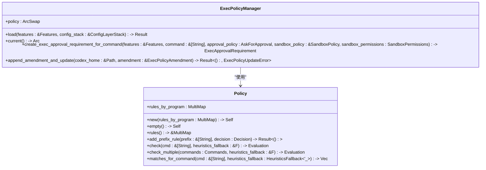
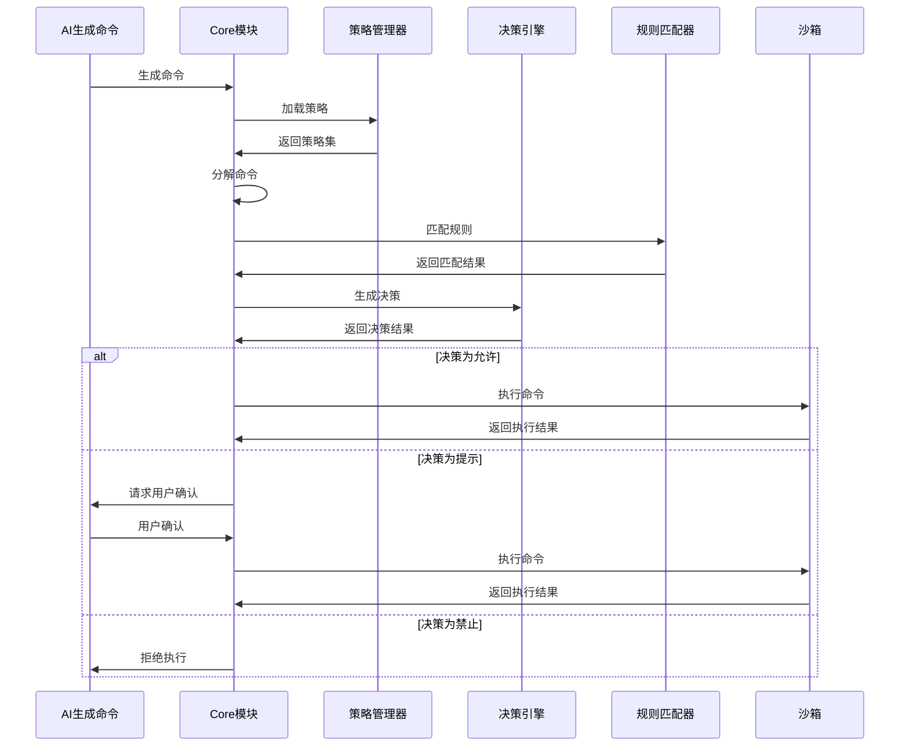
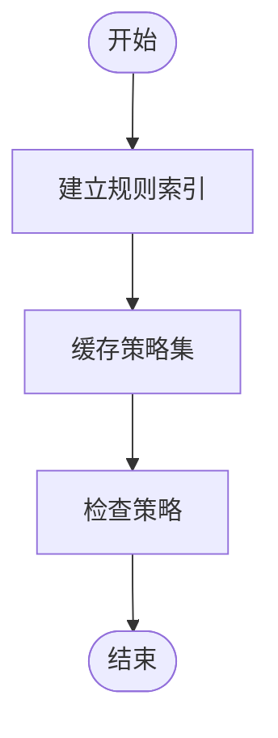
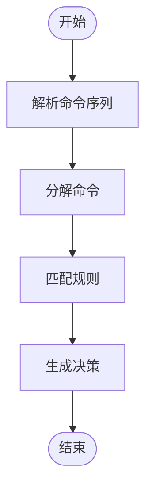

# 执行引擎

<cite>
**本文档引用的文件**   
- [lib.rs](file://codex-rs\execpolicy\src\lib.rs)
- [decision.rs](file://codex-rs\execpolicy\src\decision.rs)
- [policy.rs](file://codex-rs\execpolicy\src\policy.rs)
- [rule.rs](file://codex-rs\execpolicy\src\rule.rs)
- [parser.rs](file://codex-rs\execpolicy\src\parser.rs)
- [amend.rs](file://codex-rs\execpolicy\src\amend.rs)
- [exec_policy.rs](file://codex-rs\core\src\exec_policy.rs)
- [bash.rs](file://codex-rs\core\src\bash.rs)
- [is_dangerous_command.rs](file://codex-rs\core\src\command_safety\is_dangerous_command.rs)
- [sandboxing.rs](file://codex-rs\core\src\tools\sandboxing.rs)
- [parse_command.rs](file://codex-rs\core\src\parse_command.rs)
</cite>

## 目录
1. [引言](#引言)
2. [执行策略引擎核心架构](#执行策略引擎核心架构)
3. [策略决策流程](#策略决策流程)
4. [策略规则匹配与解析](#策略规则匹配与解析)
5. [命令解析与分解](#命令解析与分解)
6. [策略引擎与核心模块集成](#策略引擎与核心模块集成)
7. [执行流程时序图](#执行流程时序图)
8. [性能优化措施](#性能优化措施)
9. [复杂命令处理](#复杂命令处理)
10. [结论](#结论)

## 引言
Codex执行策略引擎是一个关键的安全组件，负责拦截和评估AI生成的命令执行请求。该引擎通过`execpolicy`库实现，该库提供了一套完整的策略定义、解析和决策机制。引擎与`core`模块紧密集成，确保所有命令在执行前都经过严格的策略检查。本文档将深入探讨执行策略引擎的内部工作原理，包括其核心执行流程、决策算法、性能优化措施以及如何处理复杂的嵌套命令和管道操作。

## 执行策略引擎核心架构
执行策略引擎的核心架构由`execpolicy`库和`core`模块中的`exec_policy.rs`文件共同构成。`execpolicy`库提供了策略定义、解析和决策的核心功能，而`core`模块中的`exec_policy.rs`文件则负责将这些功能集成到Codex的整体执行流程中。

引擎的核心组件包括：
- **策略解析器** (`PolicyParser`)：负责解析策略文件，将策略规则加载到内存中。
- **策略管理器** (`ExecPolicyManager`)：管理当前的策略集，提供策略检查和更新的接口。
- **决策引擎** (`Decision`)：根据策略规则和启发式规则，决定命令是否允许执行。
- **规则匹配器** (`RuleMatch`)：负责将命令与策略规则进行匹配，确定匹配的规则和决策。

这些组件协同工作，确保所有命令在执行前都经过严格的策略检查，从而保障系统的安全性和稳定性。

**Section sources**
- [lib.rs](file://codex-rs\execpolicy\src\lib.rs#L1-L21)
- [exec_policy.rs](file://codex-rs\core\src\exec_policy.rs#L86-L195)

## 策略决策流程
策略决策流程是执行策略引擎的核心，它决定了AI生成的命令是否可以执行。该流程从`execpolicy`库的`lib.rs`文件中的主接口开始，通过`decision.rs`中的决策算法进行评估。

决策流程主要包括以下几个步骤：
1. **策略加载**：`ExecPolicyManager`从配置文件中加载策略规则，构建一个策略集。
2. **命令解析**：将AI生成的命令分解为程序名和参数列表。
3. **规则匹配**：将分解后的命令与策略规则进行匹配，查找匹配的规则。
4. **决策生成**：根据匹配的规则和启发式规则，生成最终的决策（允许、提示或禁止）。
5. **执行检查**：根据决策结果，决定是否允许命令执行。

**Diagram sources **
- [lib.rs](file://codex-rs\execpolicy\src\lib.rs#L1-L21)
- [decision.rs](file://codex-rs\execpolicy\src\decision.rs#L7-L27)
- [exec_policy.rs](file://codex-rs\core\src\exec_policy.rs#L109-L163)

## 策略规则匹配与解析
策略规则匹配与解析是执行策略引擎的关键功能，它确保命令能够与策略规则进行高效匹配。`execpolicy`库中的`parser.rs`文件负责解析策略文件，将策略规则转换为内存中的数据结构。

策略规则的解析过程包括：
1. **语法解析**：使用`tree-sitter`库解析策略文件的语法结构。
2. **规则提取**：从解析后的语法树中提取策略规则。
3. **规则验证**：验证提取的规则是否符合策略定义的语法和语义要求。
4. **规则存储**：将验证后的规则存储在策略集中，供后续匹配使用。

规则匹配过程则通过`rule.rs`文件中的`RuleMatch`结构体实现，它负责将命令与策略规则进行匹配，确定匹配的规则和决策。

**Diagram sources **
- [parser.rs](file://codex-rs\execpolicy\src\parser.rs#L28-L260)
- [rule.rs](file://codex-rs\execpolicy\src\rule.rs#L61-L71)

## 命令解析与分解
命令解析与分解是执行策略引擎的重要环节，它将AI生成的命令分解为程序名和参数列表，以便与策略规则进行匹配。`core`模块中的`bash.rs`文件负责解析bash命令，将复杂的命令序列分解为简单的命令。

命令解析过程包括：
1. **命令提取**：从AI生成的命令中提取出实际的命令部分。
2. **语法解析**：使用`tree-sitter`库解析命令的语法结构。
3. **命令分解**：将解析后的命令分解为程序名和参数列表。
4. **安全检查**：对分解后的命令进行安全检查，确保没有危险的命令。

**Diagram sources **
- [bash.rs](file://codex-rs\core\src\bash.rs#L115-L120)
- [parse_command.rs](file://codex-rs\core\src\parse_command.rs#L30-L41)

## 策略引擎与核心模块集成
策略引擎与`core`模块的集成是通过`exec_policy.rs`文件实现的。该文件中的`ExecPolicyManager`结构体负责管理策略集，并提供策略检查和更新的接口。

集成过程包括：
1. **策略加载**：`ExecPolicyManager`从配置文件中加载策略规则，构建一个策略集。
2. **策略检查**：在命令执行前，调用`create_exec_approval_requirement_for_command`方法进行策略检查。
3. **策略更新**：根据用户反馈，调用`append_amendment_and_update`方法更新策略集。

**Diagram sources **
- [exec_policy.rs](file://codex-rs\core\src\exec_policy.rs#L86-L195)
- [policy.rs](file://codex-rs\execpolicy\src\policy.rs#L17-L136)

## 执行流程时序图
执行流程时序图展示了从AI生成命令到策略检查通过或拒绝的完整路径。该图详细描述了各个组件之间的交互过程。

**Diagram sources **
- [exec_policy.rs](file://codex-rs\core\src\exec_policy.rs#L109-L163)
- [sandboxing.rs](file://codex-rs\core\src\tools\sandboxing.rs#L89-L108)

## 性能优化措施
执行策略引擎采用了多种性能优化措施，以确保在高并发场景下仍能高效运行。这些措施包括规则索引和缓存机制。

### 规则索引
规则索引通过`MultiMap`数据结构实现，将规则按程序名进行索引，从而在匹配时能够快速定位到相关的规则。

### 缓存机制
缓存机制通过`ArcSwap`数据结构实现，将策略集存储在原子引用计数的交换器中，确保在多线程环境下能够高效地共享和更新策略集。

**Diagram sources **
- [policy.rs](file://codex-rs\execpolicy\src\policy.rs#L17-L136)
- [exec_policy.rs](file://codex-rs\core\src\exec_policy.rs#L86-L195)

## 复杂命令处理
执行策略引擎能够处理复杂的嵌套命令和管道操作。`bash.rs`文件中的`try_parse_word_only_commands_sequence`函数负责解析复杂的bash命令序列，将其分解为简单的命令。

复杂命令处理过程包括：
1. **命令序列解析**：解析复杂的命令序列，提取出每个简单的命令。
2. **命令分解**：将每个简单的命令分解为程序名和参数列表。
3. **规则匹配**：将分解后的命令与策略规则进行匹配。
4. **决策生成**：根据匹配结果生成最终的决策。

**Diagram sources **
- [bash.rs](file://codex-rs\core\src\bash.rs#L29-L95)
- [is_dangerous_command.rs](file://codex-rs\core\src\command_safety\is_dangerous_command.rs#L44-L65)

## 结论
Codex执行策略引擎通过`execpolicy`库和`core`模块的紧密集成，实现了对AI生成命令的高效、安全的策略检查。引擎的核心执行流程从`lib.rs`中的主接口开始，通过`decision.rs`中的决策算法进行评估，最终与`core`模块中的`exec_policy.rs`文件集成，拦截和评估AI生成的命令执行请求。引擎能够将命令行分解为程序名和参数列表，并与策略规则进行高效匹配。通过规则索引和缓存机制等性能优化措施，引擎能够在高并发场景下仍保持高效运行。此外，引擎还能够处理复杂的嵌套命令和管道操作，确保所有命令在执行前都经过严格的策略检查。