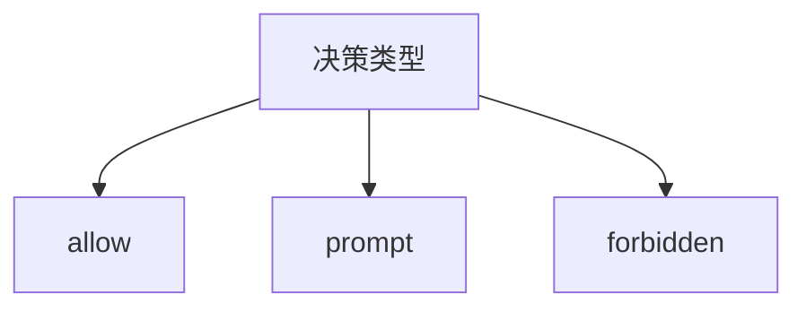
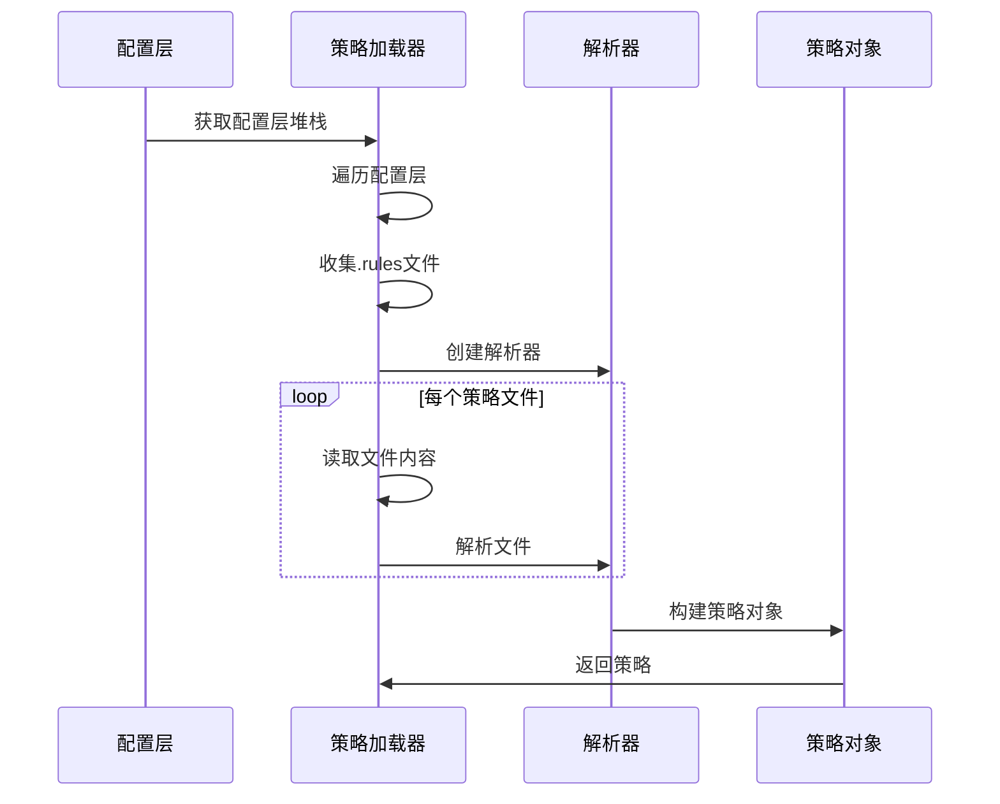
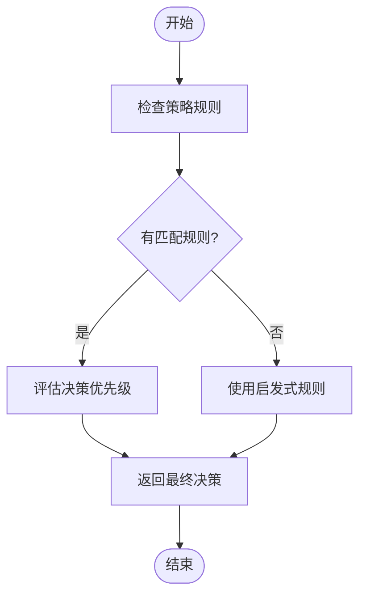
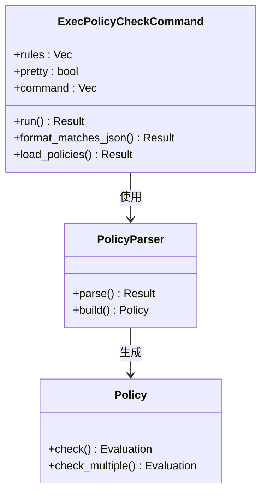

# 执行策略

<cite>
**本文档中引用的文件**  
- [example.codexpolicy](file://codex-rs/execpolicy/examples/example.codexpolicy)
- [lib.rs](file://codex-rs/execpolicy/src/lib.rs)
- [parser.rs](file://codex-rs/execpolicy/src/parser.rs)
- [policy.rs](file://codex-rs/execpolicy/src/policy.rs)
- [rule.rs](file://codex-rs/execpolicy/src/rule.rs)
- [decision.rs](file://codex-rs/execpolicy/src/decision.rs)
- [execpolicycheck.rs](file://codex-rs/execpolicy/src/execpolicycheck.rs)
- [main.rs](file://codex-rs/execpolicy/src/main.rs)
- [exec_policy.rs](file://codex-rs/core/src/exec_policy.rs)
- [amend.rs](file://codex-rs/execpolicy/src/amend.rs)
</cite>

## 目录
1. [简介](#简介)
2. [策略语言语法](#策略语言语法)
3. [策略加载与解析流程](#策略加载与解析流程)
4. [策略执行决策逻辑](#策略执行决策逻辑)
5. [实际策略配置示例](#实际策略配置示例)
6. [策略测试工具](#策略测试工具)
7. [开发者指南](#开发者指南)

## 简介
Codex执行策略（execpolicy）系统通过声明式策略文件控制AI可以执行的命令。该系统使用基于前缀匹配的规则引擎，结合允许（allow）、拒绝（forbidden）和提示（prompt）三种决策类型，实现对命令执行的精细控制。策略文件采用类似Starlark的语法，支持复杂的模式匹配和条件判断。

**Section sources**
- [lib.rs](file://codex-rs/execpolicy/src/lib.rs#L1-L21)
- [exec_policy.rs](file://codex-rs/core/src/exec_policy.rs#L1-L800)

## 策略语言语法
执行策略语言基于声明式语法，主要通过`prefix_rule`函数定义规则。每个规则包含模式匹配、决策类型和正负匹配示例。

### 规则结构
策略规则的基本结构如下：
```rust
prefix_rule(
    pattern = ["command", "subcommand"],
    decision = "allow",
    match = [
        ["command", "subcommand", "arg1"],
        "command subcommand arg2"
    ],
    not_match = [
        ["command", "subcommand", "--dangerous"]
    ]
)
```

### 模式匹配
- **pattern**: 定义命令前缀模式，支持字符串列表
- **单个字符串**: `["git"]` 匹配以git开头的命令
- **参数匹配**: `["git", "push"]` 匹配git push命令
- **替代模式**: 支持使用列表表示多个可选匹配

### 决策类型


**Diagram sources**
- [decision.rs](file://codex-rs/execpolicy/src/decision.rs#L7-L16)

**Section sources**
- [decision.rs](file://codex-rs/execpolicy/src/decision.rs#L7-L28)
- [parser.rs](file://codex-rs/execpolicy/src/parser.rs#L208-L259)

## 策略加载与解析流程
执行策略的加载和解析遵循特定的流程，从配置文件读取到内存中的策略对象构建。

### 加载流程


**Diagram sources**
- [exec_policy.rs](file://codex-rs/core/src/exec_policy.rs#L208-L244)
- [parser.rs](file://codex-rs/execpolicy/src/parser.rs#L47-L64)

**Section sources**
- [exec_policy.rs](file://codex-rs/core/src/exec_policy.rs#L208-L363)
- [parser.rs](file://codex-rs/execpolicy/src/parser.rs#L47-L64)

## 策略执行决策逻辑
执行策略的决策逻辑基于规则匹配和优先级评估。

### 决策评估流程


### 决策优先级
决策类型具有明确的优先级顺序：
1. **forbidden** (最高优先级)
2. **prompt**
3. **allow** (最低优先级)

当多个规则匹配时，系统会选择优先级最高的决策。

**Section sources**
- [policy.rs](file://codex-rs/execpolicy/src/policy.rs#L55-L81)
- [exec_policy.rs](file://codex-rs/core/src/exec_policy.rs#L109-L163)

## 实际策略配置示例
以下是几个实际的策略配置示例，展示如何控制不同命令的执行。

### Git命令控制
```rust
prefix_rule(
    pattern = ["git", "push"],
    decision = "prompt",
    match = [
        ["git", "push", "origin", "main"]
    ]
)
```
此规则要求在执行git push命令时进行用户确认。

### 安全命令限制
```rust
prefix_rule(
    pattern = ["rm", "-rf"],
    decision = "forbidden",
    not_match = [
        ["rm", "-rf", "./temp"]
    ]
)
```
禁止执行rm -rf命令，但允许删除临时目录。

### 网络访问控制
```rust
prefix_rule(
    pattern = ["curl"],
    decision = "prompt",
    match = [
        ["curl", "https://api.example.com"]
    ],
    not_match = [
        ["curl", "http://internal.service"]
    ]
)
```
对curl命令进行精细控制，根据目标URL决定是否需要确认。

**Section sources**
- [example.codexpolicy](file://codex-rs/execpolicy/examples/example.codexpolicy#L1-L78)
- [rule.rs](file://codex-rs/execpolicy/src/rule.rs#L11-L32)

## 策略测试工具
系统提供了`execpolicycheck`工具用于测试策略文件的正确性。

### 工具使用


**Diagram sources**
- [execpolicycheck.rs](file://codex-rs/execpolicy/src/execpolicycheck.rs#L16-L35)
- [main.rs](file://codex-rs/execpolicy/src/main.rs#L8-L11)

**Section sources**
- [execpolicycheck.rs](file://codex-rs/execpolicy/src/execpolicycheck.rs#L1-L84)
- [main.rs](file://codex-rs/execpolicy/src/main.rs#L1-L19)

## 开发者指南
为开发者提供创建自定义策略的指导。

### 策略创建最佳实践
1. **最小权限原则**: 只允许必要的命令
2. **明确的匹配模式**: 使用具体的命令前缀
3. **测试验证**: 使用`execpolicycheck`工具验证规则
4. **分层配置**: 利用配置层的优先级机制

### 动态策略更新
系统支持运行时动态更新策略：
```rust
// 添加允许规则
blocking_append_allow_prefix_rule(&policy_path, &prefix)
```

此功能允许在用户确认后自动添加新的允许规则。

**Section sources**
- [amend.rs](file://codex-rs/execpolicy/src/amend.rs#L139-L183)
- [exec_policy.rs](file://codex-rs/core/src/exec_policy.rs#L165-L187)