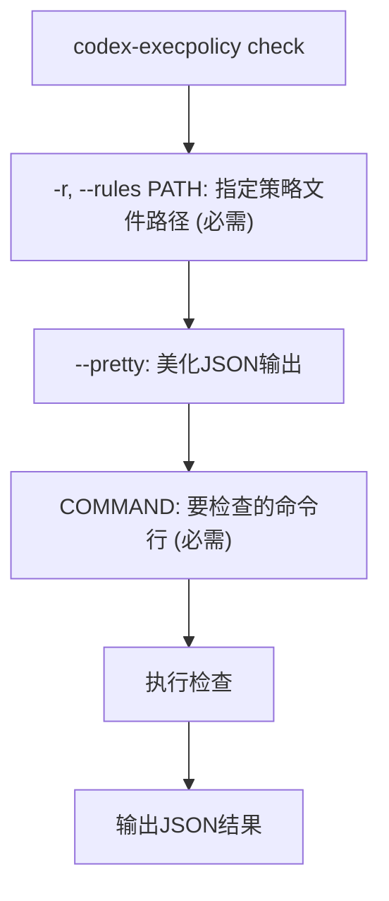
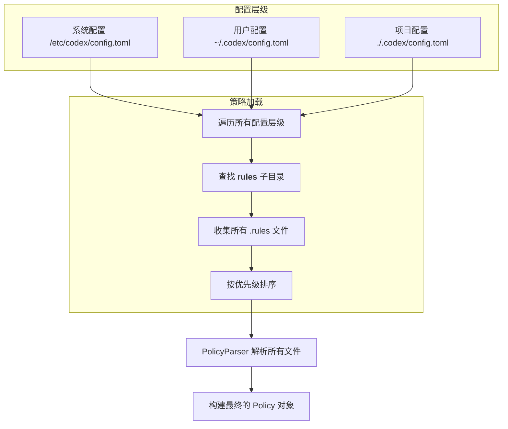

# 策略管理

<cite>
**本文档中引用的文件**  
- [lib.rs](file://codex-rs\execpolicy\src\lib.rs)
- [main.rs](file://codex-rs\execpolicy\src\main.rs)
- [execpolicycheck.rs](file://codex-rs\execpolicy\src\execpolicycheck.rs)
- [policy.rs](file://codex-rs\execpolicy\src\policy.rs)
- [rule.rs](file://codex-rs\execpolicy\src\rule.rs)
- [parser.rs](file://codex-rs\execpolicy\src\parser.rs)
- [decision.rs](file://codex-rs\execpolicy\src\decision.rs)
- [example.codexpolicy](file://codex-rs\execpolicy\examples\example.codexpolicy)
- [exec_policy.rs](file://codex-rs\core\src\exec_policy.rs)
- [mod.rs](file://codex-rs\core\src\config\mod.rs)
- [mod.rs](file://codex-rs\core\src\config_loader\mod.rs)
- [execpolicy.rs](file://codex-rs\cli\tests\execpolicy.rs)
- [Cargo.toml](file://codex-rs\execpolicy\Cargo.toml)
- [Cargo.toml](file://codex-rs\core\Cargo.toml)
</cite>

## 目录
1. [引言](#引言)
2. [执行策略文件创建与语法](#执行策略文件创建与语法)
3. `execpolicycheck` 工具使用方法
4. 策略文件加载与运行时重载机制
5. 最佳实践指南
6. 策略管理完整流程示例
7. 结论

## 引言
Codex系统通过执行策略（execpolicy）机制来控制命令执行的安全性。该机制允许开发者定义细粒度的规则，决定哪些命令可以自动执行、哪些需要用户确认、哪些被完全禁止。本文档详细阐述了Codex执行策略的管理方法，包括策略文件的创建、测试、部署，以及`execpolicycheck`工具的使用。同时，文档还解释了策略文件的加载机制、运行时重载功能，并提供了最佳实践和完整的管理流程示例。

## 执行策略文件创建与语法

### 策略文件格式与位置
执行策略文件是使用Starlark语法编写的文本文件，其文件扩展名为`.rules`。这些文件必须存放在名为`rules`的子目录中。该目录可以存在于多个配置层级中，包括：
- 用户主目录下的Codex配置目录（如`~/.codex/rules/`）
- 项目根目录下的`.codex`目录（如`./.codex/rules/`）

系统会从所有配置层级中加载`rules`目录下的策略文件，并按优先级合并。项目级的策略文件优先级高于用户级，可以覆盖全局设置。

### 策略规则定义
策略的核心是通过`prefix_rule`函数定义的规则。每个规则包含一个命令前缀模式（`pattern`）和一个决策（`decision`）。

#### 决策类型
决策（`Decision`）枚举定义了三种处理方式：
- **允许 (Allow)**: 命令可以无条件执行。
- **提示 (Prompt)**: 执行前必须请求用户明确批准。
- **禁止 (Forbidden)**: 命令被阻止执行。

#### 规则语法详解
`prefix_rule`函数接受以下参数：
- **`pattern`**: 一个字符串列表，表示命令行的前缀。例如 `["git", "reset", "--hard"]`。
- **`decision`**: 可选参数，指定该规则的决策。默认为`allow`。
- **`match`**: 一个可选的命令列表，用于验证规则。如果规则被激活，这些示例命令必须匹配。这有助于防止规则配置错误。
- **`not_match`**: 一个可选的命令列表，用于验证规则。这些示例命令必须不匹配该规则，确保规则不会意外阻止其他命令。

```starlark
# 示例：禁止危险的git操作
prefix_rule(
    pattern = ["git", "reset", "--hard"],
    decision = "forbidden",
    match = [
        ["git", "reset", "--hard"],
    ],
    not_match = [
        ["git", "reset", "--keep"],
        "git reset --merge",
    ],
)

# 示例：允许简单的ls命令
prefix_rule(
    pattern = ["ls"],
    match = [
        ["ls"],
        ["ls", "-l"],
        ["ls", "-a", "."],
    ],
)
```

### 策略解析与构建
策略文件由`PolicyParser`类解析。该类使用Starlark解析器将`.rules`文件中的Starlark代码转换为内部的策略对象。解析过程会为每个`prefix_rule`调用创建一个`PrefixRule`实例，并将其添加到一个按命令第一个词（`program`）索引的多映射（`MultiMap`）中。最终，所有规则被构建为一个`Policy`对象，用于高效的命令匹配。

**Section sources**
- [parser.rs](file://codex-rs\execpolicy\src\parser.rs#L1-L260)
- [rule.rs](file://codex-rs\execpolicy\src\rule.rs#L1-L153)
- [policy.rs](file://codex-rs\execpolicy\src\policy.rs#L1-L136)
- [example.codexpolicy](file://codex-rs\execpolicy\examples\example.codexpolicy#L1-L78)

## `execpolicycheck` 工具使用方法

### 工具概述
`execpolicycheck`是Codex提供的一个命令行工具，用于验证策略文件的语法正确性，并测试特定命令是否被允许执行。它是策略开发和调试的关键工具。

### 命令行接口
该工具通过`codex-execpolicy`二进制文件提供，其主要子命令是`check`。



**Diagram sources**
- [main.rs](file://codex-rs\execpolicy\src\main.rs#L1-L19)
- [execpolicycheck.rs](file://codex-rs\execpolicy\src\execpolicycheck.rs#L1-L84)

### 使用示例
以下是如何使用`execpolicycheck`工具的示例：

1.  **验证命令是否被禁止**:
    ```bash
    codex-execpolicy check \
      --rules /path/to/policy.rules \
      git reset --hard origin/main
    ```
    如果策略中存在禁止`git reset --hard`的规则，输出的JSON中`decision`字段将为`"forbidden"`。

2.  **测试新规则**:
    在编写新的策略文件后，可以使用`execpolicycheck`来验证其行为是否符合预期。
    ```bash
    # 创建一个临时策略文件
    echo 'prefix_rule(pattern=["echo"], decision="allow")' > temp.rules
    # 测试echo命令
    codex-execpolicy check --rules temp.rules echo hello
    # 测试一个不相关的命令
    codex-execpolicy check --rules temp.rules ls -l
    ```

3.  **获取详细的JSON输出**:
    使用`--pretty`参数可以得到格式化后的JSON输出，便于阅读和调试。
    ```bash
    codex-execpolicy check --pretty --rules policy.rules git status
    ```

### 输出格式
`execpolicycheck`的输出是一个JSON对象，包含两个主要字段：
- **`matchedRules`**: 一个数组，列出所有与输入命令匹配的规则。
- **`decision`**: 最终的决策结果，是所有匹配规则决策的最大值（`Forbidden` > `Prompt` > `Allow`）。

**Section sources**
- [execpolicycheck.rs](file://codex-rs\execpolicy\src\execpolicycheck.rs#L1-L84)
- [cli\tests\execpolicy.rs](file://codex-rs\cli\tests\execpolicy.rs#L1-L62)

## 策略文件加载与运行时重载机制

### 配置系统集成
策略文件的加载路径由Codex的核心配置系统管理。该系统位于`core/src/config/mod.rs`，它通过`ConfigLayerStack`从多个来源（系统、用户、项目）加载和合并配置。



**Diagram sources**
- [mod.rs](file://codex-rs\core\src\config\mod.rs#L1-L800)
- [mod.rs](file://codex-rs\core\src\config_loader\mod.rs#L1-L200)

### 加载过程
1.  **收集文件**: `load_exec_policy`函数会遍历`ConfigLayerStack`中的所有配置层级，从每个层级的配置文件夹中查找`rules`子目录，并收集其中所有以`.rules`为扩展名的文件。
2.  **解析文件**: 使用`PolicyParser`依次解析每个`.rules`文件。解析过程中，文件路径被用作标识符，以便在出错时提供清晰的错误信息。
3.  **构建策略**: 所有解析成功的规则被合并到一个全局的`Policy`对象中。

### 运行时重载
Codex的`ExecPolicyManager`负责管理策略的生命周期。它使用`ArcSwap`来存储当前的策略，这是一种无锁的原子引用计数交换机制。

当策略文件发生变化时（例如，通过`append_amendment_and_update`方法添加新规则），系统会：
1.  在后台线程中将新规则追加到默认的策略文件（`~/.codex/rules/default.rules`）中。
2.  在内存中创建当前策略的一个新副本，并将新规则添加进去。
3.  使用`ArcSwap::store()`方法原子地将新的策略对象替换旧的。

这个过程是线程安全的，允许在不中断服务的情况下动态更新执行策略。

**Section sources**
- [exec_policy.rs](file://codex-rs\core\src\exec_policy.rs#L1-L800)
- [mod.rs](file://codex-rs\core\src\config_loader\mod.rs#L1-L200)

## 最佳实践指南

### 分层策略管理
为了适应不同项目和环境的需求，建议采用分层策略：
- **基础安全策略**: 在用户级`~/.codex/rules/`目录下定义全局的安全基线，例如禁止`rm -rf /`、`chmod 777`等危险命令。
- **项目特定策略**: 在项目级`./.codex/rules/`目录下定义针对该项目的策略。例如，一个前端项目可以允许`npm install`和`npm run build`，而一个后端项目可以允许`cargo build`和`docker-compose up`。

这种分层方法确保了全局安全，同时允许项目拥有必要的灵活性。

### 版本控制与审计
- **将策略文件纳入版本控制**: 将项目级的`.codex/rules/`目录提交到Git仓库中。这使得策略变更可以被追踪、审查和回滚。
- **审计日志**: Codex的`history.jsonl`文件会记录所有执行的命令和相关的决策。定期审查这些日志可以发现潜在的安全问题或策略漏洞。

### 设计原则
- **最小权限原则**: 默认情况下，对未知命令采取`prompt`决策，要求用户确认。只对经过验证的、安全的命令设置`allow`。
- **明确的`not_match`验证**: 为每条规则编写`not_match`示例，防止规则过于宽泛而意外阻止合法命令。
- **避免过度复杂的模式**: 保持`pattern`简单明了，易于理解和维护。

**Section sources**
- [exec_policy.rs](file://codex-rs\core\src\exec_policy.rs#L1-L800)
- [mod.rs](file://codex-rs\core\src\config\mod.rs#L1-L800)

## 策略管理完整流程示例

### 场景
假设您正在开发一个Rust项目，并希望Codex能够自动执行`cargo build`命令，而无需每次都询问。

### 步骤1: 本地测试
首先，在本地测试`cargo build`命令是否被策略允许。
```bash
# 创建一个临时策略文件进行测试
echo 'prefix_rule(pattern=["cargo", "build"], decision="allow")' > test.rules

# 使用execpolicycheck工具测试
codex-execpolicy check --rules test.rules cargo build --release
```
检查输出，确保`decision`为`"allow"`，并且没有意外匹配其他命令。

### 步骤2: 编写正式策略
确认无误后，将规则写入项目级的策略文件。
```bash
# 在项目根目录创建 .codex 目录（如果不存在）
mkdir -p .codex/rules

# 创建策略文件
cat > .codex/rules/rust_project.rules << EOF
# 允许构建Rust项目
prefix_rule(
    pattern = ["cargo", "build"],
    decision = "allow",
    match = [
        ["cargo", "build"],
        ["cargo", "build", "--release"],
    ],
    not_match = [
        ["cargo", "install"], # 防止意外安装包
    ],
)
EOF
```

### 步骤3: 部署到生产环境
将包含`.codex`目录的项目推送到版本控制系统（如Git）。当其他团队成员克隆此项目并使用Codex时，该策略将自动生效，允许他们无缝地执行`cargo build`命令。

### 步骤4: 动态更新（可选）
如果在使用过程中，Codex提示需要批准`cargo test`，您可以选择在运行时动态添加规则。Codex会提供一个选项来“始终允许此命令”，这会调用`ExecPolicyManager::append_amendment_and_update`，将`prefix_rule(pattern=["cargo", "test"], decision="allow")`追加到`~/.codex/rules/default.rules`文件中，并立即在内存中更新策略。

**Section sources**
- [exec_policy.rs](file://codex-rs\core\src\exec_policy.rs#L1-L800)
- [execpolicycheck.rs](file://codex-rs\execpolicy\src\execpolicycheck.rs#L1-L84)

## 结论
Codex的执行策略管理系统提供了一个强大且灵活的框架，用于控制命令执行的安全性。通过理解`execpolicycheck`工具的使用、策略文件的加载机制以及最佳实践，开发者可以有效地管理不同环境下的执行权限。采用分层策略、版本控制和最小权限原则，可以构建一个既安全又高效的工作流。动态重载功能进一步增强了系统的实用性，使其能够适应不断变化的开发需求。