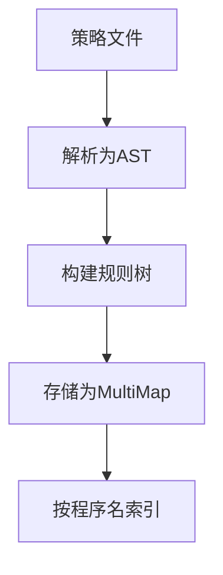
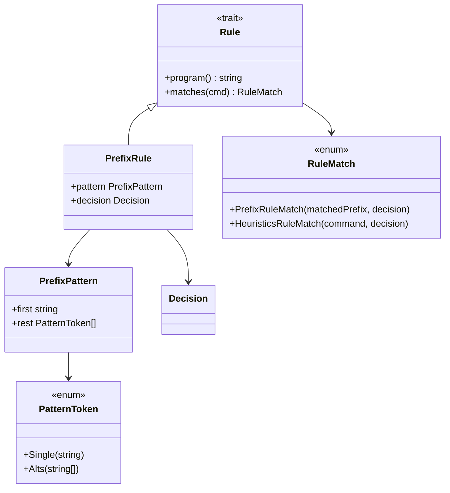
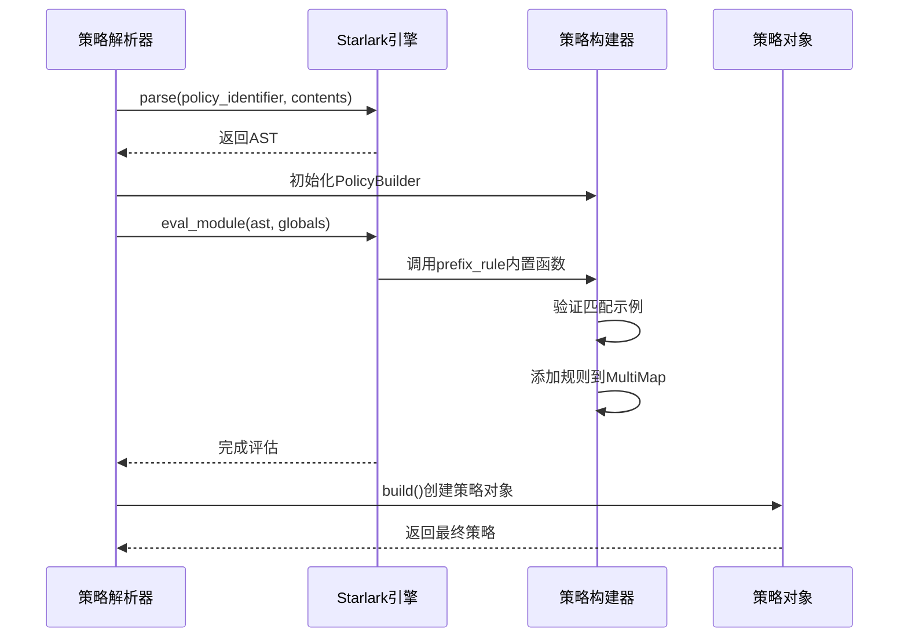
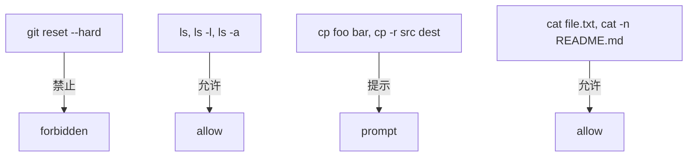
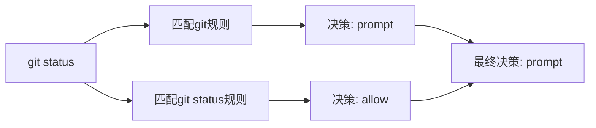
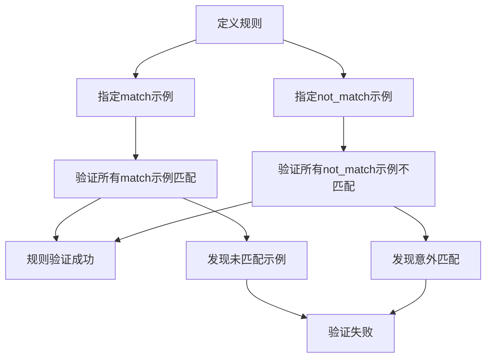
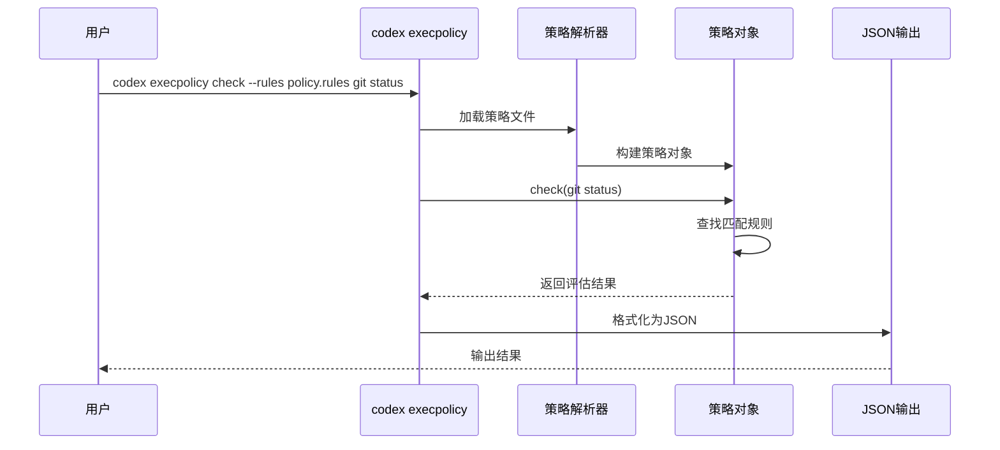

# 策略语法

<cite>
**本文档中引用的文件**  
- [lib.rs](file://codex-rs\execpolicy\src\lib.rs)
- [rule.rs](file://codex-rs\execpolicy\src\rule.rs)
- [parser.rs](file://codex-rs\execpolicy\src\parser.rs)
- [policy.rs](file://codex-rs\execpolicy\src\policy.rs)
- [decision.rs](file://codex-rs\execpolicy\src\decision.rs)
- [error.rs](file://codex-rs\execpolicy\src\error.rs)
- [execpolicycheck.rs](file://codex-rs\execpolicy\src\execpolicycheck.rs)
- [example.codexpolicy](file://codex-rs\execpolicy\examples\example.codexpolicy)
- [basic.rs](file://codex-rs\execpolicy\tests\basic.rs)
- [README.md](file://codex-rs\execpolicy\README.md)
</cite>

## 目录
1. [简介](#简介)
2. [策略文件结构](#策略文件结构)
3. [规则模型](#规则模型)
4. [解析逻辑](#解析逻辑)
5. [语法示例](#语法示例)
6. [优先级与冲突解决](#优先级与冲突解决)
7. [测试与验证](#测试与验证)
8. [CLI工具](#cli工具)

## 简介
Codex执行策略（execpolicy）语言是一种用于定义命令执行权限的领域特定语言。该语言基于Starlark语法，通过`allow`和`deny`指令的变体（`allow`、`prompt`、`forbidden`）来控制命令的执行行为。策略文件通过前缀匹配机制来识别命令，并支持通配符和条件表达式来实现灵活的匹配规则。

**Section sources**
- [README.md](file://codex-rs\execpolicy\README.md#L1-L55)

## 策略文件结构
策略文件使用Starlark语法，主要由`prefix_rule`函数调用构成。每个规则包含模式匹配、决策和验证示例三个核心部分。文件可以包含多个规则，这些规则按顺序被解析和合并。

**Diagram sources**
- [parser.rs](file://codex-rs\execpolicy\src\parser.rs#L28-L68)
- [policy.rs](file://codex-rs\execpolicy\src\policy.rs#L17-L32)

**Section sources**
- [parser.rs](file://codex-rs\execpolicy\src\parser.rs#L1-L260)
- [policy.rs](file://codex-rs\execpolicy\src\policy.rs#L1-L136)

## 规则模型
规则模型定义了策略的核心数据结构。`Rule` trait是所有规则的基类型，目前主要实现为`PrefixRule`。规则通过`PatternToken`和`PrefixPattern`来匹配命令前缀。

**Diagram sources**
- [rule.rs](file://codex-rs\execpolicy\src\rule.rs#L11-L153)

**Section sources**
- [rule.rs](file://codex-rs\execpolicy\src\rule.rs#L1-L153)
- [decision.rs](file://codex-rs\execpolicy\src\decision.rs#L7-L28)

## 解析逻辑
策略解析器使用Starlark解析器来处理策略文件。解析过程包括语法分析、语义验证和规则构建三个阶段。解析器通过`PolicyBuilder`来收集和组织规则。

**Diagram sources**
- [parser.rs](file://codex-rs\execpolicy\src\parser.rs#L28-L260)

**Section sources**
- [parser.rs](file://codex-rs\execpolicy\src\parser.rs#L1-L260)
- [lib.rs](file://codex-rs\execpolicy\src\lib.rs#L1-L21)

## 语法示例
策略语法支持多种匹配模式和验证机制。以下是一些典型的使用示例：

**Diagram sources**
- [example.codexpolicy](file://codex-rs\execpolicy\examples\example.codexpolicy#L1-L78)

**Section sources**
- [example.codexpolicy](file://codex-rs\execpolicy\examples\example.codexpolicy#L1-L78)
- [basic.rs](file://codex-rs\execpolicy\tests\basic.rs#L50-L455)

## 优先级与冲突解决
当多个规则匹配同一个命令时，系统采用最严格的决策优先原则。决策的优先级顺序为：`forbidden` > `prompt` > `allow`。这种机制确保了安全策略的严格性。

**Diagram sources**
- [policy.rs](file://codex-rs\execpolicy\src\policy.rs#L124-L128)

**Section sources**
- [policy.rs](file://codex-rs\execpolicy\src\policy.rs#L1-L136)
- [basic.rs](file://codex-rs\execpolicy\tests\basic.rs#L358-L391)

## 测试与验证
策略文件支持内置的测试和验证机制。通过`match`和`not_match`参数，可以定义正向和负向的测试用例。这些测试在策略加载时自动执行，确保规则的正确性。

**Diagram sources**
- [rule.rs](file://codex-rs\execpolicy\src\rule.rs#L112-L152)

**Section sources**
- [rule.rs](file://codex-rs\execpolicy\src\rule.rs#L112-L152)
- [basic.rs](file://codex-rs\execpolicy\tests\basic.rs#L314-L354)

## CLI工具
Codex提供了一个命令行工具来测试和验证策略文件。该工具可以加载一个或多个策略文件，并对指定命令进行评估，输出JSON格式的评估结果。

**Diagram sources**
- [execpolicycheck.rs](file://codex-rs\execpolicy\src\execpolicycheck.rs#L1-L84)
- [main.rs](file://codex-rs\execpolicy\src\main.rs#L1-L19)

**Section sources**
- [execpolicycheck.rs](file://codex-rs\execpolicy\src\execpolicycheck.rs#L1-L84)
- [main.rs](file://codex-rs\execpolicy\src\main.rs#L1-L19)
- [README.md](file://codex-rs\execpolicy\README.md#L22-L35)