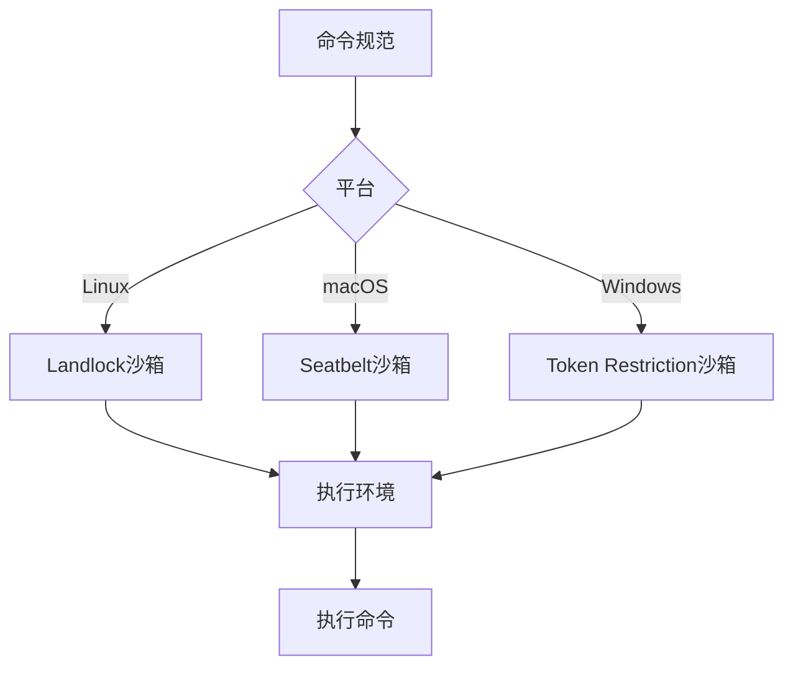
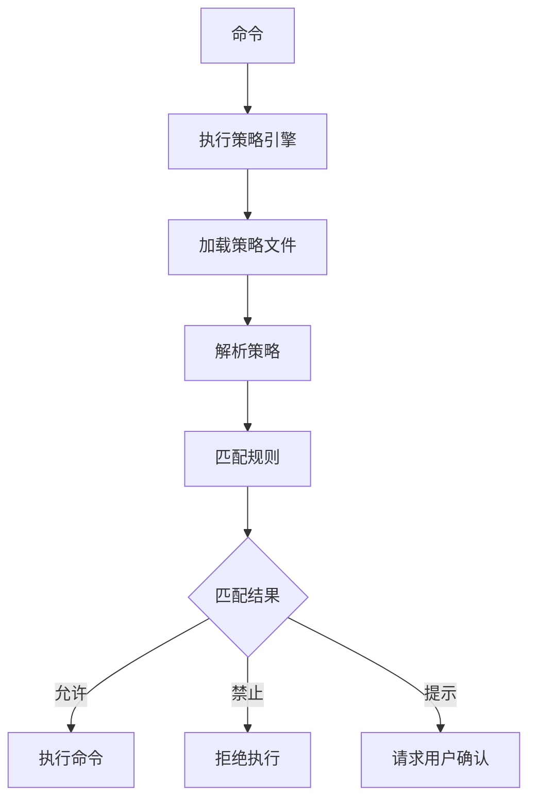
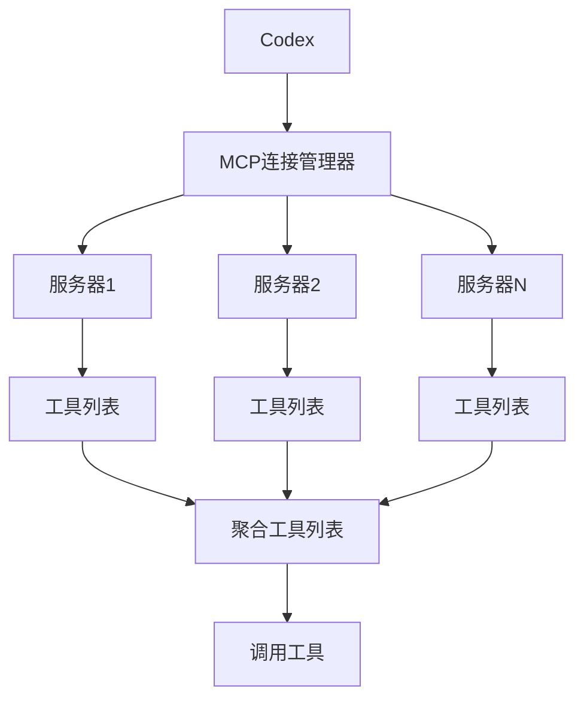

# 核心概念

<cite>
**本文档中引用的文件**   
- [lib.rs](file://codex-rs\core\src\lib.rs)
- [codex.rs](file://codex-rs\core\src\codex.rs)
- [mod.rs](file://codex-rs\core\src\sandboxing\mod.rs)
- [example.codexpolicy](file://codex-rs\execpolicy\examples\example.codexpolicy)
- [safety.rs](file://codex-rs\core\src\safety.rs)
- [seatbelt.rs](file://codex-rs\core\src\seatbelt.rs)
- [lib.rs](file://codex-rs\windows-sandbox-rs\src\lib.rs)
- [lib.rs](file://codex-rs\linux-sandbox\src\lib.rs)
- [mcp_connection_manager.rs](file://codex-rs\core\src\mcp_connection_manager.rs)
- [exec_policy.rs](file://codex-rs\core\src\exec_policy.rs)
</cite>

## 目录
1. [AI编程代理与传统代码补全工具的区别](#ai编程代理与传统代码补全工具的区别)
2. [会话与任务生命周期管理](#会话与任务生命周期管理)
3. [安全机制与沙箱技术](#安全机制与沙箱技术)
4. [执行策略引擎](#执行策略引擎)
5. [模型上下文协议](#模型上下文协议)

## AI编程代理与传统代码补全工具的区别

Codex的核心是一个AI编程代理，它与传统的代码补全工具在工作原理和功能上有着本质的区别。传统的代码补全工具主要基于静态分析和模式匹配，通过分析当前代码上下文来预测下一个可能的代码片段。而Codex作为一个AI编程代理，能够理解更复杂的上下文，进行多轮对话，并执行实际的编程任务。

Codex通过`Codex`结构体提供了一个高级接口，该接口作为队列对工作，用户发送提交（submissions）并接收事件（events）。这种设计允许Codex处理复杂的、状态化的交互，而不仅仅是简单的代码建议。`Codex::spawn`方法用于启动一个新的Codex实例并初始化会话，它接收配置、认证管理器、模型管理器、技能管理器、对话历史和会话来源等参数。

**Section sources**
- [lib.rs](file://codex-rs\core\src\lib.rs#L1-L130)
- [codex.rs](file://codex-rs\core\src\codex.rs#L163-L336)

## 会话与任务生命周期管理

Codex的会话（Session）和任务（Turn）生命周期管理是其核心功能之一。一个会话代表一次完整的交互过程，而一个任务（Turn）则是会话中的一个具体步骤。`Session`结构体管理着会话的状态，包括会话ID、事件发送器、状态锁、功能集、活动任务和会话服务等。

会话的创建通过`Session::new`方法完成，该方法接收会话配置、配置、认证管理器、模型管理器、执行策略、事件发送器、初始历史、会话来源和技能管理器等参数。会话创建后，会启动一个`submission_loop`任务来处理提交，直到收到`Op::Shutdown`操作。

任务（Turn）是会话中的具体执行单元，由`TurnContext`结构体表示。它包含了任务执行所需的所有上下文信息，如提交ID、模型客户端、工作目录、开发者指令、基础指令、紧凑提示、用户指令、审批策略、沙箱策略、shell环境策略、工具配置、幽灵快照、最终输出JSON模式、Codex Linux沙箱可执行文件路径、工具调用门控和截断策略等。

**Section sources**
- [codex.rs](file://codex-rs\core\src\codex.rs#L338-L800)
- [codex.rs](file://codex-rs\core\src\codex.rs#L534-L537)

## 安全机制与沙箱技术

Codex实现了多种安全机制，包括Linux Landlock、macOS Seatbelt和Windows Token Restriction等沙箱技术，以确保代码执行的安全性。这些沙箱技术通过限制进程的权限来防止恶意代码的执行。

### Linux Landlock沙箱

在Linux系统上，Codex使用Landlock沙箱技术。`landlock`模块提供了创建Linux沙箱命令参数的功能。`create_linux_sandbox_command_args`函数根据命令、沙箱策略和沙箱策略工作目录生成相应的参数。沙箱管理器`SandboxManager`负责选择和转换命令规范为执行环境。

### macOS Seatbelt沙箱

在macOS系统上，Codex使用Seatbelt沙箱技术。`seatbelt`模块提供了创建Seatbelt命令参数的功能。`create_seatbelt_command_args`函数根据命令、沙箱策略和沙箱策略工作目录生成相应的参数。该函数还处理文件读写权限和网络访问权限的配置。

### Windows Token Restriction沙箱

在Windows系统上，Codex使用Token Restriction沙箱技术。`windows-sandbox-rs`库提供了创建受限令牌的功能。`run_windows_sandbox_capture`函数负责在受限令牌下执行命令，并处理标准输入、输出和错误流。

**Diagram sources **
- [mod.rs](file://codex-rs\core\src\sandboxing\mod.rs#L29-L181)
- [seatbelt.rs](file://codex-rs\core\src\seatbelt.rs#L46-L135)
- [lib.rs](file://codex-rs\windows-sandbox-rs\src\lib.rs#L175-L427)

**Section sources**
- [mod.rs](file://codex-rs\core\src\sandboxing\mod.rs#L29-L181)
- [seatbelt.rs](file://codex-rs\core\src\seatbelt.rs#L46-L135)
- [lib.rs](file://codex-rs\windows-sandbox-rs\src\lib.rs#L175-L427)

## 执行策略引擎

Codex的执行策略（execpolicy）引擎通过策略文件控制命令的执行权限。策略文件使用一种特定的语法来定义规则，这些规则可以匹配命令并决定其执行权限。

`execpolicy`库提供了策略解析、规则匹配和决策等功能。`PolicyParser`类负责解析策略文件，`Policy`类表示一个完整的策略，`Rule`类表示一个具体的规则。策略文件中的规则可以匹配命令的前缀，并根据匹配结果决定是否允许执行。

例如，在`example.codexpolicy`文件中，定义了多个`prefix_rule`，这些规则匹配特定的命令前缀，并指定相应的决策（如`forbidden`或`prompt`）。当一个命令被提交时，执行策略引擎会检查所有规则，并根据最高优先级的匹配结果做出决策。

**Diagram sources **
- [example.codexpolicy](file://codex-rs\execpolicy\examples\example.codexpolicy#L1-L78)
- [exec_policy.rs](file://codex-rs\core\src\exec_policy.rs#L208-L244)

**Section sources**
- [example.codexpolicy](file://codex-rs\execpolicy\examples\example.codexpolicy#L1-L78)
- [exec_policy.rs](file://codex-rs\core\src\exec_policy.rs#L208-L244)

## 模型上下文协议

模型上下文协议（MCP）允许Codex与外部工具和服务进行通信。MCP通过定义一组标准的接口和消息格式，使得Codex可以与各种外部系统集成。

`mcp_connection_manager`模块负责管理与MCP服务器的连接。它维护一个`RmcpClient`实例的映射，每个实例对应一个配置的服务器。`McpConnectionManager`提供了便利的方法来查询所有服务器上的可用工具，并将它们聚合到一个单一的映射中。

MCP服务器可以通过`list_all_tools`、`list_all_resources`和`list_all_resource_templates`等方法提供工具、资源和资源模板的列表。Codex可以通过`call_tool`方法调用这些工具，并通过`list_resources`、`list_resource_templates`和`read_resource`等方法访问资源。

**Diagram sources **
- [mcp_connection_manager.rs](file://codex-rs\core\src\mcp_connection_manager.rs#L402-L416)
- [mcp_connection_manager.rs](file://codex-rs\core\src\mcp_connection_manager.rs#L554-L573)

**Section sources**
- [mcp_connection_manager.rs](file://codex-rs\core\src\mcp_connection_manager.rs#L402-L416)
- [mcp_connection_manager.rs](file://codex-rs\core\src\mcp_connection_manager.rs#L554-L573)