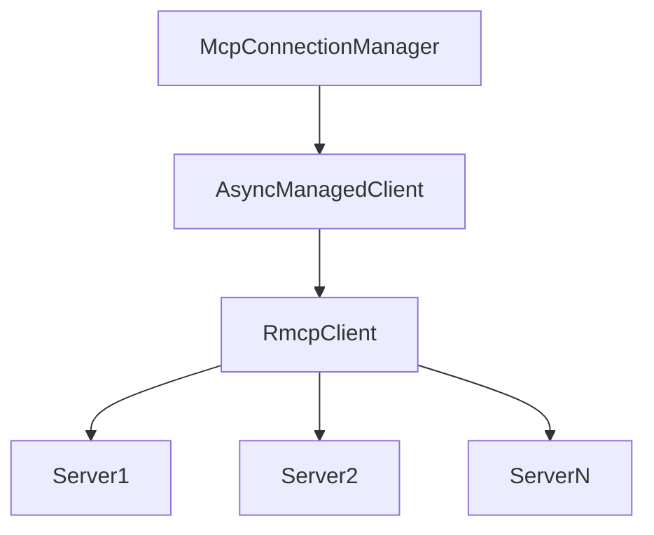
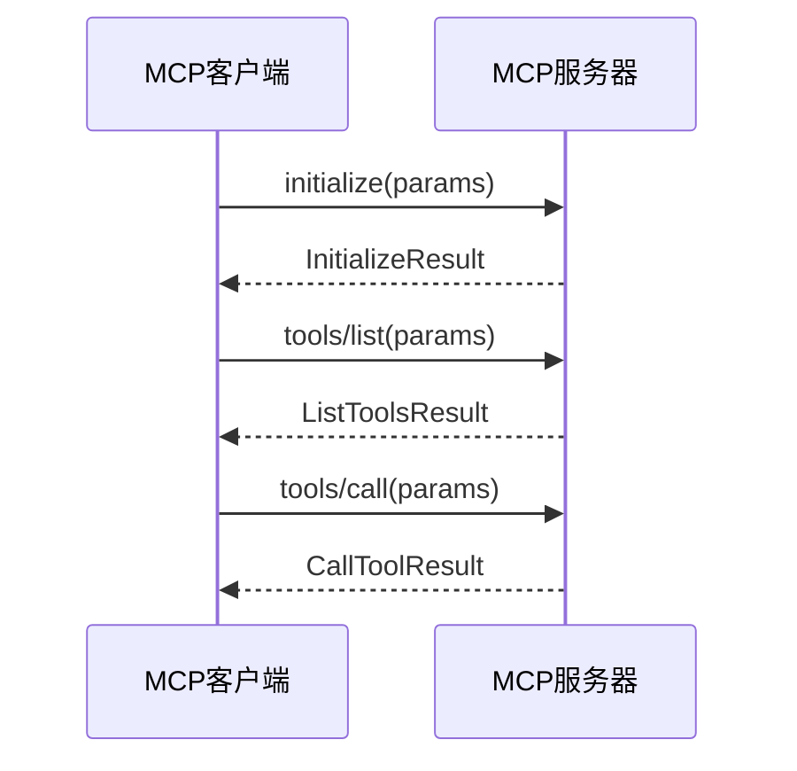
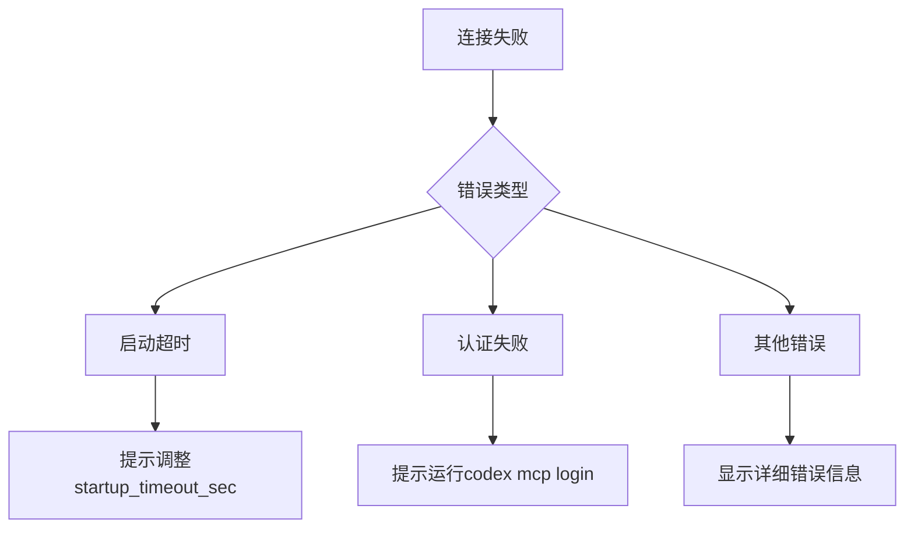

# MCP客户端

<cite>
**本文档中引用的文件**  
- [mcp_connection_manager.rs](file://codex-rs\core\src\mcp_connection_manager.rs)
- [lib.rs](file://codex-rs\mcp-types\src\lib.rs)
- [mcp_cmd.rs](file://codex-rs\cli\src\mcp_cmd.rs)
- [config.toml](file://codex-rs\core\src\config\edit.rs)
- [README.md](file://sdk\typescript\README.md)
</cite>

## 目录
1. [简介](#简介)
2. [MCP客户端发现机制](#mcp客户端发现机制)
3. [连接管理](#连接管理)
4. [通信协议与消息序列化](#通信协议与消息序列化)
5. [错误处理与重连策略](#错误处理与重连策略)
6. [TypeScript SDK使用示例](#typescript-sdk使用示例)

## 简介
MCP（Model Context Protocol）客户端是Codex系统中用于发现、连接和与MCP服务器通信的核心组件。该客户端通过`McpConnectionManager`管理与多个MCP服务器的连接，并通过`McpClient`发送RPC请求（如`initialize`、`tool.list`等）并处理响应。本文档详细说明了MCP客户端的工作机制，包括发现、连接、通信、错误处理和重连策略。

## MCP客户端发现机制
MCP客户端通过`mcp-servers`配置发现MCP服务器。配置文件通常位于`~/.codex/config.toml`，其中定义了服务器的名称、传输方式（stdio或streamable_http）、启动命令、环境变量等。

```toml
[mcp_servers.my-tool]
transport = "stdio"
command = "my-command"
args = ["--arg1", "--arg2"]
env = { KEY = "value" }
cwd = "/path/to/working/directory"
enabled = true
startup_timeout_sec = 10
tool_timeout_sec = 60
enabled_tools = ["tool1", "tool2"]
disabled_tools = ["tool3"]
```

服务器名称必须符合正则表达式`^[a-zA-Z0-9_-]+$`。客户端通过`load_global_mcp_servers`函数加载全局MCP服务器配置，并通过`McpConnectionManager`初始化连接。

**Section sources**
- [mcp_cmd.rs](file://codex-rs\cli\src\mcp_cmd.rs#L181-L288)
- [edit.rs](file://codex-rs\core\src\config\edit.rs#L492-L520)

## 连接管理
`McpConnectionManager`负责管理与多个MCP服务器的连接。每个服务器对应一个`RmcpClient`实例，由`AsyncManagedClient`异步管理。连接管理器在初始化时为每个启用的服务器创建异步客户端，并在后台任务中启动服务器。



**Diagram sources**
- [mcp_connection_manager.rs](file://codex-rs\core\src\mcp_connection_manager.rs#L278-L313)

**Section sources**
- [mcp_connection_manager.rs](file://codex-rs\core\src\mcp_connection_manager.rs#L278-L380)

## 通信协议与消息序列化
MCP客户端使用JSON-RPC 2.0协议与服务器通信。消息序列化和反序列化通过`mcp-types`库实现，该库定义了所有RPC请求和响应的类型。`mcp-types`库通过`generate_mcp_types.py`脚本从JSON Schema生成Rust和TypeScript类型。



**Diagram sources**
- [lib.rs](file://codex-rs\mcp-types\src\lib.rs#L536-L583)
- [mcp_connection_manager.rs](file://codex-rs\core\src\mcp_connection_manager.rs#L768-L794)

**Section sources**
- [lib.rs](file://codex-rs\mcp-types\src\lib.rs#L1-L800)
- [mcp_connection_manager.rs](file://codex-rs\core\src\mcp_connection_manager.rs#L768-L794)

## 错误处理与重连策略
MCP客户端在连接和通信过程中可能遇到各种错误，如服务器启动超时、认证失败、网络错误等。客户端通过`StartupOutcomeError`枚举处理启动错误，并提供相应的错误提示。



**Diagram sources**
- [mcp_connection_manager.rs](file://codex-rs\core\src\mcp_connection_manager.rs#L890-L926)

**Section sources**
- [mcp_connection_manager.rs](file://codex-rs\core\src\mcp_connection_manager.rs#L890-L926)

## TypeScript SDK使用示例
以下示例展示了如何使用TypeScript SDK作为MCP客户端：

```typescript
import { Codex } from "@openai/codex-sdk";

const codex = new Codex();
const thread = codex.startThread();
const turn = await thread.run("Diagnose the test failure and propose a fix");

console.log(turn.finalResponse);
console.log(turn.items);
```

**Section sources**
- [README.md](file://sdk\typescript\README.md#L1-L134)