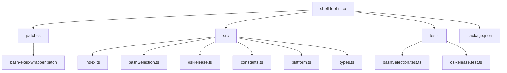
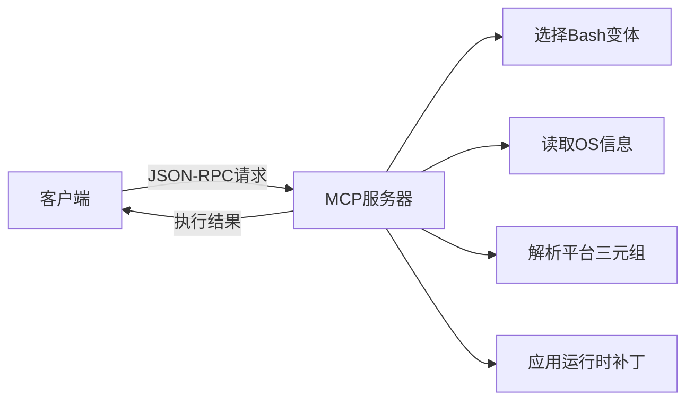
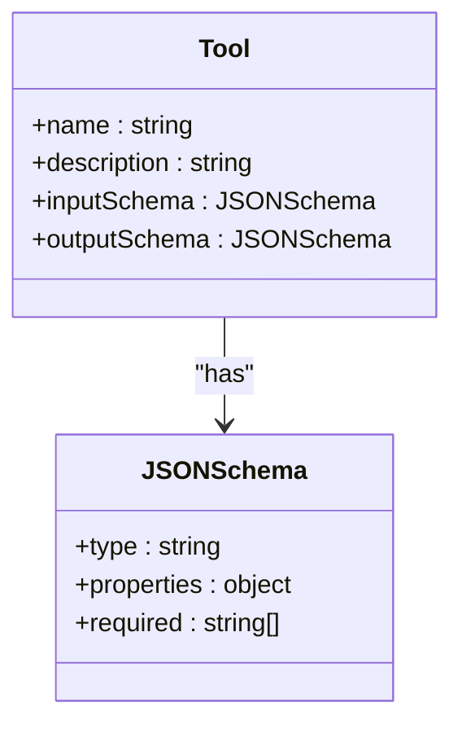
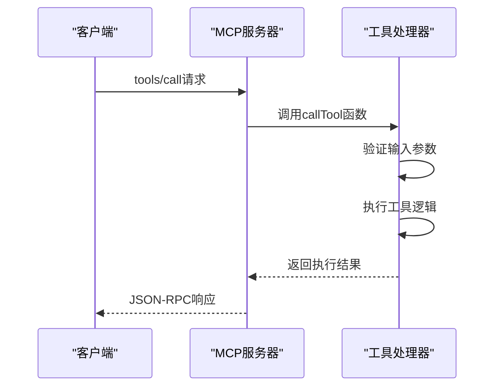
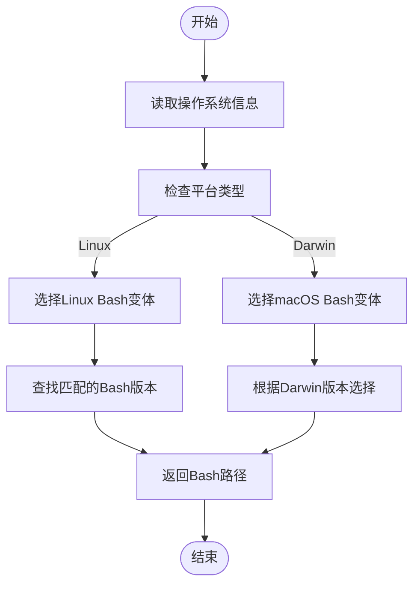
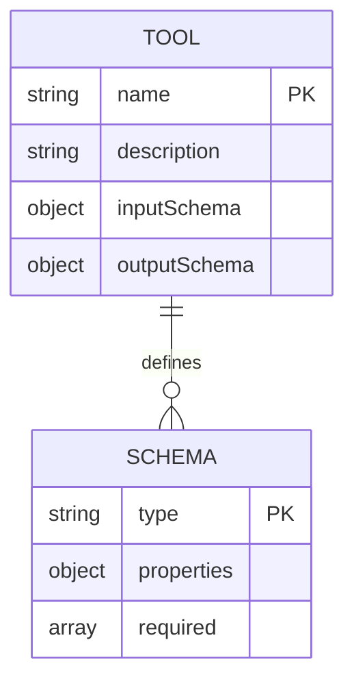
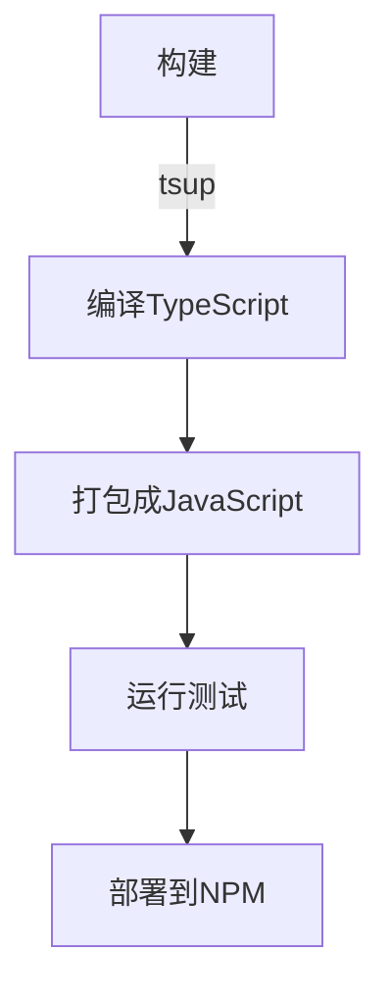
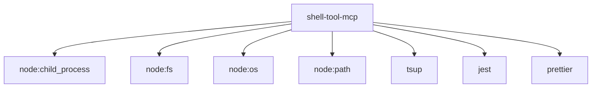

# MCP工具开发

<cite>
**本文档中引用的文件**  
- [package.json](file://shell-tool-mcp/package.json)
- [index.ts](file://shell-tool-mcp/src/index.ts)
- [types.ts](file://shell-tool-mcp/src/types.ts)
- [bashSelection.ts](file://shell-tool-mcp/src/bashSelection.ts)
- [osRelease.ts](file://shell-tool-mcp/src/osRelease.ts)
- [constants.ts](file://shell-tool-mcp/src/constants.ts)
- [platform.ts](file://shell-tool-mcp/src/platform.ts)
- [bash-exec-wrapper.patch](file://shell-tool-mcp/patches/bash-exec-wrapper.patch)
- [lib.rs](file://codex-rs/mcp-types/src/lib.rs)
- [mcp-server/lib.rs](file://codex-rs/mcp-server/src/lib.rs)
</cite>

## 目录
1. [简介](#简介)
2. [项目结构](#项目结构)
3. [核心组件](#核心组件)
4. [架构概述](#架构概述)
5. [详细组件分析](#详细组件分析)
6. [依赖分析](#依赖分析)
7. [性能考虑](#性能考虑)
8. [故障排除指南](#故障排除指南)
9. [结论](#结论)

## 简介
本文档旨在为开发者提供一个全面的MCP（Model Context Protocol）工具开发指南。通过分析`shell-tool-mcp`示例项目，详细阐述如何使用TypeScript/JavaScript创建自定义MCP工具，包括工具定义、执行请求处理、跨平台兼容性实现、JSON Schema输入输出定义、工具打包部署以及运行时补丁应用等关键环节。

## 项目结构
`shell-tool-mcp`项目是一个专门用于实现shell工具功能的MCP服务器。其结构清晰地分离了源代码、测试、补丁和构建配置。

**Diagram sources**
- [package.json](file://shell-tool-mcp/package.json)
- [src/index.ts](file://shell-tool-mcp/src/index.ts)
- [patches/bash-exec-wrapper.patch](file://shell-tool-mcp/patches/bash-exec-wrapper.patch)

**Section sources**
- [package.json](file://shell-tool-mcp/package.json)
- [src/index.ts](file://shell-tool-mcp/src/index.ts)

## 核心组件
本项目的核心组件包括工具启动器、Bash选择器、操作系统信息读取器、平台目标三元组解析器以及类型定义。这些组件协同工作，确保MCP工具能够在不同操作系统和架构上正确运行。

**Section sources**
- [index.ts](file://shell-tool-mcp/src/index.ts)
- [bashSelection.ts](file://shell-tool-mcp/src/bashSelection.ts)
- [osRelease.ts](file://shell-tool-mcp/src/osRelease.ts)
- [platform.ts](file://shell-tool-mcp/src/platform.ts)
- [types.ts](file://shell-tool-mcp/src/types.ts)

## 架构概述
`shell-tool-mcp`的架构遵循MCP协议规范，通过JSON-RPC与客户端通信。它主要由以下几个部分组成：工具注册、请求处理、跨平台兼容性处理和运行时补丁应用。

**Diagram sources**
- [lib.rs](file://codex-rs/mcp-types/src/lib.rs)
- [mcp-server/lib.rs](file://codex-rs/mcp-server/src/lib.rs)

## 详细组件分析

### 工具定义与执行
在MCP工具开发中，`tools`数组用于定义可用的工具及其参数。`callTool`函数负责处理执行请求，根据传入的工具名称和参数调用相应的功能。

#### 工具定义

**Diagram sources**
- [lib.rs](file://codex-rs/mcp-types/src/lib.rs)

#### 执行请求处理

**Diagram sources**
- [mcp-server/lib.rs](file://codex-rs/mcp-server/src/lib.rs)

### 跨平台兼容性
为了确保工具在不同平台上的兼容性，项目实现了`bashSelection`和`osRelease`模块。

#### Bash选择机制

**Diagram sources**
- [bashSelection.ts](file://shell-tool-mcp/src/bashSelection.ts)
- [osRelease.ts](file://shell-tool-mcp/src/osRelease.ts)

**Section sources**
- [bashSelection.ts](file://shell-tool-mcp/src/bashSelection.ts)
- [osRelease.ts](file://shell-tool-mcp/src/osRelease.ts)
- [constants.ts](file://shell-tool-mcp/src/constants.ts)

### JSON Schema定义
根据`mcp-types`中的定义，工具的输入和输出需要遵循严格的JSON Schema规范。

**Diagram sources**
- [lib.rs](file://codex-rs/mcp-types/src/lib.rs)

### 打包与部署
工具的打包和部署通过`package.json`中的脚本进行管理。

**Diagram sources**
- [package.json](file://shell-tool-mcp/package.json)

### 运行时补丁应用
`patches`目录中的`bash-exec-wrapper.patch`用于在运行时修改Bash的行为。

**Diagram sources**
- [bash-exec-wrapper.patch](file://shell-tool-mcp/patches/bash-exec-wrapper.patch)

**Section sources**
- [bash-exec-wrapper.patch](file://shell-tool-mcp/patches/bash-exec-wrapper.patch)

## 依赖分析
项目依赖关系清晰，主要依赖Node.js内置模块和TypeScript开发工具。

**Diagram sources**
- [package.json](file://shell-tool-mcp/package.json)

**Section sources**
- [package.json](file://shell-tool-mcp/package.json)

## 性能考虑
由于MCP工具需要处理实时的JSON-RPC通信，性能优化至关重要。建议使用异步I/O操作，避免阻塞主线程，并合理利用缓存机制减少重复计算。

## 故障排除指南
常见问题包括Bash路径找不到、操作系统信息读取失败和跨平台兼容性问题。建议检查`/etc/os-release`文件是否存在，确认Bash变体配置是否正确，并验证平台三元组解析逻辑。

**Section sources**
- [osRelease.ts](file://shell-tool-mcp/src/osRelease.ts)
- [platform.ts](file://shell-tool-mcp/src/platform.ts)

## 结论
通过本指南，开发者可以全面了解MCP工具的开发流程，从工具定义到部署的各个环节都有详细的说明。`shell-tool-mcp`项目提供了一个优秀的参考实现，展示了如何构建一个健壮、跨平台的MCP工具。