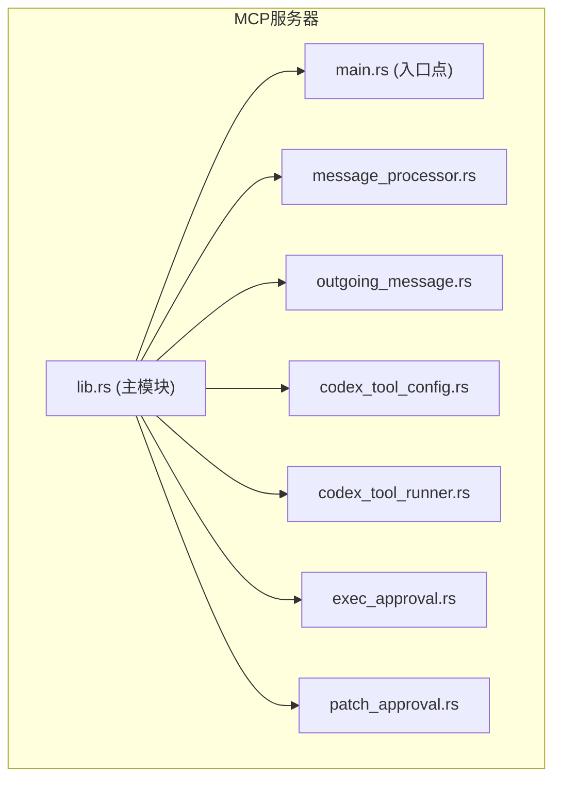
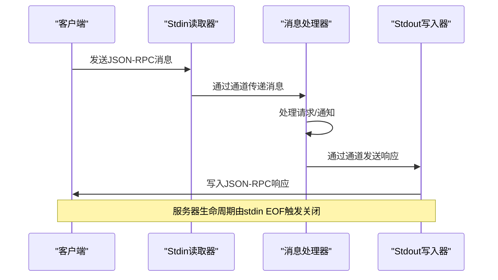
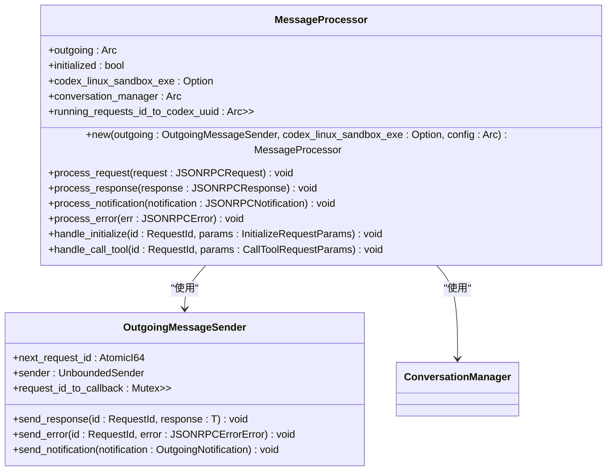
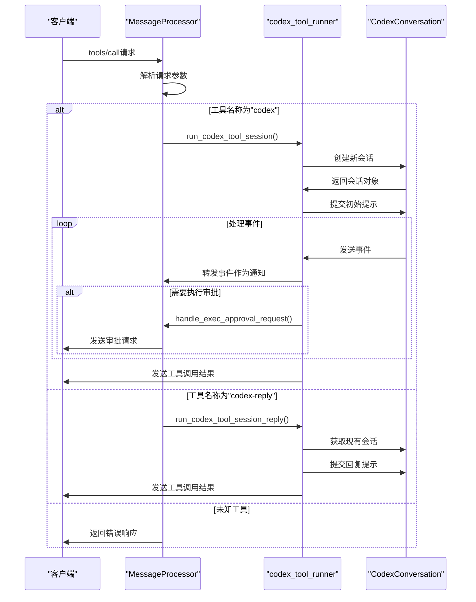
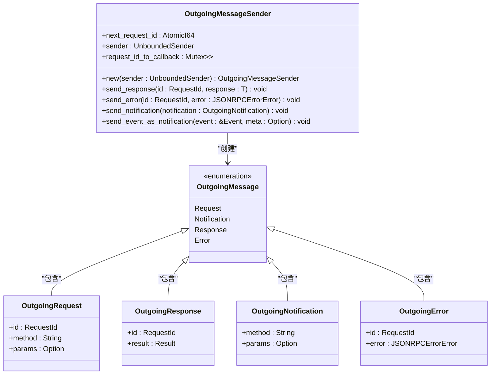
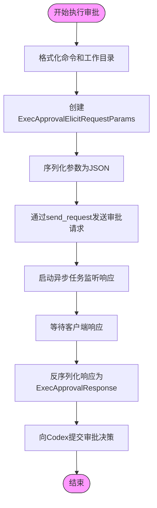
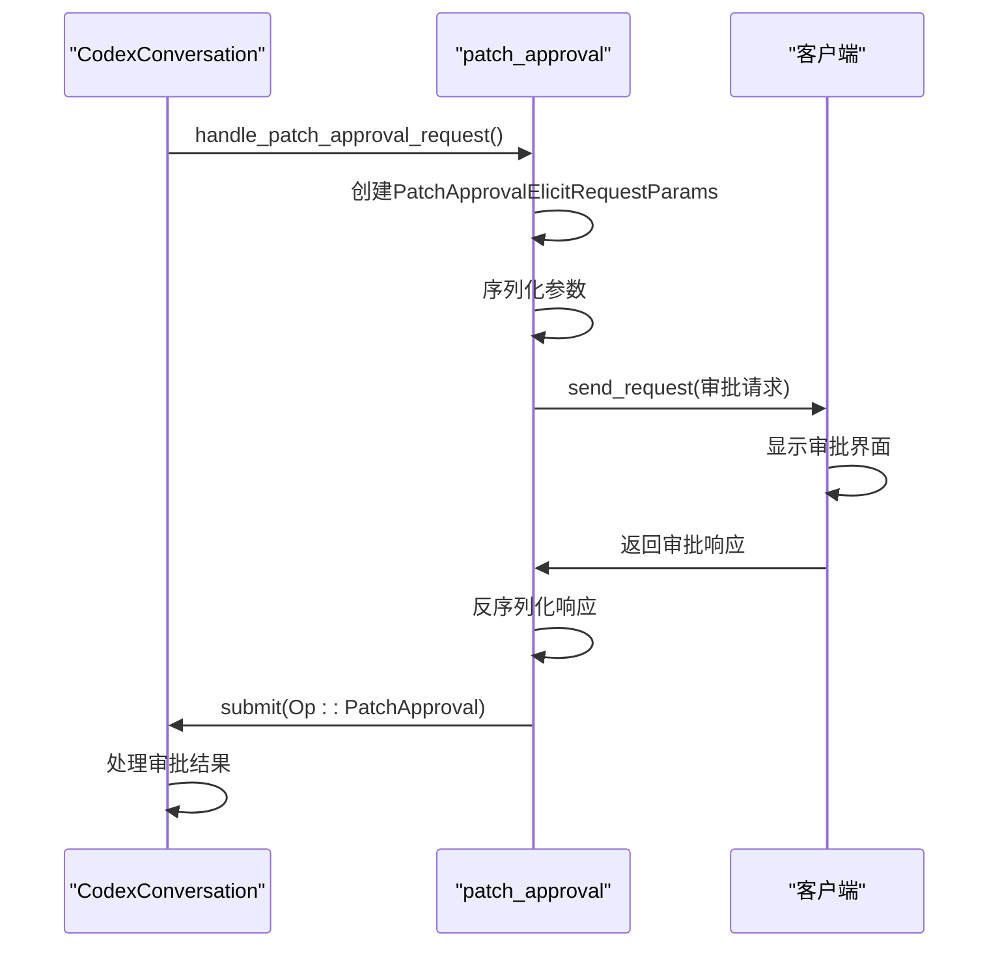
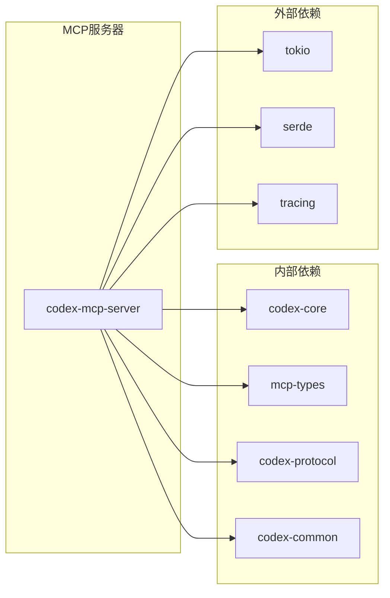

# MCP服务器

<cite>
**本文档中引用的文件**   
- [lib.rs](file://codex-rs\mcp-server\src\lib.rs)
- [main.rs](file://codex-rs\mcp-server\src\main.rs)
- [message_processor.rs](file://codex-rs\mcp-server\src\message_processor.rs)
- [outgoing_message.rs](file://codex-rs\mcp-server\src\outgoing_message.rs)
- [exec_approval.rs](file://codex-rs\mcp-server\src\exec_approval.rs)
- [patch_approval.rs](file://codex-rs\mcp-server\src\patch_approval.rs)
- [codex_tool_config.rs](file://codex-rs\mcp-server\src\codex_tool_config.rs)
- [codex_tool_runner.rs](file://codex-rs\mcp-server\src\codex_tool_runner.rs)
- [Cargo.toml](file://codex-rs\mcp-server\Cargo.toml)
</cite>

## 目录
1. [简介](#简介)
2. [项目结构](#项目结构)
3. [核心组件](#核心组件)
4. [架构概述](#架构概述)
5. [详细组件分析](#详细组件分析)
6. [依赖分析](#依赖分析)
7. [性能考虑](#性能考虑)
8. [故障排除指南](#故障排除指南)
9. [结论](#结论)

## 简介
MCP服务器是Codex系统与外部MCP工具之间的桥梁，负责处理JSON-RPC 2.0消息的接收、路由和响应。该服务器作为`mcp-server` crate实现，为Codex提供与Model Context Protocol兼容的接口，使Codex能够作为工具被集成到各种AI代理系统中。服务器通过stdin/stdout与客户端通信，处理来自客户端的请求并调用相应的工具处理器，同时通过`exec_approval`和`patch_approval`模块实现对工具执行和文件修改的安全审批机制。

## 项目结构
MCP服务器的项目结构遵循Rust crate的标准组织方式，核心功能位于`src`目录下。服务器的主要组件包括消息处理器、出站消息管理器、工具配置和运行器，以及执行和补丁审批模块。配置和日志记录机制通过依赖的core和common crate实现。

**图源**
- [lib.rs](file://codex-rs\mcp-server\src\lib.rs)
- [main.rs](file://codex-rs\mcp-server\src\main.rs)

## 核心组件
MCP服务器的核心组件包括`MessageProcessor`，它负责解析传入的请求并调用相应的工具处理器；`OutgoingMessage`系统，用于构建和发送响应；以及`exec_approval`和`patch_approval`模块，实现对工具执行和文件修改的安全审批。服务器的启动流程由`run_main`函数管理，该函数设置通道并启动三个主要任务：从stdin读取输入、处理传入消息和将出站消息写入stdout。

**节源**
- [lib.rs](file://codex-rs\mcp-server\src\lib.rs#L46-L148)
- [message_processor.rs](file://codex-rs\mcp-server\src\message_processor.rs#L39-L656)
- [outgoing_message.rs](file://codex-rs\mcp-server\src\outgoing_message.rs#L24-L136)

## 架构概述
MCP服务器采用基于Tokio的异步架构，通过三个并发任务处理消息流：一个任务从stdin读取JSON-RPC消息，另一个任务处理这些消息，第三个任务将响应写回stdout。这种设计实现了输入/处理/输出的分离，确保了服务器的响应性和可扩展性。

**图源**
- [lib.rs](file://codex-rs\mcp-server\src\lib.rs#L58-L146)

## 详细组件分析

### 消息处理分析
`MessageProcessor`是MCP服务器的核心，负责解析传入的JSON-RPC请求并路由到适当的处理程序。它维护服务器状态，包括是否已初始化，并处理各种MCP协议请求，如初始化、工具调用和列表请求。

#### 消息处理器类图

**图源**
- [message_processor.rs](file://codex-rs\mcp-server\src\message_processor.rs#L39-L656)
- [outgoing_message.rs](file://codex-rs\mcp-server\src\outgoing_message.rs#L24-L136)

#### 工具调用序列图

**图源**
- [message_processor.rs](file://codex-rs\mcp-server\src\message_processor.rs#L317-L423)
- [codex_tool_runner.rs](file://codex-rs\mcp-server\src\codex_tool_runner.rs#L39-L340)

### 出站消息系统分析
`OutgoingMessage`系统负责构建和发送JSON-RPC响应、通知和错误。它使用`OutgoingMessageSender`来管理请求回调和消息序列化。

#### 出站消息类图

**图源**
- [outgoing_message.rs](file://codex-rs\mcp-server\src\outgoing_message.rs#L24-L231)

### 安全审批机制分析
`exec_approval`和`patch_approval`模块实现了对工具执行和文件修改的安全审批。当Codex需要执行命令或应用补丁时，这些模块会向客户端发送审批请求，并等待用户的批准或拒绝。

#### 执行审批流程图

**图源**
- [exec_approval.rs](file://codex-rs\mcp-server\src\exec_approval.rs#L52-L154)

#### 补丁审批序列图

**图源**
- [patch_approval.rs](file://codex-rs\mcp-server\src\patch_approval.rs#L44-L151)

## 依赖分析
MCP服务器依赖于多个内部crate来实现其功能，包括`codex-core`用于核心会话管理，`mcp-types`用于MCP协议类型，以及`tokio`用于异步运行时。这些依赖关系通过Cargo.toml文件定义，并在lib.rs中通过use语句导入。

**图源**
- [Cargo.toml](file://codex-rs\mcp-server\Cargo.toml#L18-L38)

## 性能考虑
MCP服务器的性能主要受三个因素影响：通道容量、异步任务调度和JSON序列化/反序列化开销。服务器使用固定容量的通道（默认128条消息）来平衡吞吐量和内存使用。异步任务设计避免了阻塞操作，确保了高并发性能。JSON序列化使用serde_json，这是Rust中最快的JSON库之一。

## 故障排除指南
当MCP服务器出现问题时，可以按照以下步骤进行排查：

1. **检查日志输出**：服务器使用tracing库记录日志，通过设置RUST_LOG环境变量可以控制日志级别。
2. **验证JSON-RPC消息格式**：确保客户端发送的JSON-RPC消息符合规范，特别是id、method和params字段。
3. **检查初始化流程**：服务器必须先收到initialize请求才能处理其他请求，重复初始化会返回错误。
4. **调试审批流程**：如果审批请求没有正确处理，检查`exec_approval`和`patch_approval`模块的日志。
5. **验证工具调用**：确保工具名称正确（"codex"或"codex-reply"），并且参数符合预期格式。

**节源**
- [lib.rs](file://codex-rs\mcp-server\src\lib.rs#L50-L55)
- [message_processor.rs](file://codex-rs\mcp-server\src\message_processor.rs#L177-L229)
- [outgoing_message.rs](file://codex-rs\mcp-server\src\outgoing_message.rs#L127-L135)

## 结论
MCP服务器成功实现了Codex与外部MCP工具之间的桥梁功能，通过处理JSON-RPC 2.0消息实现了高效的通信。服务器的架构设计合理，通过三个并发任务分离了输入、处理和输出关注点。`MessageProcessor`有效地解析和路由请求，而`OutgoingMessage`系统则可靠地构建和发送响应。安全审批机制通过`exec_approval`和`patch_approval`模块得到了妥善实现，确保了系统安全性。整体设计遵循了Rust的最佳实践，具有良好的性能和可维护性。