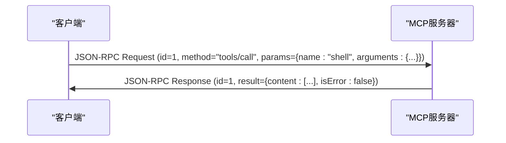

# 模型上下文协议（MCP）

<cite>
**本文档引用的文件**   
- [lib.rs](file://codex-rs\mcp-types\src\lib.rs)
- [main.rs](file://codex-rs\mcp-server\src\main.rs)
- [mcp_cmd.rs](file://codex-rs\cli\src\mcp_cmd.rs)
- [mod.rs](file://codex-rs\core\src\mcp\mod.rs)
- [mcp_connection_manager.rs](file://codex-rs\core\src\mcp_connection_manager.rs)
- [lib.rs](file://codex-rs\mcp-server\src\lib.rs)
- [message_processor.rs](file://codex-rs\mcp-server\src\message_processor.rs)
- [outgoing_message.rs](file://codex-rs\mcp-server\src\outgoing_message.rs)
- [codex_tool_config.rs](file://codex-rs\mcp-server\src\codex_tool_config.rs)
- [codex_tool_runner.rs](file://codex-rs\mcp-server\src\codex_tool_runner.rs)
- [exec_approval.rs](file://codex-rs\mcp-server\src\exec_approval.rs)
- [patch_approval.rs](file://codex-rs\mcp-server\src\patch_approval.rs)
- [index.ts](file://shell-tool-mcp\src\index.ts)
- [types.ts](file://shell-tool-mcp\src\types.ts)
</cite>

## 目录
1. [简介](#简介)
2. [MCP服务器启动与工具注册](#mcp服务器启动与工具注册)
3. [消息格式与JSON-RPC 2.0协议](#消息格式与json-rpc-20协议)
4. [mcp-types crate与工具模式定义](#mcp-types-crate与工具模式定义)
5. [shell-tool-mcp工具实现示例](#shell-tool-mcp工具实现示例)
6. [安全特性：执行审批与沙箱集成](#安全特性执行审批与沙箱集成)
7. [开发者指南：创建自定义MCP工具](#开发者指南创建自定义mcp工具)
8. [结论](#结论)

## 简介
模型上下文协议（Model Context Protocol, MCP）是Codex系统用于与外部工具（如Shell、数据库、版本控制系统）进行安全通信的核心机制。该协议基于JSON-RPC 2.0标准，定义了一套清晰的请求-响应和通知机制，允许Codex作为客户端与各种MCP服务器进行交互。通过MCP，Codex能够发现、调用和管理外部工具，从而扩展其功能，同时通过内置的审批机制和沙箱集成确保操作的安全性。本文档将全面介绍MCP的实现细节，包括服务器的启动方式、工具注册流程、消息格式、模式定义以及如何创建自定义工具。

## MCP服务器启动与工具注册
MCP服务器的启动是通过`codex mcp-server`命令行指令完成的。此命令会初始化一个MCP服务器实例，该实例通过标准输入（stdin）和标准输出（stdout）与客户端进行基于JSON-RPC 2.0的通信。服务器的主入口点位于`mcp-server` crate的`main.rs`文件中，其核心逻辑是创建一个事件循环，监听来自stdin的JSON-RPC消息，并将响应写回stdout。

工具的注册流程是通过`codex mcp add`命令实现的。该命令允许用户将一个外部工具（由一个可执行文件表示）注册为MCP服务器。注册过程会将工具的配置信息（如启动命令、环境变量等）写入Codex的全局配置文件中。`mcp_cmd.rs`文件中的`AddArgs`结构体定义了添加工具时所需的参数，包括工具名称、启动命令（或URL）以及环境变量。当一个工具被注册后，MCP服务器在初始化时会尝试启动该工具，并通过`initialize`请求与之建立连接，从而将其纳入可用工具列表。

**Section sources**
- [main.rs](file://codex-rs\mcp-server\src\main.rs#L1-L11)
- [mcp_cmd.rs](file://codex-rs\cli\src\mcp_cmd.rs#L1-L800)

## 消息格式与JSON-RPC 2.0协议
MCP严格遵循JSON-RPC 2.0协议规范。所有在客户端和服务器之间交换的消息都是JSON对象，其格式由`mcp_types::JSONRPCMessage`枚举定义，该枚举包含四种类型：`Request`（请求）、`Response`（响应）、`Notification`（通知）和`Error`（错误）。

- **请求 (Request)**: 由客户端发起，期望服务器返回响应。它包含一个`id`（用于匹配响应）、`method`（方法名，如`tools/call`）和可选的`params`（参数）。
- **响应 (Response)**: 服务器对请求的回复。它包含与请求相同的`id`和一个`result`字段，该字段承载了请求的返回值。
- **通知 (Notification)**: 一种单向消息，不需要响应。它没有`id`字段，常用于服务器向客户端推送状态更新。
- **错误 (Error)**: 当请求处理失败时，服务器会返回一个错误对象，其中包含`code`、`message`和可选的`data`。

例如，当客户端想要调用一个工具时，它会发送一个`tools/call`请求，其`params`是一个`CallToolRequestParams`对象，包含工具名称和参数。服务器处理后，会返回一个`CallToolResult`作为响应。



**Diagram sources **
- [lib.rs](file://codex-rs\mcp-types\src\lib.rs#L1-L800)

## mcp-types crate与工具模式定义
`mcp-types` crate是MCP协议的核心，它使用`serde`和`schemars`等库在Rust中定义了协议的所有数据结构，并自动生成了对应的JSON Schema。这确保了工具的输入和输出模式（Schema）是类型安全且可验证的。

该crate通过`ModelContextProtocolRequest`和`ModelContextProtocolNotification`这两个trait来定义请求和通知。例如，`CallToolRequest`是一个请求，其`METHOD`为`"tools/call"`，`Params`类型为`CallToolRequestParams`，`Result`类型为`CallToolResult`。`ToolInputSchema`结构体定义了工具输入参数的JSON Schema，它支持复杂的类型，如对象、枚举和布尔值。

通过`create_tool_for_codex_tool_call_param`这样的函数，可以基于Rust结构体（如`CodexToolCallParam`）动态生成完整的`Tool`定义，包括其名称、描述和输入模式。这使得工具的模式定义变得非常直观和易于维护。

**Section sources**
- [lib.rs](file://codex-rs\mcp-types\src\lib.rs#L1-L800)
- [codex_tool_config.rs](file://codex-rs\mcp-server\src\codex_tool_config.rs#L1-L344)

## shell-tool-mcp工具实现示例
`shell-tool-mcp`是一个用TypeScript编写的MCP工具实现示例，它允许Codex安全地执行Shell命令。该项目位于`shell-tool-mcp`目录下，其核心是`index.ts`文件。

该工具的实现方式是作为一个“包装器”，它启动一个名为`codex-exec-mcp-server`的底层Rust二进制文件。`index.ts`中的`main`函数负责根据当前操作系统和架构解析出正确的二进制文件路径，检查其是否存在，然后使用`node:child_process.spawn`来启动服务器进程，并将自身的命令行参数传递给它。

`types.ts`文件定义了用于选择正确Bash解释器的类型，如`LinuxBashVariant`和`OsReleaseInfo`。这体现了该工具在不同Linux发行版上的兼容性处理。整个实现展示了如何将一个强大的底层MCP服务器与一个轻量级的、可跨平台分发的Node.js包装器结合起来。

**Section sources**
- [index.ts](file://shell-tool-mcp\src\index.ts#L1-L97)
- [types.ts](file://shell-tool-mcp\src\types.ts#L1-L22)

## 安全特性：执行审批与沙箱集成
MCP协议内置了强大的安全机制，其中最关键的是执行审批（Approval）和沙箱（Sandboxing）集成。

当Codex生成一个需要执行Shell命令的计划时，MCP服务器会通过`elicitation/create`请求向客户端发起一个审批请求。`exec_approval.rs`文件中的`handle_exec_approval_request`函数负责处理此类请求。它会构造一个`ExecApprovalElicitRequestParams`对象，其中包含要执行的命令、工作目录等信息，并通过`outgoing_message_sender`发送出去。客户端（如Codex UI）会显示一个对话框，询问用户是否允许执行该命令。用户的决策（允许或拒绝）会通过一个`ElicitResult`响应返回，MCP服务器收到后会相应地提交`ExecApproval`操作给Codex核心。

沙箱集成通过`SandboxState`结构体实现，该结构体定义了沙箱策略（如只读、工作区可写等）。`mcp_connection_manager.rs`中的`notify_sandbox_state_change`方法负责将当前的沙箱状态通知给所有已连接的MCP服务器，确保它们在正确的安全上下文中运行。

```mermaid
flowchart TD
A[Codex生成执行命令] --> B{MCP服务器}
B --> C[发送审批请求 (elicitation/create)]
C --> D[客户端UI显示审批对话框]
D --> E{用户决策}
E --> |允许| F[提交ExecApproval: 允许]
E --> |拒绝| G[提交ExecApproval: 拒绝]
F --> H[执行命令]
G --> I[中止执行]
```

**Diagram sources **
- [exec_approval.rs](file://codex-rs\mcp-server\src\exec_approval.rs#L1-L154)
- [mcp_connection_manager.rs](file://codex-rs\core\src\mcp_connection_manager.rs#L1-L800)

## 开发者指南：创建自定义MCP工具
为Codex创建自定义MCP工具的分步指南如下：

1.  **定义工具规范**: 首先，确定你的工具需要哪些输入参数。在Rust中，创建一个实现`JsonSchema`和`Deserialize`的结构体来定义这些参数的模式。参考`codex_tool_config.rs`中的`CodexToolCallParam`。
2.  **实现MCP服务器**: 创建一个新的Rust crate，实现`ModelContextProtocolRequest` trait来处理`initialize`、`tools/list`和`tools/call`等核心方法。`mcp-server` crate提供了一个很好的起点。
3.  **处理请求**: 在`tools/call`请求的处理函数中，解析传入的参数，执行你的工具逻辑，并构造一个`CallToolResult`作为响应。确保处理所有可能的错误情况并返回适当的错误信息。
4.  **集成安全特性**: 如果你的工具涉及系统操作，务必实现审批机制。使用`send_request`方法发起`elicitation/create`请求，并等待用户的响应。
5.  **打包与分发**: 将你的工具编译成可执行文件。可以像`shell-tool-mcp`一样，创建一个Node.js包装器来简化跨平台分发和启动。
6.  **注册工具**: 使用`codex mcp add my-tool -- /path/to/your/tool`命令将你的工具注册到Codex中。

通过遵循这些步骤，开发者可以创建出功能强大且安全的MCP工具，极大地扩展Codex的能力。

**Section sources**
- [message_processor.rs](file://codex-rs\mcp-server\src\message_processor.rs#L1-L656)
- [outgoing_message.rs](file://codex-rs\mcp-server\src\outgoing_message.rs#L1-L352)
- [codex_tool_runner.rs](file://codex-rs\mcp-server\src\codex_tool_runner.rs#L1-L340)

## 结论
模型上下文协议（MCP）是Codex系统实现安全、可扩展的外部工具集成的基石。通过基于JSON-RPC 2.0的标准化通信、由`mcp-types` crate定义的强类型模式以及`shell-tool-mcp`提供的清晰实现示例，MCP为开发者提供了一个强大而灵活的框架。其核心安全特性，如执行审批和沙箱集成，确保了自动化操作在用户知情和控制的范围内进行。掌握MCP的原理和实现，是开发和利用Codex高级功能的关键。