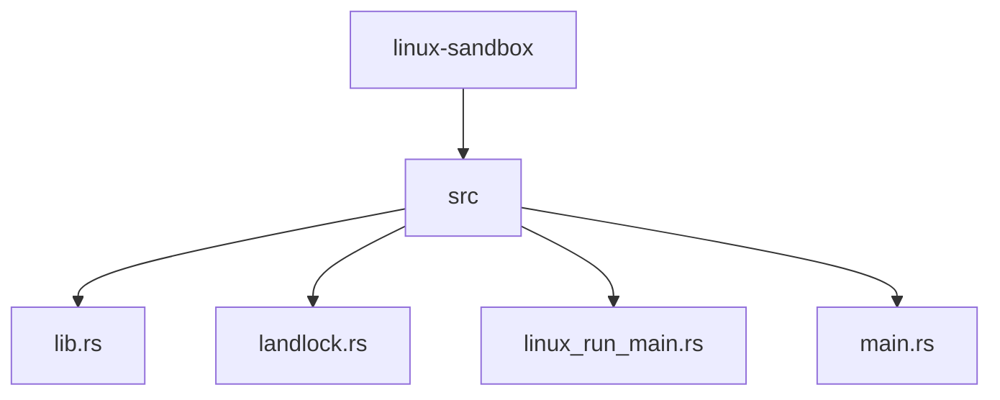
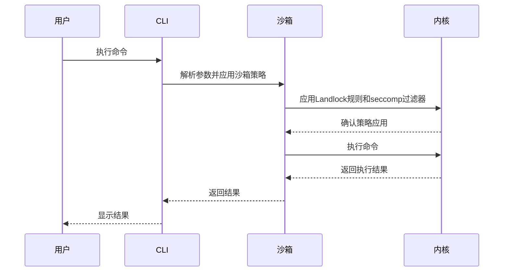
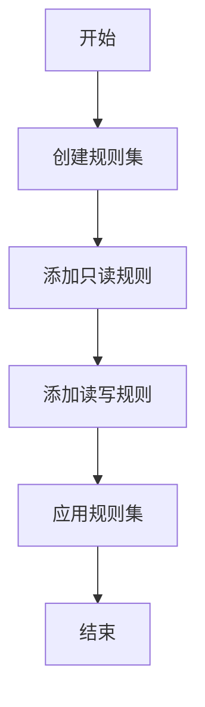
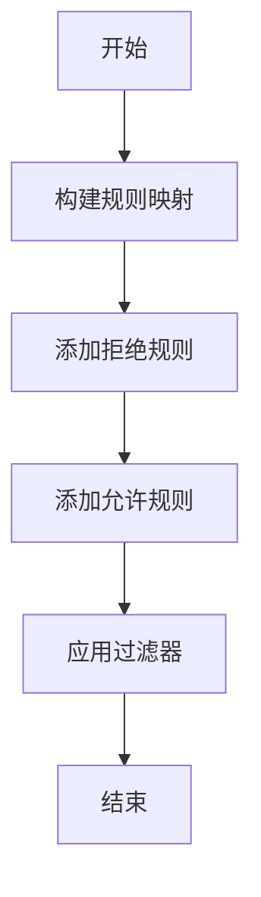
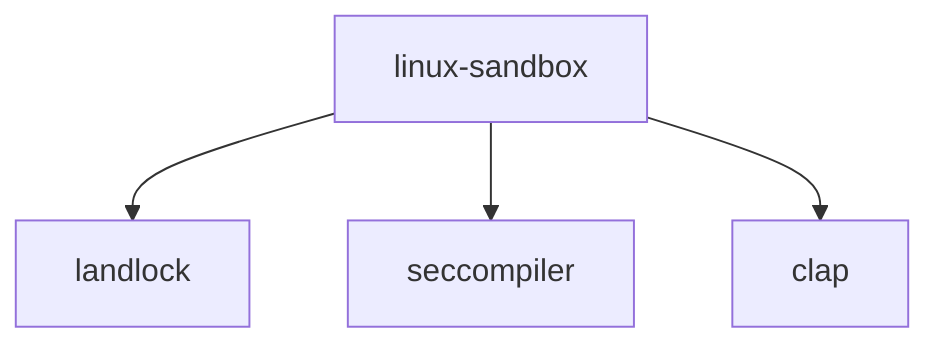

# Linux沙箱机制

<cite>
**本文档引用的文件**   
- [lib.rs](file://codex-rs\linux-sandbox\src\lib.rs)
- [landlock.rs](file://codex-rs\linux-sandbox\src\landlock.rs)
- [linux_run_main.rs](file://codex-rs\linux-sandbox\src\linux_run_main.rs)
- [main.rs](file://codex-rs\linux-sandbox\src\main.rs)
- [config.toml](file://codex-rs\core\src\config\mod.rs)
- [protocol.rs](file://codex-rs\protocol\src\protocol.rs)
</cite>

## 目录
1. [引言](#引言)
2. [项目结构](#项目结构)
3. [核心组件](#核心组件)
4. [架构概述](#架构概述)
5. [详细组件分析](#详细组件分析)
6. [依赖分析](#依赖分析)
7. [性能考虑](#性能考虑)
8. [故障排除指南](#故障排除指南)
9. [结论](#结论)

## 引言
Codex在Linux平台上的沙箱机制利用Landlock LSM（Linux Security Module）实现细粒度的文件系统访问控制。该机制确保AI生成的命令只能访问工作目录及其子目录，从而增强系统的安全性。通过结合`linux-sandbox/src/lib.rs`中的代码，本文档详细说明了沙箱的初始化流程、权限边界设置以及与内核的交互机制。

## 项目结构
Codex的Linux沙箱机制主要位于`codex-rs/linux-sandbox`目录下，包含以下几个关键文件：
- `src/lib.rs`：定义了沙箱的主要接口和功能。
- `src/landlock.rs`：实现了Landlock相关的文件系统规则和网络访问控制。
- `src/linux_run_main.rs`：处理沙箱策略的应用和命令执行。
- `src/main.rs`：入口点，调用`run_main`函数启动沙箱。

**图源**
- [lib.rs](file://codex-rs\linux-sandbox\src\lib.rs)
- [landlock.rs](file://codex-rs\linux-sandbox\src\landlock.rs)
- [linux_run_main.rs](file://codex-rs\linux-sandbox\src\linux_run_main.rs)
- [main.rs](file://codex-rs\linux-sandbox\src\main.rs)

**节源**
- [lib.rs](file://codex-rs\linux-sandbox\src\lib.rs)
- [landlock.rs](file://codex-rs\linux-sandbox\src\landlock.rs)
- [linux_run_main.rs](file://codex-rs\linux-sandbox\src\linux_run_main.rs)
- [main.rs](file://codex-rs\linux-sandbox\src\main.rs)

## 核心组件
### 沙箱初始化
沙箱的初始化流程由`run_main`函数驱动，该函数首先解析命令行参数，然后应用沙箱策略，最后执行指定的命令。`apply_sandbox_policy_to_current_thread`函数负责将沙箱策略应用于当前线程，确保只有子进程继承这些策略。

**节源**
- [linux_run_main.rs](file://codex-rs\linux-sandbox\src\linux_run_main.rs)
- [landlock.rs](file://codex-rs\linux-sandbox\src\landlock.rs)

### 权限边界设置
权限边界通过`install_filesystem_landlock_rules_on_current_thread`函数设置，该函数允许对整个文件系统的读取访问，同时限制写入访问到`/dev/null`和指定的可写根目录。此外，`install_network_seccomp_filter_on_current_thread`函数通过seccomp过滤器阻止出站网络访问，除了AF_UNIX域套接字。

**节源**
- [landlock.rs](file://codex-rs\linux-sandbox\src\landlock.rs)

## 架构概述
Codex的Linux沙箱机制通过Landlock LSM和seccomp过滤器实现细粒度的访问控制。沙箱策略通过命令行参数和配置文件进行配置，确保AI生成的命令只能在指定的权限范围内操作。

**图源**
- [linux_run_main.rs](file://codex-rs\linux-sandbox\src\linux_run_main.rs)
- [landlock.rs](file://codex-rs\linux-sandbox\src\landlock.rs)

## 详细组件分析
### Landlock规则应用
`install_filesystem_landlock_rules_on_current_thread`函数通过创建一个规则集来限制文件系统的写入访问。规则集包括对`/`的只读访问和对`/dev/null`的读写访问。如果指定了可写根目录，则这些目录也会被添加到规则集中。

**图源**
- [landlock.rs](file://codex-rs\linux-sandbox\src\landlock.rs)

### 网络访问控制
`install_network_seccomp_filter_on_current_thread`函数通过构建一个规则映射来阻止出站网络访问。规则映射包括对`connect`、`accept`等系统调用的拒绝规则，但允许`recvfrom`以支持某些工具的正常运行。

**图源**
- [landlock.rs](file://codex-rs\linux-sandbox\src\landlock.rs)

## 依赖分析
Codex的Linux沙箱机制依赖于以下外部库：
- `landlock`：用于实现文件系统访问控制。
- `seccompiler`：用于生成和应用seccomp过滤器。
- `clap`：用于解析命令行参数。

**图源**
- [Cargo.toml](file://codex-rs\linux-sandbox\Cargo.toml)

**节源**
- [Cargo.toml](file://codex-rs\linux-sandbox\Cargo.toml)

## 性能考虑
沙箱机制在应用规则集和过滤器时可能会引入一定的性能开销。为了最小化这种开销，建议在配置沙箱策略时尽量减少不必要的规则和过滤器。

## 故障排除指南
### 常见错误
- **内核版本不兼容**：确保使用的Linux内核版本支持Landlock LSM。
- **权限不足**：确保运行沙箱的用户具有足够的权限来应用规则集和过滤器。

**节源**
- [landlock.rs](file://codex-rs\linux-sandbox\src\landlock.rs)

## 结论
Codex的Linux沙箱机制通过Landlock LSM和seccomp过滤器实现了细粒度的文件系统和网络访问控制。通过合理的配置和使用，可以有效增强系统的安全性，防止AI生成的命令对系统造成潜在威胁。