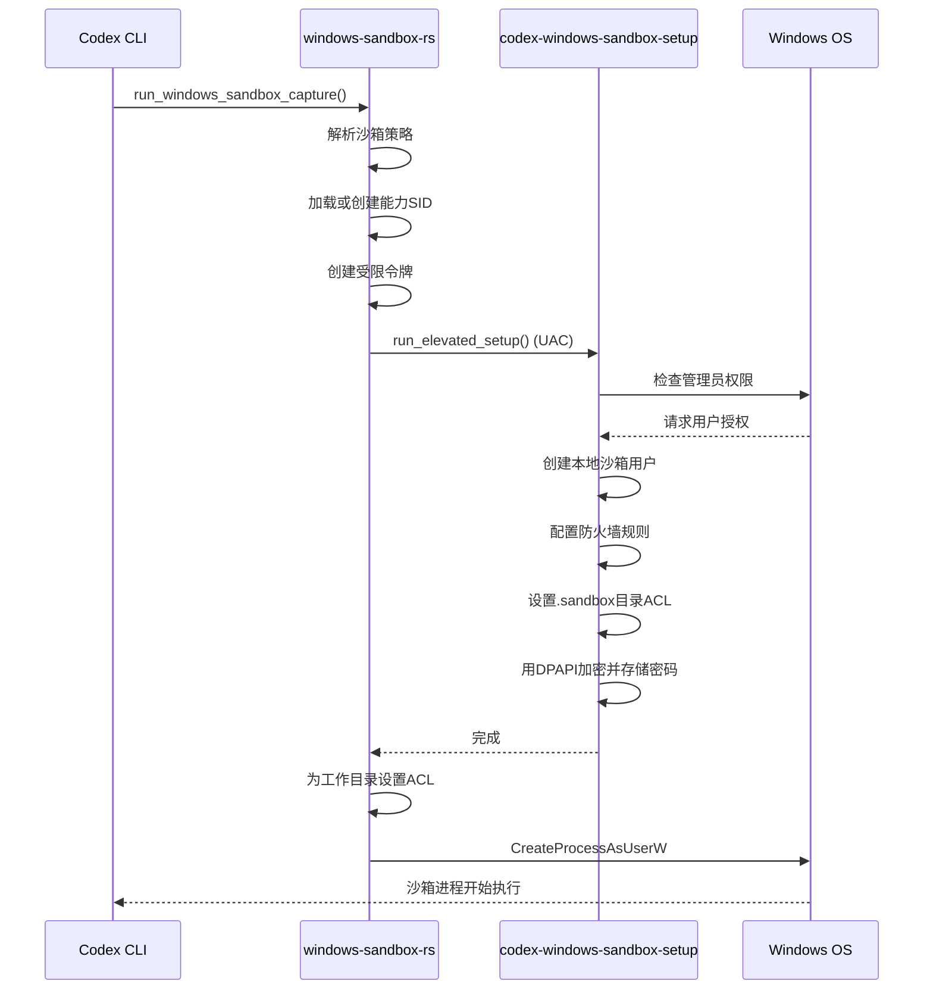

# Windows沙箱机制

<cite>
**本文档引用的文件**   
- [lib.rs](file://codex-rs/windows-sandbox-rs/src/lib.rs)
- [token.rs](file://codex-rs/windows-sandbox-rs/src/token.rs)
- [acl.rs](file://codex-rs/windows-sandbox-rs/src/acl.rs)
- [dpapi.rs](file://codex-rs/windows-sandbox-rs/src/dpapi.rs)
- [setup_orchestrator.rs](file://codex-rs/windows-sandbox-rs/src/setup_orchestrator.rs)
- [setup_main_win.rs](file://codex-rs/windows-sandbox-rs/src/setup_main_win.rs)
- [policy.rs](file://codex-rs/windows-sandbox-rs/src/policy.rs)
- [elevated_impl.rs](file://codex-rs/windows-sandbox-rs/src/elevated_impl.rs)
- [debug_sandbox.rs](file://codex-rs/cli/src/debug_sandbox.rs)
- [sandbox_smoketests.py](file://codex-rs/windows-sandbox-rs/sandbox_smoketests.py)
</cite>

## 目录
1. [引言](#引言)
2. [核心安全机制](#核心安全机制)
3. [沙箱初始化流程](#沙箱初始化流程)
4. [权限边界设置](#权限边界设置)
5. [进程创建与安全上下文](#进程创建与安全上下文)
6. [配置与策略管理](#配置与策略管理)
7. [部署与调试指南](#部署与调试指南)
8. [常见错误与解决方案](#常见错误与解决方案)
9. [总结](#总结)

## 引言
Codex在Windows平台上的沙箱机制旨在为代码执行提供一个高度安全的隔离环境。该机制通过结合Windows令牌限制（Token Restriction）、访问控制列表（ACL）和数据保护API（DPAPI）来构建一个坚固的执行环境。沙箱通过降低进程权限、限制访问令牌和设置目录ACL，有效防止了对系统关键文件的未授权修改。本文档将深入分析`windows-sandbox-rs`模块的实现，详细阐述沙箱的初始化流程、权限边界设置、进程创建和安全上下文管理，并提供配置Windows沙箱策略的具体方法。

## 核心安全机制

Codex的Windows沙箱机制依赖于三个核心的Windows安全特性：令牌限制、访问控制列表（ACL）和数据保护API（DPAPI）。

### 令牌限制（Token Restriction）
令牌限制是沙箱实现权限降级的核心。沙箱不直接以低权限用户身份运行，而是通过`CreateRestrictedToken` API 对当前用户的访问令牌（Access Token）进行限制，创建一个“受限令牌”（Restricted Token）。这个受限令牌继承了原始令牌的身份，但被剥夺了大部分权限和组成员资格。

在`token.rs`文件中，`create_readonly_token_with_cap_from`和`create_workspace_write_token_with_cap_from`函数实现了这一过程。它们首先通过`get_current_token_for_restriction`获取当前进程的令牌，然后调用`CreateRestrictedToken`，并传入以下标志：
- `DISABLE_MAX_PRIVILEGE`: 禁用令牌中的所有特权。
- `LUA_TOKEN`: 将令牌标记为“有限用户账户”（Limited User Account）令牌。
- `WRITE_RESTRICTED`: 进一步限制写入权限。

通过这种方式，沙箱进程虽然以用户身份运行，但其权限被严格限制，无法执行需要管理员权限或高特权的操作。

### 访问控制列表（ACL）
ACL是Windows文件系统和对象安全的基础。沙箱利用ACL来精确控制沙箱进程对文件和目录的访问权限。主要通过两种方式实现：
1.  **路径级别的ACL**：在特定目录上设置允许（Allow）和拒绝（Deny）ACE（访问控制项），以控制沙箱进程的读写权限。
2.  **令牌级别的ACL**：为受限令牌设置一个默认的DACL（自主访问控制列表），以控制沙箱进程创建的IPC对象（如管道、事件）的访问权限。

在`acl.rs`文件中，`add_allow_ace`和`add_deny_write_ace`函数负责在指定路径上添加允许或拒绝写入的ACE。`set_default_dacl`函数则在`token.rs`中被调用，为受限令牌设置一个宽松的默认DACL，允许沙箱内的进程相互通信，避免因权限问题导致PowerShell管道等操作失败。

### 数据保护API（DPAPI）
DPAPI（Data Protection API）用于安全地存储敏感信息，例如沙箱用户的密码。沙箱在设置阶段会为专用的沙箱用户生成随机密码，并使用`CryptProtectData`函数将密码加密。加密后的数据与用户信息一起存储在`sandbox_users.json`文件中。当需要以沙箱用户身份运行进程时，再使用`CryptUnprotectData`函数解密密码。

`dpapi.rs`文件提供了`protect`和`unprotect`两个简单的封装函数，用于调用底层的`CryptProtectData`和`CryptUnprotectData` API。这种机制确保了即使`sandbox_users.json`文件被读取，攻击者也无法轻易获取明文密码。

**Section sources**
- [token.rs](file://codex-rs/windows-sandbox-rs/src/token.rs#L1-L384)
- [acl.rs](file://codex-rs/windows-sandbox-rs/src/acl.rs#L1-L630)
- [dpapi.rs](file://codex-rs/windows-sandbox-rs/src/dpapi.rs#L1-L82)

## 沙箱初始化流程

沙箱的初始化是一个多阶段的过程，涉及权限提升、用户创建和权限配置。

**Diagram sources**
- [lib.rs](file://codex-rs/windows-sandbox-rs/src/lib.rs#L184-L427)
- [setup_orchestrator.rs](file://codex-rs/windows-sandbox-rs/src/setup_orchestrator.rs#L367-L400)
- [setup_main_win.rs](file://codex-rs/windows-sandbox-rs/src/setup_main_win.rs#L659-L714)

**Section sources**
- [lib.rs](file://codex-rs/windows-sandbox-rs/src/lib.rs#L184-L427)
- [setup_orchestrator.rs](file://codex-rs/windows-sandbox-rs/src/setup_orchestrator.rs#L367-L400)
- [setup_main_win.rs](file://codex-rs/windows-sandbox-rs/src/setup_main_win.rs#L659-L714)

## 权限边界设置

沙箱的权限边界由沙箱策略（Sandbox Policy）定义，并通过ACL和令牌限制来强制执行。

### 沙箱策略
沙箱策略决定了沙箱的权限级别。目前支持两种主要模式：
- **只读（read-only）**: 沙箱进程对工作区目录只有读取和执行权限，无法进行任何写入操作。
- **工作区写入（workspace-write）**: 沙箱进程对工作区目录拥有完全的读写权限。

策略在`policy.rs`文件中通过`parse_policy`函数解析。该函数将命令行参数（如`read-only`）或JSON字符串转换为`SandboxPolicy`枚举。`DangerFullAccess`和`ExternalSandbox`策略被明确禁止在沙箱中使用。

### ACL权限配置
权限配置是沙箱安全的关键。其核心思想是“最小权限原则”，即只授予完成任务所必需的权限。

1.  **设置阶段（Setup Phase）**:
    *   **创建沙箱用户**: `setup_main_win.rs`中的`ensure_local_user`函数创建两个本地用户（`CodexSandboxOffline`和`CodexSandboxOnline`）。
    *   **配置.sandbox目录**: `lock_sandbox_dir`函数为`.sandbox`目录设置ACL，确保SYSTEM、Administrators和真实用户拥有完全控制权，而沙箱用户也拥有完全控制权，以便其可以创建和管理自己的文件。
    *   **配置读取权限**: `apply_read_acls`函数为系统关键目录（如`C:\Windows`）和用户配置文件目录设置读取权限，允许沙箱进程访问必要的系统文件和用户数据。

2.  **运行阶段（Runtime Phase）**:
    *   **工作区写入**: 当策略为`workspace-write`时，`add_allow_ace`函数会为工作区目录（CWD）添加一个允许读、写、执行的ACE，授予沙箱进程写入权限。
    *   **只读限制**: 当策略为`read-only`时，`add_deny_write_ace`函数会为工作区目录添加一个拒绝写入的ACE，阻止任何修改操作。

**Section sources**
- [policy.rs](file://codex-rs/windows-sandbox-rs/src/policy.rs#L1-L58)
- [setup_main_win.rs](file://codex-rs/windows-sandbox-rs/src/setup_main_win.rs#L515-L618)
- [acl.rs](file://codex-rs/windows-sandbox-rs/src/acl.rs#L379-L508)

## 进程创建与安全上下文

沙箱进程的创建是整个流程的最后一步，它利用了之前准备好的安全上下文。

### 创建受限令牌
在`lib.rs`的`run_windows_sandbox_capture`函数中，首先根据沙箱策略加载或创建一个“能力SID”（Capability SID）。这个SID是沙箱权限的“能力令牌”。然后，调用`token.rs`中的`create_readonly_token_with_cap`或`create_workspace_write_token_with_cap`函数，传入能力SID，创建一个受限令牌。

### 配置进程环境
在创建进程之前，需要配置好进程的环境：
*   **环境变量**: 通过`make_env_block`函数将`HashMap<String, String>`格式的环境变量转换为Windows API所需的`u16`数组块。
*   **标准I/O管道**: 调用`CreatePipe`创建三对匿名管道，分别用于重定向沙箱进程的stdin、stdout和stderr，以便主进程可以捕获其输出。

### 启动沙箱进程
最后，调用`CreateProcessAsUserW` API，使用之前创建的受限令牌来启动沙箱进程。此API需要提供：
*   `hToken`: 受限令牌的句柄。
*   `lpCommandLine`: 要执行的命令行。
*   `lpEnvironment`: 环境变量块。
*   `lpCurrentDirectory`: 工作目录。
*   `lpStartupInfo`: 包含标准I/O管道句柄的启动信息。

一旦`CreateProcessAsUserW`成功返回，沙箱进程便在受限的安全上下文中开始执行。

**Section sources**
- [lib.rs](file://codex-rs/windows-sandbox-rs/src/lib.rs#L206-L320)
- [token.rs](file://codex-rs/windows-sandbox-rs/src/token.rs#L287-L383)

## 配置与策略管理

开发者可以通过命令行参数和配置文件来调整沙箱的行为。

### 命令行参数
通过Codex CLI，可以使用以下参数：
*   `--sandbox read-only`: 使用只读沙箱策略。
*   `--sandbox workspace-write` 或 `--full-auto`: 使用工作区写入沙箱策略。
*   `-c "sandbox_workspace_write.writable_roots=[\"C:\\\\path\\\\to\\\\extra\"]"`: 通过配置覆盖，为`workspace-write`策略添加额外的可写根目录。

这些参数在`debug_sandbox.rs`文件的`run_command_under_windows`函数中被处理，并最终转换为`SandboxPolicy`。

### 配置文件
沙箱的持久化配置（如沙箱用户的加密密码和设置标记）存储在用户主目录下的`.codex/.sandbox`文件夹中：
*   `sandbox_users.json`: 包含`CodexSandboxOffline`和`CodexSandboxOnline`用户的用户名和DPAPI加密后的密码。
*   `setup_marker.json`: 包含设置版本、用户名和创建时间，用于判断是否需要重新运行设置。

**Section sources**
- [debug_sandbox.rs](file://codex-rs/cli/src/debug_sandbox.rs#L76-L206)
- [setup_main_win.rs](file://codex-rs/windows-sandbox-rs/src/setup_main_win.rs#L620-L657)

## 部署与调试指南

### 部署
1.  确保Codex CLI已正确安装。
2.  首次使用沙箱时，系统会自动触发UAC（用户账户控制）提示，请求管理员权限以完成初始设置。
3.  设置完成后，沙箱即可通过CLI命令使用。

### 调试
*   **日志文件**: 沙箱的详细日志记录在`.codex/.sandbox/codex-windows-sandbox.log`文件中。这是排查问题的第一手资料。
*   **烟雾测试**: 项目提供了`sandbox_smoketests.py`脚本，可以运行一系列测试用例来验证沙箱功能是否正常。
*   **调试命令**: 使用`codex debug-sandbox windows`命令可以手动在沙箱中执行命令，便于测试和调试。

**Section sources**
- [setup_main_win.rs](file://codex-rs/windows-sandbox-rs/src/setup_main_win.rs#L660-L678)
- [sandbox_smoketests.py](file://codex-rs/windows-sandbox-rs/sandbox_smoketests.py#L1-L502)

## 常见错误与解决方案

### UAC权限问题
*   **现象**: 沙箱设置失败，提示需要管理员权限。
*   **原因**: 初始设置需要创建本地用户和修改防火墙规则，这需要管理员权限。
*   **解决方案**: 确保当前用户是管理员组成员，并在出现UAC提示时点击“是”。如果在非管理员账户下运行，设置将失败。

### ACL设置失败
*   **现象**: 沙箱进程无法读取或写入预期的文件或目录。
*   **原因**: `SetEntriesInAclW`或`SetNamedSecurityInfoW` API调用失败。
*   **解决方案**: 
    1.  检查`.codex/.sandbox/codex-windows-sandbox.log`日志文件，查看具体的错误代码。
    2.  确认目标路径存在且可访问。
    3.  尝试手动删除`.codex/.sandbox`目录，然后重新运行一个沙箱命令，触发重新设置。

### 沙箱进程启动失败
*   **现象**: `CreateProcessAsUserW`或`CreateProcessWithLogonW`失败。
*   **原因**: 可能是令牌创建失败、环境变量问题或命令行格式错误。
*   **解决方案**: 
    1.  检查日志文件中`CreateProcessAsUserW failed`的详细错误信息。
    2.  确认沙箱用户的密码已正确解密（检查DPAPI是否正常工作）。
    3.  验证要执行的命令和工作目录是否正确。

**Section sources**
- [lib.rs](file://codex-rs/windows-sandbox-rs/src/lib.rs#L297-L319)
- [setup_main_win.rs](file://codex-rs/windows-sandbox-rs/src/setup_main_win.rs#L193-L217)
- [elevated_impl.rs](file://codex-rs/windows-sandbox-rs/src/elevated_impl.rs#L355-L358)

## 总结
Codex的Windows沙箱机制通过巧妙地结合Windows的令牌限制、ACL和DPAPI，构建了一个强大且灵活的安全执行环境。它通过在设置阶段进行一次性的权限提升操作，避免了在每次执行时都请求UAC，同时利用受限令牌和精细的ACL控制，确保了沙箱进程的权限被严格限制。这种设计在安全性和用户体验之间取得了良好的平衡，为在Windows平台上安全地执行代码提供了可靠的保障。