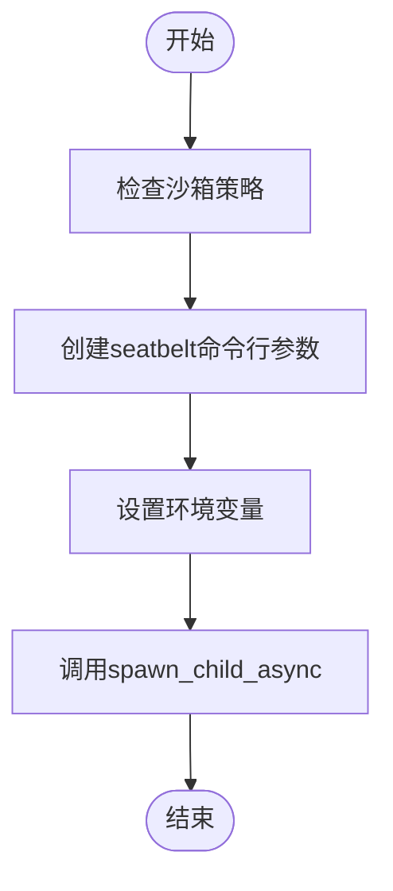
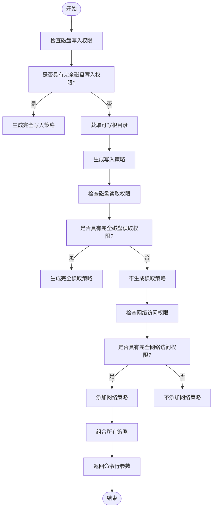

# macOS沙箱机制

<cite>
**本文档中引用的文件**  
- [seatbelt.rs](file://codex-rs\core\src\seatbelt.rs)
- [seatbelt_base_policy.sbpl](file://codex-rs\core\src\seatbelt_base_policy.sbpl)
- [seatbelt_network_policy.sbpl](file://codex-rs\core\src\seatbelt_network_policy.sbpl)
- [protocol.rs](file://codex-rs\protocol\src\protocol.rs)
- [spawn.rs](file://codex-rs\core\src\spawn.rs)
- [seatbelt.rs](file://codex-rs\cli\src\debug_sandbox\seatbelt.rs)
- [sandbox.md](file://docs\sandbox.md)
</cite>

## 目录
1. [简介](#简介)
2. [Seatbelt与系统完整性保护(SIP)](#seatbelt与系统完整性保护sip)
3. [沙箱配置文件详解](#沙箱配置文件详解)
4. [沙箱启动流程](#沙箱启动流程)
5. [权限降级机制](#权限降级机制)
6. [与SIP的交互](#与sip的交互)
7. [配置macOS沙箱策略](#配置macos沙箱策略)
8. [沙箱调试技巧](#沙箱调试技巧)
9. [常见沙箱错误及解决方案](#常见沙箱错误及解决方案)

## 简介
Codex在macOS平台上的沙箱机制主要依赖于苹果的Seatbelt框架来限制应用程序的权限。该机制通过定义进程可以访问的资源范围，防止对系统关键目录（如/System、/usr、/bin）的未授权访问。本文档将深入解释如何利用Seatbelt和系统完整性保护（SIP）来实现这些安全限制，并结合`core/src/sandboxing/`模块中的实现，描述沙箱的启动流程、权限降级机制以及与SIP的交互。

## Seatbelt与系统完整性保护(SIP)
Seatbelt是苹果提供的沙箱框架，用于限制应用程序的权限。Codex使用`/usr/bin/sandbox-exec`来执行命令，确保即使攻击者试图在PATH上注入恶意版本，也无法绕过沙箱限制。如果`/usr/bin/sandbox-exec`被篡改，则攻击者已经拥有root权限。

系统完整性保护（SIP）进一步增强了安全性，防止对系统关键目录的未授权访问。结合Seatbelt和SIP，Codex能够有效地限制应用程序的行为，确保系统的安全性和稳定性。

## 沙箱配置文件详解
Codex的沙箱配置文件包括基础策略文件`seatbelt_base_policy.sbpl`和网络策略文件`seatbelt_network_policy.sbpl`。这些文件定义了进程可以执行的操作和访问的资源。

### 基础策略文件
`seatbelt_base_policy.sbpl`文件定义了基本的安全策略，包括：
- 默认拒绝所有操作
- 允许子进程继承父进程的策略
- 允许读取用户偏好设置
- 允许进程信息查询
- 允许写入`/dev/null`
- 允许读取特定的sysctl参数

### 网络策略文件
`seatbelt_network_policy.sbpl`文件在启用网络访问时添加额外的策略，包括：
- 允许出站和入站网络连接
- 允许系统套接字
- 允许mach-lookup以查找用户缓存目录
- 允许读取网络配置

## 沙箱启动流程
沙箱的启动流程由`spawn_command_under_seatbelt`函数控制。该函数接收命令、工作目录、沙箱策略等参数，并生成相应的`sandbox-exec`命令行参数。



**Diagram sources**
- [seatbelt.rs](file://codex-rs\core\src\seatbelt.rs#L23-L44)

## 权限降级机制
权限降级机制通过`create_seatbelt_command_args`函数实现。该函数根据沙箱策略生成相应的文件读写和网络访问策略。



**Diagram sources**
- [seatbelt.rs](file://codex-rs\core\src\seatbelt.rs#L46-L135)

## 与SIP的交互
SIP与Seatbelt协同工作，确保系统关键目录的安全。当沙箱策略尝试访问受SIP保护的目录时，即使沙箱策略允许，SIP也会阻止访问。这种双重保护机制大大增强了系统的安全性。

## 配置macOS沙箱策略
可以通过命令行参数和配置文件调整沙箱行为。例如，使用`--sandbox`参数指定沙箱模式，使用`--ask-for-approval`参数控制审批策略。

```toml
# approval mode
approval_policy = "untrusted"
sandbox_mode    = "read-only"

# full-auto mode
approval_policy = "on-request"
sandbox_mode    = "workspace-write"

# Optional: allow network in workspace-write mode
[sandbox_workspace_write]
network_access = true
```

**Section sources**
- [sandbox.md](file://docs\sandbox.md#L29-L43)

## 沙箱调试技巧
开发者可以使用CLI工具来测试命令在Codex沙箱中的行为。例如，使用`codex sandbox macos`命令来测试macOS上的沙箱行为。

```bash
# macOS
codex sandbox macos [--full-auto] [COMMAND]...

# Linux
codex sandbox linux [--full-auto] [COMMAND]...

# Legacy aliases
codex debug seatbelt [--full-auto] [COMMAND]...
codex debug landlock [--full-auto] [COMMAND]...
```

**Section sources**
- [sandbox.md](file://docs\sandbox.md#L82-L96)

## 常见沙箱错误及解决方案
### 权限被拒绝
当进程尝试访问未授权的资源时，会收到权限被拒绝的错误。解决方案是检查沙箱策略，确保所需的资源已被正确授权。

### 配置文件加载失败
如果沙箱配置文件无法加载，可能是文件路径错误或文件损坏。解决方案是验证文件路径和内容的正确性。

**Section sources**
- [seatbelt.rs](file://codex-rs\core\src\seatbelt.rs#L23-L44)
- [seatbelt_base_policy.sbpl](file://codex-rs\core\src\seatbelt_base_policy.sbpl)
- [seatbelt_network_policy.sbpl](file://codex-rs\core\src\seatbelt_network_policy.sbpl)