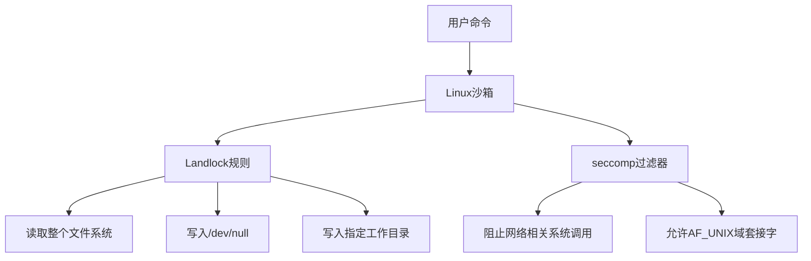
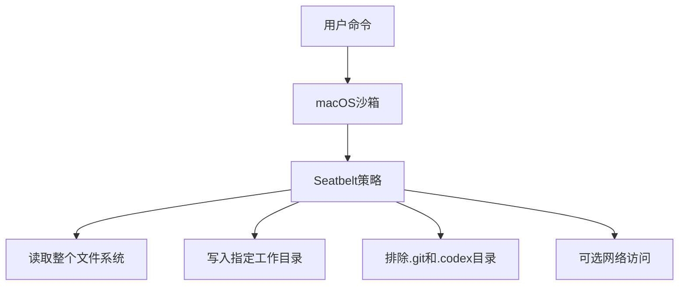
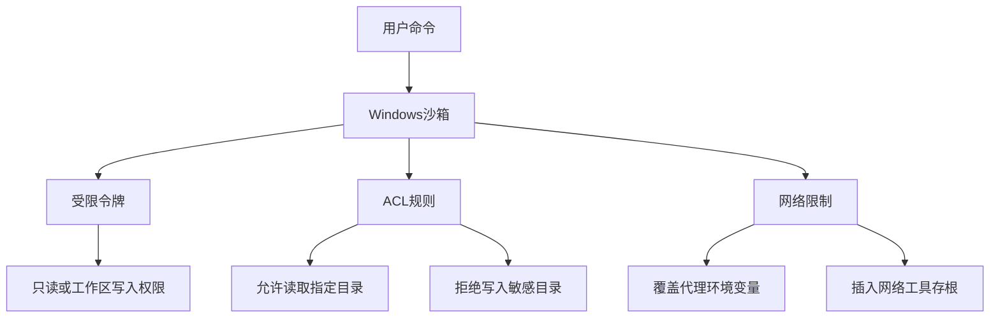
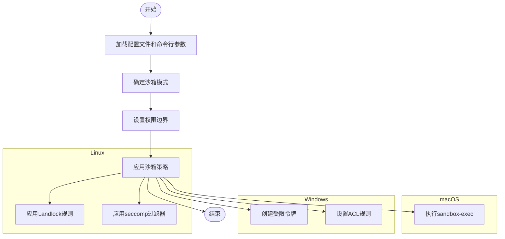

# 沙箱机制

<cite>
**本文档引用的文件**   
- [landlock.rs](file://d:\pos-src\codex\codex-rs\core\src\landlock.rs)
- [seatbelt.rs](file://d:\pos-src\codex\codex-rs\core\src\seatbelt.rs)
- [lib.rs](file://d:\pos-src\codex\codex-rs\windows-sandbox-rs\src\lib.rs)
- [config_requirements.rs](file://d:\pos-src\codex\codex-rs\core\src\config_loader\config_requirements.rs)
- [config.toml](file://d:\pos-src\codex\codex-rs\core\src\config\mod.rs)
- [sandbox.md](file://d:\pos-src\codex\docs\sandbox.md)
- [protocol.rs](file://d:\pos-src\codex\codex-rs\protocol\src\protocol.rs)
</cite>

## 目录
1. [引言](#引言)
2. [跨平台沙箱实现原理](#跨平台沙箱实现原理)
3. [沙箱策略与权限边界](#沙箱策略与权限边界)
4. [沙箱初始化流程](#沙箱初始化流程)
5. [配置沙箱行为](#配置沙箱行为)
6. [扩展沙箱功能](#扩展沙箱功能)
7. [常见沙箱错误与解决方案](#常见沙箱错误与解决方案)
8. [结论](#结论)

## 引言
Codex的沙箱机制旨在为AI生成的命令提供一个安全的执行环境，防止对系统关键文件的意外修改。该机制根据不同的操作系统平台，采用相应的系统级安全技术来实现文件系统访问控制和网络访问限制。在Linux上使用Landlock进行文件系统访问控制，在macOS上使用Seatbelt（SIP）进行系统保护，在Windows上使用令牌限制（Token Restriction）和访问控制列表（ACL）。本文档将详细解释这些技术的实现原理、沙箱的初始化流程、权限边界设置以及如何通过命令行参数和配置文件调整沙箱行为。

## 跨平台沙箱实现原理

### Linux平台：Landlock与seccomp
在Linux平台上，Codex结合使用Landlock和seccomp两种内核级安全机制来实现沙箱。Landlock是一种轻量级的内核强制访问控制（MAC）框架，允许进程在不具有特权的情况下限制自身对文件系统的访问。seccomp则用于过滤系统调用，阻止潜在的危险操作。



**Diagram sources**
- [landlock.rs](file://d:\pos-src\codex\codex-rs\core\src\landlock.rs#L53-L85)
- [linux-sandbox/src/landlock.rs](file://d:\pos-src\codex\codex-rs\linux-sandbox\src\landlock.rs#L53-L85)

**Section sources**
- [landlock.rs](file://d:\pos-src\codex\codex-rs\core\src\landlock.rs#L28-L51)
- [linux-sandbox/src/landlock.rs](file://d:\pos-src\codex\codex-rs\linux-sandbox\src\landlock.rs#L28-L51)

### macOS平台：Seatbelt（SIP）
在macOS平台上，Codex利用Apple的Seatbelt技术，通过`sandbox-exec`命令执行带有特定安全策略的子进程。Seatbelt策略以文本形式定义，可以精确控制进程对文件系统和网络的访问权限。



**Diagram sources**
- [seatbelt.rs](file://d:\pos-src\codex\codex-rs\core\src\seatbelt.rs#L46-L135)
- [seatbelt_base_policy.sbpl](file://d:\pos-src\codex\codex-rs\core\src\seatbelt_base_policy.sbpl)
- [seatbelt_network_policy.sbpl](file://d:\pos-src\codex\codex-rs\core\src\seatbelt_network_policy.sbpl)

**Section sources**
- [seatbelt.rs](file://d:\pos-src\codex\codex-rs\core\src\seatbelt.rs#L23-L45)
- [seatbelt_base_policy.sbpl](file://d:\pos-src\codex\codex-rs\core\src\seatbelt_base_policy.sbpl)
- [seatbelt_network_policy.sbpl](file://d:\pos-src\codex\codex-rs\core\src\seatbelt_network_policy.sbpl)

### Windows平台：令牌限制与ACL
在Windows平台上，Codex采用令牌限制（Token Restriction）和访问控制列表（ACL）相结合的方式。通过创建受限令牌，限制进程的权限，并使用ACL来控制对特定目录的读写访问。



**Diagram sources**
- [lib.rs](file://d:\pos-src\codex\codex-rs\windows-sandbox-rs\src\lib.rs#L168-L427)
- [token.rs](file://d:\pos-src\codex\codex-rs\windows-sandbox-rs\src\token.rs)
- [acl.rs](file://d:\pos-src\codex\codex-rs\windows-sandbox-rs\src\acl.rs)

**Section sources**
- [lib.rs](file://d:\pos-src\codex\codex-rs\windows-sandbox-rs\src\lib.rs#L107-L138)
- [token.rs](file://d:\pos-src\codex\codex-rs\windows-sandbox-rs\src\token.rs)
- [acl.rs](file://d:\pos-src\codex\codex-rs\windows-sandbox-rs\src\acl.rs)

## 沙箱策略与权限边界
Codex的沙箱策略由`SandboxPolicy`枚举定义，主要包括以下几种模式：

- **ReadOnly**: 只读模式，禁止任何文件写入操作。
- **WorkspaceWrite**: 工作区写入模式，允许在指定工作目录内进行读写操作。
- **DangerFullAccess**: 危险全访问模式，绕过所有沙箱限制（不推荐使用）。
- **ExternalSandbox**: 外部沙箱模式，使用外部沙箱机制。

沙箱的权限边界通过`SandboxPolicy`中的`writable_roots`字段来定义，该字段指定了允许写入的目录列表。在初始化沙箱时，系统会根据当前工作目录和配置文件中的设置来确定这些可写根目录。

```mermaid
classDiagram
    class SandboxPolicy {
        +ReadOnly
        +WorkspaceWrite
        +DangerFullAccess
        +ExternalSandbox
    }
    class Config {
        +sandbox_mode : Option<SandboxMode>
        +sandbox_workspace_write : Option<SandboxWorkspaceWrite>
    }
    class SandboxWorkspaceWrite {
        +writable_roots : Option<Vec<String>>
        +network_access : Option<bool>
        +exclude_tmpdir_env_var : Option<bool>
        +exclude_slash_tmp : Option<bool>
    }
    Config --> SandboxPolicy : "派生"
    Config --> SandboxWorkspaceWrite : "包含"

    SandboxPolicy --> WorkspaceWrite : "writable_roots : Vec<PathBuf>, network_access : bool"
    SandboxPolicy --> ExternalSandbox : "network_access : NetworkAccess"
```

**Diagram sources**
- [protocol.rs](file://d:\pos-src\codex\codex-rs\protocol\src\protocol.rs#L93-L94)
- [config.toml](file://d:\pos-src\codex\codex-rs\core\src\config\mod.rs#L935-L945)

**Section sources**
- [protocol.rs](file://d:\pos-src\codex\codex-rs\protocol\src\protocol.rs#L93-L94)
- [config.toml](file://d:\pos-src\codex\codex-rs\core\src\config\mod.rs#L935-L945)

## 沙箱初始化流程
沙箱的初始化流程主要包括以下几个步骤：

1. **加载配置**：从配置文件和命令行参数中加载沙箱配置。
2. **确定沙箱模式**：根据配置和用户输入确定最终的沙箱模式。
3. **设置权限边界**：根据沙箱模式和工作目录设置文件系统和网络的访问权限。
4. **应用沙箱策略**：在目标平台上应用相应的沙箱技术。



**Diagram sources**
- [debug_sandbox.rs](file://d:\pos-src\codex\codex-rs\cli\src\debug_sandbox.rs#L103-L277)
- [landlock.rs](file://d:\pos-src\codex\codex-rs\core\src\landlock.rs#L30-L51)
- [seatbelt.rs](file://d:\pos-src\codex\codex-rs\core\src\seatbelt.rs#L23-L45)
- [lib.rs](file://d:\pos-src\codex\codex-rs\windows-sandbox-rs\src\lib.rs#L175-L427)

**Section sources**
- [debug_sandbox.rs](file://d:\pos-src\codex\codex-rs\cli\src\debug_sandbox.rs#L103-L277)
- [landlock.rs](file://d:\pos-src\codex\codex-rs\core\src\landlock.rs#L30-L51)
- [seatbelt.rs](file://d:\pos-src\codex\codex-rs\core\src\seatbelt.rs#L23-L45)
- [lib.rs](file://d:\pos-src\codex\codex-rs\windows-sandbox-rs\src\lib.rs#L175-L427)

## 配置沙箱行为
用户可以通过命令行参数和配置文件来调整沙箱的行为。

### 命令行参数
- `--sandbox read-only`: 设置为只读模式。
- `--sandbox workspace-write`: 设置为工作区写入模式。
- `--full-auto`: 便捷别名，等同于`--sandbox workspace-write`和`--ask-for-approval on-request`。
- `--dangerously-bypass-approvals-and-sandbox`: 绕过所有沙箱和审批（不推荐）。

### 配置文件
在`config.toml`文件中，可以通过以下配置项来设置沙箱行为：

```toml
# 审批模式
approval_policy = "untrusted"
# 沙箱模式
sandbox_mode = "read-only"

# 全自动模式
approval_policy = "on-request"
sandbox_mode = "workspace-write"

# 可选：在workspace-write模式下允许网络访问
[sandbox_workspace_write]
network_access = true
```

此外，还可以通过配置文件保存预设：

```toml
[profiles.full_auto]
approval_policy = "on-request"
sandbox_mode = "workspace-write"

[profiles.readonly_quiet]
approval_policy = "never"
sandbox_mode = "read-only"
```

**Section sources**
- [sandbox.md](file://d:\pos-src\codex\docs\sandbox.md#L29-L55)
- [config.toml](file://d:\pos-src\codex\codex-rs\core\src\config\mod.rs#L913-L934)

## 扩展沙箱功能
开发者可以通过以下方式在自定义环境中扩展沙箱功能：

1. **实现新的沙箱策略**：通过扩展`SandboxPolicy`枚举来支持新的沙箱模式。
2. **自定义权限边界**：在`SandboxPolicy`中添加新的字段来定义更精细的权限控制。
3. **集成外部沙箱**：通过`ExternalSandbox`模式集成第三方沙箱解决方案。

例如，可以通过修改`config_requirements.rs`文件来添加新的沙箱模式要求：

```rust
#[derive(Deserialize, Debug, Clone, Copy, PartialEq)]
pub enum SandboxModeRequirement {
    ReadOnly,
    WorkspaceWrite,
    DangerFullAccess,
    ExternalSandbox,
    // 新增自定义模式
    CustomMode,
}
```

**Section sources**
- [config_requirements.rs](file://d:\pos-src\codex\codex-rs\core\src\config_loader\config_requirements.rs#L36-L48)
- [protocol.rs](file://d:\pos-src\codex\codex-rs\protocol\src\protocol.rs#L93-L94)

## 常见沙箱错误与解决方案
### Linux平台
- **Landlock不支持**：如果内核版本过旧，可能不支持Landlock。解决方案是升级内核或在容器化环境中使用外部隔离。
- **seccomp过滤器失败**：某些系统调用可能被意外阻止。可以通过调整`install_network_seccomp_filter_on_current_thread`函数中的规则来解决。

### macOS平台
- **sandbox-exec未找到**：确保`/usr/bin/sandbox-exec`存在且未被篡改。
- **权限不足**：检查用户是否有足够的权限执行`sandbox-exec`。

### Windows平台
- **受限令牌创建失败**：确保系统支持AppContainer配置文件。
- **ACL设置失败**：检查目标目录的权限设置，确保可以修改ACL。

**Section sources**
- [sandbox.md](file://d:\pos-src\codex\docs\sandbox.md#L67-L80)
- [lib.rs](file://d:\pos-src\codex\codex-rs\windows-sandbox-rs\src\lib.rs#L199-L204)
- [landlock.rs](file://d:\pos-src\codex\codex-rs\linux-sandbox\src\landlock.rs#L78-L82)

## 结论
Codex的沙箱机制通过利用各平台的原生安全技术，为AI生成的命令提供了一个强大的安全执行环境。通过合理配置沙箱策略和权限边界，用户可以在保证安全的同时，灵活地控制AI的行为。未来，随着平台安全技术的发展，Codex的沙箱机制也将不断演进，提供更精细、更安全的控制能力。