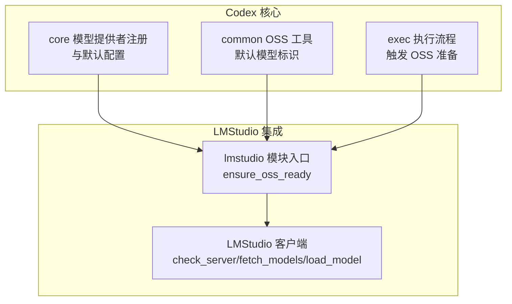
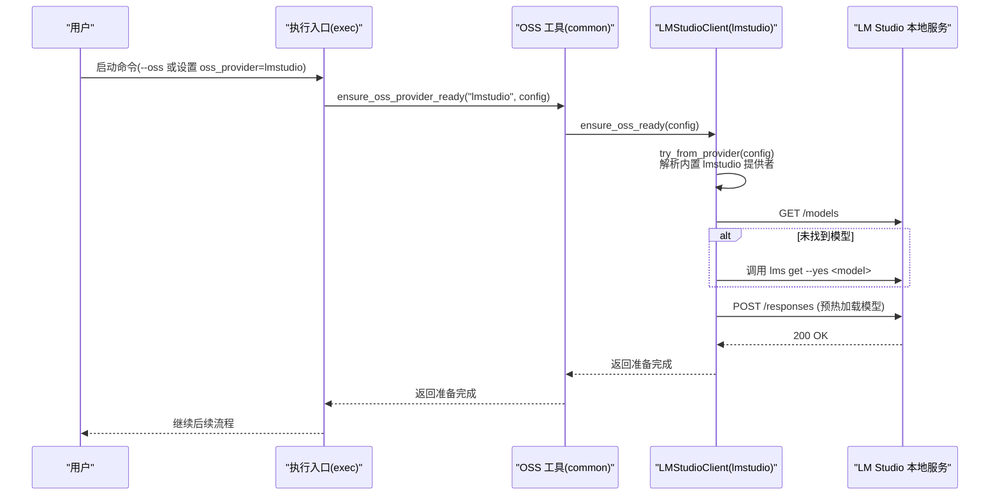
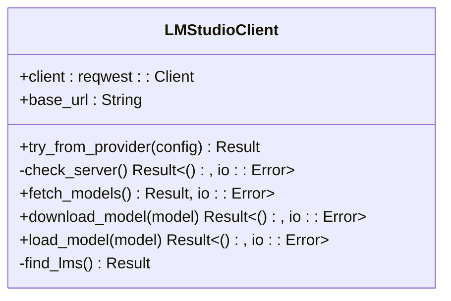
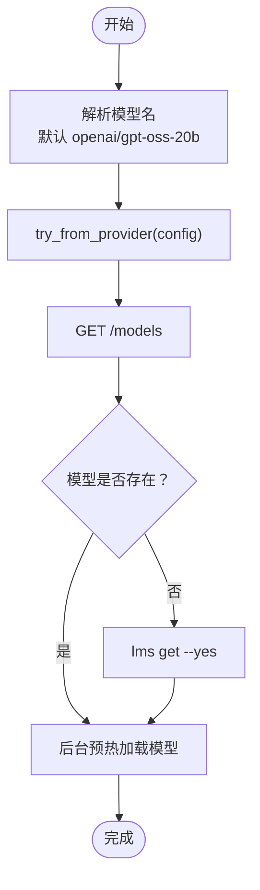
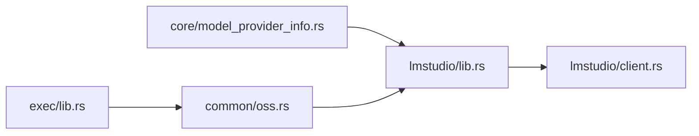

# LMStudio 集成

<cite>
**本文引用的文件**
- [lmstudio 模块入口](file://codex-rs/lmstudio/src/lib.rs)
- [LMStudio 客户端实现](file://codex-rs/lmstudio/src/client.rs)
- [模型提供者注册与默认配置](file://codex-rs/core/src/model_provider_info.rs)
- [OSS 提供者工具（包含 LMStudio 默认模型）](file://codex-rs/common/src/oss.rs)
- [执行流程与 OSS 设置入口](file://codex-rs/exec/src/lib.rs)
- [LMStudio 客户端单元测试](file://codex-rs/lmstudio/src/client.rs)
</cite>

## 目录
1. [简介](#简介)
2. [项目结构](#项目结构)
3. [核心组件](#核心组件)
4. [架构总览](#架构总览)
5. [详细组件分析](#详细组件分析)
6. [依赖关系分析](#依赖关系分析)
7. [性能考量](#性能考量)
8. [故障排除指南](#故障排除指南)
9. [结论](#结论)
10. [附录](#附录)

## 简介
本文件面向希望在 Codex 中使用 LMStudio 本地模型服务器的用户与开发者，系统性说明 Codex 如何与 LMStudio 的本地服务通信、如何启动与配置、如何将 Codex 请求转换为与 LMStudio 兼容的格式，以及在 LMStudio 中可用并在 Codex 中可使用的模型类型。同时提供连接失败、模型加载错误等常见问题的排查建议。

## 项目结构
LMStudio 集成主要由以下模块组成：
- lmstudio 模块：负责与 LMStudio 本地服务器交互（检查服务、拉取模型列表、下载模型、预热加载模型）。
- core 模块：定义模型提供者注册表与默认 OSS 提供者配置（含 LMStudio 默认端口与协议）。
- common 模块：提供 OSS 提供者工具函数，包含 LMStudio 默认模型标识。
- exec 模块：在执行流程中根据用户选择的 OSS 提供者触发 LMStudio 准备流程（检查服务、下载/加载模型）。

图表来源
- [lmstudio 模块入口](file://codex-rs/lmstudio/src/lib.rs#L1-L46)
- [LMStudio 客户端实现](file://codex-rs/lmstudio/src/client.rs#L1-L124)
- [模型提供者注册与默认配置](file://codex-rs/core/src/model_provider_info.rs#L258-L324)
- [OSS 提供者工具（包含 LMStudio 默认模型）](file://codex-rs/common/src/oss.rs#L1-L37)
- [执行流程与 OSS 设置入口](file://codex-rs/exec/src/lib.rs#L170-L271)

章节来源
- [lmstudio 模块入口](file://codex-rs/lmstudio/src/lib.rs#L1-L46)
- [LMStudio 客户端实现](file://codex-rs/lmstudio/src/client.rs#L1-L124)
- [模型提供者注册与默认配置](file://codex-rs/core/src/model_provider_info.rs#L258-L324)
- [OSS 提供者工具（包含 LMStudio 默认模型）](file://codex-rs/common/src/oss.rs#L1-L37)
- [执行流程与 OSS 设置入口](file://codex-rs/exec/src/lib.rs#L170-L271)

## 核心组件
- LMStudioClient：封装与 LMStudio 本地服务的 HTTP 通信，提供服务可达性检查、模型列表查询、模型下载、模型预热加载等能力。
- ensure_oss_ready：在启用 OSS 模式时，确保本地 LMStudio 服务可达、目标模型存在且已加载。
- 默认 OSS 提供者与默认模型：LMStudio 默认提供者 ID 为 lmstudio，默认模型标识为 openai/gpt-oss-20b。
- 执行入口：当用户选择 OSS 提供者时，执行流程会调用 ensure_oss_provider_ready 并进一步委托给 LMStudio 实现。

章节来源
- [LMStudio 客户端实现](file://codex-rs/lmstudio/src/client.rs#L1-L124)
- [lmstudio 模块入口](file://codex-rs/lmstudio/src/lib.rs#L1-L46)
- [模型提供者注册与默认配置](file://codex-rs/core/src/model_provider_info.rs#L258-L324)
- [OSS 提供者工具（包含 LMStudio 默认模型）](file://codex-rs/common/src/oss.rs#L1-L37)
- [执行流程与 OSS 设置入口](file://codex-rs/exec/src/lib.rs#L170-L271)

## 架构总览
Codex 通过内置的 LMStudio OSS 提供者与 LMStudio 本地服务进行交互。默认情况下，Codex 使用 http://localhost:1234/v1 作为 LMStudio 的基础地址（可通过环境变量覆盖），并通过 Responses 协议与服务通信。

图表来源
- [执行流程与 OSS 设置入口](file://codex-rs/exec/src/lib.rs#L170-L271)
- [OSS 提供者工具（包含 LMStudio 默认模型）](file://codex-rs/common/src/oss.rs#L1-L37)
- [lmstudio 模块入口](file://codex-rs/lmstudio/src/lib.rs#L1-L46)
- [LMStudio 客户端实现](file://codex-rs/lmstudio/src/client.rs#L1-L124)

## 详细组件分析

### LMStudioClient：与本地服务通信
- 从配置中解析内置的 lmstudio 提供者，要求提供 base_url。
- 通过 GET /models 检查服务是否可达；若不可达则返回明确提示。
- 通过 GET /models 获取模型列表，解析响应中的 data 数组并提取 id 字段。
- 通过 POST /responses 发送最小化请求以预热加载指定模型（空输入，max_output_tokens=1）。
- 当模型不存在时，尝试通过 lms 可执行文件下载模型。

图表来源
- [LMStudio 客户端实现](file://codex-rs/lmstudio/src/client.rs#L1-L124)

章节来源
- [LMStudio 客户端实现](file://codex-rs/lmstudio/src/client.rs#L1-L124)

### ensure_oss_ready：OSS 环境准备
- 解析当前使用的模型名（若未显式指定，则使用 LMStudio 默认模型 openai/gpt-oss-20b）。
- 尝试从配置中构建 LMStudioClient 并检查服务。
- 查询本地模型列表，若缺失则调用 lms 下载。
- 异步后台预热加载模型，避免首次请求延迟。

图表来源
- [lmstudio 模块入口](file://codex-rs/lmstudio/src/lib.rs#L1-L46)
- [LMStudio 客户端实现](file://codex-rs/lmstudio/src/client.rs#L1-L124)

章节来源
- [lmstudio 模块入口](file://codex-rs/lmstudio/src/lib.rs#L1-L46)

### 默认 OSS 提供者与模型
- 内置 LMStudio 提供者 ID 为 lmstudio，默认端口为 1234，使用 Responses 协议。
- 默认模型标识为 openai/gpt-oss-20b，可在 OSS 工具中查询默认模型映射。

章节来源
- [模型提供者注册与默认配置](file://codex-rs/core/src/model_provider_info.rs#L258-L324)
- [OSS 提供者工具（包含 LMStudio 默认模型）](file://codex-rs/common/src/oss.rs#L1-L37)

### 执行流程中的 OSS 设置
- 当启用 OSS 模式时，执行入口会解析 OSS 提供者（lmstudio 或 ollama），并调用 ensure_oss_provider_ready。
- 若未配置默认 OSS 提供者，会提示用户通过 --local-provider 或在配置中设置 oss_provider。

章节来源
- [执行流程与 OSS 设置入口](file://codex-rs/exec/src/lib.rs#L170-L271)

## 依赖关系分析
- lmstudio 模块依赖 core 的模型提供者常量与配置结构。
- common 模块依赖 lmstudio 的默认模型常量，用于在 OSS 场景下推断默认模型。
- exec 模块在运行时根据用户选择的 OSS 提供者触发相应的准备流程。

图表来源
- [模型提供者注册与默认配置](file://codex-rs/core/src/model_provider_info.rs#L258-L324)
- [OSS 提供者工具（包含 LMStudio 默认模型）](file://codex-rs/common/src/oss.rs#L1-L37)
- [lmstudio 模块入口](file://codex-rs/lmstudio/src/lib.rs#L1-L46)
- [LMStudio 客户端实现](file://codex-rs/lmstudio/src/client.rs#L1-L124)
- [执行流程与 OSS 设置入口](file://codex-rs/exec/src/lib.rs#L170-L271)

章节来源
- [模型提供者注册与默认配置](file://codex-rs/core/src/model_provider_info.rs#L258-L324)
- [OSS 提供者工具（包含 LMStudio 默认模型）](file://codex-rs/common/src/oss.rs#L1-L37)
- [lmstudio 模块入口](file://codex-rs/lmstudio/src/lib.rs#L1-L46)
- [LMStudio 客户端实现](file://codex-rs/lmstudio/src/client.rs#L1-L124)
- [执行流程与 OSS 设置入口](file://codex-rs/exec/src/lib.rs#L170-L271)

## 性能考量
- 连接超时：客户端在构建时设置了较短的连接超时，有助于快速失败与避免长时间阻塞。
- 异步预热：模型加载采用 tokio::spawn 在后台异步执行，降低首次请求延迟。
- 仅在必要时下载：只有当模型不存在时才触发 lms 下载，减少不必要的网络与磁盘 IO。

章节来源
- [LMStudio 客户端实现](file://codex-rs/lmstudio/src/client.rs#L1-L124)
- [lmstudio 模块入口](file://codex-rs/lmstudio/src/lib.rs#L1-L46)

## 故障排除指南
- 无法连接 LM Studio 本地服务
  - 现象：提示“LM Studio 未响应，请安装并运行 lms server start”。
  - 排查：确认本地服务已启动；检查内置提供者的 base_url 是否正确（默认 http://localhost:1234/v1）。可通过环境变量覆盖默认端口或基础地址。
  - 参考路径：[LMStudio 客户端实现](file://codex-rs/lmstudio/src/client.rs#L1-L62)、[模型提供者注册与默认配置](file://codex-rs/core/src/model_provider_info.rs#L288-L324)

- 模型不存在
  - 现象：查询不到目标模型，需要下载。
  - 排查：确认 lms 可执行文件在 PATH 或用户主目录下的 .lmstudio/bin 路径；确保网络可访问模型仓库。
  - 参考路径：[LMStudio 客户端实现](file://codex-rs/lmstudio/src/client.rs#L126-L190)

- 模型加载失败
  - 现象：POST /responses 成功但模型未就绪，或后续推理报错。
  - 排查：等待后台预热完成；检查模型是否被其他进程占用；查看日志输出。
  - 参考路径：[lmstudio 模块入口](file://codex-rs/lmstudio/src/lib.rs#L1-L46)、[LMStudio 客户端实现](file://codex-rs/lmstudio/src/client.rs#L64-L92)

- 未配置默认 OSS 提供者
  - 现象：执行时报错提示需设置 oss_provider。
  - 排查：通过 --local-provider 或在配置中设置 oss_provider=lmstudio。
  - 参考路径：[执行流程与 OSS 设置入口](file://codex-rs/exec/src/lib.rs#L170-L190)

- 测试与验证
  - 可参考单元测试对 fetch_models、check_server、download_model 等行为的断言，帮助定位问题。
  - 参考路径：[LMStudio 客户端实现](file://codex-rs/lmstudio/src/client.rs#L206-L397)

章节来源
- [LMStudio 客户端实现](file://codex-rs/lmstudio/src/client.rs#L1-L124)
- [lmstudio 模块入口](file://codex-rs/lmstudio/src/lib.rs#L1-L46)
- [模型提供者注册与默认配置](file://codex-rs/core/src/model_provider_info.rs#L288-L324)
- [执行流程与 OSS 设置入口](file://codex-rs/exec/src/lib.rs#L170-L190)
- [LMStudio 客户端实现（测试）](file://codex-rs/lmstudio/src/client.rs#L206-L397)

## 结论
Codex 对 LMStudio 的集成通过内置的 lmstudio 提供者与 LMStudio 本地服务的 HTTP API 完成。其核心流程包括：解析提供者、检查服务、查询/下载模型、后台预热加载。默认模型 openai/gpt-oss-20b 与默认端口 1234 已在代码中固化，用户可通过环境变量覆盖基础地址。遇到连接或模型加载问题时，可依据本文提供的排查步骤快速定位并解决。

## 附录

### 连接与配置指南
- 启动 LM Studio 本地服务器
  - 请先安装 LM Studio，并运行本地服务器（提示中包含启动命令）。
  - 参考路径：[LMStudio 客户端实现](file://codex-rs/lmstudio/src/client.rs#L1-L31)

- 配置 Codex 使用 LMStudio
  - 方案一：通过命令行参数 --local-provider=lmstudio。
  - 方案二：在配置文件中设置 oss_provider=lmstudio。
  - 参考路径：[执行流程与 OSS 设置入口](file://codex-rs/exec/src/lib.rs#L170-L190)

- 自定义基础地址
  - 可通过环境变量覆盖默认基础地址（默认 http://localhost:1234/v1）。
  - 参考路径：[模型提供者注册与默认配置](file://codex-rs/core/src/model_provider_info.rs#L288-L324)

### 请求格式与协议
- 协议：Responses 协议（/v1/responses）。
- 模型列表查询：GET /models。
- 模型下载：调用 lms 可执行文件（get --yes <model>）。
- 预热加载：POST /responses，请求体包含 model、input、max_output_tokens。
- 参考路径：[LMStudio 客户端实现](file://codex-rs/lmstudio/src/client.rs#L64-L124)

### 可用模型类型
- 默认模型：openai/gpt-oss-20b。
- 参考路径：[OSS 提供者工具（包含 LMStudio 默认模型）](file://codex-rs/common/src/oss.rs#L1-L37)