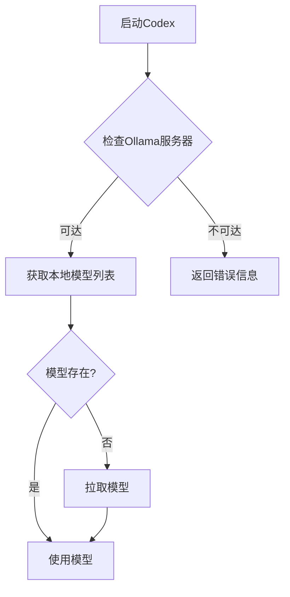

# Ollama 集成

<cite>
**本文档引用的文件**   
- [client.rs](file://codex-rs/ollama/src/client.rs)
- [lib.rs](file://codex-rs/ollama/src/lib.rs)
- [pull.rs](file://codex-rs/ollama/src/pull.rs)
- [url.rs](file://codex-rs/ollama/src/url.rs)
- [config.md](file://docs/config.md)
- [example-config.md](file://docs/example-config.md)
- [model_provider_info.rs](file://codex-rs/core/src/model_provider_info.rs)
- [mod.rs](file://codex-rs/core/src/config/mod.rs)
</cite>

## 目录
1. [简介](#简介)
2. [本地运行Ollama服务器](#本地运行ollama服务器)
3. [配置Codex连接到Ollama](#配置codex连接到ollama)
4. [Ollama模块与REST API交互](#ollama模块与rest-api交互)
5. [模型管理](#模型管理)
6. [硬件要求与性能优化](#硬件要求与性能优化)

## 简介
本文档详细介绍了如何在本地集成和使用Ollama大语言模型。内容涵盖Ollama服务器的本地部署、Codex客户端的配置、Ollama模块与REST API的交互机制、模型的拉取与管理，以及相关的硬件要求和性能优化建议。通过本指南，用户可以在本地环境中高效地运行和管理大型语言模型。

## 本地运行Ollama服务器
要在本地运行Ollama服务器，首先需要安装Ollama。安装完成后，可以通过运行`ollama serve`命令启动服务器。默认情况下，Ollama服务器监听`http://localhost:11434`地址。确保服务器正在运行是使用Ollama模型的前提条件。

**Section sources**
- [client.rs](file://codex-rs/ollama/src/client.rs#L18-L19)

## 配置Codex连接到Ollama
要配置Codex连接到本地Ollama服务器，需要在`config.toml`文件中设置模型提供者。可以通过添加或修改`model_providers`部分来指定Ollama服务器的URL。例如：

```toml
[model_providers.ollama]
name = "Ollama"
base_url = "http://localhost:11434/v1"
wire_api = "chat"
```

此外，需要将`model_provider`设置为`"ollama"`，并选择一个本地模型作为`model`。例如：

```toml
model_provider = "ollama"
model = "mistral"
```

这些配置确保Codex能够正确地与本地Ollama服务器通信。

**Section sources**
- [example-config.md](file://docs/example-config.md#L286-L290)
- [config.md](file://docs/config.md#L180-L188)

## Ollama模块与REST API交互
Ollama模块通过REST API与Ollama服务器进行交互。主要功能包括获取模型列表、拉取模型和发送聊天补全请求。

### 获取模型列表
`fetch_models`方法用于获取本地Ollama实例中已知的模型名称列表。该方法向`/api/tags`端点发送GET请求，并解析返回的JSON数据以提取模型名称。

### 拉取模型
`pull_with_reporter`方法用于拉取指定的模型。该方法首先向`/api/pull`端点发送POST请求，然后通过流式响应接收进度更新。进度报告器（如`CliProgressReporter`）用于显示下载进度。

### 聊天补全请求
Ollama客户端通过`try_from_oss_provider`方法构建，该方法验证本地Ollama服务器是否可达。如果服务器不可达，则返回带有安装/运行说明的错误信息。一旦客户端成功创建，即可用于发送聊天补全请求。

**Section sources**
- [client.rs](file://codex-rs/ollama/src/client.rs#L102-L125)
- [client.rs](file://codex-rs/ollama/src/client.rs#L187-L219)
- [client.rs](file://codex-rs/ollama/src/client.rs#L27-L46)

## 模型管理
### 拉取和管理模型
用户可以通过Ollama命令行工具或API拉取和管理模型。常用的模型包括`llama3`、`mistral`等。拉取模型时，Ollama会自动处理依赖项和缓存。

### 在Codex中选择本地模型
在Codex中选择本地模型时，需要确保模型已在本地Ollama服务器中可用。可以通过`fetch_models`方法检查模型是否存在。如果模型不存在，`ensure_oss_ready`函数会自动拉取所需的模型。



**Diagram sources **
- [lib.rs](file://codex-rs/ollama/src/lib.rs#L20-L47)
- [client.rs](file://codex-rs/ollama/src/client.rs#L102-L125)

**Section sources**
- [lib.rs](file://codex-rs/ollama/src/lib.rs#L20-L47)
- [client.rs](file://codex-rs/ollama/src/client.rs#L102-L125)

## 硬件要求与性能优化
### 硬件要求
运行大型语言模型需要足够的计算资源。推荐的硬件配置包括：
- **CPU**: 多核处理器（如Intel i7或更高）
- **内存**: 至少16GB RAM，建议32GB或更多
- **GPU**: 支持CUDA的NVIDIA GPU（如RTX 3060或更高），显存至少8GB
- **存储**: SSD硬盘，至少100GB可用空间

### 性能优化建议
- **使用GPU加速**: 确保Ollama服务器配置为使用GPU进行推理，以显著提高性能。
- **调整批处理大小**: 根据硬件能力调整批处理大小，以平衡内存使用和推理速度。
- **缓存机制**: 利用Ollama的内置缓存机制减少重复计算，提高响应速度。
- **网络优化**: 确保本地网络稳定，避免因网络延迟影响性能。

通过合理配置硬件和优化设置，可以在本地环境中高效运行大型语言模型，提供流畅的用户体验。

**Section sources**
- [mod.rs](file://codex-rs/core/src/config/mod.rs#L79)
- [model_provider_info.rs](file://codex-rs/core/src/model_provider_info.rs#L258-L262)