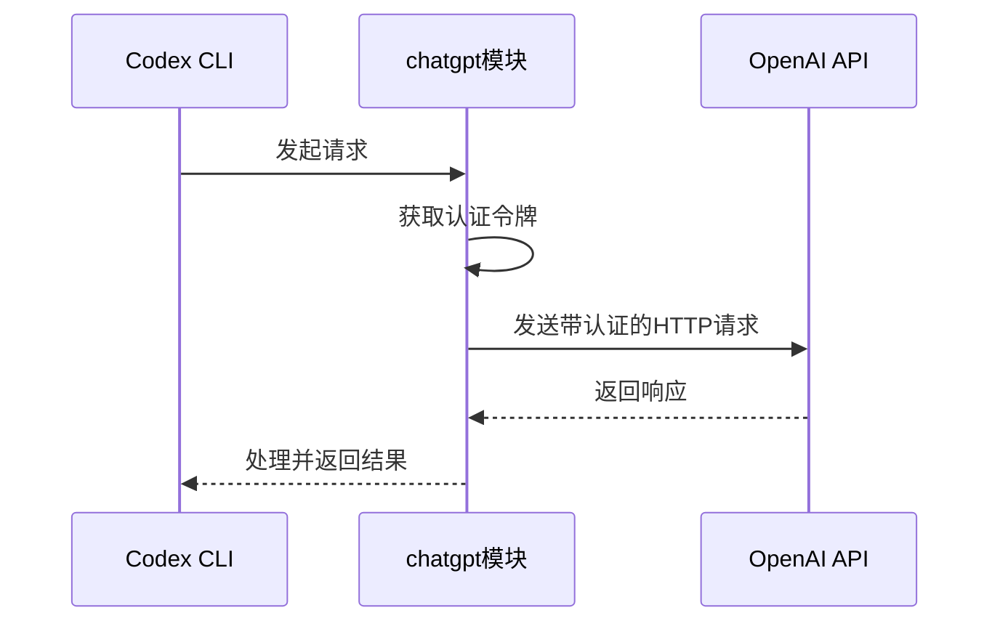
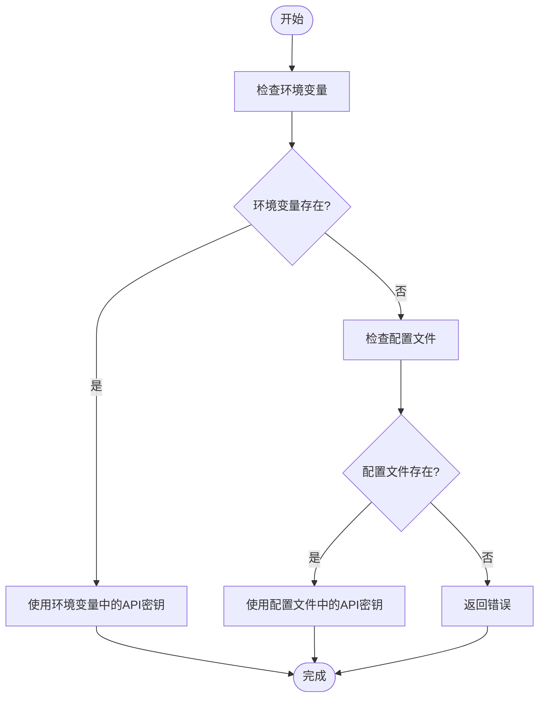
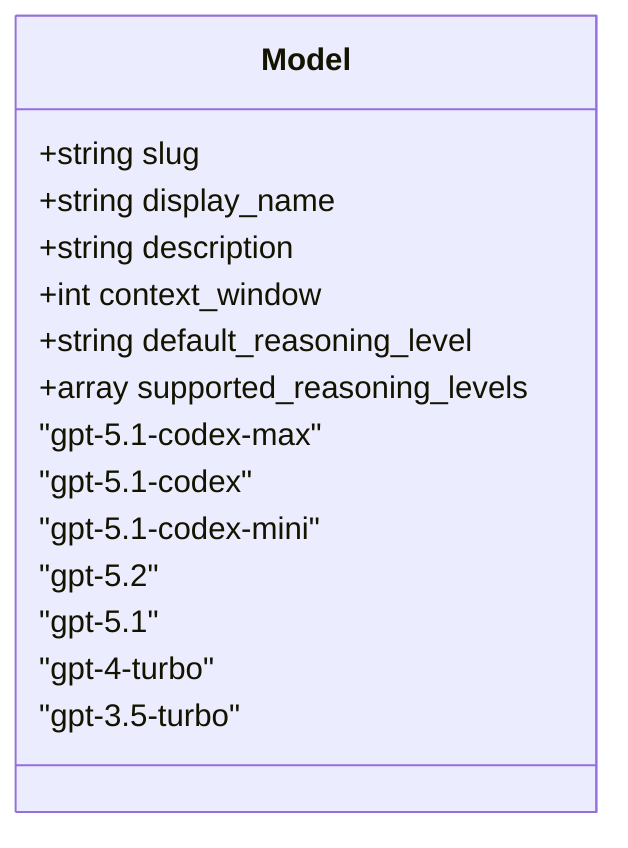
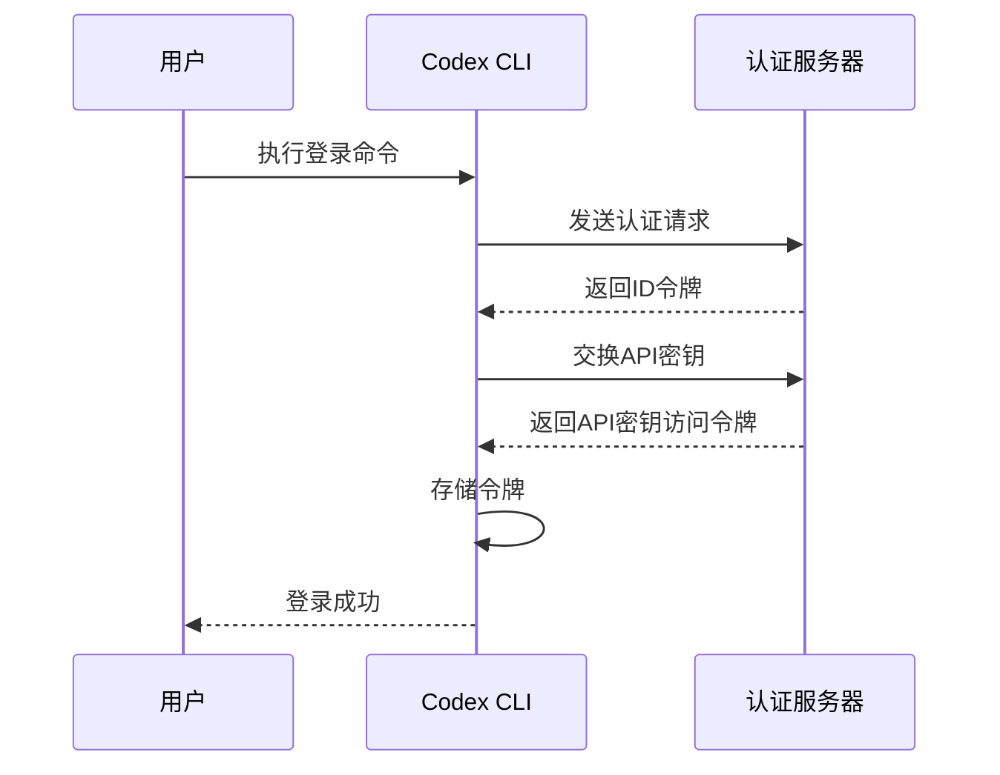
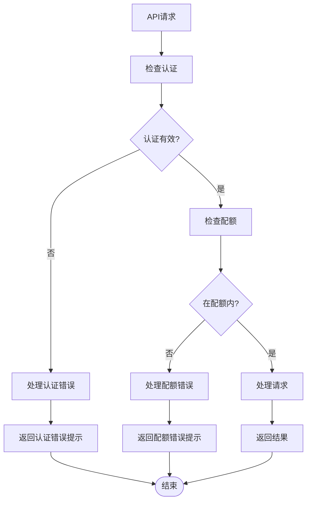
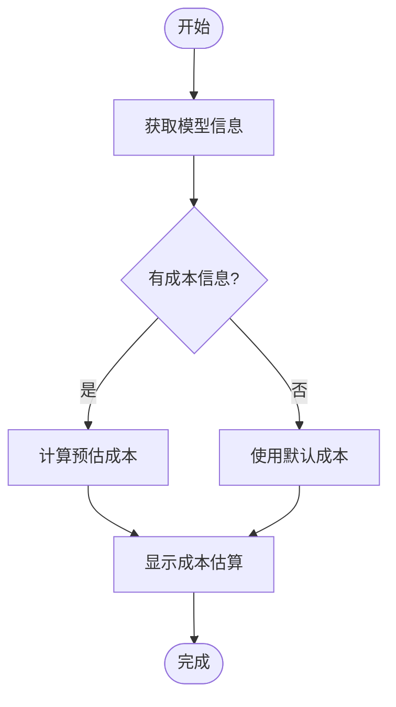

# OpenAI 集成

<cite>
**本文档引用的文件**   
- [chatgpt_client.rs](file://codex-rs\chatgpt\src\chatgpt_client.rs)
- [chatgpt_token.rs](file://codex-rs\chatgpt\src\chatgpt_token.rs)
- [auth.rs](file://codex-rs\core\src\auth.rs)
- [model_provider_info.rs](file://codex-rs\core\src\model_provider_info.rs)
- [config.md](file://docs\config.md)
- [models.json](file://codex-rs\core\models.json)
- [error.rs](file://codex-rs\core\src\error.rs)
</cite>

## 目录
1. [简介](#简介)
2. [Codex与OpenAI API通信机制](#codex与openai-api通信机制)
3. [API密钥获取与配置](#api密钥获取与配置)
4. [支持的OpenAI模型](#支持的openai模型)
5. [配置示例](#配置示例)
6. [认证流程与错误处理](#认证流程与错误处理)
7. [成本估算与速率限制](#成本估算与速率限制)

## 简介
本文档详细介绍了Codex如何通过`chatgpt`模块与OpenAI API进行集成。文档涵盖了API密钥的获取与配置、支持的模型列表、完整的配置示例、认证流程、错误处理机制以及成本和速率限制策略。

## Codex与OpenAI API通信机制

Codex通过`chatgpt`模块与OpenAI API进行通信。该模块负责处理认证、请求发送和响应接收。



**Diagram sources**
- [chatgpt_client.rs](file://codex-rs\chatgpt\src\chatgpt_client.rs)
- [chatgpt_token.rs](file://codex-rs\chatgpt\src\chatgpt_token.rs)

**Section sources**
- [chatgpt_client.rs](file://codex-rs\chatgpt\src\chatgpt_client.rs#L10-L51)
- [chatgpt_token.rs](file://codex-rs\chatgpt\src\chatgpt_token.rs#L1-L33)

## API密钥获取与配置

Codex提供了两种方式来配置API密钥：环境变量设置和配置文件配置。

### 环境变量设置
通过设置环境变量来配置API密钥，这是推荐的安全方式。



**Diagram sources**
- [model_provider_info.rs](file://codex-rs\core\src\model_provider_info.rs#L170-L190)

### 配置文件配置
通过在配置文件中设置`model_providers`字段来配置API密钥。

```toml
[model_providers.openai]
env_key = "OPENAI_API_KEY"
base_url = "https://api.openai.com/v1"
wire_api = "responses"
```

**Section sources**
- [config.md](file://docs\config.md#L1029-L1038)
- [model_provider_info.rs](file://codex-rs\core\src\model_provider_info.rs#L50-L88)

## 支持的OpenAI模型

Codex支持多种OpenAI模型，每种模型都有其特定的配置和用途。

### 模型列表
根据配置文件，支持的模型包括：

- `gpt-5.1-codex-max` - Codex优化的旗舰模型，适用于深度和快速推理
- `gpt-5.1-codex` - 为Codex优化的模型
- `gpt-5.1-codex-mini` - 更便宜、更快但能力较弱的Codex优化模型
- `gpt-5.2` - 在知识、推理和编码方面有改进的最新前沿模型
- `gpt-5.1` - 具有强大通用推理能力的广泛世界知识模型
- `gpt-4-turbo` - 高性能的GPT-4变体
- `gpt-3.5-turbo` - 成本效益高的GPT-3.5变体



**Diagram sources**
- [models.json](file://codex-rs\core\models.json)
- [config.md](file://docs\config.md#L1001-L1002)

**Section sources**
- [models.json](file://codex-rs\core\models.json#L3-L238)
- [config.md](file://docs\config.md#L999-L1072)

## 配置示例

以下是一个完整的配置示例，展示了如何设置API端点、模型选择、温度参数等。

```toml
# 基本模型配置
model = "gpt-5.1-codex-max"
model_provider = "openai"
model_context_window = 272000

# 模型提供商配置
[model_providers.openai]
name = "OpenAI"
base_url = "https://api.openai.com/v1"
env_key = "OPENAI_API_KEY"
wire_api = "responses"
request_max_retries = 4
stream_max_retries = 5
stream_idle_timeout_ms = 300000

# 模型参数配置
[model_params]
temperature = 0.7
max_tokens = 4096
top_p = 0.9
frequency_penalty = 0.0
presence_penalty = 0.0

# 认证配置
chatgpt_base_url = "https://chatgpt.com/backend-api/"
cli_auth_credentials_store = "file"
```

**Section sources**
- [config.md](file://docs\config.md#L999-L1072)
- [models.json](file://codex-rs\core\models.json)

## 认证流程与错误处理

### 认证流程
Codex的认证流程包括获取和刷新API密钥。



**Diagram sources**
- [auth.rs](file://codex-rs\core\src\auth.rs#L145-L267)
- [server.rs](file://codex-rs\login\src\server.rs#L688-L721)

### 错误处理
当API密钥无效或配额用尽时，Codex会提供相应的用户提示。



**Diagram sources**
- [error.rs](file://codex-rs\core\src\error.rs#L111-L125)
- [api.rs](file://codex-rs\codex-api\src\error.rs#L17-L18)

**Section sources**
- [error.rs](file://codex-rs\core\src\error.rs#L111-L125)
- [api.rs](file://codex-rs\codex-api\src\error.rs#L17-L18)

## 成本估算与速率限制

### 成本估算
Codex通过模型配置和使用情况来估算成本。



### 速率限制处理策略
Codex实现了多种策略来处理速率限制。

```toml
# 速率限制配置
[model_providers.openai]
request_max_retries = 4
stream_max_retries = 5
stream_idle_timeout_ms = 300000
```

当遇到速率限制时，Codex会：
1. 自动重试请求（最多4次）
2. 对于流式响应，最多重试5次
3. 在300秒空闲超时后断开连接
4. 向用户显示友好的错误消息

**Section sources**
- [model_provider_info.rs](file://codex-rs\core\src\model_provider_info.rs#L86-L90)
- [error.rs](file://codex-rs\core\src\error.rs#L111-L125)