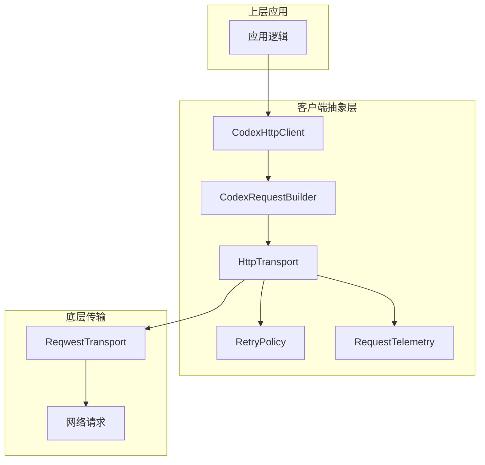
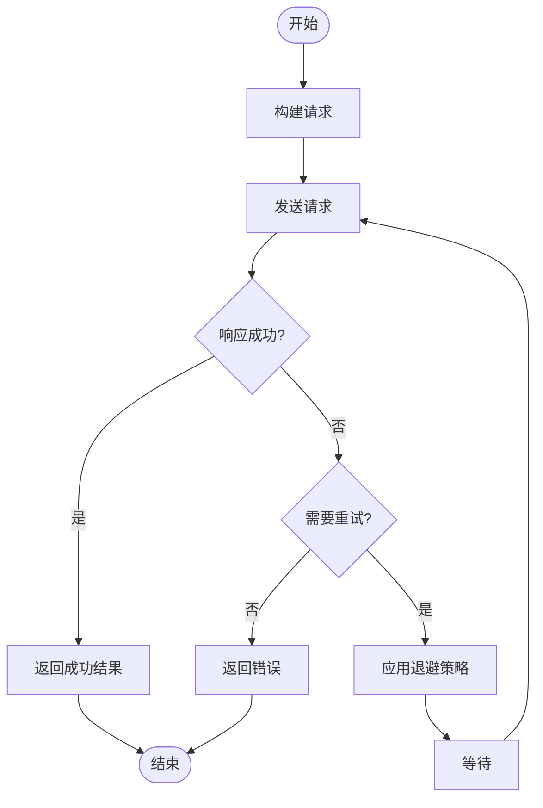
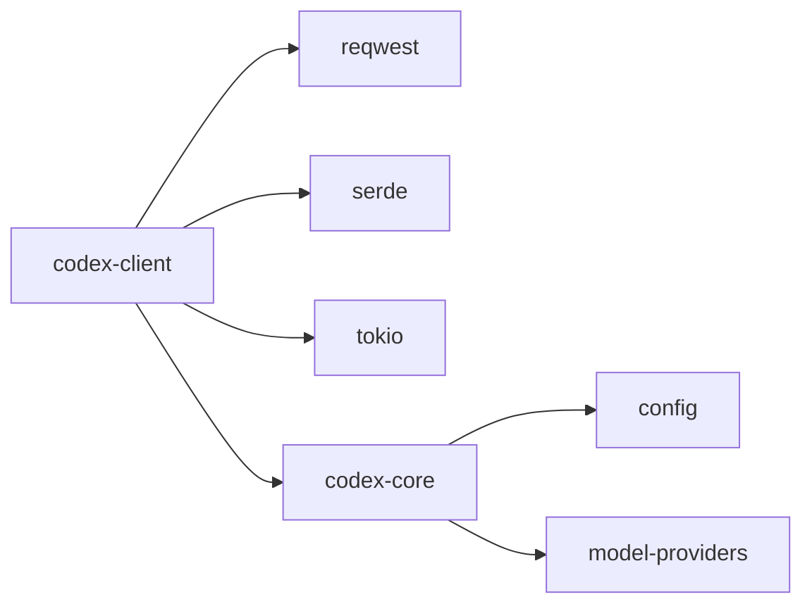

# 模型客户端抽象

<cite>
**本文档中引用的文件**  
- [lib.rs](file://codex-rs\codex-client\src\lib.rs)
- [default_client.rs](file://codex-rs\codex-client\src\default_client.rs)
- [request.rs](file://codex-rs\codex-client\src\request.rs)
- [error.rs](file://codex-rs\codex-client\src\error.rs)
- [retry.rs](file://codex-rs\codex-client\src\retry.rs)
- [sse.rs](file://codex-rs\codex-client\src\sse.rs)
- [telemetry.rs](file://codex-rs\codex-client\src\telemetry.rs)
- [transport.rs](file://codex-rs\codex-client\src\transport.rs)
- [chatgpt_client.rs](file://codex-rs\chatgpt\src\chatgpt_client.rs)
- [client.rs](file://codex-rs\ollama\src\client.rs)
- [client.rs](file://codex-rs\lmstudio\src\client.rs)
</cite>

## 目录
1. [简介](#简介)
2. [核心组件](#核心组件)
3. [架构概述](#架构概述)
4. [详细组件分析](#详细组件分析)
5. [依赖分析](#依赖分析)
6. [性能考虑](#性能考虑)
7. [故障排除指南](#故障排除指南)
8. [结论](#结论)

## 简介
本文档详细描述了`codex-client`模块如何为不同的模型提供商（如OpenAI、Ollama、LMStudio）提供统一的接口。该抽象层的设计旨在处理不同提供商之间的API差异、认证机制和响应格式，同时提供一致的错误处理、重试机制和超时策略。通过这种设计，系统能够灵活地支持多种模型提供商，而无需在高层调用中暴露底层实现细节。

## 核心组件
`codex-client`模块的核心组件包括请求/响应生命周期管理、统一的错误处理机制、重试策略以及流式传输支持。这些组件共同构成了一个健壮的客户端抽象层，使得上层应用可以以一致的方式与不同的模型提供商进行交互。

**核心组件**
- [lib.rs](file://codex-rs\codex-client\src\lib.rs#L1-L25)
- [default_client.rs](file://codex-rs\codex-client\src\default_client.rs#L1-L226)

## 架构概述
`codex-client`模块采用分层架构，将HTTP传输、请求构建、错误处理和重试机制分离。这种设计使得每个组件可以独立演化，同时保持整体架构的清晰性和可维护性。客户端通过`HttpTransport` trait与底层HTTP客户端进行交互，而具体的实现（如`ReqwestTransport`）则负责处理实际的网络请求。

**图表来源**
- [lib.rs](file://codex-rs\codex-client\src\lib.rs#L1-L25)
- [transport.rs](file://codex-rs\codex-client\src\transport.rs#L1-L124)

## 详细组件分析
### 请求/响应生命周期
从高层调用到具体实现的转换过程涉及多个步骤。首先，应用通过`CodexHttpClient`创建一个`CodexRequestBuilder`，然后设置请求的各种参数（如URL、方法、头信息、超时等）。最后，调用`send`方法发送请求并接收响应。整个过程通过`HttpTransport` trait与底层HTTP客户端进行交互。

**组件来源**
- [default_client.rs](file://codex-rs\codex-client\src\default_client.rs#L1-L226)
- [request.rs](file://codex-rs\codex-client\src\request.rs#L1-L40)

### 错误处理与重试机制
错误处理和重试机制是`codex-client`模块的重要组成部分。`TransportError`枚举定义了可能的传输错误类型，包括HTTP错误、重试限制、超时和网络错误。`RetryPolicy`结构体则定义了重试策略，包括最大尝试次数、基础延迟时间和重试条件。`run_with_retry`函数实现了基于指数退避的重试逻辑，确保在遇到可恢复错误时能够自动重试。

**图表来源**
- [error.rs](file://codex-rs\codex-client\src\error.rs#L1-L30)
- [retry.rs](file://codex-rs\codex-client\src\retry.rs#L1-L74)

### 流式传输支持
对于需要流式传输的场景，`codex-client`模块提供了`sse_stream`函数，该函数利用`eventsource_stream`库处理SSE（Server-Sent Events）流。通过这种方式，客户端可以实时接收来自服务器的数据帧，并在发生错误或超时时及时通知上层应用。

**组件来源**
- [sse.rs](file://codex-rs\codex-client\src\sse.rs#L1-L49)
- [transport.rs](file://codex-rs\codex-client\src\transport.rs#L1-L124)

## 依赖分析
`codex-client`模块依赖于多个外部库，包括`reqwest`用于HTTP请求、`serde`用于序列化/反序列化、`tokio`用于异步运行时等。此外，它还依赖于`codex-core`模块中的配置和模型提供商信息。这些依赖关系通过Cargo.toml文件进行管理，确保了版本的一致性和兼容性。

**图表来源**
- [Cargo.toml](file://codex-rs\codex-client\Cargo.toml)
- [config.rs](file://codex-rs\core\src\config\config.rs)
- [model_provider_info.rs](file://codex-rs\core\src\model_provider_info.rs)

## 性能考虑
为了优化性能，`codex-client`模块采用了多种策略。首先，通过复用`reqwest::Client`实例来减少连接建立的开销。其次，使用异步I/O操作避免阻塞主线程。最后，通过合理的超时设置和重试策略，平衡了可靠性和响应速度。

## 故障排除指南
当遇到问题时，可以通过以下步骤进行排查：
1. 检查网络连接是否正常。
2. 验证API密钥和认证信息是否正确。
3. 查看日志输出，特别是错误消息和状态码。
4. 确认请求参数是否符合API文档要求。
5. 如果使用流式传输，检查SSE连接是否保持活跃。

**故障排除来源**
- [error.rs](file://codex-rs\codex-client\src\error.rs#L1-L30)
- [default_client.rs](file://codex-rs\codex-client\src\default_client.rs#L1-L226)

## 结论
`codex-client`模块通过精心设计的抽象层，成功地为多种模型提供商提供了统一的接口。其分层架构、灵活的错误处理机制和高效的流式传输支持，使得上层应用可以轻松地与不同的模型提供商进行交互，而无需关心底层实现细节。未来，可以通过添加更多模型提供商的支持和优化现有功能，进一步增强该模块的能力。