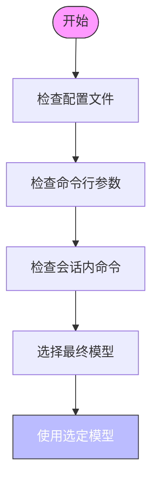

# 模型集成

<cite>
**本文档中引用的文件**   
- [lib.rs](file://codex-rs\codex-client\src\lib.rs)
- [default_client.rs](file://codex-rs\codex-client\src\default_client.rs)
- [chatgpt_client.rs](file://codex-rs\chatgpt\src\chatgpt_client.rs)
- [client.rs](file://codex-rs\ollama\src\client.rs)
- [client.rs](file://codex-rs\lmstudio\src\client.rs)
- [manager.rs](file://codex-rs\core\src\models_manager\manager.rs)
- [mod.rs](file://codex-rs\core\src\config\mod.rs)
- [mod.rs](file://codex-rs\core\src\model_provider_info.rs)
- [provider.rs](file://codex-rs\codex-api\src\provider.rs)
</cite>

## 目录
1. [简介](#简介)
2. [Codex客户端抽象层](#codex客户端抽象层)
3. [模型提供商集成](#模型提供商集成)
   1. [OpenAI集成](#openai集成)
   2. [Ollama集成](#ollama集成)
   3. [LMStudio集成](#lmstudio集成)
4. [模型选择策略](#模型选择策略)
5. [性能与成本考量](#性能与成本考量)

## 简介
Codex系统通过一个前端`codex-client`模块与后端大语言模型API进行通信。该系统设计为支持多种模型提供商，包括OpenAI、Ollama和LMStudio。`codex-client`模块负责抽象化不同提供商的API差异，为上层应用提供统一的接口。本文档详细解释了这些集成机制、配置方法和模型选择策略。

## Codex客户端抽象层

`codex-client`模块是Codex系统与各种模型提供商通信的核心。它提供了一个统一的接口，抽象了不同提供商的API差异。该模块的主要组件包括`CodexHttpClient`和`CodexRequestBuilder`，它们封装了HTTP请求的创建和发送过程。

`CodexHttpClient`使用`reqwest::Client`作为底层HTTP客户端，提供了`get`、`post`和通用的`request`方法来创建请求。`CodexRequestBuilder`则允许链式调用各种配置方法，如添加头部、设置超时、添加认证信息等，最后通过`send`方法发送请求。

该模块还集成了OpenTelemetry追踪功能，通过`trace_headers`函数将当前追踪上下文注入到HTTP请求头部中，便于分布式追踪和性能分析。

**Section sources**
- [lib.rs](file://codex-rs\codex-client\src\lib.rs#L1-L25)
- [default_client.rs](file://codex-rs\codex-client\src\default_client.rs#L1-L226)

## 模型提供商集成

Codex系统支持多种模型提供商，每种提供商都有专门的客户端实现来处理其特定的API和协议。

### OpenAI集成

OpenAI集成通过`chatgpt`模块实现，主要功能在`chatgpt_client.rs`文件中。该模块提供了`chatgpt_get_request`函数，用于向ChatGPT后端API发送GET请求。

集成过程包括：
1. 从配置中获取ChatGPT基础URL
2. 初始化ChatGPT令牌（通过`init_chatgpt_token_from_auth`）
3. 使用令牌进行认证，发送HTTP请求

该集成使用Bearer Token认证，并在请求头部中包含`chatgpt-account-id`以标识账户。错误处理机制会检查响应状态码，对于非成功响应，会解析错误信息并返回相应的错误。

**Section sources**
- [chatgpt_client.rs](file://codex-rs\chatgpt\src\chatgpt_client.rs#L1-L51)

### Ollama集成

Ollama集成通过`ollama`模块实现，主要功能在`client.rs`文件中。`OllamaClient`结构体负责与本地Ollama实例交互。

关键功能包括：
- `try_from_oss_provider`: 从配置中创建Ollama客户端并验证服务器可达性
- `fetch_models`: 获取本地Ollama实例已知的模型列表
- `pull_model_stream`: 启动模型拉取并返回流式事件
- `pull_with_reporter`: 高级辅助函数，用于拉取模型并驱动进度报告器

Ollama客户端支持两种API模式：原生Ollama API和OpenAI兼容API。通过`is_openai_compatible_base_url`函数检测基础URL来确定使用哪种模式。服务器可达性通过探测健康端点（`/v1/models`或`/api/tags`）来验证。

```mermaid
classDiagram
class OllamaClient {
+client : reqwest : : Client
+host_root : String
+uses_openai_compat : bool
+try_from_oss_provider(config : &Config) io : : Result~Self~
+fetch_models() io : : Result~Vec~String~~
+pull_model_stream(model : &str) io : : Result~BoxStream~'static, PullEvent~~
+pull_with_reporter(model : &str, reporter : &mut dyn PullProgressReporter) io : : Result~()~
}
OllamaClient --> reqwest : : Client : "uses"
OllamaClient --> PullEvent : "emits"
OllamaClient --> PullProgressReporter : "drives"
```

**Diagram sources**
- [client.rs](file://codex-rs\ollama\src\client.rs#L1-L351)

### LMStudio集成

LMStudio集成通过`lmstudio`模块实现，主要功能在`client.rs`文件中。`LMStudioClient`结构体负责与本地LM Studio服务器交互。

关键功能包括：
- `try_from_provider`: 从配置中创建LM Studio客户端并验证服务器响应
- `check_server`: 检查服务器是否响应
- `load_model`: 加载指定模型
- `fetch_models`: 获取可用模型列表
- `download_model`: 下载模型

LMStudio客户端通过`find_lms`函数查找`lms`命令行工具，首先在PATH中查找，如果找不到则检查平台特定的备用路径。模型下载通过调用`lms get`命令实现，而模型加载则通过向`/responses`端点发送空请求来触发。

```mermaid
classDiagram
class LMStudioClient {
+client : reqwest : : Client
+base_url : String
+try_from_provider(config : &Config) std : : io : : Result~Self~
+check_server() io : : Result~()~
+load_model(model : &str) io : : Result~()~
+fetch_models() io : : Result~Vec~String~~
+download_model(model : &str) std : : io : : Result~()~
}
LMStudioClient --> reqwest : : Client : "uses"
LMStudioClient --> lms : "executes"
```

**Diagram sources**
- [client.rs](file://codex-rs\lmstudio\src\client.rs#L1-L398)

## 模型选择策略

Codex系统提供了多种方式来选择和配置使用的模型，包括配置文件、命令行参数和会话内命令。

模型选择的核心逻辑在`models_manager`模块中，特别是`ModelsManager`结构体。该管理器协调远程模型发现和磁盘上的元数据缓存。

主要选择策略包括：

1. **配置文件**: 在`~/.codex/config.toml`中通过`model`字段指定模型
2. **命令行**: 通过`--model`参数覆盖配置文件中的设置
3. **会话内命令**: 在运行时通过特定命令切换模型

`ModelsManager`使用缓存机制来提高性能，缓存文件为`models_cache.json`，默认TTL为300秒。当缓存新鲜时，直接从缓存加载模型列表；否则，从远程API获取最新模型列表并更新缓存。

模型选择的优先级顺序为：命令行参数 > 配置文件 > 默认值。系统还支持模型家族的概念，可以根据模型slug查找对应的家族，并应用远程元数据覆盖。



**Section sources**
- [manager.rs](file://codex-rs\core\src\models_manager\manager.rs#L1-L679)
- [mod.rs](file://codex-rs\core\src\config\mod.rs#L1-L800)

## 性能与成本考量

在集成不同模型提供商时，需要考虑性能和成本因素。

**性能考量**:
- **连接超时**: 所有客户端都设置了5秒的连接超时，防止长时间等待
- **流式传输**: 支持流式响应，可以实时处理模型输出
- **重试策略**: 实现了可配置的重试机制，包括最大重试次数、基础延迟等
- **缓存**: 使用本地缓存减少对远程API的频繁调用

**成本考量**:
- **API调用频率**: 通过缓存和批量处理减少不必要的API调用
- **模型选择**: 不同模型的成本差异很大，应根据任务需求选择合适的模型
- **令牌使用**: 监控和优化提示词和响应的长度，减少令牌消耗

系统还提供了详细的配置选项来控制这些行为，例如`request_max_retries`、`stream_max_retries`和`stream_idle_timeout_ms`等参数可以在配置文件中调整。

**Section sources**
- [mod.rs](file://codex-rs\core\src\model_provider_info.rs#L1-L500)
- [provider.rs](file://codex-rs\codex-api\src\provider.rs#L1-L119)