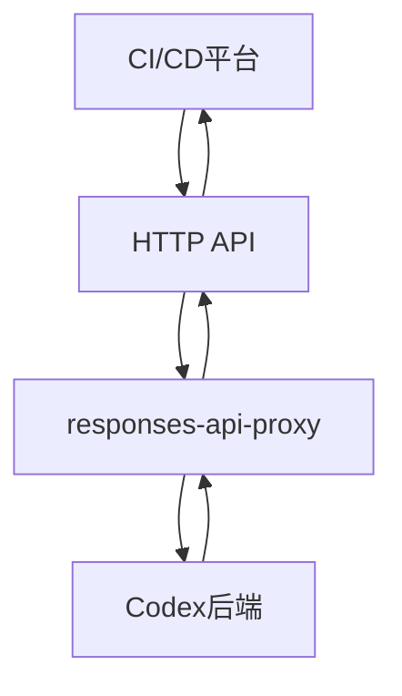
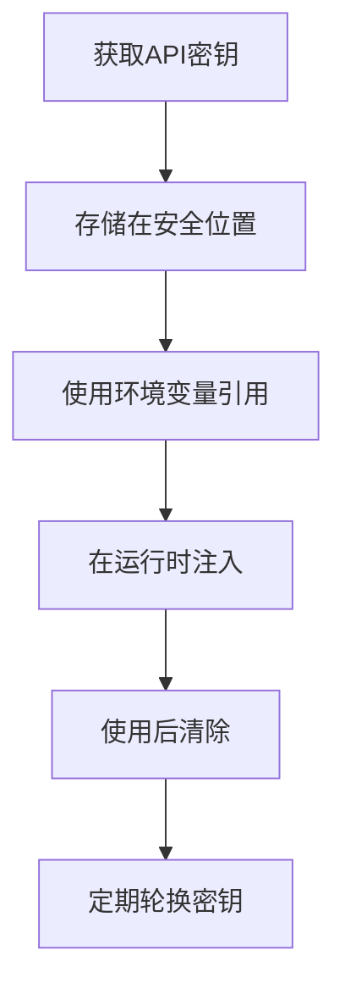
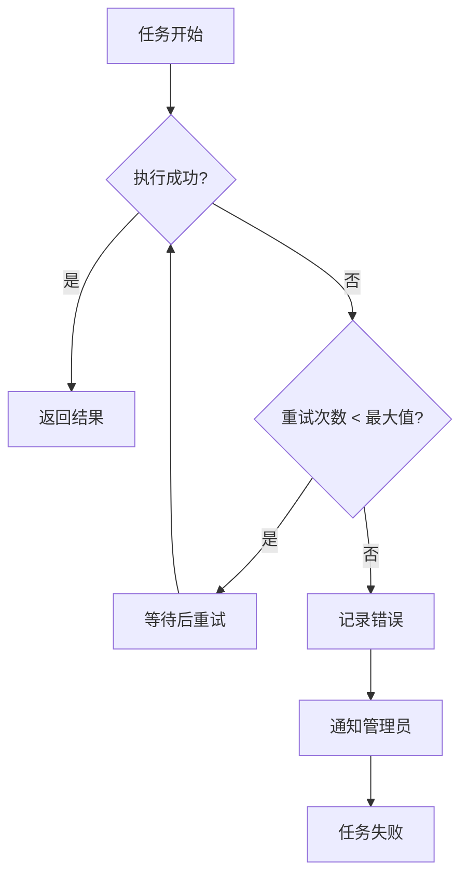

# 第三方系统集成

<cite>
**本文档中引用的文件**  
- [codex.ts](file://sdk/typescript/src/codex.ts)
- [thread.ts](file://sdk/typescript/src/thread.ts)
- [exec.ts](file://sdk/typescript/src/exec.ts)
- [index.ts](file://sdk/typescript/src/index.ts)
- [package.json](file://sdk/typescript/package.json)
- [main.rs](file://codex-rs/cli/src/main.rs)
- [app-server\README.md](file://codex-rs/app-server/README.md)
- [responses-api-proxy\README.md](file://codex-rs/responses-api-proxy/README.md)
- [responses-api-proxy\src\lib.rs](file://codex-rs/responses-api-proxy/src/lib.rs)
- [responses-api-proxy\src\read_api_key.rs](file://codex-rs/responses-api-proxy/src/read_api_key.rs)
- [cli.rs](file://codex-rs/exec/src/cli.rs)
</cite>

## 目录
1. [简介](#简介)
2. [TypeScript SDK集成](#typescript-sdk集成)
3. [GitHub Actions集成](#github-actions集成)
4. [其他CI/CD平台集成](#其他cicd平台集成)
5. [自定义集成最佳实践](#自定义集成最佳实践)
6. [结论](#结论)

## 简介
Codex是一个先进的AI助手，能够与各种第三方系统集成，为开发者提供智能辅助功能。本指南将详细介绍如何将Codex集成到现有的Web应用、桌面应用以及CI/CD工作流中。我们将探讨使用TypeScript SDK进行应用集成、在GitHub Actions中实现自动化代码审查、与其他CI/CD平台集成的方法，以及构建自定义集成的最佳实践。

## TypeScript SDK集成

Codex提供了TypeScript SDK，使开发者能够轻松地将Codex的智能助手功能集成到现有的Web应用或桌面应用中。SDK提供了简洁的API来启动和管理与Codex的对话会话。

### SDK安装与配置
要使用Codex TypeScript SDK，首先需要通过npm安装：

```bash
npm install @openai/codex-sdk
```

安装完成后，可以通过导入SDK并创建Codex实例来开始使用：

```typescript
import { Codex } from "@openai/codex-sdk";

const codex = new Codex({
  apiKey: "your-api-key",
  baseUrl: "https://api.openai.com"
});
```

### 启动对话会话
使用SDK启动新的对话会话非常简单。通过`startThread`方法可以创建一个新的会话：

```typescript
const thread = codex.startThread({
  model: "gpt-5.1-codex",
  sandboxMode: "workspaceWrite"
});
```

### 流式处理响应
SDK支持流式处理Codex的响应，这对于构建实时交互界面非常有用。可以使用`runStreamed`方法来获取流式事件：

```typescript
const result = await thread.runStreamed("请帮我重构这段代码");
for await (const event of result.events) {
  console.log(event);
}
```

### 恢复现有会话
如果需要恢复之前的会话，可以使用`resumeThread`方法：

```typescript
const resumedThread = codex.resumeThread("thr_123", {
  model: "gpt-5.1-codex"
});
```

**Section sources**
- [codex.ts](file://sdk/typescript/src/codex.ts#L1-L39)
- [thread.ts](file://sdk/typescript/src/thread.ts#L1-L155)
- [exec.ts](file://sdk/typescript/src/exec.ts#L1-L254)
- [index.ts](file://sdk/typescript/src/index.ts#L1-L40)
- [package.json](file://sdk/typescript/package.json#L1-L67)

## GitHub Actions集成

Codex可以通过`codex exec`命令与GitHub Actions工作流集成，实现自动化代码审查和文档生成。这种集成方式特别适用于在代码提交时自动进行质量检查。

### GitHub Actions工作流配置
以下是一个具体的GitHub Actions YAML配置示例，展示了如何在`pull_request`事件触发时运行Codex进行代码审查：

```yaml
name: Codex Code Review

on:
  pull_request:
    types: [opened, synchronize, reopened]

jobs:
  codex-review:
    runs-on: ubuntu-latest
    steps:
    - uses: actions/checkout@v4
      with:
        ref: ${{ github.event.pull_request.head.sha }}
        
    - name: Set up Node.js
      uses: actions/setup-node@v4
      with:
        node-version: '18'
        
    - name: Install Codex CLI
      run: |
        npm install -g @openai/codex
        
    - name: Run Codex Code Review
      env:
        CODEX_API_KEY: ${{ secrets.CODEX_API_KEY }}
      run: |
        codex exec \
          --model gpt-5.1-codex \
          --sandbox workspaceWrite \
          --cd ${{ github.workspace }} \
          "请审查最近的代码更改，重点关注代码质量、潜在bug和改进建议"
          
    - name: Post Review Results
      if: always()
      run: |
        echo "Codex代码审查已完成"
```

### 工作流说明
上述工作流配置了在以下情况下自动触发：
- 拉取请求被创建
- 拉取请求被更新（同步）
- 拉取请求被重新打开

工作流执行步骤包括：
1. 检出代码库
2. 设置Node.js环境
3. 安装Codex CLI
4. 运行Codex进行代码审查
5. 发布审查结果

### 安全考虑
在GitHub Actions中使用Codex时，需要注意API密钥的安全管理。建议使用GitHub Secrets来存储API密钥，避免在代码中硬编码敏感信息。

**Section sources**
- [main.rs](file://codex-rs/cli/src/main.rs#L78-L277)
- [cli.rs](file://codex-rs/exec/src/cli.rs#L1-L158)
- [app-server\README.md](file://codex-rs/app-server/README.md#L1-L486)

## 其他CI/CD平台集成

除了GitHub Actions，Codex还可以通过HTTP API或直接调用CLI的方式与其他CI/CD平台集成，如GitLab CI和CircleCI。

### GitLab CI集成
在GitLab CI中集成Codex可以通过在`.gitlab-ci.yml`文件中添加相应的作业来实现：

```yaml
codex-review:
  image: node:18
  script:
    - npm install -g @openai/codex
    - codex exec \
        --model gpt-5.1-codex \
        --sandbox workspaceWrite \
        --cd $CI_PROJECT_DIR \
        "请审查代码并提供改进建议"
  rules:
    - if: $CI_PIPELINE_SOURCE == "merge_request_event"
```

### CircleCI集成
在CircleCI中，可以在`config.yml`文件中配置Codex集成：

```yaml
version: 2.1
jobs:
  codex-review:
    docker:
      - image: cimg/node:18.10
    steps:
      - checkout
      - run:
          name: Install Codex CLI
          command: npm install -g @openai/codex
      - run:
          name: Run Codex Review
          command: |
            codex exec \
              --model gpt-5.1-codex \
              --sandbox workspaceWrite \
              --cd $PWD \
              "请审查代码质量"
workflows:
  version: 2
  review:
    jobs:
      - codex-review:
          filters:
            branches:
              ignore: main
```

### HTTP API集成
虽然Codex主要通过CLI进行交互，但也可以通过HTTP API进行集成。`responses-api-proxy`组件提供了一个HTTP代理，可以将请求转发到Codex后端：



**Diagram sources**
- [responses-api-proxy\README.md](file://codex-rs/responses-api-proxy/README.md#L1-L64)
- [responses-api-proxy\src\lib.rs](file://codex-rs/responses-api-proxy/src/lib.rs#L1-L238)

**Section sources**
- [responses-api-proxy\README.md](file://codex-rs/responses-api-proxy/README.md#L1-L64)
- [responses-api-proxy\src\lib.rs](file://codex-rs/responses-api-proxy/src/lib.rs#L1-L238)
- [responses-api-proxy\src\read_api_key.rs](file://codex-rs/responses-api-proxy/src/read_api_key.rs#L68-L342)

## 自定义集成最佳实践

构建与Codex的自定义集成时，需要遵循一些最佳实践来确保安全性、可靠性和可维护性。

### API密钥安全管理
API密钥是访问Codex服务的关键，必须妥善管理：



**Diagram sources**
- [responses-api-proxy\src\read_api_key.rs](file://codex-rs/responses-api-proxy/src/read_api_key.rs#L68-L342)

### 异步任务处理
处理Codex的异步任务时，需要考虑任务的状态管理和错误恢复：

```typescript
async function runCodexTask(prompt: string): Promise<string> {
  const thread = codex.startThread();
  try {
    const result = await thread.run(prompt);
    return result.finalResponse;
  } catch (error) {
    console.error("Codex任务执行失败:", error);
    throw error;
  } finally {
    // 清理资源
    thread.cleanup();
  }
}
```

### 错误恢复机制
建立健壮的错误恢复机制对于确保集成的可靠性至关重要：



**Diagram sources**
- [core\src\codex.rs](file://codex-rs/core/src/codex.rs#L1421-L1453)
- [exec\tests\event_processor_with_json_output.rs](file://codex-rs/exec/tests/event_processor_with_json_output.rs#L578-L629)

### 性能优化
为了优化集成性能，可以考虑以下策略：
- 使用缓存减少重复请求
- 实现请求批处理
- 优化网络连接
- 监控和分析性能指标

**Section sources**
- [codex.ts](file://sdk/typescript/src/codex.ts#L1-L39)
- [thread.ts](file://sdk/typescript/src/thread.ts#L1-L155)
- [exec.ts](file://sdk/typescript/src/exec.ts#L1-L254)
- [core\src\codex.rs](file://codex-rs/core/src/codex.rs#L1421-L1453)

## 结论
Codex提供了多种方式与第三方系统集成，从TypeScript SDK到CI/CD平台集成，为开发者提供了灵活的选择。通过遵循最佳实践，可以构建安全、可靠和高效的集成解决方案。无论是将Codex作为智能助手集成到应用中，还是在CI/CD流程中实现自动化代码审查，这些集成方法都能显著提升开发效率和代码质量。