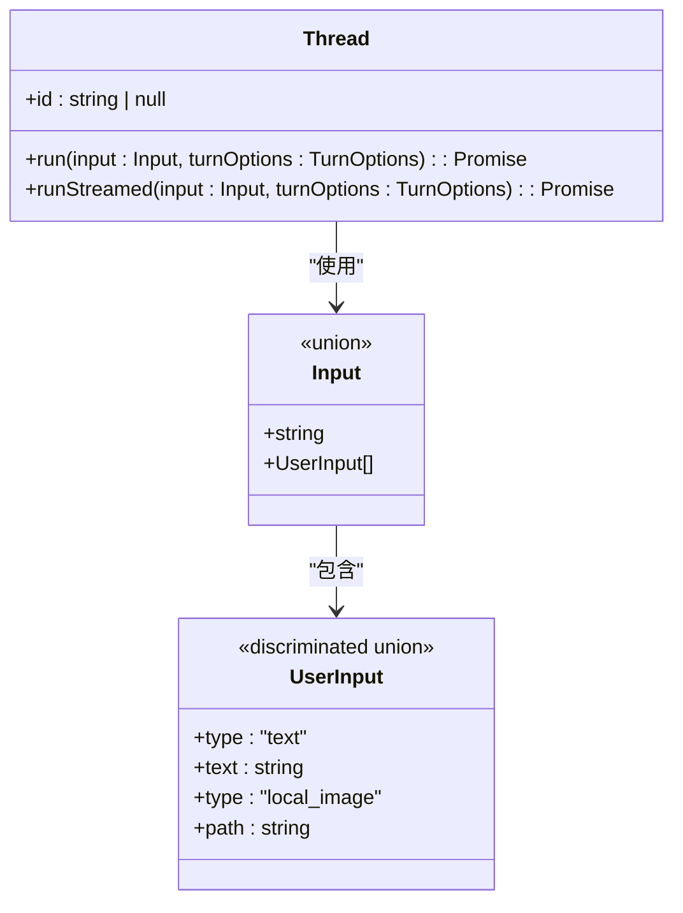

# 自动化与集成

<cite>
**本文档中引用的文件**   
- [codex.ts](file://sdk/typescript/src/codex.ts)
- [thread.ts](file://sdk/typescript/src/thread.ts)
- [exec.ts](file://sdk/typescript/src/exec.ts)
- [events.ts](file://sdk/typescript/src/events.ts)
- [items.ts](file://sdk/typescript/src/items.ts)
- [threadOptions.ts](file://sdk/typescript/src/threadOptions.ts)
- [turnOptions.ts](file://sdk/typescript/src/turnOptions.ts)
- [index.ts](file://sdk/typescript/src/index.ts)
- [package.json](file://sdk/typescript/package.json)
- [README.md](file://sdk/typescript/README.md)
- [basic_streaming.ts](file://sdk/typescript/samples/basic_streaming.ts)
- [structured_output.ts](file://sdk/typescript/samples/structured_output.ts)
- [run.test.ts](file://sdk/typescript/tests/run.test.ts)
- [runStreamed.test.ts](file://sdk/typescript/tests/runStreamed.test.ts)
- [codex.js](file://codex-cli/bin/codex.js)
- [lib.rs](file://codex-rs/exec/src/lib.rs)
- [exec.md](file://docs/exec.md)
</cite>

## 目录
1. [简介](#简介)
2. [TypeScript SDK 集成](#typescript-sdk-集成)
3. [codex exec 模式自动化](#codex-exec-模式自动化)
4. [系统集成与最佳实践](#系统集成与最佳实践)
5. [结论](#结论)

## 简介
Codex 是一个先进的自动化代理系统，旨在通过智能对话和自动化执行来增强开发工作流。本指南全面介绍了 Codex 的自动化与集成能力，重点涵盖其 TypeScript SDK、`codex exec` 命令行模式以及与其他系统的集成可能性。开发者可以利用这些功能在 Node.js 应用中嵌入 Codex 代理，自动化脚本和 CI/CD 流水线，并通过 GitHub Actions 等工具实现代码审查自动化。

## TypeScript SDK 集成

### 核心类与方法
Codex TypeScript SDK 提供了与 Codex 代理交互的高级接口。其核心类包括 `Codex` 和 `Thread`，分别用于管理会话和对话线程。

#### Codex 类
`Codex` 类是与 Codex 代理交互的主要入口点。它负责启动和恢复对话线程。

**核心方法：**
- **`startThread(options: ThreadOptions = {})`**: 启动一个新的对话线程。
- **`resumeThread(id: string, options: ThreadOptions = {})`**: 根据线程 ID 恢复先前的对话线程。


**代码示例：**
```typescript
import { Codex } from "@openai/codex-sdk";

const codex = new Codex();
const thread = codex.startThread();
const turn = await thread.run("诊断测试失败并提出修复方案");
console.log(turn.finalResponse);
```

#### Thread 类
`Thread` 类代表与代理的一系列对话。一个线程可以包含多个连续的回合（turn）。

**核心方法：**
- **`run(input: Input, turnOptions: TurnOptions = {})`**: 向代理提供输入并返回完成的回合。此方法会缓冲事件直到回合结束。
- **`runStreamed(input: Input, turnOptions: TurnOptions = {})`**: 向代理提供输入并流式传输事件。此方法返回一个异步生成器，可用于实时响应中间进度。

**输入类型：**
- `Input`: 可以是字符串或 `UserInput` 数组。
- `UserInput`: 支持文本和本地图像输入。



**流式响应示例：**
```typescript
const { events } = await thread.runStreamed("诊断测试失败并提出修复方案");

for await (const event of events) {
  switch (event.type) {
    case "item.completed":
      console.log("项目", event.item);
      break;
    case "turn.completed":
      console.log("使用情况", event.usage);
      break;
  }
}
```

### 事件与项目类型
SDK 定义了详细的事件和项目类型，用于描述代理的活动。

#### 事件类型
- **`thread.started`**: 当新线程启动时发出。
- **`turn.started`**: 当回合开始时发出。
- **`turn.completed`**: 当回合完成时发出，包含使用情况信息。
- **`turn.failed`**: 当回合失败时发出，包含错误详情。
- **`item.started`/`item.updated`/`item.completed`**: 当线程项目被添加/更新/完成时发出。

#### 项目类型
- **`agent_message`**: 代理的响应消息。
- **`reasoning`**: 代理思考的摘要。
- **`command_execution`**: 代理执行的命令。
- **`file_change`**: 代理进行的文件更改。
- **`mcp_tool_call`**: 代理调用的 MCP 工具。
- **`web_search`**: 代理执行的网络搜索。
- **`todo_list`**: 代理的运行计划。


**Diagram sources**
- [events.ts](file://sdk/typescript/src/events.ts)
- [items.ts](file://sdk/typescript/src/items.ts)

**Section sources**
- [codex.ts](file://sdk/typescript/src/codex.ts)
- [thread.ts](file://sdk/typescript/src/thread.ts)
- [events.ts](file://sdk/typescript/src/events.ts)
- [items.ts](file://sdk/typescript/src/items.ts)
- [README.md](file://sdk/typescript/README.md)

## codex exec 模式自动化

### 非交互模式
`codex exec` 模式允许在非交互环境中自动化常见工作流。在此模式下，Codex 不会请求命令或编辑批准。

**基本用法：**
```bash
codex exec "计算此项目的总代码行数"
```

#### 输出模式
- **默认输出模式**: Codex 将活动流式传输到 stderr，仅将代理的最终消息写入 stdout。这使得将 `codex exec` 管道传输到另一个工具变得更加容易。
- **JSON 输出模式**: 使用 `--json` 模式，Codex 以 JSON Lines (JSONL) 格式将事件流式传输到 stdout。

**JSONL 输出示例：**
```jsonl
{"type":"thread.started","thread_id":"0199a213-81c0-7800-8aa1-bbab2a035a53"}
{"type":"turn.started"}
{"type":"item.completed","item":{"id":"item_0","type":"reasoning","text":"**Searching for README files**"}}
{"type":"item.started","item":{"id":"item_1","type":"command_execution","command":"bash -lc ls","aggregated_output":"","status":"in_progress"}}
{"type":"item.completed","item":{"id":"item_1","type":"command_execution","command":"bash -lc ls","aggregated_output":"2025-09-11\nAGENTS.md\nCHANGELOG.md\ncliff.toml\ncodex-cli\ncodex-rs\ndocs\nexamples\nflake.lock\nflake.nix\nLICENSE\nnode_modules\nNOTICE\npackage.json\npnpm-lock.yaml\npnpm-workspace.yaml\nPNPM.md\nREADME.md\nscripts\nsdk\ntmp\n","exit_code":0,"status":"completed"}}
{"type":"item.completed","item":{"id":"item_2","type":"reasoning","text":"**Checking repository root for README**"}}
{"type":"item.completed","item":{"id":"item_3","type":"agent_message","text":"Yep — there’s a `README.md` in the repository root."}}
{"type":"turn.completed","usage":{"input_tokens":24763,"cached_input_tokens":24448,"output_tokens":122}}
```

#### 结构化输出
通过 `--output-schema` 参数，可以提供一个 JSON Schema 来定义期望的 JSON 输出。

**结构化输出示例：**
```bash
codex exec "提取项目详情" --output-schema ~/schema.json
...
{"project_name":"Codex CLI","programming_languages":["Rust","TypeScript","Shell"]}
```

#### 恢复非交互会话
可以使用 `codex exec resume <SESSION_ID>` 或 `codex exec resume --last` 恢复先前的非交互会话，以保留对话上下文。

```bash
codex exec "审查更改，查找使用后释放问题"
codex exec resume --last "修复使用后释放问题"
```


**Diagram sources**
- [lib.rs](file://codex-rs/exec/src/lib.rs)
- [exec.md](file://docs/exec.md)

**Section sources**
- [lib.rs](file://codex-rs/exec/src/lib.rs)
- [exec.md](file://docs/exec.md)

## 系统集成与最佳实践

### 与 GitHub Actions 集成
Codex 可以通过 GitHub Actions 集成来自动化代码审查流程。通过在 CI/CD 流水线中调用 `codex exec`，可以在每次提交或拉取请求时自动执行代码审查。

**GitHub Actions 工作流示例：**
```yaml
name: Codex Code Review
on: [pull_request]
jobs:
  review:
    runs-on: ubuntu-latest
    steps:
      - uses: actions/checkout@v3
      - name: Run Codex Review
        run: |
          codex exec --json "审查此拉取请求的更改，查找潜在问题" --output-schema schema.json > review.json
      - name: Parse Review Results
        run: |
          # 解析 review.json 并根据结果采取行动
          python parse_review.py review.json
```

### 最佳实践
1. **安全第一**: 在生产环境中使用 `--full-auto` 或 `--sandbox danger-full-access` 时要格外小心，确保有足够的安全措施。
2. **结构化输出**: 使用 `--output-schema` 来确保代理的输出符合预期格式，便于机器解析。
3. **会话管理**: 利用线程 ID 恢复会话，以保持上下文连续性。
4. **错误处理**: 实现健壮的错误处理机制，以应对代理失败或网络问题。
5. **性能监控**: 监控 token 使用情况和响应时间，以优化性能。

### 自定义集成指导
- **环境控制**: 通过 `env` 参数完全控制传递给 Codex CLI 的环境变量。
- **工作目录**: 使用 `workingDirectory` 选项指定运行 Codex 的工作目录。
- **附加目录**: 使用 `additionalDirectories` 选项指定额外的可访问目录。


**Diagram sources**
- [exec.ts](file://sdk/typescript/src/exec.ts)
- [threadOptions.ts](file://sdk/typescript/src/threadOptions.ts)

**Section sources**
- [exec.ts](file://sdk/typescript/src/exec.ts)
- [threadOptions.ts](file://sdk/typescript/src/threadOptions.ts)
- [README.md](file://sdk/typescript/README.md)

## 结论
Codex 提供了强大的自动化和集成能力，通过其 TypeScript SDK 和 `codex exec` 模式，开发者可以轻松地将智能代理功能嵌入到各种应用和工作流中。通过遵循最佳实践并利用结构化输出和 JSONL 事件流，可以构建高效、可靠的自动化系统。与 GitHub Actions 等工具的集成进一步扩展了 Codex 的应用场景，使其成为现代开发工作流中不可或缺的一部分。