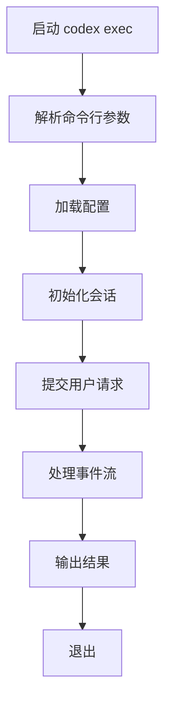
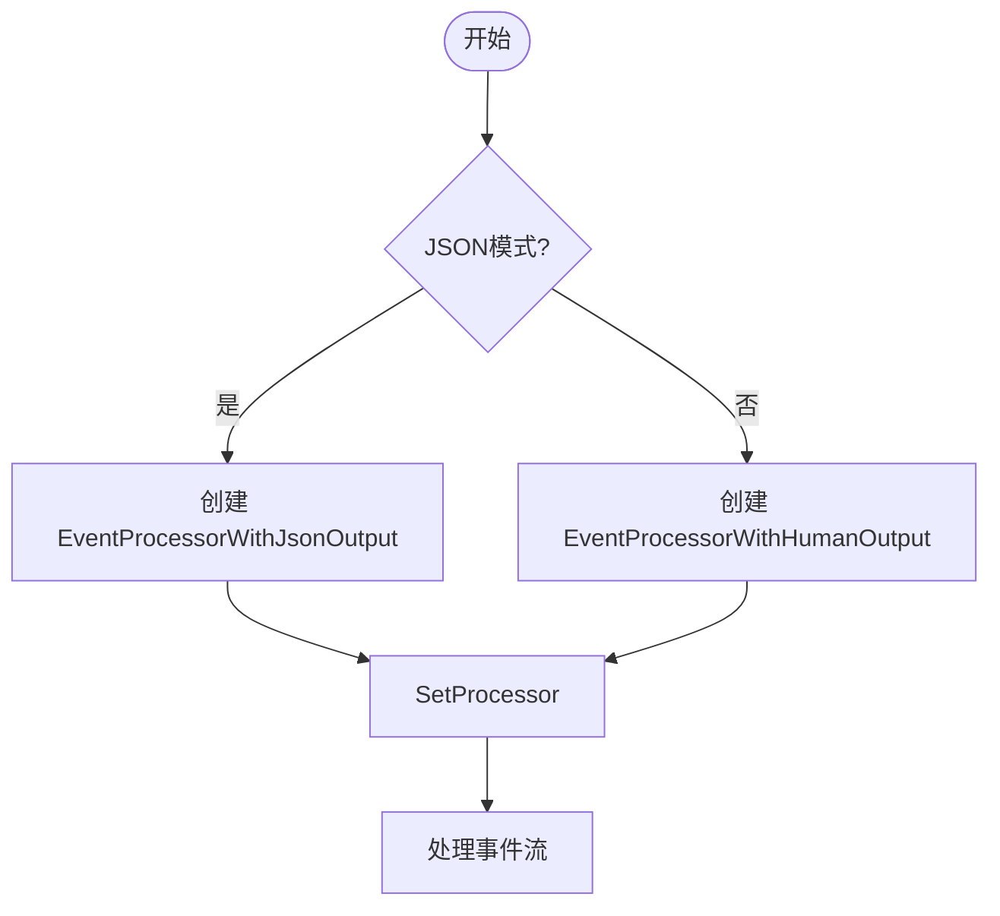
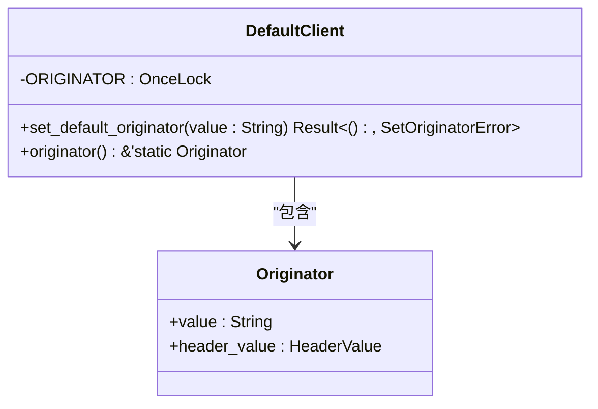
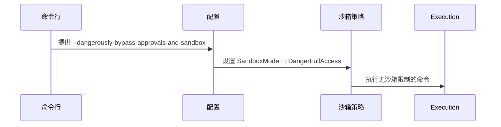
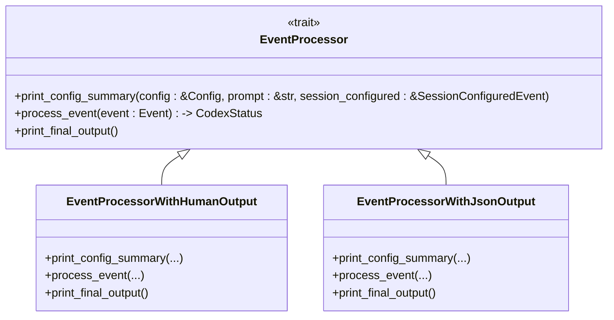
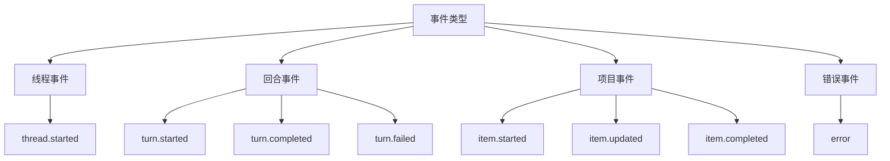
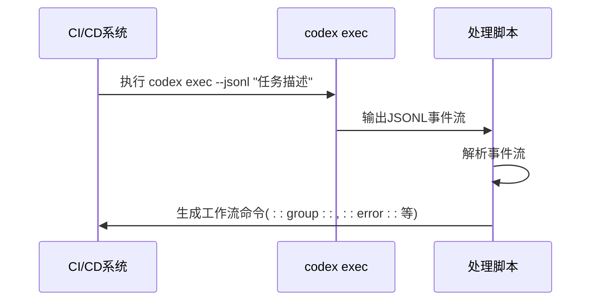

# 非交互式执行

<cite>
**本文档中引用的文件**   
- [main.rs](file://codex-rs/cli/src/main.rs)
- [main.rs](file://codex-rs/exec/src/main.rs)
- [lib.rs](file://codex-rs/exec/src/lib.rs)
- [cli.rs](file://codex-rs/exec/src/cli.rs)
- [event_processor_with_jsonl_output.rs](file://codex-rs/exec/src/event_processor_with_jsonl_output.rs)
- [event_processor.rs](file://codex-rs/exec/src/event_processor.rs)
- [default_client.rs](file://codex-rs/core/src/default_client.rs)
- [exec.md](file://docs/exec.md)
- [config_override.rs](file://codex-rs/common/src/config_override.rs)
- [install_native_deps.py](file://codex-cli/scripts/install_native_deps.py)
</cite>

## 目录
1. [简介](#简介)
2. [非交互式执行模式](#非交互式执行模式)
3. [命令行参数详解](#命令行参数详解)
4. [事件处理器与输出格式化](#事件处理器与输出格式化)
5. [与CI/CD工具集成](#与cicd工具集成)
6. [使用示例](#使用示例)
7. [结论](#结论)

## 简介

`codex exec` 提供了一种非交互式执行模式，允许在脚本和自动化流程中使用 Codex 功能。与交互式 TUI 模式不同，非交互式模式不依赖用户输入，而是通过命令行参数接收指令并自动执行任务。这种模式特别适用于自动化工作流、持续集成/持续部署（CI/CD）管道和其他需要程序化控制的场景。

**Section sources**
- [exec.md](file://docs/exec.md#L1-L115)

## 非交互式执行模式

`codex exec` 的非交互式执行模式通过 `codex-rs/exec` 模块实现。该模式的主要特点是：

- **无用户交互**：不显示交互式界面，所有输入通过命令行参数提供
- **自动化执行**：自动处理命令审批和沙箱策略，无需人工干预
- **输出可预测**：默认情况下，只有最终消息输出到 stdout，便于与其他工具集成
- **错误处理**：遇到错误时返回非零退出码，便于自动化脚本检测失败

该模式通过 `codex-rs/exec/src/main.rs` 中的 `run_main` 函数启动，该函数解析命令行参数并初始化非交互式会话。



**Diagram sources **
- [main.rs](file://codex-rs/exec/src/main.rs#L1-L41)
- [lib.rs](file://codex-rs/exec/src/lib.rs#L70-L478)

**Section sources**
- [main.rs](file://codex-rs/exec/src/main.rs#L1-L41)
- [lib.rs](file://codex-rs/exec/src/lib.rs#L70-L478)

## 命令行参数详解

`codex exec` 提供了多个命令行参数来控制其行为，这些参数在 `codex-rs/exec/src/cli.rs` 中定义。

### JSONL 输出模式 (--jsonl)

`--jsonl` 参数（也支持别名 `--json`）启用机器可读的 JSON Lines 输出模式。在这种模式下，每个事件都以独立的 JSON 对象形式输出到 stdout，每行一个事件。这种格式非常适合程序化处理和与其他工具集成。



**Diagram sources **
- [lib.rs](file://codex-rs/exec/src/lib.rs#L247-L254)
- [event_processor_with_jsonl_output.rs](file://codex-rs/exec/src/event_processor_with_jsonl_output.rs#L515-L548)

**Section sources**
- [cli.rs](file://codex-rs/exec/src/cli.rs#L76-L78)
- [lib.rs](file://codex-rs/exec/src/lib.rs#L89)
- [event_processor_with_jsonl_output.rs](file://codex-rs/exec/src/event_processor_with_jsonl_output.rs#L515-L548)

### 调用者标识 (--originator)

`--originator` 参数用于标识调用者，这在 `codex-rs/core/src/default_client.rs` 中通过 `set_default_originator` 函数实现。该功能允许区分不同来源的请求，便于审计和监控。



**Diagram sources **
- [default_client.rs](file://codex-rs/core/src/default_client.rs#L28-L71)

**Section sources**
- [default_client.rs](file://codex-rs/core/src/default_client.rs#L28-L71)

### 禁用沙箱模式 (--no-sandbox)

`--dangerously-bypass-approvals-and-sandbox` 参数（别名 `--yolo`）用于禁用沙箱，仅用于调试。此参数极其危险，仅应在外部已沙箱化的环境中使用。在 `codex-rs/exec/src/cli.rs` 中定义，并在 `codex-rs/exec/src/lib.rs` 中处理。



**Diagram sources **
- [cli.rs](file://codex-rs/exec/src/cli.rs#L45-L51)
- [lib.rs](file://codex-rs/exec/src/lib.rs#L118-L124)

**Section sources**
- [cli.rs](file://codex-rs/exec/src/cli.rs#L45-L51)
- [lib.rs](file://codex-rs/exec/src/lib.rs#L118-L124)

## 事件处理器与输出格式化

`codex exec` 使用事件处理器模式来处理和格式化输出事件。核心组件位于 `codex-rs/exec/src/event_processor.rs` 和相关实现中。

### 事件处理器架构

事件处理器通过 `EventProcessor` trait 定义接口，支持两种主要实现：
- `EventProcessorWithHumanOutput`：用于人类可读的输出
- `EventProcessorWithJsonOutput`：用于机器可读的 JSONL 输出



**Diagram sources **
- [event_processor.rs](file://codex-rs/exec/src/event_processor.rs#L13-L26)
- [event_processor_with_jsonl_output.rs](file://codex-rs/exec/src/event_processor_with_jsonl_output.rs#L515-L548)

**Section sources**
- [event_processor.rs](file://codex-rs/exec/src/event_processor.rs#L13-L26)
- [event_processor_with_jsonl_output.rs](file://codex-rs/exec/src/event_processor_with_jsonl_output.rs#L515-L548)

### JSONL 输出事件类型

在 `--jsonl` 模式下，`EventProcessorWithJsonOutput` 会生成以下类型的事件：



**Diagram sources **
- [exec.md](file://docs/exec.md#L23-L31)
- [event_processor_with_jsonl_output.rs](file://codex-rs/exec/src/event_processor_with_jsonl_output.rs#L108-L159)

**Section sources**
- [exec.md](file://docs/exec.md#L23-L31)
- [event_processor_with_jsonl_output.rs](file://codex-rs/exec/src/event_processor_with_jsonl_output.rs#L108-L159)

## 与CI/CD工具集成

`codex exec` 的非交互式模式特别适合与 CI/CD 工具集成，如 Jenkins 或 GitHub Actions。通过 `--jsonl` 输出，可以轻松解析和处理 Codex 的输出。

### GitHub Actions 集成示例

虽然 `codex exec` 本身不直接生成 GitHub Actions 工作流命令，但其输出可以被脚本处理以生成相应的命令。例如，`codex-cli/scripts/install_native_deps.py` 中展示了如何检测 GitHub Actions 环境并生成工作流命令。



**Diagram sources **
- [install_native_deps.py](file://codex-cli/scripts/install_native_deps.py#L86-L119)
- [exec.md](file://docs/exec.md#L21-L55)

**Section sources**
- [install_native_deps.py](file://codex-cli/scripts/install_native_deps.py#L86-L119)
- [exec.md](file://docs/exec.md#L21-L55)

## 使用示例

### 基本使用

在 shell 脚本中调用 `codex exec` 创建一个 hello world 的 Python 脚本：

```bash
codex exec "创建一个hello world的Python脚本"
```

### JSONL 输出解析

使用 `--jsonl` 参数并解析输出：

```bash
codex exec "分析代码质量" --jsonl | while read -r line; do
    echo "处理事件: $line"
    # 在这里添加事件处理逻辑
done
```

### 结构化输出

结合 `--output-schema` 和 `-o` 参数获取结构化输出：

```bash
codex exec "提取项目信息" --output-schema schema.json -o output.json
```

**Section sources**
- [exec.md](file://docs/exec.md#L5-L105)

## 结论

`codex exec` 的非交互式执行模式为自动化工作流提供了强大的支持。通过 `--jsonl` 参数，可以实现机器可读的输出，便于与 CI/CD 工具集成。`--originator` 参数允许标识调用者，而 `--no-sandbox` 参数（仅用于调试）提供了完全的执行权限。事件处理器架构确保了输出的一致性和可预测性，使得 `codex exec` 成为自动化任务处理的理想选择。

**Section sources**
- [exec.md](file://docs/exec.md#L1-L115)
- [lib.rs](file://codex-rs/exec/src/lib.rs#L1-L663)