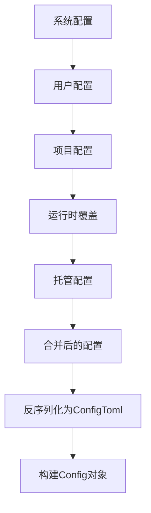

# 配置文件结构

<cite>
**本文档中引用的文件**
- [config.md](file://docs/config.md)
- [example-config.md](file://docs/example-config.md)
- [mod.rs](file://codex-rs/core/src/config/mod.rs)
- [types.rs](file://codex-rs/core/src/config/types.rs)
- [profile.rs](file://codex-rs/core/src/config/profile.rs)
- [config_types.rs](file://codex-rs/protocol/src/config_types.rs)
- [config_loader/mod.rs](file://codex-rs/core/src/config_loader/mod.rs)
</cite>

## 目录
1. [简介](#简介)
2. [配置文件加载流程](#配置文件加载流程)
3. [顶层字段](#顶层字段)
4. [嵌套表结构](#嵌套表结构)
5. [TOML语法应用](#toml语法应用)
6. [配置文件结构示例](#配置文件结构示例)
7. [常见配置错误排查](#常见配置错误排查)

## 简介
Codex的配置系统提供了对模型、执行环境和集成的精细控制。用户可以通过命令行标志、`-c/--config`标志或`~/.codex/config.toml`配置文件来设置配置值。其中，命令行标志具有最高优先级，其次是`--config`标志，最后是配置文件。本文档将深入解析`config.toml`的完整结构，包括其顶层字段和嵌套表，以及配置文件的加载和反序列化过程。

**Section sources**
- [config.md](file://docs/config.md#L1-L800)

## 配置文件加载流程
Codex的配置加载是一个多层合并的过程，从系统级配置到用户级配置，再到项目级配置，最后是运行时覆盖。加载流程如下：

1. **系统配置层**：在Unix系统上，Codex会尝试加载`/etc/codex/config.toml`文件（如果存在）。
2. **用户配置层**：加载`$CODEX_HOME/config.toml`文件（默认为`~/.codex/config.toml`）。
3. **项目配置层**：从当前工作目录（`cwd`）向上遍历，查找包含`.codex`文件夹的目录，并加载其中的`config.toml`文件。这些项目配置层按从项目根目录到当前工作目录的顺序加载，优先级逐层递增。
4. **运行时覆盖层**：应用通过命令行或UI传递的覆盖值。
5. **托管配置层**：最后，应用来自`managed_config.toml`文件的托管配置（如果存在），这通常用于企业环境中的策略强制。

所有这些层的配置值通过`merge_toml_values`函数进行合并，后加载的层具有更高的优先级，可以覆盖先前层的值。合并后的TOML值随后被反序列化为Rust的`ConfigToml`结构体，并最终构建为`Config`对象。



**Diagram sources**
- [mod.rs](file://codex-rs/core/src/config/mod.rs#L390-L422)
- [config_loader/mod.rs](file://codex-rs/core/src/config_loader/mod.rs#L100-L201)

## 顶层字段
`config.toml`文件的顶层包含一系列直接定义的字段，这些字段控制着Codex的核心行为。主要的顶层字段包括：

- **`model`**：指定Codex使用的模型，例如`"gpt-5.1"`。
- **`model_provider`**：指定模型提供商的ID，例如`"openai"`。
- **`approval_policy`**：定义执行命令时的审批策略，可选值为`"untrusted"`、`"on-failure"`、`"on-request"`或`"never"`。
- **`sandbox_mode`**：定义沙箱模式，可选值为`"read-only"`、`"workspace-write"`或`"danger-full-access"`。
- **`profile`**：指定要使用的配置文件名称。
- **`oss_provider`**：指定默认的OSS提供商，可选值为`"lmstudio"`或`"ollama"`。

这些字段在配置文件中必须出现在任何表（table）定义之前。

**Section sources**
- [config.md](file://docs/config.md#L58-L354)
- [mod.rs](file://codex-rs/core/src/config/mod.rs#L672-L723)

## 嵌套表结构
`config.toml`文件中的嵌套表用于组织更复杂的配置选项。主要的嵌套表包括：

### [features] 表
该表用于启用或禁用可选和实验性功能。每个功能由一个布尔值控制。

```toml
[features]
web_search_request = true
view_image_tool = true
```

支持的功能包括`unified_exec`、`apply_patch_freeform`、`view_image_tool`等。

### [model_providers] 表
该表允许用户添加或覆盖内置的模型提供商。每个提供商由一个子表定义，包含`name`、`base_url`、`env_key`等字段。

```toml
[model_providers.ollama]
name = "Ollama"
base_url = "http://localhost:11434/v1"
```

### [mcp_servers] 表
该表用于配置MCP（Model Context Protocol）服务器，使Codex能够访问外部应用程序或服务。MCP服务器可以是STDIO服务器或Streamable HTTP服务器。

```toml
[mcp_servers.docs]
command = "npx"
args = ["-y", "mcp-server"]
```

### [shell_environment_policy] 表
该表控制子进程的环境变量策略，包括继承哪些变量、排除哪些变量以及设置哪些变量。

```toml
[shell_environment_policy]
inherit = "core"
exclude = ["AWS_*", "AZURE_*"]
set = { CI = "1" }
```

### [tui] 表
该表包含与TUI（文本用户界面）相关的设置，如通知、动画和滚动行为。

```toml
[tui]
notifications = false
animations = true
```

### [otel] 表
该表用于配置OpenTelemetry导出器，以收集和导出遥测数据。

```toml
[otel]
exporter = "otlp-http"
environment = "staging"
```

**Section sources**
- [config.md](file://docs/config.md#L35-L658)
- [types.rs](file://codex-rs/core/src/config/types.rs#L20-L800)
- [mod.rs](file://codex-rs/core/src/config/mod.rs#L739-L795)

## TOML语法应用
在`config.toml`文件中，TOML语法被用来定义各种数据类型：

- **字符串**：用双引号包围，例如`model = "gpt-5.1"`。
- **布尔值**：直接使用`true`或`false`，例如`hide_agent_reasoning = true`。
- **数组**：用方括号包围，元素之间用逗号分隔，例如`writable_roots = ["/tmp", "/var/tmp"]`。
- **表**：用方括号定义，例如`[features]`。
- **内联表**：在一行内定义，例如`set = { PATH = "/usr/bin", HOME = "/home/user" }`。

当使用`--config`标志时，值必须是有效的TOML值。例如，`--config shell_environment_policy.include_only='["PATH", "HOME"]'`。

**Section sources**
- [config.md](file://docs/config.md#L19-L27)
- [example-config.md](file://docs/example-config.md#L13-L15)

## 配置文件结构示例
以下是一个结构清晰、注释详尽的`config.toml`文件示例：

```toml
# Codex示例配置文件
# 此文件列出了Codex从config.toml读取的所有键、它们的默认值和简明解释。

################################################################################
# 核心模型选择
################################################################################
model = "gpt-5.1-codex-max"
review_model = "gpt-5.1-codex-max"
model_provider = "openai"

################################################################################
# 推理与详细程度（支持Responses API的模型）
################################################################################
model_reasoning_effort = "medium"
model_reasoning_summary = "auto"
model_verbosity = "medium"

################################################################################
# 审批与沙箱
################################################################################
approval_policy = "on-request"
sandbox_mode = "read-only"

# 当sandbox_mode = "workspace-write"时使用的额外设置
[sandbox_workspace_write]
writable_roots = []
network_access = false

################################################################################
# Shell环境策略
################################################################################
[shell_environment_policy]
inherit = "all"
ignore_default_excludes = true
exclude = []
set = {}
include_only = []

################################################################################
# UI、通知和杂项
################################################################################
[tui]
notifications = false
animations = true
hide_agent_reasoning = false

################################################################################
# 模型提供商（扩展/覆盖内置提供商）
################################################################################
[model_providers.ollama]
name = "Ollama"
base_url = "http://localhost:11434/v1"
wire_api = "chat"

################################################################################
# 配置文件（命名预设）
################################################################################
[profiles]
# [profiles.default]
# model = "gpt-5.1-codex-max"
# approval_policy = "on-request"
# sandbox_mode = "read-only"
```

**Section sources**
- [example-config.md](file://docs/example-config.md#L5-L363)

## 常见配置错误排查
在配置`config.toml`文件时，可能会遇到一些常见错误。以下是排查方法：

- **格式错误**：确保TOML语法正确，例如字符串用引号包围，表定义正确。使用`toml`库的`from_str`函数解析时，任何语法错误都会导致解析失败。
- **无效的嵌套**：确保表定义的嵌套层级正确。例如，`[mcp_servers.server_name]`必须在`[mcp_servers]`之后定义。
- **路径解析错误**：配置文件中的相对路径会相对于配置文件所在的目录进行解析。确保路径正确，避免使用不存在的路径。
- **类型不匹配**：确保字段的值类型与预期类型匹配。例如，`approval_policy`必须是字符串，`features`表中的值必须是布尔值。

通过仔细检查这些常见错误，可以确保配置文件的正确性和有效性。

**Section sources**
- [config_loader/mod.rs](file://codex-rs/core/src/config_loader/mod.rs#L217-L244)
- [mod.rs](file://codex-rs/core/src/config/mod.rs#L472-L490)