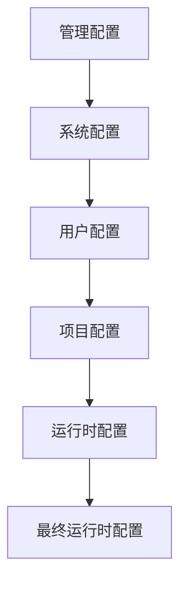
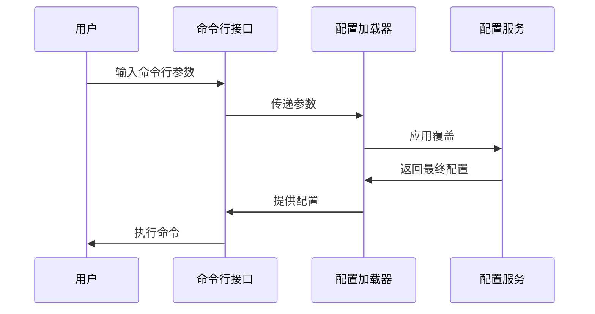

# 配置覆盖机制

<cite>
**本文档引用的文件**   
- [config_loader.rs](file://codex-rs\core\src\config_loader\mod.rs)
- [config_override.rs](file://codex-rs\common\src\config_override.rs)
- [config_service.rs](file://codex-rs\core\src\config\service.rs)
- [state.rs](file://codex-rs\core\src\config_loader\state.rs)
- [overrides.rs](file://codex-rs\core\src\config_loader\overrides.rs)
- [config.md](file://docs\config.md)
</cite>

## 目录
1. [配置覆盖机制](#配置覆盖机制)
2. [配置优先级层次](#配置优先级层次)
3. [配置加载器与配置层](#配置加载器与配置层)
4. [命令行参数覆盖](#命令行参数覆盖)
5. [运行时动态配置](#运行时动态配置)
6. [实际应用与陷阱](#实际应用与陷阱)

## 配置优先级层次

Codex的配置系统采用多层覆盖机制，确保用户可以在不同场景下灵活地控制应用行为。配置的优先级从高到低依次为：**环境变量 > 命令行参数 > 配置文件**。这种设计允许用户在不修改配置文件的情况下，通过环境变量或命令行参数临时覆盖特定设置。

例如，用户可以在配置文件中设置默认模型为`gpt-5.1-codex-max`，但在执行特定任务时，通过设置环境变量`CODEX_MODEL_DEFAULT=gpt-4o`来临时使用`gpt-4o`模型。同样，用户也可以通过命令行参数`--model claude-3-haiku`进行一次性覆盖，而无需修改任何文件。

**Section sources**
- [config.md](file://docs\config.md#L18-L27)

## 配置加载器与配置层

`ConfigLoader`是Codex配置系统的核心组件，负责从多个来源加载配置并合并成最终的运行时配置。配置加载器通过`ConfigLayer`结构体来表示不同的配置层，每个配置层都有一个明确的来源和优先级。

配置层的加载顺序如下：
1. **管理配置**（MDM）：在macOS上通过设备管理配置。
2. **系统配置**：位于`/etc/codex/config.toml`。
3. **用户配置**：位于`$CODEX_HOME/config.toml`。
4. **项目配置**：位于项目根目录下的`.codex/config.toml`。
5. **运行时配置**：通过命令行参数或UI设置。

配置加载器会按照优先级顺序合并这些配置层，确保高优先级的配置能够覆盖低优先级的配置。

**Diagram sources **
- [config_loader.rs](file://codex-rs\core\src\config_loader\mod.rs#L55-L63)

## 命令行参数覆盖

命令行参数是配置覆盖机制中优先级最高的方式之一。用户可以通过`-c`或`--config`标志来指定配置覆盖。例如，`--config model="o3"`会将模型设置为`o3`，而`--config shell_environment_policy.inherit=all`会设置环境变量继承策略。

`CliConfigOverrides`结构体用于处理命令行参数覆盖。它首先解析命令行参数中的`key=value`对，然后将这些覆盖应用到目标配置值上。如果值无法解析为有效的TOML值，则将其视为字符串值。

**Diagram sources **
- [config_override.rs](file://codex-rs\common\src\config_override.rs#L39-L88)
- [config_service.rs](file://codex-rs\core\src\config\service.rs#L108-L159)

## 运行时动态配置

`ConfigOverride`结构体在运行时动态修改配置中起着关键作用。它允许在不重启应用的情况下，通过API或UI动态修改配置。例如，用户可以在UI中选择不同的模型或调整沙箱模式，这些更改会立即生效。

`ConfigService`提供了`read`和`write`方法，用于读取和写入配置。`read`方法会返回当前的配置，而`write`方法则会应用新的配置覆盖。这些方法确保了配置的动态性和灵活性。

**Section sources**
- [config_service.rs](file://codex-rs\core\src\config\service.rs#L130-L159)

## 实际应用与陷阱

配置覆盖机制在自动化脚本和CI/CD环境中非常有用。例如，在CI/CD管道中，可以通过设置环境变量来临时覆盖配置文件中的模型设置，从而在不同的环境中使用不同的模型。

然而，这种机制也存在一些潜在的陷阱。例如，环境变量名称的拼写错误可能导致配置覆盖失败。此外，过度依赖环境变量可能会导致配置管理变得复杂，难以追踪和调试。

**Section sources**
- [config.md](file://docs\config.md#L18-L27)