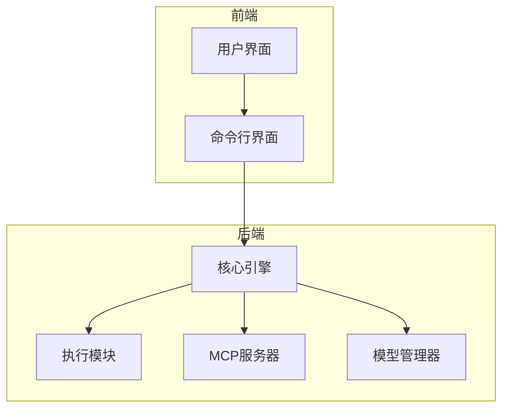
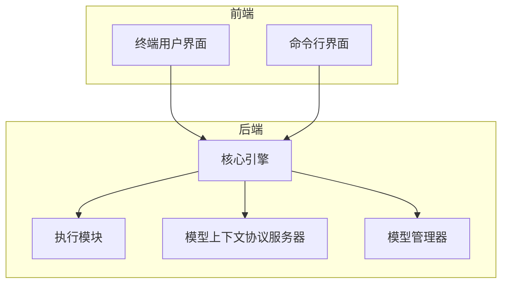
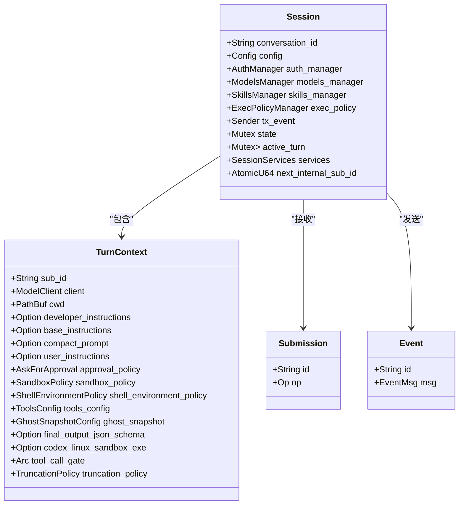
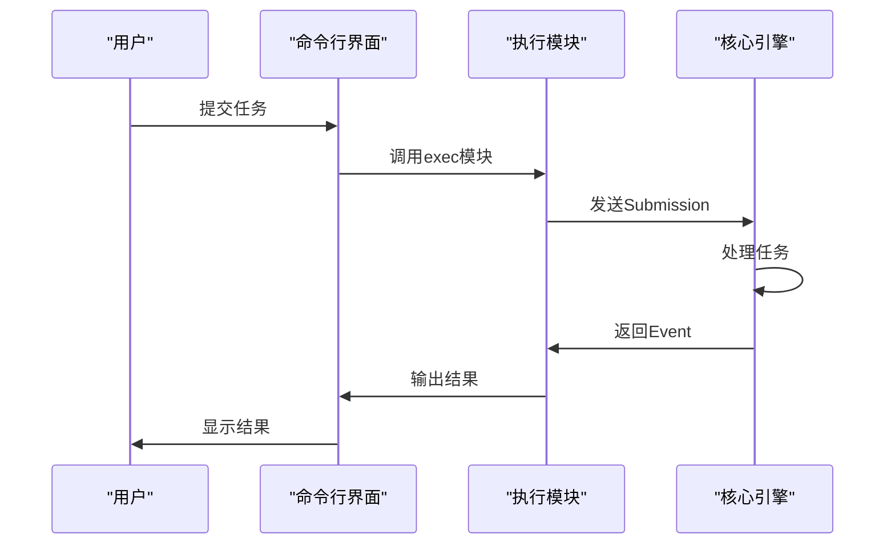
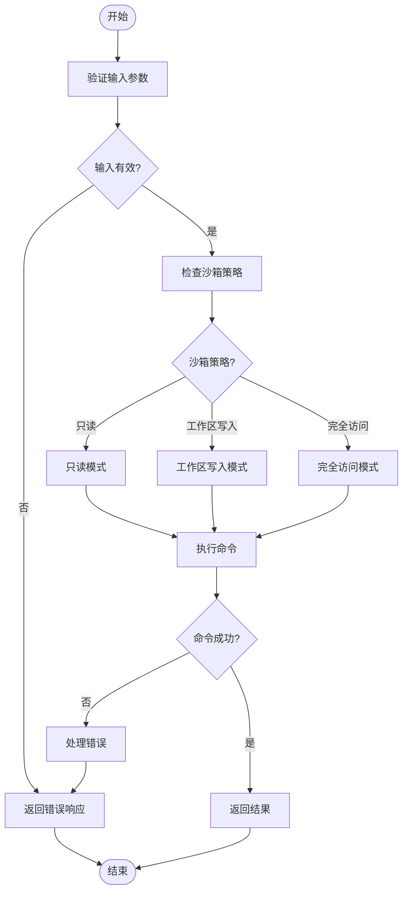
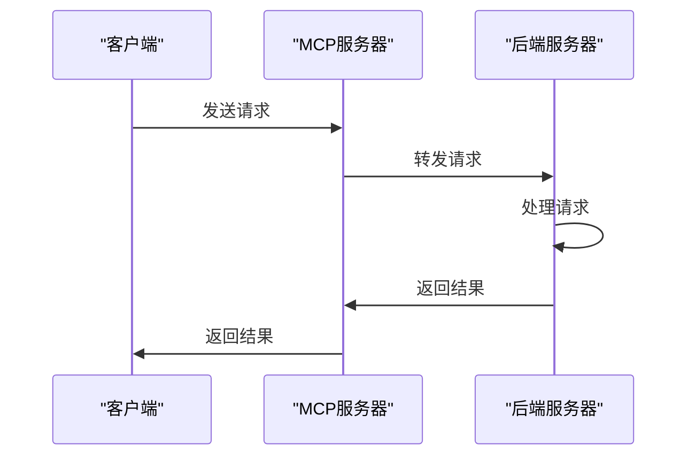
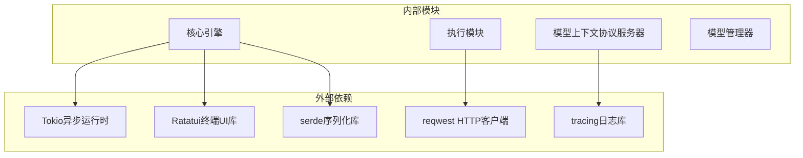

# 项目概述

<cite>
**本文档引用的文件**   
- [README.md](file://README.md)
- [codex-rs/Cargo.toml](file://codex-rs/Cargo.toml)
- [codex-rs/README.md](file://codex-rs/README.md)
- [codex-rs/core/src/lib.rs](file://codex-rs/core/src/lib.rs)
- [codex-rs/cli/src/main.rs](file://codex-rs/cli/src/main.rs)
- [codex-rs/tui/src/lib.rs](file://codex-rs/tui/src/lib.rs)
- [codex-rs/core/src/codex.rs](file://codex-rs/core/src/codex.rs)
- [codex-rs/core/src/conversation_manager.rs](file://codex-rs/core/src/conversation_manager.rs)
- [codex-rs/exec/src/lib.rs](file://codex-rs/exec/src/lib.rs)
- [codex-rs/mcp-server/src/lib.rs](file://codex-rs/mcp-server/src/lib.rs)
- [codex-rs/linux-sandbox/src/lib.rs](file://codex-rs/linux-sandbox/src/lib.rs)
- [codex-rs/windows-sandbox-rs/src/lib.rs](file://codex-rs/windows-sandbox-rs/src/lib.rs)
- [codex-rs/ollama/src/lib.rs](file://codex-rs/ollama/src/lib.rs)
- [codex-rs/lmstudio/src/lib.rs](file://codex-rs/lmstudio/src/lib.rs)
- [codex-rs/mcp-types/src/lib.rs](file://codex-rs/mcp-types/src/lib.rs)
- [codex-rs/core/src/models_manager/mod.rs](file://codex-rs/core/src/models_manager/mod.rs)
- [codex-rs/core/src/sandboxing/mod.rs](file://codex-rs/core/src/sandboxing/mod.rs)
</cite>

## 目录
1. [简介](#简介)
2. [项目结构](#项目结构)
3. [核心组件](#核心组件)
4. [架构概述](#架构概述)
5. [详细组件分析](#详细组件分析)
6. [依赖分析](#依赖分析)
7. [性能考虑](#性能考虑)
8. [故障排除指南](#故障排除指南)
9. [结论](#结论)

## 简介
Codex项目是一个由OpenAI开发的本地AI编程代理，旨在为开发者提供代码生成、审查和自动化执行能力。它通过一个交互式终端界面（TUI）或非交互式执行模式运行，支持多种大模型后端，如OpenAI、Ollama和LMStudio。Codex的核心是用Rust编写的，利用Tokio异步运行时和Ratatui驱动的终端UI，确保了高性能和响应性。项目的目标用户包括寻求提高生产力的开发者和需要安全自动化的团队。Codex通过模型上下文协议（MCP）支持与外部工具和服务集成，提供了强大的沙箱安全机制来保护用户的开发环境。

## 项目结构
Codex项目的结构清晰，分为多个模块，每个模块负责特定的功能。主要目录包括`codex-cli`、`codex-rs`、`docs`、`scripts`、`sdk`和`shell-tool-mcp`。`codex-rs`目录是Rust实现的核心，包含多个子模块，如`core`、`cli`、`tui`、`exec`、`mcp-server`等。这些模块共同构成了Codex的完整功能集。

**图源**
- [codex-rs/README.md](file://codex-rs/README.md)

**节源**
- [codex-rs/README.md](file://codex-rs/README.md)

## 核心组件
Codex的核心组件包括`Session`、`TurnContext`、`Submission`和`Event`。`Session`表示一个会话，包含会话的配置和状态。`TurnContext`表示单次对话的上下文，包含客户端、工作目录、开发者指令等信息。`Submission`表示提交给Codex的操作，如用户输入或审查请求。`Event`表示Codex生成的事件，如任务开始、任务完成等。

**节源**
- [codex-rs/core/src/codex.rs](file://codex-rs/core/src/codex.rs)
- [codex-rs/core/src/conversation_manager.rs](file://codex-rs/core/src/conversation_manager.rs)

## 架构概述
Codex的架构设计旨在提供高效、安全和可扩展的编程代理服务。核心引擎用Rust编写，利用Tokio异步运行时处理并发请求。TUI模块使用Ratatui库构建交互式终端界面，提供丰富的用户交互体验。`exec`模块支持非交互式执行模式，适用于自动化脚本和CI/CD流程。MCP服务器模块允许Codex作为MCP客户端或服务器，与其他工具和服务集成。

**图源**
- [codex-rs/README.md](file://codex-rs/README.md)

**节源**
- [codex-rs/README.md](file://codex-rs/README.md)

## 详细组件分析
### 会话管理
`Session`是Codex的核心概念，表示一个会话的生命周期。每个会话都有一个唯一的ID，并包含会话的配置和状态。会话的配置包括模型、开发者指令、用户指令等。会话的状态包括当前的对话上下文、执行策略等。

#### 会话类图

**图源**
- [codex-rs/core/src/codex.rs](file://codex-rs/core/src/codex.rs)

**节源**
- [codex-rs/core/src/codex.rs](file://codex-rs/core/src/codex.rs)

### 执行模块
`exec`模块支持非交互式执行模式，适用于自动化脚本和CI/CD流程。用户可以通过`codex exec`命令提交任务，Codex将自动处理任务直到完成。该模块支持JSON输出模式，便于与其他工具集成。

#### 执行模块序列图

**图源**
- [codex-rs/exec/src/lib.rs](file://codex-rs/exec/src/lib.rs)

**节源**
- [codex-rs/exec/src/lib.rs](file://codex-rs/exec/src/lib.rs)

### 沙箱安全机制
Codex提供了强大的沙箱安全机制，确保在执行代码时不会对用户的开发环境造成损害。沙箱机制支持多种策略，如只读、工作区写入和完全访问。用户可以通过`--sandbox`标志选择沙箱策略。

#### 沙箱安全机制流程图

**图源**
- [codex-rs/core/src/sandboxing/mod.rs](file://codex-rs/core/src/sandboxing/mod.rs)

**节源**
- [codex-rs/core/src/sandboxing/mod.rs](file://codex-rs/core/src/sandboxing/mod.rs)

### 模型上下文协议（MCP）支持
Codex支持模型上下文协议（MCP），允许与其他工具和服务集成。MCP服务器模块可以作为MCP客户端或服务器，提供丰富的功能，如资源列表、工具调用等。

#### MCP支持序列图

**图源**
- [codex-rs/mcp-server/src/lib.rs](file://codex-rs/mcp-server/src/lib.rs)

**节源**
- [codex-rs/mcp-server/src/lib.rs](file://codex-rs/mcp-server/src/lib.rs)

## 依赖分析
Codex项目依赖于多个外部库和工具，确保了其功能的完整性和性能。主要依赖包括Tokio异步运行时、Ratatui终端UI库、serde序列化库等。这些依赖通过Cargo.toml文件管理，确保了项目的可维护性和可扩展性。

**图源**
- [codex-rs/Cargo.toml](file://codex-rs/Cargo.toml)

**节源**
- [codex-rs/Cargo.toml](file://codex-rs/Cargo.toml)

## 性能考虑
Codex的设计考虑了性能优化，确保在处理大量代码生成和审查任务时仍能保持高效。核心引擎使用Rust编写，利用其内存安全和高性能特性。异步运行时和多线程处理机制确保了高并发性能。此外，缓存机制和资源管理策略进一步提升了性能。

## 故障排除指南
### 常见问题
1. **无法启动Codex**：检查是否正确安装了所有依赖项，特别是Rust和Node.js。
2. **连接问题**：确保网络连接正常，检查API密钥是否正确。
3. **沙箱错误**：检查沙箱策略是否正确配置，确保有足够的权限执行命令。

### 日志和调试
Codex提供了详细的日志记录功能，帮助开发者诊断问题。用户可以通过设置`RUST_LOG`环境变量来查看更详细的日志信息。此外，`--debug`标志可以启用调试模式，提供更多调试信息。

**节源**
- [codex-rs/README.md](file://codex-rs/README.md)
- [codex-rs/core/src/lib.rs](file://codex-rs/core/src/lib.rs)

## 结论
Codex项目是一个功能强大且安全的本地AI编程代理，旨在提高开发者的生产力。通过Rust核心引擎和多种大模型后端的支持，Codex提供了高效的代码生成、审查和自动化执行能力。其丰富的功能和灵活的配置选项使其成为开发者的理想选择。未来，Codex将继续优化性能和安全性，提供更多创新功能。