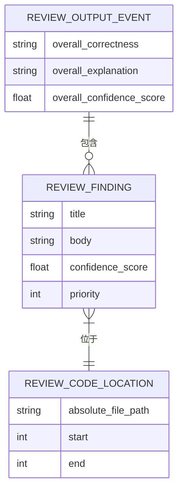
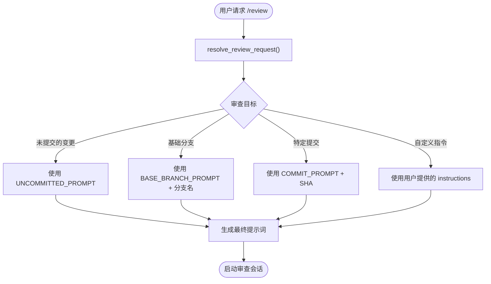
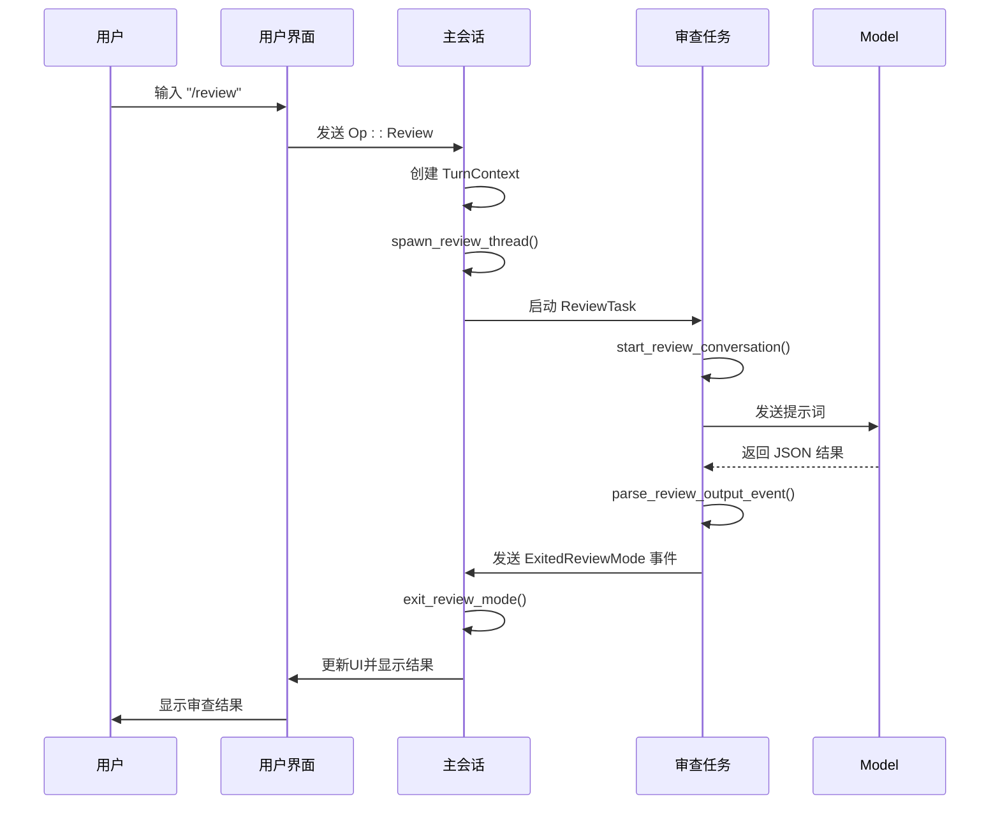

# 代码审查

<cite>
**本文档引用的文件**   
- [review.rs](file://codex-rs\core\src\tasks\review.rs)
- [review_format.rs](file://codex-rs\core\src\review_format.rs)
- [review_prompts.rs](file://codex-rs\core\src\review_prompts.rs)
- [codex.rs](file://codex-rs\core\src\codex.rs)
- [protocol.rs](file://codex-rs\protocol\src\protocol.rs)
- [client_common.rs](file://codex-rs\core\src\client_common.rs)
- [config.toml](file://codex-rs\core\src\config\mod.rs)
- [review_prompt.md](file://codex-rs\core\review_prompt.md)
</cite>

## 目录
1. [简介](#简介)
2. [核心实现机制](#核心实现机制)
3. [审查结果格式](#审查结果格式)
4. [提示词模板与配置](#提示词模板与配置)
5. [使用示例与结果解读](#使用示例与结果解读)
6. [与核心会话系统的集成](#与核心会话系统的集成)
7. [配置与自定义](#配置与自定义)
8. [入门指南与高级技巧](#入门指南与高级技巧)

## 简介
Codex的代码审查功能提供了一个强大的`/review`命令，用于对代码变更进行自动化审查。该功能通过专门的审查任务处理代码变更，调用AI模型生成详细的审查意见。审查过程是结构化的，旨在提供清晰、可操作的反馈，帮助开发者提高代码质量。本指南将深入探讨其内部实现、配置选项和最佳实践。

## 核心实现机制

`/review`命令的实现基于一个独立的`ReviewTask`，它在Codex会话中作为一个子任务运行。当用户发出`/review`指令时，系统会创建一个新的审查会话，该会话与主会话隔离，以确保审查过程的专注性和独立性。

审查流程的核心是`ReviewTask`结构体，它实现了`SessionTask` trait。当`run`方法被调用时，它会启动一个子会话（sub-codex conversation），该会话使用一个专门的模型配置。这个配置会禁用一些在审查场景下不相关的功能，如网络搜索（web_search）和查看图像（view_image），并设置一个明确的审查指令（`REVIEW_PROMPT`）。

审查会话的输入是根据`ReviewRequest`生成的提示词（prompt），该提示词会指导模型如何审查代码。审查完成后，系统会接收模型的输出，解析为结构化的`ReviewOutputEvent`，然后通过`ExitedReviewMode`事件将结果返回给主会话。

**代码审查功能的生命周期事件流如下：**
1.  **EnteredReviewMode**: 审查开始，通知UI切换到审查模式。
2.  **ExitedReviewMode**: 审查结束，携带审查结果。
3.  **TaskComplete**: 整个审查任务完成。

**本节来源**
- [review.rs](file://codex-rs\core\src\tasks\review.rs#L27-L69)
- [codex.rs](file://codex-rs\core\src\codex.rs#L2049-L2079)

## 审查结果格式

审查结果以结构化的JSON格式返回，确保了数据的可解析性和一致性。`review_format.rs`模块负责将这些结构化的数据转换为用户友好的文本格式。

### 审查结果的数据结构
审查结果的核心是`ReviewOutputEvent`，其定义如下：



**图示来源**
- [protocol.rs](file://codex-rs\protocol\src\protocol.rs#L1409-L1427)

- **`findings`**: 一个`ReviewFinding`对象的数组，每个对象代表一个具体的审查发现。
  - `title`: 发现的标题，通常以优先级标签开头，如`[P1]`。
  - `body`: 用Markdown格式编写的详细解释，说明问题所在。
  - `confidence_score`: 模型对发现的置信度分数（0.0-1.0）。
  - `priority`: 问题的优先级（0-3，对应P0-P3）。
  - `code_location`: 包含文件路径和行号范围的代码位置信息。
- **`overall_correctness`**: 对补丁整体正确性的判断，值为`"patch is correct"`或`"patch is incorrect"`。
- **`overall_explanation`**: 对整体正确性判断的简要解释。
- **`overall_confidence_score`**: 对整体判断的置信度分数。

### 格式化输出
`review_format.rs`中的`render_review_output_text`函数负责将`ReviewOutputEvent`转换为最终呈现给用户的文本。它会：
1.  首先输出`overall_explanation`。
2.  然后调用`format_review_findings_block`来格式化所有发现。
3.  如果两者都存在，则用空行分隔。

`format_review_findings_block`函数会生成一个清晰的列表，每个发现都包含其标题、位置和详细说明。

**本节来源**
- [review_format.rs](file://codex-rs\core\src\review_format.rs#L1-L83)
- [protocol.rs](file://codex-rs\protocol\src\protocol.rs#L1409-L1427)

## 提示词模板与配置

审查功能的智能程度很大程度上取决于其提示词（prompt）。Codex使用了分层的提示词系统来指导模型。

### 核心审查指令 (REVIEW_PROMPT)
这是审查任务的系统级指令，定义了审查的通用准则和输出格式。它存储在`core/review_prompt.md`文件中，并通过`client_common.rs`中的常量`REVIEW_PROMPT`引入。

该指令的核心内容包括：
- **审查准则**: 定义了什么构成一个“bug”，例如是否影响准确性、性能、安全性，以及是否是离散且可操作的。
- **评论准则**: 指导如何撰写评论，要求评论清晰、简洁、语气客观，并避免不必要的恭维。
- **优先级标记**: 要求在标题前使用`[P0]`到`[P3]`的标签来标记问题的严重性。
- **输出格式**: 严格规定了必须以纯JSON格式输出，且必须符合预定义的schema。

**本节来源**
- [client_common.rs](file://codex-rs\core\src\client_common.rs#L18-L20)
- [review_prompt.md](file://codex-rs\core\review_prompt.md)

### 动态审查提示词 (review_prompts.rs)
`review_prompts.rs`模块负责根据用户的请求动态生成具体的审查提示词。`resolve_review_request`函数会根据`ReviewRequest`中的`target`字段生成不同的提示词：

- **`UncommittedChanges`**: 提示词为`"Review the current code changes..."`，用于审查工作区中的所有变更。
- **`BaseBranch`**: 提示词会包含具体的分支名称和合并基（merge base）的SHA，指导模型如何获取差异。
- **`Commit`**: 提示词会指定要审查的提交SHA和标题。
- **`Custom`**: 允许用户提供自定义的审查指令。



**图示来源**
- [review_prompts.rs](file://codex-rs\core\src\review_prompts.rs#L13-L66)

**本节来源**
- [review_prompts.rs](file://codex-rs\core\src\review_prompts.rs#L1-L94)

## 使用示例与结果解读

### 实际使用示例
以下是如何使用`/review`命令的示例：

```bash
# 审查当前工作区的所有变更
/review

# 审查与 'main' 分支的差异
/review main

# 审查特定的提交
/review abc1234

# 使用自定义指令进行审查
/review "请重点检查这个新功能的错误处理和边界情况"
```

### 审查结果解读
一个典型的审查结果可能如下所示：

```
整体审查结论：补丁不正确。
主要问题在于新添加的函数没有处理空输入的情况，这可能导致空指针异常。

完整审查评论:
- [P1] 缺少空输入检查 — src/utils/string_utils.rs:45-50
  新增的 `processInput` 函数在接收到 `null` 或空字符串时会抛出 `NullPointerException`。
  建议在函数开始处添加空值检查。
  ```suggestion
  if (input == null || input.isEmpty()) {
      return DEFAULT_VALUE;
  }
  ```
```

**解读：**
- **整体结论**: 明确指出补丁存在严重问题（不正确）。
- **[P1] 标签**: 表示这是一个“紧急”问题，需要尽快修复。
- **位置信息**: 精确指出了问题代码的文件和行号。
- **建议**: 提供了具体的代码修改建议，使用`suggestion`块清晰地展示。

**本节来源**
- [review_format.rs](file://codex-rs\core\src\review_format.rs#L64-L82)
- [review_prompts.rs](file://codex-rs\core\src\review_prompts.rs#L22-L66)

## 与核心会话系统的集成

代码审查功能并非孤立的，而是深度集成在Codex的核心会话系统中。

### 作为子任务运行
审查任务通过`spawn_review_thread`函数在主会话中启动。它创建了一个新的`TurnContext`，并使用`spawn_task`方法将其作为子任务运行。这保证了审查过程的资源隔离，同时又能与主会话共享必要的上下文（如工作目录）。

### 事件驱动的通信
审查任务与主会话通过事件队列（Event Queue）进行通信。关键的事件包括：
- `EnteredReviewMode`: 通知UI进入审查模式。
- `ExitedReviewMode`: 携带审查结果返回。
- `Error`: 在审查过程中发生错误时发出。

主会话监听这些事件，并据此更新UI状态和记录对话历史。



**图示来源**
- [codex.rs](file://codex-rs\core\src\codex.rs#L2081-L2159)
- [review.rs](file://codex-rs\core\src\tasks\review.rs#L72-L108)

**本节来源**
- [codex.rs](file://codex-rs\core\src\codex.rs#L2049-L2168)
- [review.rs](file://codex-rs\core\src\tasks\review.rs#L36-L69)

## 配置与自定义

Codex允许通过配置文件对审查行为进行自定义。

### 配置审查模型
可以在`config.toml`中指定用于审查的专用模型，以区别于主聊天模型。这允许使用更强大或更专业的模型来处理审查任务。

```toml
# config.toml
[review]
# 用于代码审查的模型
model = "gpt-5.1-codex-max"
```

在代码中，`spawn_review_thread`函数会从配置中读取`review_model`，如果未设置，则使用默认值`gpt-5.1-codex-max`。

### 自定义审查指令
高级用户可以通过修改`core/review_prompt.md`文件来自定义审查的通用准则。这可以用于适应特定团队的编码规范或项目需求。

**本节来源**
- [config.toml](file://codex-rs\core\src\config\mod.rs#L72)
- [codex.rs](file://codex-rs\core\src\codex.rs#L2089-L2094)

## 入门指南与高级技巧

### 初学者入门指南
1.  **开始审查**: 在聊天中输入`/review`，Codex将自动审查你工作区中的所有变更。
2.  **理解结果**: 关注`[P0]`和`[P1]`的发现，这些是需要立即处理的严重问题。
3.  **应用建议**: 审查结果中的`suggestion`块可以直接复制粘贴到代码中进行修改。
4.  **重新审查**: 修改代码后，再次运行`/review`以验证问题是否已解决。

### 高级用户技巧
1.  **精准审查**: 使用`/review <branch>`或`/review <commit>`来审查特定的变更集，避免审查无关代码。
2.  **自定义指令**: 使用`/review "请检查..."`来提供具体的审查方向，例如`/review "请检查这个API端点的安全性和输入验证"`。
3.  **配置优化**: 在`config.toml`中为审查任务配置一个更强大的模型，以获得更深入的分析。
4.  **结果集成**: 将Codex的审查结果视为代码审查流程的第一道防线，然后再进行人工审查，可以大大提高效率。