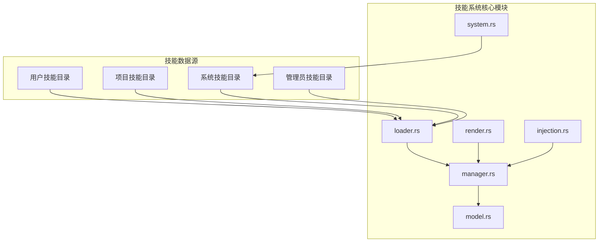
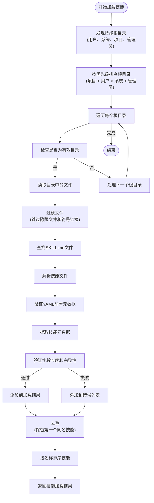
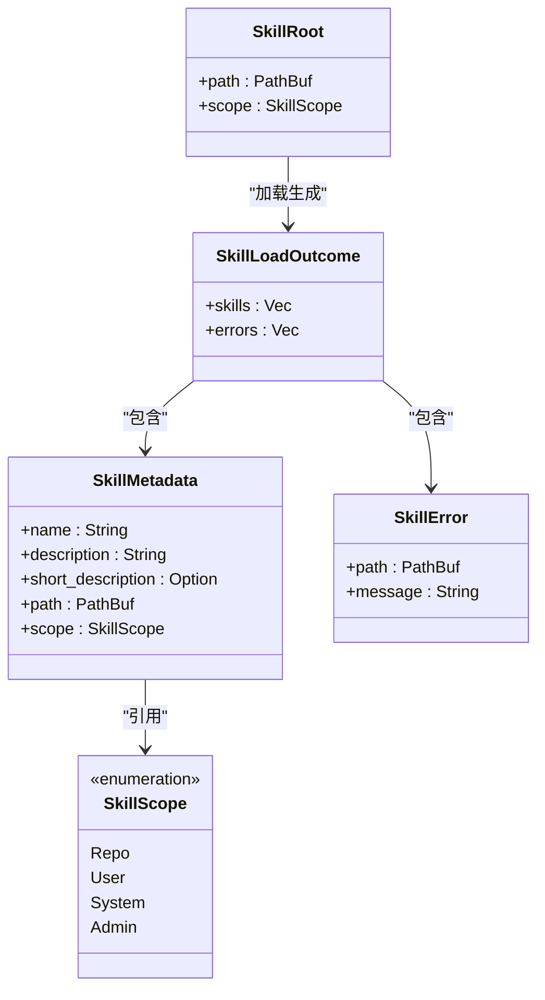
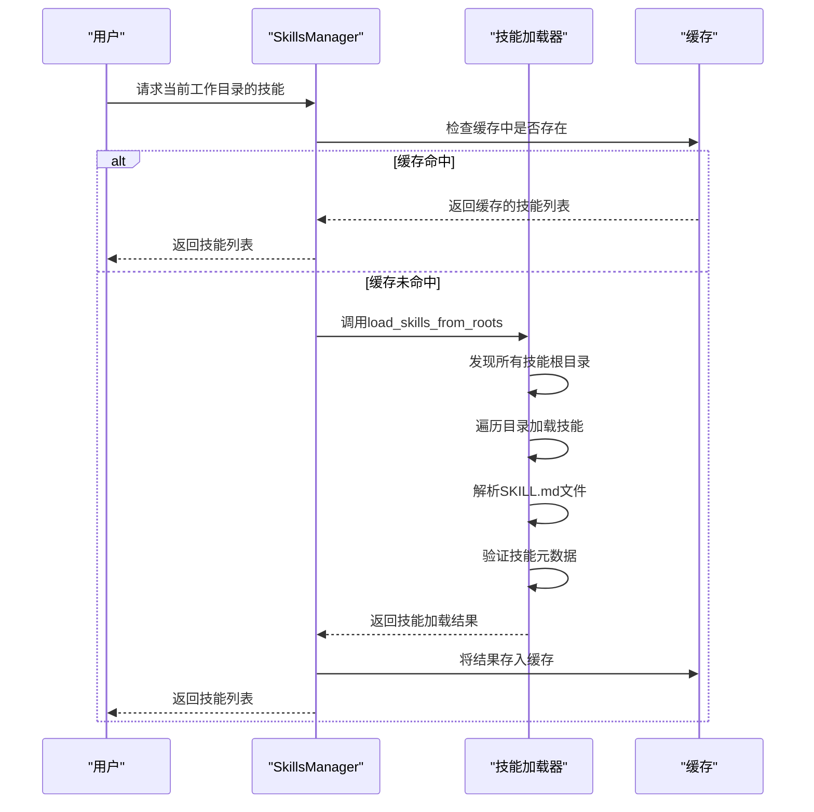
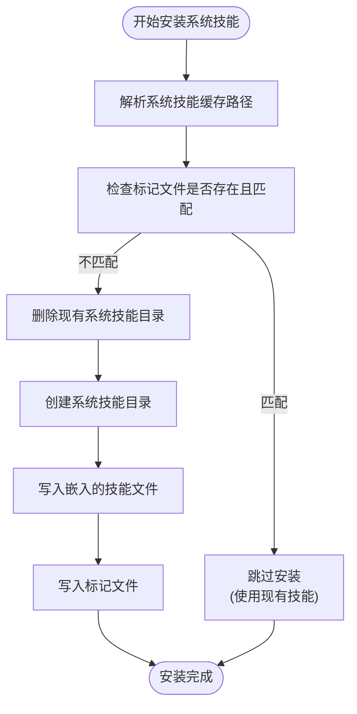
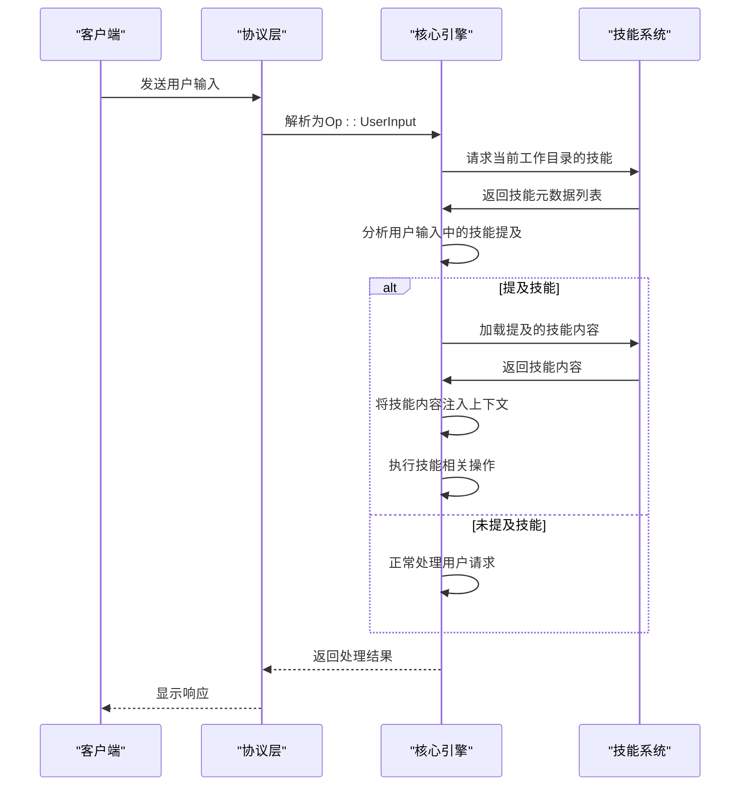
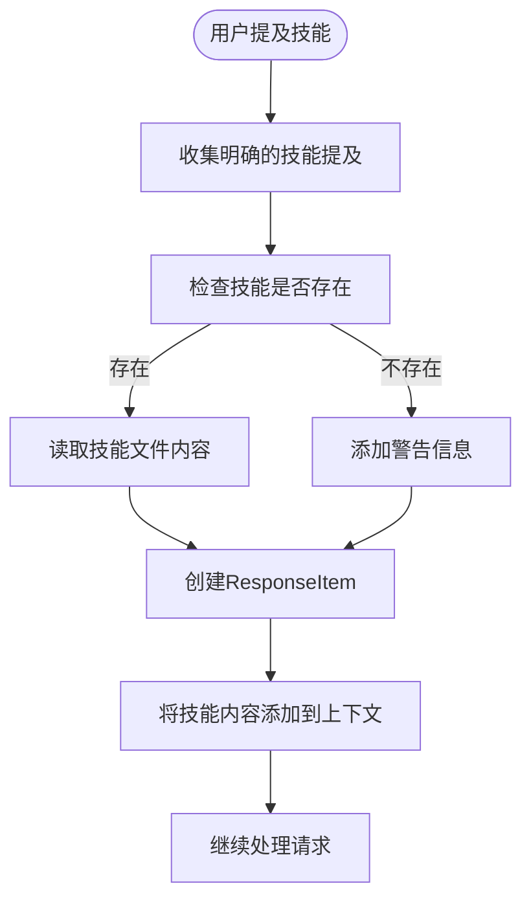
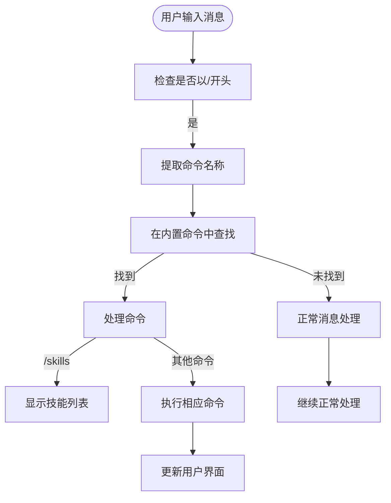
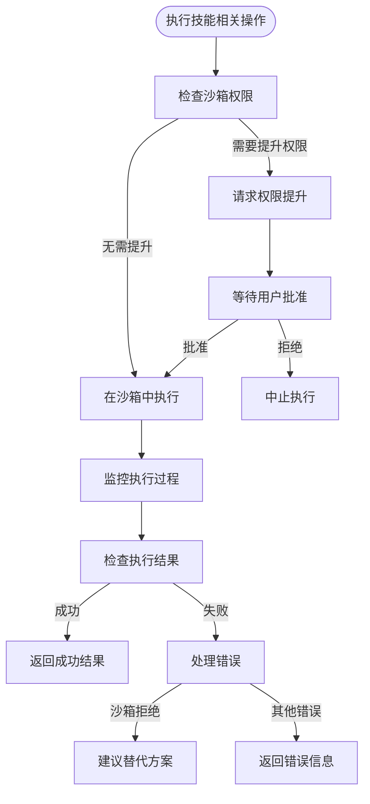

# 技能系统

<cite>
**本文档中引用的文件**  
- [mod.rs](file://codex-rs\core\src\skills\mod.rs)
- [loader.rs](file://codex-rs\core\src\skills\loader.rs)
- [manager.rs](file://codex-rs\core\src\skills\manager.rs)
- [system.rs](file://codex-rs\core\src\skills\system.rs)
- [model.rs](file://codex-rs\core\src\skills\model.rs)
- [render.rs](file://codex-rs\core\src\skills\render.rs)
- [skill-creator\SKILL.md](file://codex-rs\core\src\skills\assets\samples\skill-creator\SKILL.md)
- [skill-installer\SKILL.md](file://codex-rs\core\src\skills\assets\samples\skill-installer\SKILL.md)
- [chat_composer.rs](file://codex-rs\tui\src\bottom_pane\chat_composer.rs)
- [slash_command.rs](file://codex-rs\tui\src\slash_command.rs)
- [protocol.rs](file://codex-rs\protocol\src\protocol.rs)
</cite>

## 目录
1. [简介](#简介)
2. [技能模块架构](#技能模块架构)
3. [技能加载机制](#技能加载机制)
4. [技能管理器](#技能管理器)
5. [系统预定义技能](#系统预定义技能)
6. [自定义技能创建指南](#自定义技能创建指南)
7. [技能与对话引擎的交互](#技能与对话引擎的交互)
8. [斜杠命令激活机制](#斜杠命令激活机制)
9. [自定义技能示例](#自定义技能示例)
10. [安全性和沙箱集成](#安全性和沙箱集成)
11. [总结](#总结)

## 简介
Codex技能系统是一个模块化功能框架，允许将可重用的功能单元作为"技能"进行组织、加载和管理。技能系统通过`loader.rs`从`templates/`目录（实际为`skills/`目录）加载技能定义，并由`manager.rs`进行注册和管理。系统预定义了如`/plan`、`/undo`等系统技能，用户可以通过斜杠命令激活特定技能。本文档详细解释技能系统的工作原理，指导用户如何创建自定义技能，并讨论技能系统与核心对话引擎的交互机制以及安全性和沙箱集成。

## 技能模块架构
Codex技能系统采用模块化设计，主要由以下几个核心组件构成：

- **loader模块**：负责从文件系统加载技能定义
- **manager模块**：负责技能的注册、管理和缓存
- **model模块**：定义技能的元数据模型
- **system模块**：处理系统级技能的安装和管理
- **render模块**：负责技能信息的渲染和展示
- **injection模块**：处理技能注入逻辑



**图源**
- [mod.rs](file://codex-rs\core\src\skills\mod.rs)
- [loader.rs](file://codex-rs\core\src\skills\loader.rs)
- [manager.rs](file://codex-rs\core\src\skills\manager.rs)

## 技能加载机制
技能加载机制通过`loader.rs`实现，从多个目录源加载技能定义。系统按照特定的优先级顺序搜索和加载技能，确保技能的正确性和一致性。

### 技能加载流程


**图源**
- [loader.rs](file://codex-rs\core\src\skills\loader.rs)

### 技能加载源
技能系统从以下四个主要来源加载技能，按优先级顺序：

1. **项目级技能** (`Repo`)：位于项目根目录下的`.codex/skills`目录中，优先级最高
2. **用户级技能** (`User`)：位于用户主目录下的`skills`目录中
3. **系统级技能** (`System`)：位于`CODEX_HOME/skills/.system`目录中，由系统预安装
4. **管理员级技能** (`Admin`)：位于`/etc/codex/skills`目录中，优先级最低



**图源**
- [loader.rs](file://codex-rs\core\src\skills\loader.rs)
- [model.rs](file://codex-rs\core\src\skills\model.rs)

## 技能管理器
技能管理器(`manager.rs`)负责技能的注册、管理和缓存，确保技能在运行时的高效访问和使用。

### 技能管理器功能


**图源**
- [manager.rs](file://codex-rs\core\src\skills\manager.rs)
- [loader.rs](file://codex-rs\core\src\skills\loader.rs)

### 技能管理器实现
技能管理器的主要功能包括：

- **技能缓存**：使用`RwLock<HashMap<PathBuf, SkillLoadOutcome>>`缓存已加载的技能，避免重复加载
- **技能刷新**：支持强制重新加载技能，忽略缓存
- **系统技能安装**：在初始化时自动安装系统级技能
- **线程安全**：使用读写锁确保多线程环境下的安全访问

```rust
pub struct SkillsManager {
    codex_home: PathBuf,
    cache_by_cwd: RwLock<HashMap<PathBuf, SkillLoadOutcome>>,
}
```

**节源**
- [manager.rs](file://codex-rs\core\src\skills\manager.rs)

## 系统预定义技能
系统预定义技能是Codex内置的核心功能，通过`system.rs`模块进行管理和安装。这些技能在系统启动时自动安装到`CODEX_HOME/skills/.system`目录中。

### 系统技能安装流程


**图源**
- [system.rs](file://codex-rs\core\src\skills\system.rs)

### 预定义系统技能
根据代码分析，系统预定义了以下技能：

- **skill-creator**：技能创建向导，指导用户如何创建有效的技能
- **skill-installer**：技能安装器，帮助用户从GitHub等源安装技能

#### skill-creator技能
该技能提供创建有效技能的指导，包括：

- **技能原则**：简洁性、适当的自由度设置
- **技能结构**：SKILL.md文件、脚本、参考文档和资源
- **创建流程**：理解需求、规划内容、初始化、编辑、打包和迭代

#### skill-installer技能
该技能帮助安装Codex技能，主要功能包括：

- **列出可安装技能**：从预定义的GitHub仓库列出可用技能
- **安装技能**：从GitHub仓库安装指定技能
- **支持私有仓库**：通过现有git凭据或GITHUB_TOKEN访问私有仓库

**节源**
- [system.rs](file://codex-rs\core\src\skills\system.rs)
- [skill-creator\SKILL.md](file://codex-rs\core\src\skills\assets\samples\skill-creator\SKILL.md)
- [skill-installer\SKILL.md](file://codex-rs\core\src\skills\assets\samples\skill-installer\SKILL.md)

## 自定义技能创建指南
创建自定义技能是扩展Codex功能的核心方式。本节详细指导如何创建自定义技能，包括技能描述、触发条件和提示词模板的定义。

### 技能文件结构
每个技能由一个目录和必要的文件组成：
```
skill-name/
├── SKILL.md (必需)
│   ├── YAML前置元数据 (必需)
│   │   ├── name: (必需)
│   │   └── description: (必需)
│   └── Markdown说明 (必需)
└── 可选资源
    ├── scripts/          - 可执行代码 (Python/Bash等)
    ├── references/       - 需要时加载到上下文的文档
    └── assets/           - 用于输出的文件 (模板、图标、字体等)
```

### 技能元数据定义
技能的元数据定义在SKILL.md文件的YAML前置部分，包含以下必需字段：

- **name**：技能名称，使用小写字母、数字和连字符
- **description**：技能描述，是技能触发的主要机制
- **short-description**：简短描述，可选

```yaml
---
name: skill-creator
description: Guide for creating effective skills. This skill should be used when users want to create a new skill (or update an existing skill) that extends Codex's capabilities with specialized knowledge, workflows, or tool integrations.
metadata:
  short-description: Create or update a skill
---
```

### 技能创建步骤
创建自定义技能的完整流程如下：

1. **理解技能需求**：通过具体示例明确技能的功能
2. **规划可重用内容**：分析需要的脚本、参考文档和资源
3. **初始化技能**：使用`init_skill.py`脚本创建技能模板
4. **编辑技能**：完善SKILL.md文件和添加资源
5. **打包技能**：使用`package_skill.py`脚本验证和打包技能
6. **迭代优化**：根据实际使用反馈进行改进

**节源**
- [skill-creator\SKILL.md](file://codex-rs\core\src\skills\assets\samples\skill-creator\SKILL.md)

## 技能与对话引擎的交互
技能系统与核心对话引擎通过协议层进行交互，确保技能能够被正确识别、加载和执行。

### 交互协议


**图源**
- [protocol.rs](file://codex-rs\protocol\src\protocol.rs)
- [manager.rs](file://codex-rs\core\src\skills\manager.rs)

### 技能注入机制
当用户提及技能时，系统会自动将技能内容注入到对话上下文中：



**图源**
- [injection.rs](file://codex-rs\core\src\skills\injection.rs)

## 斜杠命令激活机制
斜杠命令是激活特定技能的主要方式，用户可以通过输入以`/`开头的命令来调用预定义的功能。

### 斜杠命令列表
根据代码分析，支持的斜杠命令包括：

| 命令 | 用途 |
|------|------|
| `/model` | 选择使用的模型和推理努力程度 |
| `/approvals` | 设置Codex在无需批准的情况下可以执行的操作 |
| `/skills` | 浏览和插入技能 |
| `/review` | 审查当前更改并发现问题 |
| `/new` | 在对话期间开始新的聊天 |
| `/resume` | 恢复旧的聊天 |
| `/init` | 创建包含Codex指令的AGENTS.md文件 |
| `/compact` | 总结对话以防止达到上下文限制 |
| `/diff` | 显示git差异（包括未跟踪的文件） |
| `/mention` | 提及文件 |
| `/status` | 显示当前会话配置和令牌使用情况 |
| `/mcp` | 列出配置的MCP工具 |
| `/logout` | 退出Codex |
| `/quit` | 退出Codex |

**节源**
- [slash_command.rs](file://codex-rs\tui\src\slash_command.rs)
- [chat_composer.rs](file://codex-rs\tui\src\bottom_pane\chat_composer.rs)

### 斜杠命令处理流程


**图源**
- [chat_composer.rs](file://codex-rs\tui\src\bottom_pane\chat_composer.rs)

## 自定义技能示例
本节提供一个创建自动化部署技能的完整示例，展示如何创建和使用自定义技能。

### 自动化部署技能创建
```bash
# 1. 初始化技能
scripts/init_skill.py deploy-automation --path skills/public --resources scripts,references

# 2. 编辑SKILL.md文件
# 添加技能描述和工作流程
```

### 技能文件内容
**SKILL.md**
```yaml
---
name: deploy-automation
description: Automate deployment processes for web applications. Use when users need to deploy applications to various environments (development, staging, production) with different configurations and requirements.
metadata:
  short-description: 自动化部署流程
---
# 自动化部署技能

## 部署流程
1. 构建应用程序
2. 运行测试
3. 部署到目标环境
4. 验证部署

## 脚本
- `scripts/build.sh`：构建脚本
- `scripts/test.sh`：测试脚本
- `scripts/deploy.sh`：部署脚本
```

### 使用技能
用户可以通过以下方式使用该技能：
1. 在聊天中提及"deploy-automation"技能
2. 使用斜杠命令`/skills`浏览并选择技能
3. 系统自动加载技能内容并执行部署流程

**节源**
- [skill-creator\SKILL.md](file://codex-rs\core\src\skills\assets\samples\skill-creator\SKILL.md)

## 安全性和沙箱集成
技能系统的安全性和沙箱集成是确保系统稳定运行的关键。

### 安全机制


**图源**
- [exec.rs](file://codex-rs\core\src\exec.rs)
- [tools\orchestrator.rs](file://codex-rs\core\src\tools\orchestrator.rs)

### 沙箱集成特点
- **权限控制**：技能执行需要适当的沙箱权限
- **网络访问**：某些技能（如skill-installer）需要网络访问权限
- **错误处理**：当沙箱拒绝执行时，系统会识别并建议替代方案
- **安全审计**：所有技能操作都经过安全审查和批准流程

**节源**
- [exec.rs](file://codex-rs\core\src\exec.rs)
- [tools\orchestrator.rs](file://codex-rs\core\src\tools\orchestrator.rs)

## 总结
Codex技能系统是一个强大而灵活的功能扩展框架，通过模块化设计实现了功能的可重用性和可扩展性。系统通过`loader.rs`从多个目录源加载技能定义，并由`manager.rs`进行注册和管理。预定义的系统技能（如`/plan`、`/undo`）提供了核心功能，用户可以通过斜杠命令激活特定技能。创建自定义技能的流程清晰，包括编写技能描述、定义触发条件和关联的提示词模板。技能系统与核心对话引擎通过协议层紧密集成，确保技能能够被正确识别和执行。安全性和沙箱集成机制保障了系统的稳定运行。通过理解和掌握技能系统，用户可以充分利用Codex的强大功能，实现各种复杂的自动化任务。