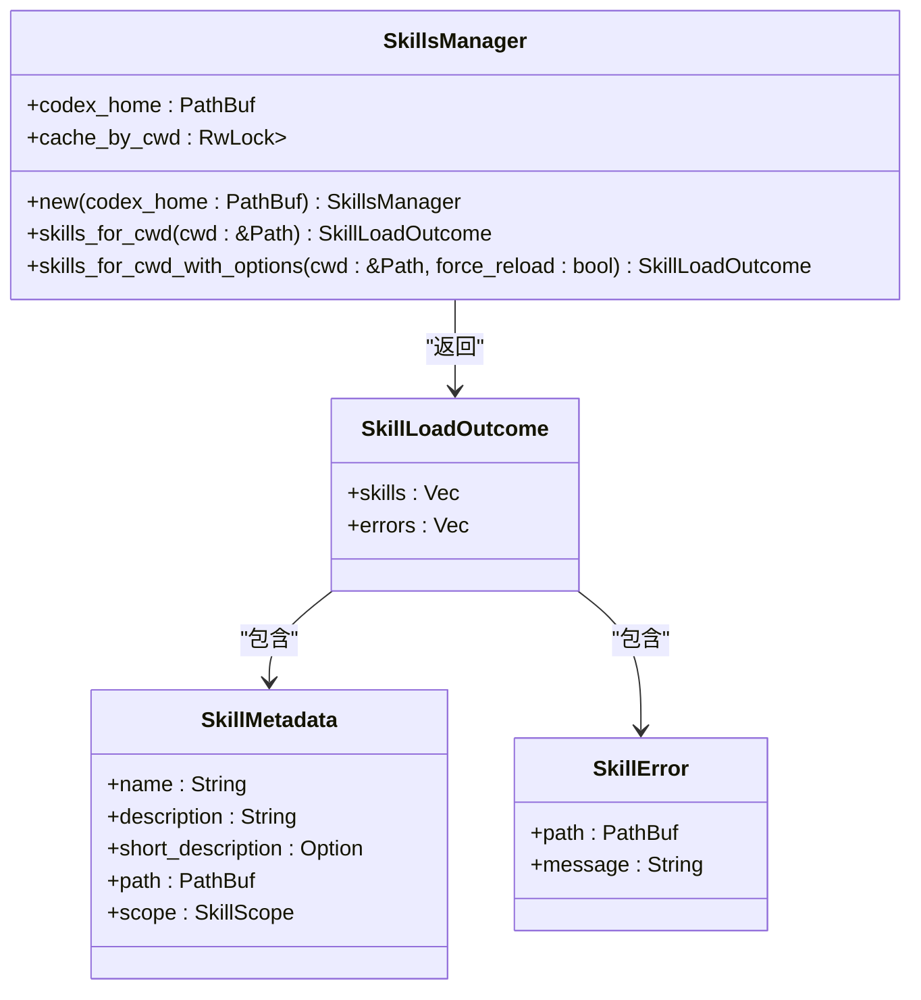
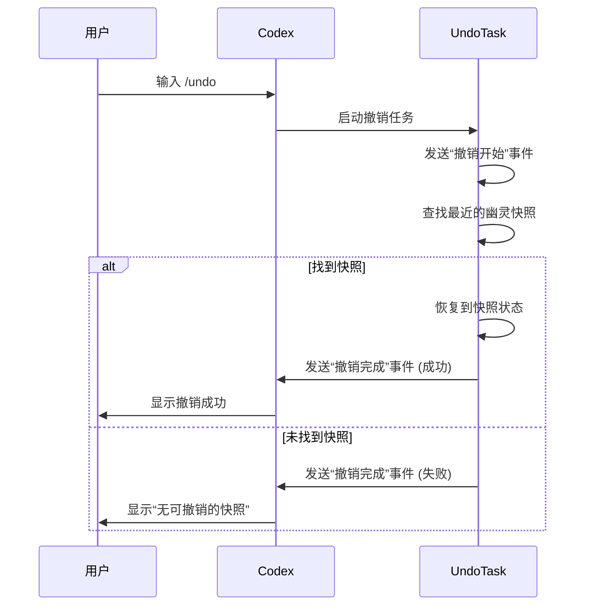

# 高级功能

<cite>
**本文档中引用的文件**  
- [slash_commands.md](file://docs/slash_commands.md)
- [skills.md](file://docs/skills.md)
- [prompts.md](file://docs/prompts.md)
- [review_prompt.md](file://codex-rs/core/review_prompt.md)
- [custom_prompts.rs](file://codex-rs/core/src/custom_prompts.rs)
- [review_prompts.rs](file://codex-rs/core/src/review_prompts.rs)
- [tasks/undo.rs](file://codex-rs/core/src/tasks/undo.rs)
- [skills/loader.rs](file://codex-rs/core/src/skills/loader.rs)
- [skills/manager.rs](file://codex-rs/core/src/skills/manager.rs)
- [skills/model.rs](file://codex-rs/core/src/skills/model.rs)
- [skills/render.rs](file://codex-rs/core/src/skills/render.rs)
- [skills/system.rs](file://codex-rs/core/src/skills/system.rs)
- [codex.rs](file://codex-rs/core/src/codex.rs)
- [protocol.rs](file://codex-rs/protocol/src/protocol.rs)
- [slash_command.rs](file://codex-rs/tui2/src/slash_command.rs)
- [command_popup.rs](file://codex-rs/tui2/src/bottom_pane/command_popup.rs)
- [chatwidget.rs](file://codex-rs/tui2/src/chatwidget.rs)
</cite>

## 目录
1. [/review 命令详解](#review-命令详解)
2. [技能系统（Skills）](#技能系统skills)
3. [自定义提示词（Custom Prompts）](#自定义提示词custom-prompts)
4. [其他斜杠命令](#其他斜杠命令)
5. [使用场景与最佳实践](#使用场景与最佳实践)

## /review 命令详解

`/review` 命令是 Codex 的核心代码审查功能，用于分析代码变更并提供结构化的审查意见。当用户在对话中输入 `/review` 时，Codex 会启动一个专门的审查会话，分析当前的代码更改。

该命令支持多种审查目标：
- **未提交的更改**：审查当前暂存、未暂存和未跟踪的文件更改。
- **基础分支对比**：将当前分支的更改与指定的基础分支进行对比审查。
- **特定提交**：审查由特定提交哈希引入的代码更改。
- **自定义指令**：根据用户提供的任意指令进行审查。

审查过程由 `review_prompt.md` 文件中的系统提示词指导，该文件定义了审查的通用准则，包括：
- 问题必须对代码的准确性、性能、安全性或可维护性产生实质性影响。
- 问题必须是离散且可操作的。
- 修复问题所需的严谨性不应超过代码库中其他部分的现有标准。
- 问题必须是在当前提交中引入的，而非预先存在的缺陷。

审查结果以严格的 JSON 格式输出，包含以下关键字段：
- `findings`：一个包含问题标题、详细说明、置信度分数、优先级和代码位置的对象数组。
- `overall_correctness`：对补丁正确性的总体判断（“补丁正确”或“补丁不正确”）。
- `overall_explanation`：对总体判断的简要解释。
- `overall_confidence_score`：对总体判断的置信度分数。

Codex 通过 `codex.rs` 文件中的 `review` 函数处理审查请求。该函数首先解析 `ReviewRequest`，然后启动一个审查线程。审查线程会根据请求的目标生成相应的提示词，并调用 AI 模型进行分析。最终的审查结果通过事件系统发送回用户界面。

**Section sources**
- [review_prompt.md](file://codex-rs/core/review_prompt.md#L1-L88)
- [review_prompts.rs](file://codex-rs/core/src/review_prompts.rs#L1-L94)
- [codex.rs](file://codex-rs/core/src/codex.rs#L2049-L2079)
- [protocol.rs](file://codex-rs/protocol/src/protocol.rs#L1385-L1427)

## 技能系统（Skills）

Codex 的技能系统是一个强大的功能，允许用户加载和管理可复用的功能模块，以增强 Codex 在特定任务上的表现。技能是存储在 `SKILL.md` 文件中的可复用知识模块，可以包含领域专业知识、工作流程、脚本和参考文档。

### 技能的加载与管理

技能从多个来源按优先级顺序加载：
1. **仓库级技能**：位于项目根目录下的 `.codex/skills/` 目录中。
2. **用户级技能**：位于 `$CODEX_HOME/skills/` 目录中。
3. **系统级技能**：由 Codex 安装程序提供的内置技能。
4. **管理员级技能**：位于 `/etc/codex/skills/` 目录中（仅限 Unix 系统）。

当存在同名技能时，系统会根据上述优先级顺序进行去重，优先保留高优先级来源的技能。`SkillsManager` 负责管理技能的生命周期，它会缓存每个工作目录下的技能列表，以提高性能。

技能的元数据（`SkillMetadata`）包含名称、描述、路径和作用域。`SkillsManager` 通过 `skills_for_cwd` 方法为当前工作目录提供技能列表，该列表随后可用于渲染到用户界面。



**Diagram sources**
- [skills/manager.rs](file://codex-rs/core/src/skills/manager.rs#L1-L52)
- [skills/model.rs](file://codex-rs/core/src/skills/model.rs#L1-L24)

### 创建和使用技能

用户可以通过 `init_skill.py` 脚本创建新的技能。该脚本会生成一个包含标准模板的 `SKILL.md` 文件和可选的资源目录（如 `scripts`、`references` 和 `assets`）。

一个技能的核心是其 `SKILL.md` 文件，该文件以 YAML 前置元数据开头，定义了技能的名称和描述。描述字段至关重要，因为它决定了 Codex 在何时会触发该技能。描述中应明确说明技能的功能以及触发它的具体场景。

技能内容应遵循特定的设计模式，例如：
- **工作流模式**：适用于有明确步骤的顺序过程。
- **任务模式**：适用于提供不同操作或能力的工具集合。
- **参考/指南模式**：适用于标准或规范。

创建完成后，技能会被自动发现并出现在 `/skills` 命令的列表中。用户可以通过 `/skills` 命令浏览、选择和插入技能内容到对话中。

**Section sources**
- [skills/loader.rs](file://codex-rs/core/src/skills/loader.rs#L1-L200)
- [skills/manager.rs](file://codex-rs/core/src/skills/manager.rs#L1-L52)
- [skills/model.rs](file://codex-rs/core/src/skills/model.rs#L1-L24)
- [skills/system.rs](file://codex-rs/core/src/skills/system.rs#L122-L165)
- [skills/render.rs](file://codex-rs/core/src/skills/render.rs#L1-L17)
- [skills.md](file://docs/skills.md)

## 自定义提示词（Custom Prompts）

自定义提示词功能允许用户创建可重用的提示词模板，通过斜杠命令来引导 AI 的行为，从而避免重复输入或复制粘贴长篇指令。

### 提示词的存储与格式

自定义提示词存储在 `$CODEX_HOME/prompts/` 目录中（默认为 `~/.codex/prompts/`）。只有 `.md` 扩展名的文件才会被加载。文件名（不含 `.md`）即为提示词的名称，例如 `review.md` 对应 `/prompts:review` 命令。

提示词文件可以包含可选的 YAML 前置元数据，用于增强斜杠命令弹出窗口的显示效果：
- `description`：在弹出窗口中显示的简短描述。
- `argument-hint`：提示用户需要提供的参数。

### 占位符与参数

自定义提示词支持两种占位符，用于在运行时注入动态内容：
- **数字占位符**：`$1` 到 `$9` 用于插入前九个位置参数。`$ARGUMENTS` 插入所有位置参数，用单个空格连接。
- **命名占位符**：如 `$FILE` 或 `$TICKET_ID`，通过 `KEY=value` 的形式提供值。键名区分大小写。

例如，一个名为 `ticket.md` 的提示词文件内容如下：
```markdown
---
description: 为票据生成提交信息
argument-hint: TICKET_ID=<id> TICKET_TITLE=<title>
---
请为票据 $TICKET_ID: $TICKET_TITLE 写一个简洁的提交信息。
```
用户可以通过 `/prompts:ticket TICKET_ID=JIRA-1234 TICKET_TITLE="修复登录错误"` 来调用，Codex 会将占位符替换后发送最终的提示词。

**Section sources**
- [prompts.md](file://docs/prompts.md)
- [custom_prompts.rs](file://codex-rs/core/src/custom_prompts.rs#L1-L245)

## 其他斜杠命令

除了 `/review`、`/skills` 和自定义提示词外，Codex 还提供了一系列其他斜杠命令来控制会话行为。

### /plan 命令

`/plan` 命令（或更准确地说，`update_plan` 工具）用于规划复杂任务。当任务非平凡、需要多个操作、存在逻辑阶段或依赖关系、或有歧义需要明确高层次目标时，Codex 会自动使用此功能。

计划以结构化的方式呈现步骤和进度，帮助用户理解任务的处理方式。计划应将任务分解为有意义的、逻辑有序的步骤。Codex 会在执行命令前考虑是否已完成上一步，并在移动到下一步之前将其标记为完成。计划不应包含填充性的步骤或陈述显而易见的内容。

### /undo 命令

`/undo` 命令允许用户撤销 Codex 在上一个“回合”（turn）中所做的所有更改。该功能通过 `UndoTask` 实现，它会查找对话历史中的“幽灵快照”（ghost snapshot），并将其恢复到之前的状态。

`UndoTask` 首先发送一个“撤销开始”事件，然后在历史记录中反向查找最近的幽灵快照。如果找到，则执行恢复操作；如果未找到，则返回错误信息。此命令对于纠正意外的更改或探索不同的解决方案路径非常有用。



**Diagram sources**
- [tasks/undo.rs](file://codex-rs/core/src/tasks/undo.rs#L1-L85)

### 其他常用命令

| 命令 | 用途 |
| :--- | :--- |
| `/model` | 选择要使用的模型和推理努力程度 |
| `/approvals` | 设置 Codex 在无需批准的情况下可以执行的操作 |
| `/new` | 在对话期间开始新的聊天 |
| `/resume` | 恢复已保存的聊天 |
| `/init` | 创建一个包含 Codex 指令的 AGENTS.md 文件 |
| `/compact` | 总结对话以防止达到上下文限制 |
| `/diff` | 显示 git diff（包括未跟踪的文件） |
| `/status` | 显示当前会话配置和令牌使用情况 |
| `/logout` | 退出 Codex |
| `/quit` 或 `/exit` | 退出 Codex |

**Section sources**
- [slash_commands.md](file://docs/slash_commands.md)
- [slash_command.rs](file://codex-rs/tui2/src/slash_command.rs#L1-L59)
- [command_popup.rs](file://codex-rs/tui2/src/bottom_pane/command_popup.rs#L33-L64)
- [chatwidget.rs](file://codex-rs/tui2/src/chatwidget.rs#L3545-L3566)

## 使用场景与最佳实践

### 使用 /review 进行代码质量检查

`/review` 命令是确保代码质量的强大工具。最佳实践包括：
- **在提交前审查**：在创建拉取请求（Pull Request）之前，使用 `/review` 检查你的更改，以捕获潜在的 bug、性能问题或安全漏洞。
- **关注具体问题**：审查结果会提供具体的代码位置和解释，应优先处理置信度分数高且优先级高的问题。
- **结合自定义提示词**：创建一个自定义提示词，如 `/prompts:security-review`，专门用于执行安全审查，可以包含更严格的审查准则。

### 使用技能自动化开发任务

技能系统可以极大地提高特定领域任务的效率。最佳实践包括：
- **为重复性任务创建技能**：如果你发现自己经常为某个框架或工具编写类似的指令，将其创建为一个技能。
- **利用资源目录**：在技能中包含脚本、API 参考和资产文件，使 Codex 能够执行更复杂的操作。
- **明确触发条件**：在技能描述中清晰地说明何时应使用该技能，这有助于 Codex 在正确的情境下自动调用它。

### 使用自定义提示词标准化工作流程

自定义提示词有助于标准化团队的工作流程。最佳实践包括：
- **创建团队共享提示词**：将常用的提示词（如代码审查、文档生成、错误报告）放入共享的 `$CODEX_HOME` 目录中，供团队成员使用。
- **使用命名参数**：对于复杂的提示词，使用命名占位符（如 `FILE=...`）比位置参数更清晰、更不易出错。
- **提供参数提示**：在 YAML 前置元数据中使用 `argument-hint` 字段，指导用户如何正确使用提示词。

**Section sources**
- [slash_commands.md](file://docs/slash_commands.md)
- [prompts.md](file://docs/prompts.md)
- [review_prompt.md](file://codex-rs/core/review_prompt.md#L1-L88)